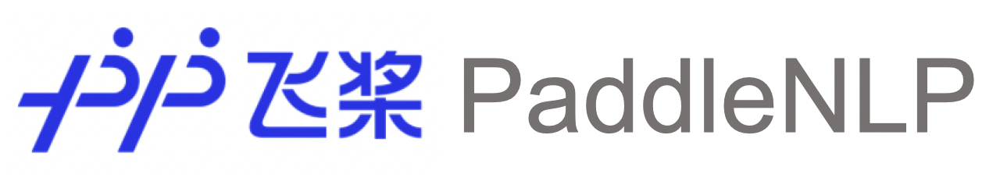

简体中文 | [English](./README_en.md)

<p align="center">
  
</p>

------------------------------------------------------------------------------------------
[](https://pypi.org/project/paddlenlp/)
[](https://pypi.org/project/paddlenlp/)
[](https://pepy.tech/project/paddlenlp)


## News  

* [2022-03-21] PaddleNLP**一键预测工具**[Taskflow](./docs/model_zoo/taskflow.md)全新升级！🚀欢迎体验更丰富的功能、更便捷的使用方式；新推出适合不同场景的中文分词、命名实体识别模式！
* [2021-12-28] PaddleNLP新发**语义检索、问答、评论观点抽取和情感倾向分析** [产业化案例](https://github.com/PaddlePaddle/PaddleNLP/tree/develop/applications)，🚀快速搭建系统！配套视频课程[直通车](https://aistudio.baidu.com/aistudio/course/introduce/24902)！

## 简介

PaddleNLP是飞桨自然语言处理开发库，具备**易用的文本领域API**，**多场景的应用示例**、和**高性能分布式训练**三大特点，旨在提升开发者在文本领域的开发效率，并提供丰富的NLP应用示例。

- **易用的文本领域API**
  - 提供丰富的产业级预置任务能力[Taskflow](./docs/model_zoo/taskflow.md)和全流程的文本领域API：支持丰富中文数据集加载的[Dataset API](https://paddlenlp.readthedocs.io/zh/latest/data_prepare/dataset_list.html)；灵活高效地完成数据预处理的[Data API](https://paddlenlp.readthedocs.io/zh/latest/source/paddlenlp.data.html)；提供100+预训练模型的[Transformers API](./docs/model_zoo/transformers.rst)等，可大幅提升NLP任务建模的效率。
- **多场景的应用示例**
  - 覆盖从学术到产业级的NLP[应用示例](#多场景的应用示例)，涵盖NLP基础技术、NLP系统应用以及相关拓展应用。全面基于飞桨核心框架2.0全新API体系开发，为开发者提供飞桨文本领域的最佳实践。
- **高性能分布式训练**
  - 基于飞桨核心框架领先的自动混合精度优化策略，结合分布式Fleet API，支持4D混合并行策略，可高效地完成大规模预训练模型训练。

## 社区交流

微信扫描下方二维码加入官方交流群，与各行各业开发者充分交流，期待您的加入⬇️

<div align="center">
  
</div>


## 安装

### 环境依赖

- python >= 3.6
- paddlepaddle >= 2.2

### pip安装

```shell
pip install --upgrade paddlenlp
```

更多关于PaddlePaddle和PaddleNLP安装的详细教程请查看[Installation](./docs/get_started/installation.rst)。

## 易用的文本领域API

### Taskflow：开箱即用的产业级NLP能力

Taskflow旨在提供**开箱即用**的NLP预置任务能力，覆盖自然语言理解与生成两大场景，提供**产业级的效果**与**极致的预测性能**。


更多使用方法请参考[Taskflow文档](./docs/model_zoo/taskflow.md)。

### Transformers API: 强大的预训练模型生态底座

覆盖 **45+** 个网络结构和 **500+** 个预训练模型参数，既包括百度自研的预训练模型如ERNIE系列, PLATO, SKEP等，也涵盖业界主流的中文预训练模型如BERT，GPT，RoBERTa，T5等。使用AutoModel可以下载不同网络结构的预训练模型。欢迎开发者加入贡献更多预训练模型！🤗

```python
from paddlenlp.transformers import *

ernie = AutoModel.from_pretrained('ernie-1.0')
ernie_gram = AutoModel.from_pretrained('ernie-gram-zh')
bert = AutoModel.from_pretrained('bert-wwm-chinese')
albert = AutoModel.from_pretrained('albert-chinese-tiny')
roberta = AutoModel.from_pretrained('roberta-wwm-ext')
electra = AutoModel.from_pretrained('chinese-electra-small')
gpt = AutoModelForPretraining.from_pretrained('gpt-cpm-large-cn')
```

对预训练模型应用范式如语义表示、文本分类、句对匹配、序列标注、问答等，提供统一的API体验。

```python
import paddle
from paddlenlp.transformers import *

tokenizer = AutoTokenizer.from_pretrained('ernie-1.0')
text = tokenizer('自然语言处理')

# 语义表示
model = AutoModel.from_pretrained('ernie-1.0')
sequence_output, pooled_output = model(input_ids=paddle.to_tensor([text['input_ids']]))
# 文本分类 & 句对匹配
model = AutoModelForSequenceClassification.from_pretrained('ernie-1.0')
# 序列标注
model = AutoModelForTokenClassification.from_pretrained('ernie-1.0')
# 问答
model = AutoModelForQuestionAnswering.from_pretrained('ernie-1.0')
```

请参考[Transformer 文档](https://paddlenlp.readthedocs.io/zh/latest/model_zoo/index.html) 查看目前支持的预训练模型结构、参数和详细用法。

### Datasets API: 丰富的中文数据集

Dataset API提供便捷、高效的数据集加载功能；内置[千言数据集](https://www.luge.ai/)，提供丰富的面向自然语言理解与生成场景的中文数据集，为NLP研究人员提供一站式的科研体验。

```python
from paddlenlp.datasets import load_dataset

train_ds, dev_ds, test_ds = load_dataset("chnsenticorp", splits=["train", "dev", "test"])

train_ds, dev_ds = load_dataset("lcqmc", splits=["train", "dev"])
```

可参考[Dataset文档](https://paddlenlp.readthedocs.io/zh/latest/data_prepare/dataset_list.html) 查看更多数据集。

### Embedding API: 一键加载预训练词向量

```python
from paddlenlp.embeddings import TokenEmbedding

wordemb = TokenEmbedding("w2v.baidu_encyclopedia.target.word-word.dim300")
print(wordemb.cosine_sim("国王", "王后"))
>>> 0.63395125
wordemb.cosine_sim("艺术", "火车")
>>> 0.14792643
```

内置50+中文词向量，覆盖多种领域语料、如百科、新闻、微博等。更多使用方法请参考[Embedding文档](./docs/model_zoo/embeddings.md)。

### 更多API使用文档

- [Data API](./docs/data.md): 提供便捷高效的文本数据处理功能
- [Metrics API](./docs/metrics.md): 提供NLP任务的评估指标，与飞桨高层API兼容。

更多的API示例与使用说明请查阅[PaddleNLP官方文档](https://paddlenlp.readthedocs.io/)

## 多场景的应用示例

PaddleNLP提供了多粒度、多场景的NLP应用示例，面向动态图模式和全新的API体系开发，更加简单易懂。
涵盖了[NLP基础技术](#nlp-基础技术)、[NLP系统应用](#nlp-系统应用)以及文本相关的[NLP拓展应用](#拓展应用)、与知识库结合的[文本知识关联](./examples/text_to_knowledge)、与图结合的[文本图学习](./examples/text_graph/)等。

### NLP 基础技术

| 任务   | 简介     |
| :------------  | ---- |
| [词向量](./examples/word_embedding/) | 利用`TokenEmbedding API`展示如何快速计算词之间语义距离和词的特征提取。 |
| [词法分析](./examples/lexical_analysis/) | 基于BiGRU-CRF模型实现了分词、词性标注和命名实体识的联合训练任务。 |
| [语言模型](./examples/language_model/)  | 覆盖了经典的LSTM类语言模型，和Transformer类的预训练语言模型，如BERT, ERNIE, GPT, XLNet, BART，ELECTRA，BigBird等。 |
| [语义解析](./examples/text_to_sql/):star: | 语义解析Text-to-SQL任务是让机器自动让自然语言问题转换数据库可操作的SQL查询语句，是实现基于数据库自动问答的核心模块。|

#### 句法依存分析 (Dependency Parsing)

| 模型  | 简介    |
| :----- | ------ |
| [Deep Biaffine Parsing](./examples/dependency_parsing/) | 实现经典的Deep Biaffine Parsing句法分析模型，并提供高质量的中文预训练模型可供直接使用。|

#### 文本分类 (Text Classification)

| 模型  | 简介    |
| :----- | ------ |
| [RNN/CNN/GRU/LSTM](./examples/text_classification/rnn) | 实现了经典的RNN, CNN, GRU, LSTM等经典文本分类结构。|
| [BiLSTM-Attention](./examples/text_classification/rnn) | 基于BiLSTM网络结构引入注意力机制提升文本分类效果。 |
| [BERT/ERNIE](./examples/text_classification/pretrained_models) | 提供基于预训练模型的文本分类任务实现，包含训练、预测和推理部署的全流程应用。 |

#### 文本匹配 (Text Matching)

| 模型    | 简介       |
| :--------------- | ---------- |
| [SimCSE](./examples/text_matching/simcse/):star2:  | 基于论文[SimCSE: Simple Contrastive Learning of Sentence Embeddings](https://arxiv.org/abs/2104.08821)实现无监督语义匹配模型，无需标注数据仅利用无监督数据也能训练效果出众的语义匹配模型。|
| [ERNIE-Gram w/ R-Drop](./examples/text_matching/question_matching/) | 提供基于ERNIE-Gram预训练模型结合R-Drop策略的问题匹配任在千言数据集上的基线代码。|
| [SimNet](./examples/text_matching/simnet/)  | 百度自研的语义匹配框架，使用BOW、CNN、GRNN等核心网络作为表示层，在百度内搜索、推荐等多个应用场景得到广泛易用。|
| [ERNIE](./examples/text_matching/ernie_matching/) | 基于ERNIE使用LCQMC数据完成中文句对匹配任务，提供了Pointwise和Pairwise两种类型学习方式。 |
| [Sentence-BERT](./examples/text_matching/sentence_transformers/) | 提供基于Siamese双塔结构的文本匹配模型[Sentence-BERT](https://arxiv.org/abs/1908.1008)实现，可用于获取文本的向量化表示。 |
| [SimBERT](./examples/text_matching/simbert/) | 提供[SimBERT](https://github.com/ZhuiyiTechnology/simbert)模型实现，用于获取文本的向量化表示。|

#### 文本生成 (Text Generation)

| 模型        | 简介      |
| :------------ | ---------- |
| [Seq2Seq](./examples/text_generation/couplet) | 实现了经典的Seq2Seq with Attention的网络结构，并提供在自动对联的文本生成应用示例。 |
| [VAE-Seq2Seq](./examples/text_generation/vae-seq2seq) | 在Seq2Seq框架基础上，加入VAE结构以实现更加多样化的文本生成。|
| [ERNIE-GEN](./examples/text_generation/ernie-gen) | [ERNIE-GEN](https://arxiv.org/abs/2001.11314)是百度NLP提出的基于多流(multi-flow)机制生成完整语义片段的预训练模型，基于该模型实现了提供了智能写诗的应用示例。|

#### 文本纠错 (Text Correction)

| 模型        | 简介      |
| :------------ | ---------- |
| [ERNIE-CSC](./examples/text_correction/ernie-csc) :star2:  | [ERNIE-CSC](https://aclanthology.org/2021.findings-acl.198.pdf)是基于ERNIE预训练模型融合了拼音特征的端到端中文拼写纠错模型，在SIGHAN数据集上取得SOTA的效果。|

#### 语义索引 (Semantic Indexing)

提供一套完整的语义索引开发流程，并提供了In-Batch Negative和Hardest Negatives两种策略，开发者可基于该示例实现一个轻量级的语义索引系统，更多信息请查看[语义索引应用示例](./examples/semantic_indexing/)。

#### 信息抽取 (Information Extraction)

| 任务   | 简介     |
| :---------------  | ---- |
| [DuEE](./examples/information_extraction/DuEE/) | 基于[DuEE](https://link.springer.com/chapter/10.1007/978-3-030-60457-8_44)数据集，使用预训练模型的方式提供句子级和篇章级的事件抽取示例。 |
| [DuIE](./examples/information_extraction/DuIE/) | 基于[DuIE](http://tcci.ccf.org.cn/conference/2019/papers/EV10.pdf)数据集，使用预训练模型的方式提供关系抽取示例。 |
| [快递单信息抽取](./examples/information_extraction/waybill_ie/) | 提供BiLSTM+CRF和预训练模型两种方式完成真实的快递单信息抽取案例。 |

### NLP 系统应用

#### 情感分析 (Sentiment Analysis)

| 模型      | 简介       |
| :--------- | ---------- |
| [SKEP](./examples/sentiment_analysis/skep/):star2: | [SKEP](https://arxiv.org/abs/2005.05635)是百度提出的基于情感知识增强的预训练算法，利用无监督挖掘的海量情感知识构建预训练目标，让模型更好理解情感语义，可为各类情感分析任务提供统一且强大的情感语义表示。 |

#### 阅读理解 (Machine Reading Comprehension)

| 任务   | 简介     |
| :-------------------  | ---- |
| [SQuAD](./examples/machine_reading_comprehension/SQuAD/) | 提供预训练模型在SQuAD 2.0数据集上微调的应用示例。 |
| [DuReader-yesno](./examples/machine_reading_comprehension/DuReader-yesno/) | 提供预训练模型在**千言数据集DuReader-yesno**上微调的应用示例。 |
| [DuReader-robust](./examples/machine_reading_comprehension/DuReader-robust/) | 提供预训练模型在**千言数据集DuReader-robust**上微调的应用示例。 |

#### 文本翻译 (Text Translation)

| 模型    | 简介     |
| :--------------- | ------- |
| [Seq2Seq-Attn](./examples/machine_translation/seq2seq) | 提供了[Effective Approaches to Attention-based Neural Machine Translation](https://arxiv.org/abs/1508.04025v5)基于注意力机制改进的Seq2Seq经典神经网络机器翻译模型实现。|
| [Transformer](./examples/machine_translation/transformer) | 提供了基于[Attention Is All You Need](https://arxiv.org/abs/1706.03762)论文的Transformer机器翻译实现，包含了完整的训练到推理部署的全流程实现。|

#### 同传翻译 (Simultaneous Translation)

| 模型    | 简介     |
| :---------- | ------- |
| [STACL](./examples/simultaneous_translation/stacl) :star:| [STACL](https://www.aclweb.org/anthology/P19-1289/)是百度自研的基于Prefix-to-Prefix框架的同传翻译模型，结合Wait-k策略可以在保持较高的翻译质量的同时实现任意字级别的翻译延迟，并提供了轻量级同声传译系统搭建教程。|

#### 对话系统 (Dialogue System)

| 模型   | 简介      |
| :---------------- | ------|
| [PLATO-2](./examples/dialogue/plato-2) | [PLATO-2](https://arxiv.org/abs/2006.16779)是百度自研领先的基于课程学习两阶段方式训练的开放域对话预训练模型。|
| [PLATO-mini](./examples/dialogue/unified_transformer):star2: | 基于6层UnifiedTransformer预训练结构，结合海量中文对话语料数据预训练的轻量级**中文**闲聊对话模型。|

### 拓展应用

#### 文本知识关联 (Text to Knowledge)

:star2:[**解语**](./examples/text_to_knowledge/)是由百度知识图谱部开发的文本知识关联框架，覆盖中文全词类的知识库和知识标注工具，能够帮助开发者面对更加多元的应用场景，方便地融合自有知识体系，显著提升中文文本解析和挖掘效果，还可以便捷地利用知识增强机器学习模型效果。

* [TermTree: 中文全词类的知识库](./examples/text_to_knowledge/termtree):star2:
* [WordTag: 中文词类知识标注工具](./examples/text_to_knowledge/wordtag):star2:
* [NPTag: 中文名词短语标注工具](./examples/text_to_knowledge/nptag):star2:

#### 文本图学习 (Text Graph Learning)

| 模型   | 简介     |
| :------------ | ------- |
| [ERNIESage](./examples/text_graph/erniesage)| 基于[飞桨PGL](https://github.com/PaddlePaddle/PGL)图学习框架结合PaddleNLP Transformer API实现的文本与图结构融合的模型。|

#### 模型压缩 (Model Compression)

| 模型                                                       | 简介                                                         |
| :--------------------------------------------------------- | ------------------------------------------------------------ |
| [MiniLMv2](examples/model_compression/minilmv2)    | 基于[MiniLMv2: Multi-Head Self-Attention Relation Distillation for Compressing Pretrained Transformers](https://arxiv.org/abs/2012.15828)论文策略的实现，是一种通用蒸馏方法。本实例以`bert-base-chinese`为教师模型，利用中文数据进行了通用蒸馏。 |
| [TinyBERT](./model_zoo/tinybert)          | 基于论文[TinyBERT: Distilling BERT for Natural Language Understanding](https://arxiv.org/abs/1909.10351)的实现，提供了通用蒸馏和下游任务蒸馏的脚本。本实例利用开源模型`tinybert-6l-768d-v2`初始化，在GLUE的7个数据集上进行下游任务的蒸馏，最终模型参数量缩小1/2，预测速度提升2倍，同时保证模型精度几乎无损，其中精度可达教师模型`bert-base-uncased`的 98.90%。 |
| [OFA-BERT](./examples/model_compression/ofa/)     | 基于PaddleSlim Once-For-ALL(OFA)策略对BERT在GLUE任务的下游模型进行压缩，在精度无损的情况下可减少33%参数量，达到模型小型化的提速的效果。 |
| [Distill-LSTM](./examples/model_compression/distill_lstm/) | 基于[Distilling Task-Specific Knowledge from BERT into Simple Neural Networks](https://arxiv.org/abs/1903.12136)论文策略的实现，将BERT中英文分类的下游模型知识通过蒸馏的方式迁移至LSTM的小模型结构中，取得比LSTM单独训练更好的效果。 |
| [PP-MiniLM](examples/model_compression/pp-minilm) :star2:    | 基于 PaddleSlim 通过模型蒸馏、剪裁、量化等级联模型压缩技术发布中文特色小模型 PP-MiniLM(6L768H) 及压缩方案，保证模型精度的同时模型推理速度达 BERT-base 的4.2倍，参数量相比减少52%，模型精度在中文语言理解评测基准 CLUE 高0.32。 |

#### 小样本学习 (Few-Shot Learning)

| 算法   | 简介    |
| :--------------- | ------- |
| [PET](./examples/few_shot/pet/) | 基于[Exploiting Cloze Questions for Few Shot Text Classification and Natural Language Inference](https://arxiv.org/abs/2001.07676) 论文策略实现, 基于人工知识设计 Prompt, 将下游目标任务转换为完形填空任务来充分挖掘预训练模型中的知识, 显著提升模型效果。|
| [P-Tuning](./examples/few_shot/p-tuning/) |基于[GPT Understands, Too](https://arxiv.org/pdf/2103.10385.pdf) 论文策略实现, 首次提出连续可学习的模板参数，在全参数空间对模板进行连续优化，大幅提升模型稳定性和模型效果。|
| [EFL](./examples/few_shot/efl/) | 基于[Entailment as Few-Shot Learner](https://arxiv.org/abs/2104.14690) 论文策略实现，将下游目标任务转换为蕴含任务降低模型预测空间，显著提升模型效果。|

## 交互式Notebook教程

- [使用Seq2Vec模块进行句子情感分类](https://aistudio.baidu.com/aistudio/projectdetail/1283423)
- [如何通过预训练模型Fine-tune下游任务](https://aistudio.baidu.com/aistudio/projectdetail/1294333)
- [使用BiGRU-CRF模型完成快递单信息抽取](https://aistudio.baidu.com/aistudio/projectdetail/1317771)
- [使用预训练模型ERNIE优化快递单信息抽取](https://aistudio.baidu.com/aistudio/projectdetail/1329361)
- [使用Seq2Seq模型完成自动对联](https://aistudio.baidu.com/aistudio/projectdetail/1321118)
- [使用预训练模型ERNIE-GEN实现智能写诗](https://aistudio.baidu.com/aistudio/projectdetail/1339888)
- [使用TCN网络完成新冠疫情病例数预测](https://aistudio.baidu.com/aistudio/projectdetail/1290873)

更多教程参见[PaddleNLP on AI Studio](https://aistudio.baidu.com/aistudio/personalcenter/thirdview/574995)。


## 版本更新

更多版本更新说明请查看[ChangeLog](./docs/changelog.md)

## Citation

如果PaddleNLP对您的研究有帮助，欢迎引用
```
@misc{=paddlenlp,
    title={PaddleNLP: An Easy-to-use and High Performance NLP Library},
    author={PaddleNLP Contributors},
    howpublished = {\url{https://github.com/PaddlePaddle/PaddleNLP}},
    year={2021}
}
```

## Acknowledge

我们借鉴了Hugging Face的[Transformers](https://github.com/huggingface/transformers)🤗关于预训练模型使用的优秀设计，在此对Hugging Face作者及其开源社区表示感谢。

## License

PaddleNLP遵循[Apache-2.0开源协议](./LICENSE)。
