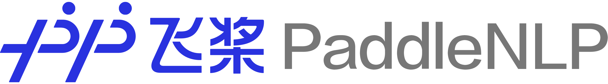

简体中文 | [English](./README_en.md)

<p align="center">
  
</p>

------------------------------------------------------------------------------------------

<p align="center">
    <a href="./LICENSE"></a>
    <a href="https://github.com/PaddlePaddle/PaddleNLP/releases"></a>
    <a href=""></a>
    <a href=""></a>
    <a href="https://github.com/PaddlePaddle/PaddleNLP/graphs/contributors"></a>
    <a href="https://github.com/PaddlePaddle/PaddleNLP/commits"></a>
    <a href="https://pypi.org/project/paddlenlp/"></a>
    <a href="https://github.com/PaddlePaddle/PaddleNLP/issues"></a>
    <a href="https://github.com/PaddlePaddle/PaddleNLP/stargazers"></a>
</p>

<h4 align="center">
  <a href=#Feature> Features </a> |
  <a href=#Installation> Installation </a> |
  <a href=#QuickStart> Quick Start </a> |
  <a href=#APIReference> API Reference </a> |
  <a href=#Community> Community </a> 
</h4>

## News  

* 🔥 2021.5.18-19 We will introduce **UIE** (Universal Information Extraction) and **ERNIE 3.0** Light-weight model. Welcome to join us.

  <div align="center">
  
  </div>

* 🔥 2022.5.16 PaddleNLP [release/2.3](https://github.com/PaddlePaddle/PaddleNLP/releases/tag/v2.3.0)

  * Release [ERNIE 3.0](./model_zoo/ernie-3.0) which achieve SOTA result on CLUE benchmark. Release [ERNIE-Health](./model_zoo/ernie-health), the SOTA pretrained model on CBLUE benchmark; Release PLATO-XL with FasterGeneration, which can do parallel inference for 11B large-scale model.
  * Release [**UIE** (Universal Information Extraction)](./model_zoo/uie) technique, which single model can support NER, Relation Extraction, Event Extraction and Sentiment Anlaysis simultaneously.

## Features

PaddleNLP is an easy-to-use and high performance NLP library with awesome pre-trained Transformer models, supporting wide-range of NLP tasks from research to industrial applications.

#### <a href=#Off-the-shelf NLP Pre-built Task> Off-the-shelf NLP Pre-built Task </a>

#### <a href=#Awesome Chinese Pre-trained Model Zoo> Awesome Chinese Pre-trained Model Zoo </a> 

#### <a href=#Industrial End-to-end NLP System> Industrial End-to-end NLP System </a> 

#### <a href=#High Performance Distributed Training and Infernece> High Performance Distributed Training and Infernece </a> 


### Off-the-shelf NLP Pre-built Task

Taskflow aims to provide off-the-shelf NLP pre-built task covering NLU and NLG scenario, in the meanwhile with extreamly fast infernece satisfying industrial applications.


For more usage please refer to [Taskflow Docs](./docs/model_zoo/taskflow.md)。

### Awesome Chinese Pre-trained Model Zoo

#### Comprehensive Chinese Transformer Models

We provide 45+ network architectures and over 500+ pretrained models. Not only includes all the SOTA model like ERNIE, PLATO and SKEP released by Baidu, but also integrates most of the high quality Chinese pretrained model developed by other organizations. Use AutoModel API to **⚡FAST⚡** download pretrained mdoels of different architecture. We welcome all developers to contribute your Transformer models to PaddleNLP! 

```python
from paddlenlp.transformers import *

ernie = AutoModel.from_pretrained('ernie-3.0-base-zh')
bert = AutoModel.from_pretrained('bert-wwm-chinese')
albert = AutoModel.from_pretrained('albert-chinese-tiny')
roberta = AutoModel.from_pretrained('roberta-wwm-ext')
electra = AutoModel.from_pretrained('chinese-electra-small')
gpt = AutoModelForPretraining.from_pretrained('gpt-cpm-large-cn')
```

Unified API experience for NLP task like semantic representation, text classification, sentence matching, sequence labeling, question answering, etc.

```python
import paddle
from paddlenlp.transformers import *

tokenizer = AutoTokenizer.from_pretrained('ernie-3.0-medium-zh')
text = tokenizer('natural language processing')

# Semantic Representation
model = AutoModel.from_pretrained('ernie-3.0-medium-zh')
sequence_output, pooled_output = model(input_ids=paddle.to_tensor([text['input_ids']]))
# Text Classificaiton and Matching
model = AutoModelForSequenceClassification.from_pretrained('ernie-3.0-medium-zh')
# Sequence Labeling
model = AutoModelForTokenClassification.from_pretrained('ernie-3.0-medium-zh')
# Question Answering
model = AutoModelForQuestionAnswering.from_pretrained('ernie-3.0-medium-zh')
```

</div></details>

<details><summary>&emsp;PaddleNLP Transformer model summary, click to show more detials </summary><div>

| Model              | Sequence Classification | Token Classification | Question Answering | Text Generation | Multiple Choice |
| :----------------- | ----------------------- | -------------------- | ------------------ | --------------- | --------------- |
| ALBERT             | ✅                       | ✅                    | ✅                  | ❌               | ✅               |
| BART               | ✅                       | ✅                    | ✅                  | ✅               | ❌               |
| BERT               | ✅                       | ✅                    | ✅                  | ❌               | ✅               |
| BigBird            | ✅                       | ✅                    | ✅                  | ❌               | ✅               |
| BlenderBot         | ❌                       | ❌                    | ❌                  | ✅               | ❌               |
| ChineseBERT        | ✅                       | ✅                    | ✅                  | ❌               | ❌               |
| ConvBERT           | ✅                       | ✅                    | ✅                  | ❌               | ✅               |
| CTRL               | ✅                       | ❌                    | ❌                  | ❌               | ❌               |
| DistilBERT         | ✅                       | ✅                    | ✅                  | ❌               | ❌               |
| ELECTRA            | ✅                       | ✅                    | ✅                  | ❌               | ✅               |
| ERNIE              | ✅                       | ✅                    | ✅                  | ❌               | ✅               |
| ERNIE-CTM          | ❌                       | ✅                    | ❌                  | ❌               | ❌               |
| ERNIE-Doc          | ✅                       | ✅                    | ✅                  | ❌               | ❌               |
| ERNIE-GEN          | ❌                       | ❌                    | ❌                  | ✅               | ❌               |
| ERNIE-Gram         | ✅                       | ✅                    | ✅                  | ❌               | ❌               |
| ERNIE-M            | ✅                       | ✅                    | ✅                  | ❌               | ❌               |
| FNet               | ✅                       | ✅                    | ✅                  | ❌               | ✅               |
| Funnel-Transformer | ✅                       | ✅                    | ✅                  | ❌               | ❌               |
| GPT                | ✅                       | ✅                    | ❌                  | ✅               | ❌               |
| LayoutLM           | ✅                       | ✅                    | ❌                  | ❌               | ❌               |
| LayoutLMv2         | ❌                       | ✅                    | ❌                  | ❌               | ❌               |
| LayoutXLM          | ❌                       | ✅                    | ❌                  | ❌               | ❌               |
| LUKE               | ❌                       | ✅                    | ✅                  | ❌               | ❌               |
| mBART              | ✅                       | ❌                    | ✅                  | ❌               | ✅               |
| MegatronBERT       | ✅                       | ✅                    | ✅                  | ❌               | ✅               |
| MobileBERT         | ✅                       | ❌                    | ✅                  | ❌               | ❌               |
| MPNet              | ✅                       | ✅                    | ✅                  | ❌               | ✅               |
| NEZHA              | ✅                       | ✅                    | ✅                  | ❌               | ✅               |
| PP-MiniLM          | ✅                       | ❌                    | ❌                  | ❌               | ❌               |
| ProphetNet         | ❌                       | ❌                    | ❌                  | ✅               | ❌               |
| Reformer           | ✅                       | ❌                    | ✅                  | ❌               | ❌               |
| RemBERT            | ✅                       | ✅                    | ✅                  | ❌               | ✅               |
| RoBERTa            | ✅                       | ✅                    | ✅                  | ❌               | ✅               |
| RoFormer           | ✅                       | ✅                    | ✅                  | ❌               | ❌               |
| SKEP               | ✅                       | ✅                    | ❌                  | ❌               | ❌               |
| SqueezeBERT        | ✅                       | ✅                    | ✅                  | ❌               | ❌               |
| T5                 | ❌                       | ❌                    | ❌                  | ✅               | ❌               |
| TinyBERT           | ✅                       | ❌                    | ❌                  | ❌               | ❌               |
| UnifiedTransformer | ❌                       | ❌                    | ❌                  | ✅               | ❌               |
| XLNet              | ✅                       | ✅                    | ✅                  | ❌               | ✅               |

</div></details>

For more pretrained model usage, please refer to [Transformer 文档](/docs/model_zoo/index.rst).

#### Wide-range NLP Task Support

PaddleNLP provides rich application examples covering mainstream NLP task to help developers accelerate problem solving.

精选预训练模型示例可参考[Model Zoo](./model_zoo)，更多场景示例文档可参考[examples目录](./examples)。更有免费算力支持的[AI Studio](https://aistudio.baidu.com)平台的[Notbook交互式教程](https://aistudio.baidu.com/aistudio/personalcenter/thirdview/574995)提供实践。


### Industrial End-to-end System Cases

PaddleNLP针对信息抽取、语义检索、智能问答、情感分析等高频NLP技术产经，提供端到端系统范例，打通数据标注-模型训练-调优-预测部署全流程，持续降低NLP技术产业落地门槛，更多详细的系统级产业范例使用说明请参考[Applications](./applications)。

#### Speech Command Analysis

Integrated ASR Model, Information Extraction, we provide a speech command analysis pipeline that show how to use PaddleNLP and PaddleSpeech to solve Speech + NLP real scenarios. 

<div align="center">
    
</div>


For more details please refer to [Speech Command Analysis](./applications/speech_cmd_analysis)。

#### Semantic Retrieval System


<div align="center">
    
</div>


For more details please refer to [Neural Search](./applications/neural_search)。

#### Question Answering System

We provide question answering pipeline which can support FAQ system, Document-level Visual Question answering system based on [RocketQA](https://github.com/PaddlePaddle/RocketQA) technique.

<div align="center">
    
</div>


For more details please refer to [Question Answering](./applications/question_answering)。


#### Review Extraction and Sentiment Analysis

基于情感知识增强预训练模型SKEP，针对产品评论进行评价维度和观点抽取，以及细粒度的情感分析。

<div align="center">
    
</div>


For more details please refer to [Sentiment Analysis](./applications/sentiment_analysis)。

### High Performance Distributed Training and Inference

#### PaddlePaddle 4D Hybrid Distributed Training

<div align="center">
    
</div>


For more supre large-scale model training please refer to [GPT-3](./examples/language_model/gpt-3)。

#### FasterTokenizers: High Performance Text Preprocessing Library

<div align="center">
    
</div>


For more usage please refer to [FasterTokenizers](./faster_tokenizers)。

#### FasterGeneration: High Perforance Generation Utilities

<div align="center">
    
</div>


For more usage please refer to [FasterGeneration](./faster_generation)。

## Community👬

### Special Interest Group (SIG)

Welcome to join [PaddleNLP SIG](https://iwenjuan.baidu.com/?code=bkypg8) for contribution, eg. Dataset, Models and Toolkit.

### Slack

To connect with other users and contributors, welcome to join our [Slack channel](https://paddlenlp.slack.com/).

### WeChat

Scan the QR code below with your Wechat⬇️. You can access to official technical exchange group. Look forward to your participation.

<div align="center">
  
</div>

## Installation

### Prerequisites

* python >= 3.6
* paddlepaddle >= 2.2

More information about PaddlePaddle installation please refer to [PaddlePaddle's Website](https://www.paddlepaddle.org.cn/install/quick?docurl=/documentation/docs/zh/install/conda/linux-conda.html).

### Python pip Installation

```
pip install --upgrade paddlenlp
```

### More API Usage

- [Transformer API](./docs/model_zoo/transformers.rst)
- [Data API](./docs/data.md)
- [Dataset API](./docs/datasets.md)
- [Embedding API](./docs/model_zoo/embeddings.md)
- [Metrics API](./docs/metrics.md)

Please find more API Reference from our [readthedocs](https://paddlenlp.readthedocs.io/).

## ChangeLog

For more details about our release, please refer to [ChangeLog](./docs/changelog.md)

## Citation

If you find PaddleNLP useful in your research, please consider cite
```
@misc{=paddlenlp,
    title={PaddleNLP: An Easy-to-use and High Performance NLP Library},
    author={PaddleNLP Contributors},
    howpublished = {\url{https://github.com/PaddlePaddle/PaddleNLP}},
    year={2021}
}
```

## Acknowledge

We have borrowed from Hugging Face's [Transformer](https://github.com/huggingface/transformers)🤗 excellent design on pretrained models usage, and we would like to express our gratitude to the authors of Hugging Face and its open source community.

## License

PaddleNLP is provided under the [Apache-2.0 License](./LICENSE).