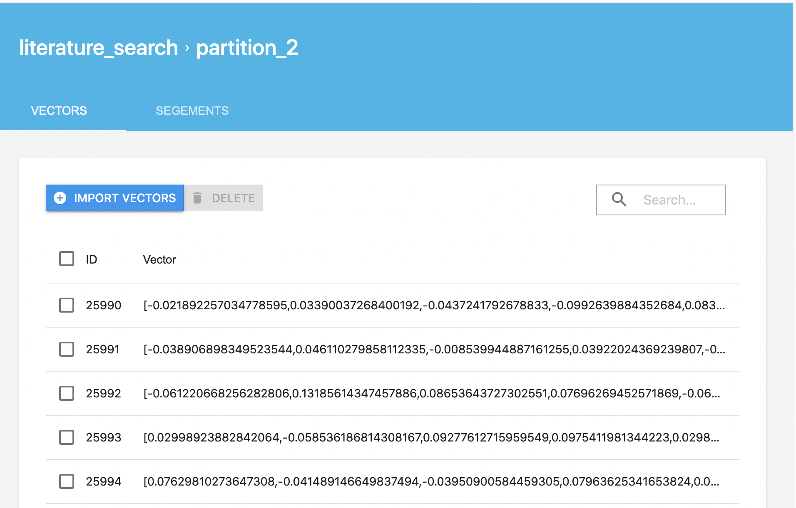

# 手把手搭建一个语义检索系统 

## 1. 场景概述

检索系统存在于我们日常使用的很多产品中，比如商品搜索系统、学术文献检索系等等，本方案提供了检索系统完整实现。限定场景是用户通过输入检索词query，快速得在海量数据中查找相似文档。

所谓语义检索（也称基于向量的检索），是指检索系统不再拘泥于用户query字面本身，而是能精准捕捉到用户query后面的真正意图并以此来搜索，从而更准确地向用户返回最符合的结果。通过使用最先进的语言模型找到文本的向量表示，在高维向量空间中对它们进行索引，并度量查询向量与索引文档的相似程度，从而解决了关键词索引带来的缺陷。

## 2. 产品功能介绍

通常检索业务的数据都比较庞大，都会分为召回（索引）、排序两个环节。召回阶段主要是从至少千万级别的候选集合里面，筛选出相关的文档，这样候选集合的数目就会大大降低，在之后的排序阶段就可以使用一些复杂的模型做精细化或者个性化的排序。排序是对召回方法的得到的候选结果进行统一的打分，这个召回方法可能是多种方法的召回结果的聚合，经过统一的打分以后就能够选出最优的TopK的结果。

### 2.1 系统特色
    
+ 易用性( or 低门槛)
    + 手把手搭建起检索系统
    + 无需标注数据也能构建检索系统
    + 一站式提供 训练、预测、ANN 引擎能力

+ 效果好
    + 针对各数据场景专业的基础解决方案
        + 仅有无监督数据: SimCSE
        + 仅有有监督数据: InBatchNegative
        + 无监督数据 + 有监督数据都有
    + 进一步优化方案: 面向领域的预训练 Post-Training
+ 性能快
    + 基于 PaddleInference 快速抽取向量性能数据
    + Milvus 引擎相关性能
    + ANN 建库性能
    + ANN 查询相应性能

###  2.2 架构&功能

索引环节有两类方法：基于字面的关键词索引；语义索引。语义索引能够较好地表征语义信息，解决字面不相似但语义相似的情形。本系统针对的是语义索引的方案。下面就详细介绍整个方案的架构和功能。

#### 2.2.1 结构图整体介绍

下面是整个索引系统的召回系统和排序系统的架构：


#### 2.2.2 召回模块

召回模块需要从千亿、万亿等海量数据中快速召回候选数据。首先需要抽取数据集文本的Embedding，然后借助向量搜索引擎实现高效ANN，实现候选集召回。


我们针对大规模无监督数据、有监督数据两种情况推出三种语义索引方案，如下图所示，您可以参照此方案，快速建立语义索引。数据量要求参考下表：

|  无监督数据 |  有监督数据 | 召回方案 |
| ------------ | ------------ | ------------ | 
|  多 |  无 | SimCSE | 
|  无 |  多 | InBatchNegative|
|  有 | 有  | SimCSE+ InBatchNegative |

最基本的情况是只有无监督数据，我们推荐您使用SimCSE进行无监督训练；另一种方案是只有有监督数据，我们推荐您使用InBatchNegative的方法进行有监督训练。

如果想进一步提升模型效果：还可以使用大规模业务数据，对预训练模型进行Post-Training，训练完以后得到预训练模型，再进行无监督的SimCSE。

此外，如果您同时拥有监督数据和无监督数据，我们推荐将两种方案结合使用，这样能训练出更加强大的语义索引模型。对SimCSE之后的模型，通过in-batch negative方法进行微调，就可以得到语义索引模型。得到语义匹配的模型后，就可以把建库的文本放入模型中抽取特征向量，然后把抽取后的向量放到语义索引引擎milvus中，利用milvus就可以很高效的实现召回了。


#### 2.2.3 排序模块

基于预训练模型 ERNIE-Gram 训练Pair-wise语义匹配模型。


## 3. 万方文献检索实践

### 3.1 数据说明

数据集来源于万方系统的点击数据，总共600万条，经过数据去重和过滤掉脏数据后，剩下的数据量是4017738条。数据的格式为：

```
每行4列:  query \t title \t keyword \t abstract
```


Post-Training的时候使用的是全量的数据，使用了文本的query,title,abstract三个字段的内容。


|  阶段 |模型 |   测试集 | 召回集 |训练集 |
| ------------ | ------------ |------------ | ------------ | ------------ |
|  召回 |  Post-Training |  - | - |20097095 |
|  召回 |  无监督预训练 |  20000 | 300000 |7984598 |
|  召回 |  有监督训练 | 20000  | 300000 |3998 |
|  排序 |  - | 37862  | - |1874103 |


### 3.2 技术方案和评估指标

#### 3.2.1 技术方案

**语义索引**：结合SimCSE和In-batch Negative方案，并采取Post-Training优化模型效果

**排序**：使用ERNIE-Gram的单塔结构对召回后的数据精排序。

首先是利用Ernie模型进行Post-Training，训练完以后得到预训练模型，然后再进行无监督的SimCSE进行无监督训练，最后利用in-batch negative方法进行微调，就可以得到语义索引模型。得到语义匹配的模型后，就可以把建库的文本放入模型中抽取特征向量，然后把抽取后的向量放到语义索引引擎milvus中，然后利用milvus就可以很方便的实现召回了。

#### 3.2.2 评估指标

在语义索引召回阶段使用的指标是Recall@K,表示的是在查询的所有实际相关结果中在所有的实际相关结果的比例,在排序阶段使用的指标为AUC，AUC反应的是分类器对样本的排序能力，如果完全随机的对样本分类，那么AUC应该接近0.5。分类器越可能把真正的正样本排在前面，auc越大，分类性能越好。


### 3.3 运行环境和安装说明

（1）运行环境

a. 软件环境：

```
python 3.x
paddlenlp                          2.1.1        
paddlepaddle-gpu                   2.1.3.post101
CUDA Version: 10.2
NVIDIA Driver Version: 440.64.00 
Ubuntu 16.04.6 LTS (Docker)
```

b. 硬件环境：

```
NVIDIA Tesla V100 16GB x4卡
Intel(R) Xeon(R) Gold 6148 CPU @ 2.40GHz
```

## 4. 动手实践——搭建自己的检索系统

这里展示了能够从头至尾跑通的完整代码，您使用自己的业务数据，照着跑，能搭建出一个给定query，返回topN相关文档的小型检索系统。请参照我们给出的效果、性能数据，check自己的运行过程是否正确。

### 4.1 召回阶段

**召回模型训练**

召回提供了四种实现方案：

|  方案名 | 说明 | 
| ------------ | ------------ |
|召回方案一|SimCSE|
|召回方案二|In-batch Negative|
|召回方案三|SimCSE+In-batch Negative|
|召回方案四|Post-Training+SimCSE+In-batch Negative|


第一步：Post-Training

训练教程请参考：

[ernie-1.0](./ernie-1.0/)


第二步：无监督预训练


无监督预训练的教程请参考SimCSE的文档：

[simcse](./simcse/)


第三步：有监督训练

有监督训练的教程请参考InbatchNegative的文档：

[in_batch_negative](./in_batch_negative/)


召回阶段的效果评估：


|  模型 |  Recall@1 | Recall@5 |Recall@10 |Recall@20 |Recall@50 |策略简要说明|
| ------------ | ------------ | ------------ |--------- |--------- |--------- |--------- |
|  Baseline |  - | -| - | - |-| 标准 pair-wise 训练范式，通过随机采样产生负样本|
|  In-batch negatives |  51.301 | 65.309| 69.878| 73.996|78.881| Inbatch-negative有监督训练|
|  SimCSE |  42.374 | 57.505| 62.641| 67.09|72.331| SimCSE无监督训练|
|  SimCSE+Inbatch-negative |  55.976 | 71.849| 76.363| 80.49|84.809| SimCSE无监督训练，Inbatch-negative有监督训练|
|  Post Training+SimCSE |  51.031 | 66.648| 71.338 | 75.676 |80.144| Ernie预训练，SimCSE无监督训练|
|  Post Training+SimCSE+Inbatch-negative|  **58.248** | **75.099**| **79.813**| **83.801**|**87.733**| Ernie预训练，simcse无监督训训练，Inbatch-negative有监督训练|


**召回系统搭建**

我们首先展示一下系统的效果，首先输入的文本如下：

```
{0:'国有企业引入非国有资本对创新绩效的影响——基于制造业国有上市公司的经验证据'}

```
下面是召回的部分结果，第一个数字是id，第二个是召回的title，第三个数字是计算的相似度距离

```
3997808 ——基于制造业国有上市公司的经验证据非国有股东,高层治理,创新绩效,中介效应,经理人观 0.3855040669441223
2218765 完善国有企业技术创新投入机制的探讨--基于经济责任审计实践国有企业,技术创新,投入机制 0.40141749382019043
1349286 企业技术创新与组织冗余--基于国有企业与非国有企业的情境研究 0.402583509683609
3009241 企业创新影响对外直接投资决策—基于中国制造业上市公司的研究企业创新;对外直接投资;制造业;上市公司 0.4121207594871521
2844610 政治关联对企业创新绩效的影响——国有企业与民营企业的对比政治关联,创新绩效,国有企业,民营企业,双重差分 0.42234885692596436
1180378 国有企业创新投入与企业绩效的研究——基于董事会成员构成的调节效应企业创新投入;调节效应;企业绩效;国有企业;董事会结构 0.45658397674560547
1031343 所有权性质、政府补助与企业绩效——来自制造业上市公司的经验证据所有权性质,政府补助,企业绩效 0.4591867923736572
109799 制造企业利用资本市场增强财务运营能力的措施——基于经济转型的背景制造企业,经济转型,资本市场,财务运营 0.46185851097106934
2469654 财务杠杆、股权激励与企业创新——基于中国A股制造业经验数据制造业;上市公司;股权激励;财务杠杆;企业创新 0.46187272667884827
3334077 R&D资助、企业创新和技术进步——基于国有企业与民营企业对比的实证研究R&D资助,企业创新,技术进步,倾向得分匹配 0.46909990906715393
2173045 政府研发资助对企业技术创新投入强度的影响——基于A股制造业上市公司的经验分析政府研发资助,技术创新投入,融资约束,知识基础,行业竞争性 0.47399336099624634
1512229 国有股权与技术创新的关系研究——基于国有上市公司的实证分析国有上市公司;国有股权;技术创新;治理结构 0.4757470488548279
3842853 政府R&D资助对企业技术创新的影响——一个基于国有与非国有企业的比较研究政府R&D资助,技术创新,国有企业,非国有企业 0.4808158278465271
467434 企业金融化、经营绩效与创新投资——基于我国制造型企业上市公司的经验研究制造型企业,企业金融化,创新投资,经营绩效 0.48144614696502686
426085 企业集团对创新产出的影响:来自制造业上市公司的经验证据企业集团,创新产出,国有企业改革,内部资本市场,专利 0.48480725288391113
2114211 研发投入、风险投资与企业融资约束——基于中国制造业上市公司的实证分析研发投入,风险投资,融资约束,信息不对称 0.48543691635131836
1694311 社会文化背景对国有大中型企业技术创新的影响国有大中型企业,技术创新,影响因素 0.4879727065563202
3270815 国有企业创新效率损失研究国有企业,创新效率 0.4884374141693115
3140513 中国国有企业并购的创新溢出效应研究国有企业;并购活动;创新溢出效应 0.4891805350780487
......

```

基于万方和开源的数据集构造生成了面向语义索引的召回库。

数据集的样例如下，有两种，第一种是title+keywords进行拼接；第二种是一句话。

```
煤矸石-污泥基活性炭介导强化污水厌氧消化煤矸石,污泥,复合基活性炭,厌氧消化,直接种间电子传递
睡眠障碍与常见神经系统疾病的关系睡眠觉醒障碍,神经系统疾病,睡眠,快速眼运动,细胞增殖,阿尔茨海默病
城市道路交通流中观仿真研究智能运输系统;城市交通管理;计算机仿真;城市道路;交通流;路径选择
....
```

数据准备结束以后，我们开始搭建Milvus的语义检索引擎，用于语义向量的快速检索，milvus的详细代码请参考：

[milvus](./milvus/)

我们使用[Milvus](https://milvus.io/)开源工具进行召回，milvus的搭建教程请参考官方教程  [milvus官方安装教程](https://milvus.io/cn/docs/v1.1.1/milvus_docker-cpu.md)本案例使用的是milvus的1.1.1版本，搭建完以后启动milvus


```
cd [Milvus root path]/core/milvus
export LD_LIBRARY_PATH=$LD_LIBRARY_PATH:[Milvus root path]/core/milvus/lib
cd scripts
./start_server.sh

```

搭建完系统以后就可以插入和检索向量了，首先生成embedding向量，每个样本生成256维度的向量：

```
root_dir="checkpoints/train_0.001" 
python -u -m paddle.distributed.launch --gpus "3" --log_dir "recall_log/" \
        milvus_demo.py \
        --device gpu \
        --recall_result_dir "recall_result_dir" \
        --recall_result_file "recall_result.txt" \
        --params_path "${root_dir}/model_40/model_state.pdparams" \
        --hnsw_m 100 \
        --hnsw_ef 100 \
        --batch_size 4096 \
        --output_emb_size 256\
        --max_seq_length 60 \
        --recall_num 50 \
        --similar_text_pair "data/test.csv" \
        --corpus_file "data/milvus_data.csv" 
```

修改config.py的配置ip：

```
MILVUS_HOST='your milvus ip'
```

然后运行下面的命令把向量插入到Milvus库中：

```
python3 embedding_insert.py
```


|  数据量 |  时间 | 
| ------------ | ------------ |
|1000万条|12min24s|

另外，milvus提供了可视化的管理界面，可以很方便的查看数据，安装地址为[Milvus Enterprise Manager](https://zilliz.com/products/em).




运行召回脚本：

```
python3 embedding_recall.py

```

第一次检索的时间大概是18s左右，需要把数据从磁盘加载到内存，后面检索就很快，下面是测试的速度：

|  数据量 |  时间 | 
| ------------ | ------------ |
|100条|0.15351247787475586|


输入一条文本进行召回,输入的样本为：

```
{0:'国有企业引入非国有资本对创新绩效的影响——基于制造业国有上市公司的经验证据'}
```

运行命令

```
python3 inference.py

```


### 4.2 排序阶段

排序阶段使用的模型是ERNIE-Gram，ERNIE-Gram的详细运行步骤请参考下面的链接：

[ernie_matching](./ernie_matching/)

|  训练集 | 测试集 | 
| ------------ | ------------ | 
 |  1874103| 56793 |


排序阶段的效果评估：

|  模型 |  AUC |
| ------------ | ------------ |
|  ERNIE-Gram |  0.801 | 

## Reference

[1] Tianyu Gao, Xingcheng Yao, Danqi Chen: SimCSE: Simple Contrastive Learning of Sentence Embeddings. EMNLP (1) 2021: 6894-6910

[2] Vladimir Karpukhin, Barlas Oğuz, Sewon Min, Patrick Lewis, Ledell Wu, Sergey Edunov, Danqi Chen, Wen-tau Yih, Dense Passage Retrieval for Open-Domain Question Answering, Preprint 2020.

[3] Dongling Xiao, Yu-Kun Li, Han Zhang, Yu Sun, Hao Tian, Hua Wu, Haifeng Wang:
ERNIE-Gram: Pre-Training with Explicitly N-Gram Masked Language Modeling for Natural Language Understanding. NAACL-HLT 2021: 1702-1715

[4] Yu Sun, Shuohuan Wang, Yu-Kun Li, Shikun Feng, Xuyi Chen, Han Zhang, Xin Tian, Danxiang Zhu, Hao Tian, Hua Wu:
ERNIE: Enhanced Representation through Knowledge Integration. CoRR abs/1904.09223 (2019)

[5] Xiao, Dongling, Yu-Kun Li, Han Zhang, Yu Sun, Hao Tian, Hua Wu, and Haifeng Wang. “ERNIE-Gram: Pre-Training with Explicitly N-Gram Masked Language Modeling for Natural Language Understanding.” ArXiv:2010.12148 [Cs].