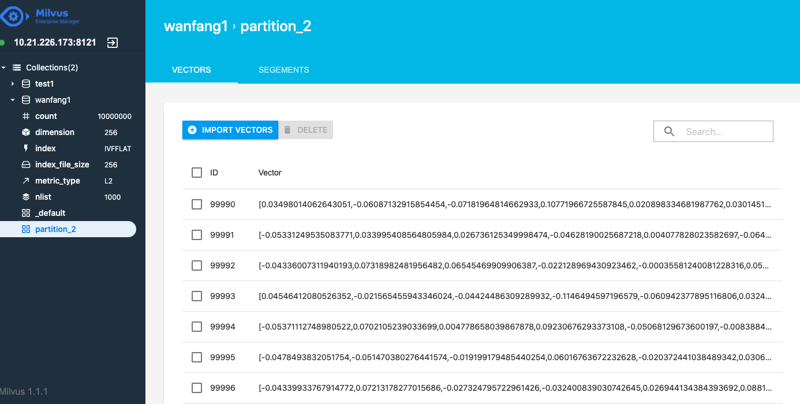

 **目录**

* [背景介绍](#背景介绍)
* [Milvus召回](#Milvus召回)
    * [1. 技术方案和评估指标](#技术方案)
    * [2. 环境依赖](#环境依赖)  
    * [3. 代码结构](#代码结构)
    * [4. 数据准备](#数据准备)
    * [5. 向量检索](#向量检索)


<a name="背景介绍"></a>

# 背景介绍

基于某检索平台开源的数据集构造生成了面向语义索引的召回库。

<a name="Milvus召回"></a>

# Milvus召回

<a name="技术方案"></a>

## 1. 技术方案和评估指标

### 技术方案

使用 Milvus 搭建召回系统，然后使用训练好的语义索引模型，抽取向量，插入到 Milvus 中，然后进行检索。

<a name="环境依赖"></a>

## 2. 环境依赖和安装说明

**环境依赖**
* python >= 3.6
* paddlepaddle >= 2.2
* paddlenlp >= 2.2
* milvus >= 1.1.1
* pymilvus >= 1.1.2

<a name="代码结构"></a>

## 3. 代码结构

## 代码结构：

```
|—— scripts
    |—— feature_extract.sh  提取特征向量的bash脚本
├── base_model.py # 语义索引模型基类
├── config.py  # milvus配置文件
├── data.py # 数据处理函数
├── embedding_insert.py # 插入向量
├── embedding_recall.py # 检索topK相似结果 / ANN
├── inference.py # 动态图模型向量抽取脚本
├── feature_extract.py # 批量抽取向量脚本
├── milvus_insert.py # 插入向量工具类
├── milvus_recall.py # 向量召回工具类
├── README.md
└── server_config.yml # milvus的config文件，本项目所用的配置
```
<a name="数据准备"></a>

## 4. 数据准备

数据集的样例如下，有两种，第一种是 title+keywords 进行拼接；第二种是一句话。

```
煤矸石-污泥基活性炭介导强化污水厌氧消化煤矸石,污泥,复合基活性炭,厌氧消化,直接种间电子传递
睡眠障碍与常见神经系统疾病的关系睡眠觉醒障碍,神经系统疾病,睡眠,快速眼运动,细胞增殖,阿尔茨海默病
城市道路交通流中观仿真研究智能运输系统;城市交通管理;计算机仿真;城市道路;交通流;路径选择
....
```

### 数据集下载


- [literature_search_data](https://bj.bcebos.com/v1/paddlenlp/data/literature_search_data.zip)

```
├── milvus # milvus建库数据集
    ├── milvus_data.csv.  # 构建召回库的数据
├── recall  # 召回（语义索引）数据集
    ├── corpus.csv # 用于测试的召回库
    ├── dev.csv  # 召回验证集
    ├── test.csv # 召回测试集
    ├── train.csv  # 召回训练集
    ├── train_unsupervised.csv # 无监督训练集
├── sort # 排序数据集
    ├── test_pairwise.csv   # 排序测试集
    ├── dev_pairwise.csv    # 排序验证集
    └── train_pairwise.csv  # 排序训练集
    
```

<a name="向量检索"></a>

## 5. 向量检索


数据准备结束以后，我们开始搭建Milvus的语义检索引擎，用于语义向量的快速检索，我们使用[Milvus](https://milvus.io/)开源工具进行召回，milvus的搭建教程请参考官方教程  [milvus官方安装教程](https://milvus.io/cn/docs/v1.1.1/milvus_docker-cpu.md)本案例使用的是milvus的1.1.1版本，搭建完以后启动milvus


```
cd [Milvus root path]/core/milvus
export LD_LIBRARY_PATH=$LD_LIBRARY_PATH:[Milvus root path]/core/milvus/lib
cd scripts
./start_server.sh

```

搭建完系统以后就可以插入和检索向量了，首先生成embedding向量，每个样本生成256维度的向量，使用的是32GB的V100的卡进行的提取：

```
root_dir="checkpoints" 
python -u -m paddle.distributed.launch --gpus "3" --log_dir "recall_log/" \
        feature_extract.py \
        --device gpu \
        --recall_result_dir "recall_result_dir" \
        --recall_result_file "recall_result.txt" \
        --params_path "${root_dir}/model_40/model_state.pdparams" \
        --hnsw_m 100 \
        --hnsw_ef 100 \
        --batch_size 4096 \
        --output_emb_size 256\
        --max_seq_length 60 \
        --recall_num 50 \
        --similar_text_pair "recall/test.csv" \
        --corpus_file "milvus/milvus_data.csv" 
```

|  数据量 |  时间 | 
| ------------ | ------------ |
|1000万条|5hour50min03s|

运行结束后会生成 corpus_embedding.npy

生成了向量后，需要把数据抽炒入到Milvus库中，首先修改配置：

修改config.py的配置ip：

```
MILVUS_HOST='your milvus ip'
```

然后运行下面的命令把向量插入到Milvus库中：

```
python3 embedding_insert.py
```


|  数据量 |  时间 | 
| ------------ | ------------ |
|1000万条|12min24s|

另外，milvus提供了可视化的管理界面，可以很方便的查看数据，安装地址为[Milvus Enterprise Manager](https://zilliz.com/products/em).




运行召回脚本：

```
python3 embedding_recall.py

```
运行的结果为，表示的是召回的id和与当前的query计算的距离：

```
10000000
time cost 0.5410025119781494 s
Status(code=0, message='Search vectors successfully!')
[
[
(id:1, distance:0.0),
(id:7109733, distance:0.832247257232666),
(id:6770053, distance:0.8488889932632446),
(id:2653227, distance:0.9032443761825562),
...
```

第一次检索的时间大概是18s左右，需要把数据从磁盘加载到内存，后面检索就很快，下面是测试的速度：

|  数据量 |  时间 | 
| ------------ | ------------ |
|100条|0.15351247787475586|


修改代码的模型路径和样本：

```
params_path='checkpoints/model_40/model_state.pdparams'
id2corpus={0:'国有企业引入非国有资本对创新绩效的影响——基于制造业国有上市公司的经验证据'}
```

运行命令

```
python3 inference.py

```
运行的输出为，分别是抽取的向量和召回的结果：

```
[1, 256]
[[ 0.06374735 -0.08051944  0.05118101 -0.05855767 -0.06969483  0.05318566
   0.079629    0.02667932 -0.04501902 -0.01187392  0.09590752 -0.05831281
   ....
5677638 国有股权参股对家族企业创新投入的影响混合所有制改革,国有股权,家族企业,创新投入 0.5417419672012329
1321645 高管政治联系对民营企业创新绩效的影响——董事会治理行为的非线性中介效应高管政治联系,创新绩效,民营上市公司,董事会治理行为,中介效应 0.5445536375045776
1340319 国有控股上市公司资产并购重组风险探讨国有控股上市公司,并购重组,防范对策 0.5515031218528748
....
```