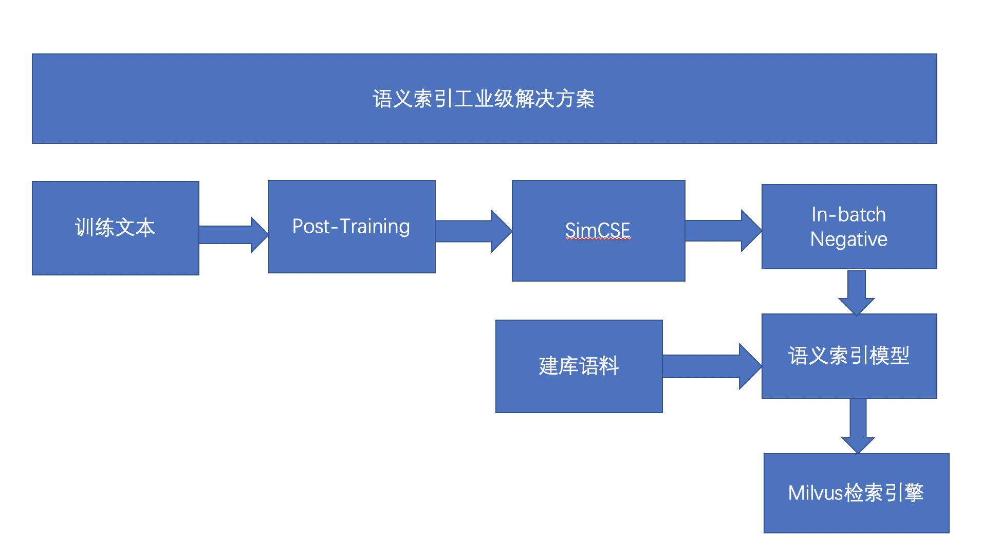
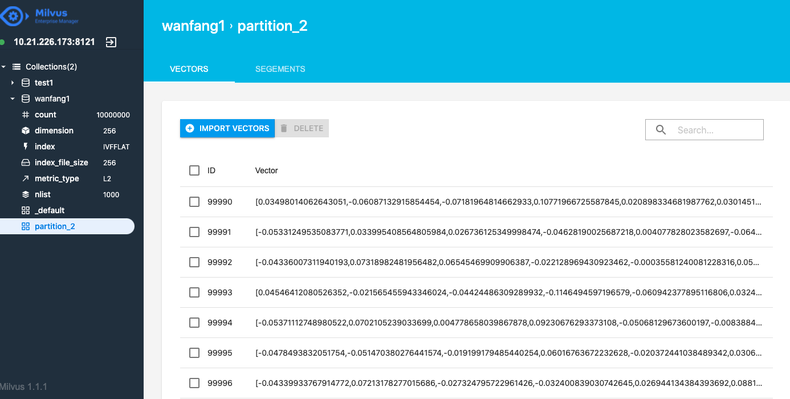

# 语义索引工业级别方案

语义索引技术是搜索引擎、推荐系统、广告系统在召回阶段的核心技术之一， 语义索引模型的效果直接决定了语义相关的物料能否被成功召回进入系统参与上层排序，从基础层面影响整个系统的效果。

语义索引库提供了前沿语义索引策略的训练、语义索引模型的效果评估方案、支持用户基于我们开源的语义索引模型进行文本 Pair 的相似度计算或者 Embedding 语义表示抽取。




上图是开源的语义索引的工业级别的解决方案，首先是利用Ernie模型进行Post-Training，训练完以后得到预训练模型，然后再进行无监督的SimCSE进行无监督训练，最后利用in-batch negative方法进行微调，就可以得到语义索引模型。得到语义匹配的模型后，就可以把建库的文本放入模型中抽取特征向量，然后把抽取后的向量放到语义索引引擎milvus中，然后利用milvus就可以很方便的实现召回了。

## 数据集介绍

数据集来源于万方系统的点击数据，总共600万条，经过数据去重和过滤掉脏数据后，剩下的数据量是4017738条。数据的格式为：

```
每行4列:  query \t title \t keyword \t abstract
```


Post-Training的时候使用的是全量的数据，使用了文本的query,title,abstract三个字段的内容。


|  阶段 |  测试集 | 召回集 |训练集 |
| ------------ | ------------ | ------------ | ------------ |
|  Post-Training |  - | - |20097095 |
|  无监督预训练 |  20000 | 300000 |7984598 |
|  有监督训练 | 20000  | 300000 |3998 |

## Post-Training

训练教程请参考：

https://github.com/PaddlePaddle/PaddleNLP/tree/develop/examples/language_model/ernie-1.0

```
task_name="ernie-1.0-dp8-gb1024"

PYTHONPATH=../../../  python -u  -m paddle.distributed.launch \
    --gpus "0,1,2,3" \
    --log_dir "output/$task_name/log" \
    run_pretrain_static.py \
    --model_type "ernie" \
    --model_name_or_path "ernie-1.0" \
    --input_dir "./data" \
    --output_dir "output/$task_name" \
    --max_seq_len 512 \
    --micro_batch_size 32 \
    --global_batch_size 128 \
    --sharding_degree 1\
    --dp_degree 4 \
    --use_sharding false \
    --use_amp true \
    --use_recompute false \
    --max_lr 0.0001 \
    --min_lr 0.00001 \
    --max_steps 200000 \
    --save_steps 100000 \
    --checkpoint_steps 5000 \
    --decay_steps 1980000 \
    --weight_decay 0.01\
    --warmup_rate 0.01 \
    --grad_clip 1.0 \
    --num_workers 2 \
    --logging_freq 20\
    --eval_freq 1000 \
    --device "gpu"
```

训练完以后，需要把静态图的参数转换成动态图，修改模型路径，然后使用下面的命令：

```
python3 ernie_static_to_dynamic.py
```

## 无监督预训练

### 数据格式

```
煤矸石-污泥基活性炭介导强化污水厌氧消化
睡眠障碍与常见神经系统疾病的关系睡眠觉醒障碍,神经系统疾病,睡眠,快速眼运动,细胞增殖,阿尔茨海默病
......
```
### 训练

无监督预训练的教程请参考SimCSE的文档：

https://github.com/PaddlePaddle/PaddleNLP/tree/develop/examples/text_matching/simcse

```
python -u -m paddle.distributed.launch --gpus '0,1,2,3' \
	train.py \
	--device gpu \
	--save_dir ./checkpoints/ \
	--batch_size 64 \
	--learning_rate 5E-5 \
	--epochs 3 \
	--save_steps 2000 \
	--eval_steps 100 \
	--max_seq_length 64 \
	--infer_with_fc_pooler \
	--dropout 0.2 \
    --output_emb_size 256 \
	--train_set_file "./data/train_unsupervised.csv" \
	--test_set_file "./data/test.csv" 
```

## 有监督训练

有监督训练的教程请参考InbatchNegative的文档：

https://github.com/PaddlePaddle/PaddleNLP/tree/develop/examples/semantic_indexing

```
root_path=train_0.001
python -u -m paddle.distributed.launch --gpus "0,1,2,3" \
    train_batch_neg.py \
    --device gpu \
    --save_dir ./checkpoints/post_simcse_inbatch_negative \
    --batch_size 64 \
    --learning_rate 5E-5 \
    --epochs 3 \
    --output_emb_size 256 \
    --save_steps 10 \
    --max_seq_length 64 \
    --margin 0.2 \
    --train_set_file data/${root_path}/train.csv  \
    --init_from_ckpt simcse/post_model_10000/model_state.pdparams
```

## 效果评估


|  模型 |  Recall@1 | Recall@5 |Recall@10 |Recall@20 |Recall@50 |策略简要说明|
| ------------ | ------------ | ------------ |--------- |--------- |--------- |--------- |
|  In-batch negatives |  51.301 | 65.309| 69.878| 73.996|78.881| Inbatch-negative有监督训练|
|  Inbatch-negative+simcse |  55.976 | 71.849| 76.363| 80.49|84.809| SimCSE无监督训练，Inbatch-negative有监督训练|
|  post+Inbatch-negative+simcse |  58.248 | 75.099| 79.813| 83.801|87.733| Ernie预训练，simcse无监督训训练，Inbatch-negative有监督训练|


## 召回系统

### 效果展示
我们首先展示一下系统的效果，首先输入的文本如下：

```
{0:'国有企业引入非国有资本对创新绩效的影响——基于制造业国有上市公司的经验证据'}

```
下面是召回的部分结果，第一个数字是id，第二个是召回的title，第三个数字是计算的相似度距离

```
3997808 ——基于制造业国有上市公司的经验证据非国有股东,高层治理,创新绩效,中介效应,经理人观 0.3855040669441223
2218765 完善国有企业技术创新投入机制的探讨--基于经济责任审计实践国有企业,技术创新,投入机制 0.40141749382019043
1349286 企业技术创新与组织冗余--基于国有企业与非国有企业的情境研究 0.402583509683609
3009241 企业创新影响对外直接投资决策—基于中国制造业上市公司的研究企业创新;对外直接投资;制造业;上市公司 0.4121207594871521
......

```
### 数据生成
我们基于万方和开源的数据集构造生成了面向语义索引的训练集、评估集、召回库。


#### 构造训练集

数据集的样例如下，有两种，第一种是title+keywords进行拼接；第二种是一句话。

```
煤矸石-污泥基活性炭介导强化污水厌氧消化煤矸石,污泥,复合基活性炭,厌氧消化,直接种间电子传递
睡眠障碍与常见神经系统疾病的关系睡眠觉醒障碍,神经系统疾病,睡眠,快速眼运动,细胞增殖,阿尔茨海默病
城市道路交通流中观仿真研究智能运输系统;城市交通管理;计算机仿真;城市道路;交通流;路径选择
....
```


#### Milvus召回

我们使用[Milvus](https://milvus.io/)开源工具进行召回，milvus的搭建教程请参考官方教程  [milvus官方安装教程](https://milvus.io/cn/docs/v1.1.1/milvus_docker-cpu.md)本案例使用的是milvus的1.1.1版本，搭建完以后启动milvus


```
cd [Milvus root path]/core/milvus
export LD_LIBRARY_PATH=$LD_LIBRARY_PATH:[Milvus root path]/core/milvus/lib
cd scripts
./start_server.sh

```
搭建完系统以后就可以插入和检索向量了，首先生成embedding向量，每个样本生成256维度的向量：

```
root_dir="checkpoints/train_0.001" 
python -u -m paddle.distributed.launch --gpus "3" --log_dir "recall_log/" \
        milvus_demo.py \
        --device gpu \
        --recall_result_dir "recall_result_dir" \
        --recall_result_file "recall_result.txt" \
        --params_path "${root_dir}/model_40/model_state.pdparams" \
        --hnsw_m 100 \
        --hnsw_ef 100 \
        --batch_size 4096 \
        --output_emb_size 256\
        --max_seq_length 60 \
        --recall_num 50 \
        --similar_text_pair "data/test.csv" \
        --corpus_file "data/milvus_data.csv" 
```

然后把向量插入到Milvus库中：

```
python3 embedding_insert.py
```


|  数据量 |  时间 | 
| ------------ | ------------ |
|1000万条|12min24s|


另外，milvus提供了可视化的管理界面，可以很方便的查看数据，安装地址为[Milvus Enterprise Manager](https://zilliz.com/products/em).




运行召回脚本：

```
python3 embedding_recall.py

```

第一次检索的时间大概是18s左右，需要把数据从磁盘加载到内存，后面检索就很快，下面是测试的速度：

|  数据量 |  时间 | 
| ------------ | ------------ |
|100条|0.15351247787475586|


输入一条文本进行召回,输入的样本为：

```
{0:'国有企业引入非国有资本对创新绩效的影响——基于制造业国有上市公司的经验证据'}
```
运行命令
```
python3 inference.py

```

## Reference
[1] Tianyu Gao, Xingcheng Yao, Danqi Chen: SimCSE: Simple Contrastive Learning of Sentence Embeddings. EMNLP (1) 2021: 6894-6910

[2] Vladimir Karpukhin, Barlas Oğuz, Sewon Min, Patrick Lewis, Ledell Wu, Sergey Edunov, Danqi Chen, Wen-tau Yih, Dense Passage Retrieval for Open-Domain Question Answering, Preprint 2020.
