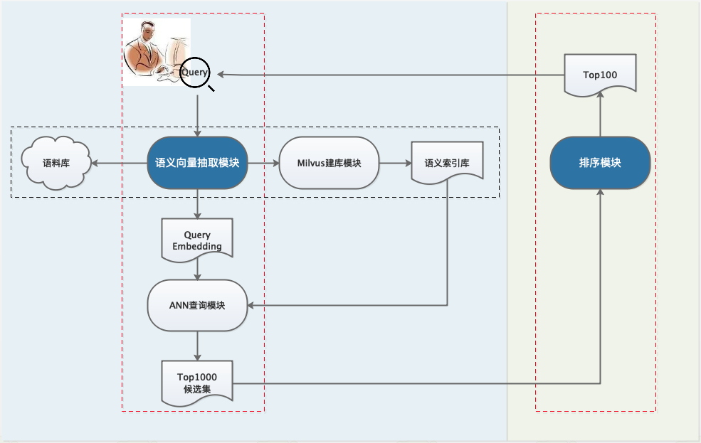

# 手把手搭建一个语义检索系统

## 1. 场景概述

检索系统存在于我们日常使用的很多产品中，比如商品搜索系统、学术文献检索系等等，本方案提供了检索系统完整实现。限定场景是用户通过输入检索词 Query，快速在海量数据中查找相似文档。

所谓语义检索（也称基于向量的检索），是指检索系统不再拘泥于用户 Query 字面本身，而是能精准捕捉到用户 Query 后面的真正意图并以此来搜索，从而更准确地向用户返回最符合的结果。通过使用最先进的语义索引模型找到文本的向量表示，在高维向量空间中对它们进行索引，并度量查询向量与索引文档的相似程度，从而解决了关键词索引带来的缺陷。

例如下面两组文本 Pair，如果基于关键词去计算相似度，两组的相似度是相同的。而从实际语义上看，第一组相似度高于第二组。

```
车头如何放置车牌    前牌照怎么装
车头如何放置车牌    后牌照怎么装
```

语义检索系统的关键就在于，采用语义而非关键词方式进行召回，达到更精准、更广泛得召回相似结果的目的。

## 2. 产品功能介绍

通常检索业务的数据都比较庞大，都会分为召回（索引）、排序两个环节。召回阶段主要是从至少千万级别的候选集合里面，筛选出相关的文档，这样候选集合的数目就会大大降低，在之后的排序阶段就可以使用一些复杂的模型做精细化或者个性化的排序。一般采用多路召回策略（例如关键词召回、热点召回、语义召回结合等），多路召回结果聚合后，经过统一的打分以后选出最优的 TopK 的结果。

### 2.1 系统特色

+ 低门槛
    + 手把手搭建起检索系统
    + 无需标注数据也能构建检索系统
    + 提供 训练、预测、ANN 引擎一站式能力

+ 效果好
    + 针对多种数据场景的专业方案
        + 仅有无监督数据: SimCSE
        + 仅有有监督数据: InBatchNegative
        + 兼具无监督数据 和 有监督数据：融合模型
    + 进一步优化方案: 面向领域的预训练 Domain-adaptive Pretraining
+ 性能快
    + 基于 Paddle Inference 快速抽取向量
    + 基于 Milvus 快速查询和高性能建库

###  2.2 功能架构

索引环节有两类方法：基于字面的关键词索引；语义索引。语义索引能够较好地表征语义信息，解决字面不相似但语义相似的情形。本系统给出的是语义索引方案，实际业务中可融合其他方案使用。下面就详细介绍整个方案的架构和功能。

#### 2.2.1 整体介绍



以上是nerual_search的系统流程图，其中左侧为召回环节，核心是语义向量抽取模块；右侧是排序环节，核心是排序模型。图中红色虚线框表示在线计算，黑色虚线框表示离线批量处理。下面我们分别介绍召回中的语义向量抽取模块，以及排序模型。


#### 2.2.2 召回模块

召回模块需要从千万量级数据中快速召回候选数据。首先需要抽取语料库中文本的 Embedding，然后借助向量搜索引擎实现高效 ANN，从而实现候选集召回。

我们针对不同的数据情况推出三种语义索引方案，如下图所示，您可以参照此方案，快速建立语义索引：

|  ⭐️ 无监督数据 |  ⭐️ 有监督数据 | **召回方案** |
| ------------ | ------------ | ------------ |
|  多 |  无 | SimCSE |
|  无 |  多 | In-batch Negatives|
|  有 | 有  | SimCSE+ In-batch Negatives |

最基本的情况是只有无监督数据，我们推荐您使用 SimCSE 进行无监督训练；另一种方案是只有有监督数据，我们推荐您使用 In-batch Negatives 的方法进行有监督训练。

如果想进一步提升模型效果：还可以使用大规模业务数据，对预训练模型进行 Domain-adaptive Pretraining，训练完以后得到预训练模型，再进行无监督的 SimCSE。

此外，如果您同时拥有监督数据和无监督数据，我们推荐将两种方案结合使用，这样能训练出更加强大的语义索引模型。

#### 2.2.3 排序模块

排序模块基于前沿的预训练模型 ERNIE-Gram，训练 Pair-wise 语义匹配模型。召回模型负责从海量（千万级）候选文本中快速（毫秒级）筛选出与 Query 相关性较高的 TopK Doc，排序模型会在召回模型筛选出的 TopK Doc 结果基础之上针对每一个 (Query, Doc) Pair 对进行两两匹配计算相关性，排序效果更精准。

## 3. 文献检索实践

### 3.1 技术方案和评估指标

#### 3.1.1 技术方案

**语义索引**：由于我们既有无监督数据，又有有监督数据，所以结合 SimCSE 和 In-batch Negatives 方案，并采取 Domain-adaptive Pretraining 优化模型效果。

首先是利用 ERNIE 1.0 模型进行 Domain-adaptive Pretraining，在得到的预训练模型基础上，进行无监督的 SimCSE 训练，最后利用 In-batch Negatives 方法进行微调，得到最终的语义索引模型，把建库的文本放入模型中抽取特征向量，然后把抽取后的向量放到语义索引引擎 milvus 中，利用 milvus 就可以很方便得实现召回了。

**排序**：使用 ERNIE-Gram 的单塔结构对召回后的数据精排序。

#### 3.1.2 评估指标

**模型效果指标**
* 在语义索引召回阶段使用的指标是 Recall@K，表示的是预测的前topK（从最后的按得分排序的召回列表中返回前K个结果）结果和语料库中真实的前 K 个相关结果的重叠率，衡量的是检索系统的查全率。

* 在排序阶段使用的指标为AUC，AUC反映的是分类器对样本的排序能力，如果完全随机得对样本分类，那么AUC应该接近0.5。分类器越可能把真正的正样本排在前面，AUC越大，分类性能越好。

**性能指标**
* 基于 Paddle Inference 快速抽取向量

* 建库性能和 ANN 查询性能快

### 3.2 数据说明

数据集来源于某文献检索系统，既有大量无监督数据，又有有监督数据。

（1）采用文献的 query, title,keywords,abstract 四个字段内容，构建无标签数据集进行 Domain-adaptive Pretraining；

（2）采用文献的 query,title,keywords 三个字段内容，构造无标签数据集，进行无监督召回训练SimCSE；

（3）使用文献的的query, title, keywords，构造带正标签的数据集，不包含负标签样本，基于 In-batch Negatives 策略进行训练；

（4）在排序阶段，使用点击（作为正样本）和展现未点击（作为负样本）数据构造排序阶段的训练集，使用ERNIE-Gram模型进行精排训练。

|  阶段 |模型 |   训练集 | 评估集（用于评估模型效果） | 召回库 |测试集 |
| ------------ | ------------ |------------ | ------------ | ------------ | ------------ |
|  召回 |  Domain-adaptive Pretraining  |  2kw | - | - | - |
|  召回 |  无监督预训练 - SimCSE |  798w  | 20000 |  300000| 1000 |
|  召回 |  有监督训练 - In-batch Negatives | 3998  | 20000 |300000  | 1000 |
|  排序 |  有监督训练 - ERNIE-Gram单塔 Pairwise| 1973538   | 57811 | - | 1000 |

我们将除 Domain-adaptive Pretraining 之外的其他数据集全部开源，下载地址：

- [literature_search_data](https://bj.bcebos.com/v1/paddlenlp/data/literature_search_data.zip)

```
├── milvus # milvus建库数据集
    ├── milvus_data.csv.  # 构建召回库的数据（模拟实际业务线上的语料库，实际语料库远大于这里的规模），用于直观演示相关文献召回效果
├── recall  # 召回阶段数据集
    ├── train_unsupervised.csv # 无监督训练集，用于训练 SimCSE
    ├── train.csv  # 有监督训练集，用于训练 In-batch Negative
    ├── dev.csv  # 召回阶段验证集，用于评估召回模型的效果，SimCSE 和 In-batch Negative 共用
    ├── corpus.csv # 构建召回库的数据（模拟实际业务线上的语料库，实际语料库远大于这里的规模），用于评估召回阶段模型效果，SimCSE 和 In-batch Negative 共用
    ├── test.csv # 召回阶段测试数据，预测文本之间的相似度，SimCSE 和 In-batch Negative 共用
├── sort # 排序阶段数据集
    ├── train_pairwise.csv  # 排序训练集
    ├── dev_pairwise.csv    # 排序验证集
    └── test_pairwise.csv   # 排序测试集
```

### 3.3 运行环境和安装说明


（1）运行环境

本实验采用了以下的运行环境进行，详细说明如下，用户也可以在自己 GPU 硬件环境进行：

a. 软件环境：


- python >= 3.6
- paddlenlp >= 2.2.1
- paddlepaddle-gpu >=2.2
- CUDA Version: 10.2
- NVIDIA Driver Version: 440.64.00
- Ubuntu 16.04.6 LTS (Docker)


b. 硬件环境：


- NVIDIA Tesla V100 16GB x4卡
- Intel(R) Xeon(R) Gold 6148 CPU @ 2.40GHz


c. 依赖安装:

```
pip install -r requirements.txt
```

## 4. 动手实践——搭建自己的检索系统

这里展示了能够从头至尾跑通的完整代码，您使用自己的业务数据，照着跑，能搭建出一个给定 Query，返回 topK 相关文档的小型检索系统。您可以参照我们给出的效果和性能数据来检查自己的运行过程是否正确。

### 4.1 召回阶段

**召回模型训练**

这里采用 Domain-adaptive Pretraining + SimCSE + In-batch Negatives 方案：

第一步：无监督训练 Domain-adaptive Pretraining

训练用时 16hour55min，可参考：[ERNIE 1.0](https://github.com/PaddlePaddle/PaddleNLP/tree/develop/model_zoo/ernie-1.0)

第二步：无监督训练 SimCSE

训练用时 16hour53min，可参考：[SimCSE](./recall/simcse/)

第三步：有监督训练

几分钟内训练完成，可参考 [In-batch Negatives](./recall/in_batch_negative/)


此外，我们进行了多组实践，用来对比说明召回阶段各方案的效果：

|  模型 |  Recall@1 | Recall@5 |Recall@10 |Recall@20 |Recall@50 |策略简要说明|
| ------------ | ------------ | ------------ |--------- |--------- |--------- |--------- |
|  有监督训练 Baseline | 30.077| 43.513| 48.633 | 53.448 |59.632| 标准 pair-wise 训练范式，通过随机采样产生负样本|
|  有监督训练 In-batch Negatives |  51.301 | 65.309| 69.878| 73.996|78.881| In-batch Negatives 有监督训练|
|  无监督训练 SimCSE |  42.374 | 57.505| 62.641| 67.09|72.331| SimCSE 无监督训练|
|  无监督 + 有监督训练 SimCSE + In-batch Negatives |  55.976 | 71.849| 76.363| 80.49|84.809| SimCSE无监督训练，In-batch Negatives 有监督训练|
|  Domain-adaptive Pretraining + SimCSE |  51.031 | 66.648| 71.338 | 75.676 |80.144| ERNIE 预训练，SimCSE 无监督训练|
|  Domain-adaptive Pretraining + SimCSE + In-batch Negatives|  **58.248** | **75.099**| **79.813**| **83.801**|**87.733**| ERNIE 预训练，SimCSE 无监督训训练，In-batch Negatives 有监督训练|

从上述表格可以看出，首先利用 ERNIE 3.0 做 Domain-adaptive Pretraining ，然后把训练好的模型加载到 SimCSE 上进行无监督训练，最后利用 In-batch Negatives 在有监督数据上进行训练能够获得最佳的性能。[模型下载](https://paddlenlp.bj.bcebos.com/models/inbatch_model_best.zip)，模型的使用方式参考[In-batch Negatives](./recall/in_batch_negative/) 。

**召回系统搭建**

召回系统使用索引引擎 Milvus，可参考 [milvus_system](./recall/milvus/)。
我们展示一下系统的效果，输入的文本如下：

```
中西方语言与文化的差异

```
下面是召回的部分结果，第一个是召回的title，第二个数字是计算的相似度距离

```
跨文化中的文化习俗对翻译的影响翻译,跨文化,文化习俗	0.615584135055542
试论翻译过程中的文化差异与语言空缺翻译过程,文化差异,语言空缺,文化对比	0.6155391931533813
中英文化差异及习语翻译习语,文化差异,翻译	0.6153547763824463
英语中的中国文化元素英语,中国文化,语言交流	0.6151996850967407
跨文化交际中的文化误读研究文化误读,影响,中华文化,西方文明	0.6137217283248901
在语言学习中了解中法文化差异文化差异,对话交际,语言	0.6134252548217773
从翻译视角看文化差异影响下的中式英语的应对策略文化差异;中式英语现;汉英翻译;动态对等理论	0.6127341389656067
归化与异化在跨文化传播中的动态平衡归化,异化,翻译策略,跨文化传播,文化外译	0.6127211451530457
浅谈中西言语交际行为中的文化差异交际用语,文化差异,中国,西方	0.6125463843345642
翻译中的文化因素--异化与归化文化翻译,文化因素,异化与归化	0.6111845970153809
历史与文化差异对翻译影响的分析研究历史与文化差异,法汉翻译,翻译方法	0.6107486486434937
从中、韩、美看跨文化交际中的东西方文化差异跨文化交际,东西方,文化差异	0.6091923713684082
试论文化差异对翻译工作的影响文化差异,翻译工作,影响	0.6084284782409668
从归化与异化看翻译中的文化冲突现象翻译,文化冲突,归化与异化,跨文化交际	0.6063553690910339
中西方问候语的文化差异问候语,文化差异,文化背景	0.6054259538650513
中英思维方式的差异对翻译的影响中英文化的差异,中英思维方式的差异,翻译	0.6026732921600342
略论中西方语言文字的特性与差异语言,会意,确意,特性,差异	0.6009351015090942
......

```


### 4.2 排序阶段

排序阶段使用的模型是 ERNIE-3.0-Medium-zh，用时 20h，可参考：

[ernie_matching](./ranking/ernie_matching/)

排序阶段的效果评估：

|  模型 |  AUC |
| ------------ | ------------ |
|  Baseline: In-batch Negatives |  0.582 |
|  ERNIE-Gram |  0.801 |

同样输入文本：

```
中西方语言与文化的差异
```
排序阶段的结果展示如下，第一个是 Title ，第二个数字是计算的概率，显然经排序阶段筛选的文档与 Query 更相关：

```
中西方文化差异以及语言体现中西方文化,差异,语言体现	0.999848484992981
论中西方语言与文化差异的历史渊源中西方语言,中西方文化,差异,历史渊源	0.9998375177383423
从日常生活比较中西方语言与文化的差异中西方,语言,文化,比较	0.9985846281051636
试论中西方语言文化教育的差异比较与融合中西方,语言文化教育,差异	0.9972485899925232
中西方文化差异对英语学习的影响中西方文化,差异,英语,学习	0.9831035137176514
跨文化视域下的中西文化差异研究跨文化,中西,文化差异	0.9781349897384644
中西方文化差异对跨文化交际的影响分析文化差异,跨文化交际,影响	0.9735479354858398
探析跨文化交际中的中西方语言差异跨文化交际,中西方,语言差异	0.9668175578117371
中西方文化差异解读中英文差异表达中西文化,差异表达,跨文化交际	0.9629314541816711
中西方文化差异对英语翻译的影响中西方文化差异,英语翻译,翻译策略,影响	0.9538986086845398
论跨文化交际中的中西方文化冲突跨文化交际,冲突,文化差异,交际策略,全球化	0.9493677616119385
中西方文化差异对英汉翻译的影响中西方文化,文化差异,英汉翻译,影响	0.9430705904960632
中西方文化差异与翻译中西方,文化差异,翻译影响,策略方法,译者素质	0.9401137828826904
外语教学中的中西文化差异外语教学,文化,差异	0.9397934675216675
浅析西语国家和中国的文化差异-以西班牙为例跨文化交际,西语国家,文化差异	0.9373322129249573
中英文化差异在语言应用中的体现中英文化,汉语言,语言应用,语言差异	0.9359155297279358
....
```


## Reference

[1] Tianyu Gao, Xingcheng Yao, Danqi Chen: [SimCSE: Simple Contrastive Learning of Sentence Embeddings](https://arxiv.org/abs/2104.08821). EMNLP (1) 2021: 6894-6910

[2] Vladimir Karpukhin, Barlas Oğuz, Sewon Min, Patrick Lewis, Ledell Wu, Sergey Edunov, Danqi Chen, Wen-tau Yih, [Dense Passage Retrieval for Open-Domain Question Answering](https://arxiv.org/abs/2004.04906). Preprint 2020.

[3] Dongling Xiao, Yu-Kun Li, Han Zhang, Yu Sun, Hao Tian, Hua Wu, Haifeng Wang:
[ERNIE-Gram: Pre-Training with Explicitly N-Gram Masked Language Modeling for Natural Language Understanding](https://arxiv.org/abs/2010.12148). NAACL-HLT 2021: 1702-1715

[4] Yu Sun, Shuohuan Wang, Yu-Kun Li, Shikun Feng, Xuyi Chen, Han Zhang, Xin Tian, Danxiang Zhu, Hao Tian, Hua Wu:
[ERNIE: Enhanced Representation through Knowledge Integration](https://arxiv.org/abs/1904.09223). CoRR abs/1904.09223 (2019)
