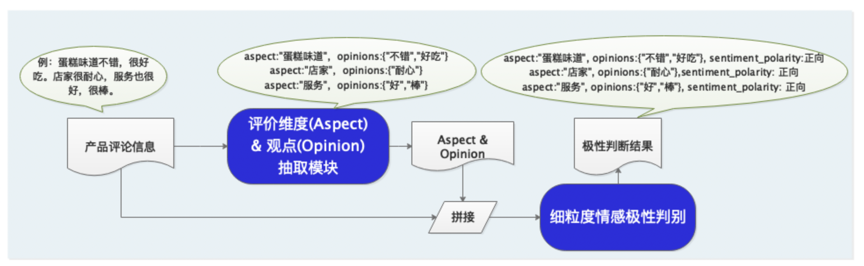
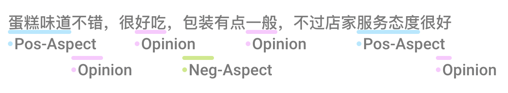

# 评论观点抽取与情感倾向性分析

## 1. 场景概述

情感分析旨在对带有情感色彩的主观性文本进行分析、处理、归纳和推理，其广泛应用于消费决策、舆情分析、个性化推荐等领域，具有很高的商业价值。

依托百度领先的情感分析技术，食行生鲜自动生成菜品评论标签辅助用户购买，并指导运营采购部门调整选品和促销策略；房天下向购房者和开发商直观展示楼盘的用户口碑情况，并对好评楼盘置顶推荐；国美搭建服务智能化评分系统，客服运营成本减少40%，负面反馈处理率100%。

情感分析相关的任务有语句级情感分析、评论对象抽取、观点抽取等等。一般来讲，被人们所熟知的情感分析任务是语句级别的情感分析，该任务是在宏观上去分析整句话的感情色彩，其粒度可能相对比较粗。

因为在人们进行评论的时候，往往针对某一产品或服务进行多个属性的评论，对每个属性的评论可能也会褒贬不一，因此针对属性级别的情感分析在真实的场景中会更加实用，同时更能给到企业用户或商家更加具体的建议。例如这句关于薯片的评论。

> 这个薯片味道真的太好了，口感很脆，只是包装很一般。

可以看到，顾客在口感、包装和味道 三个属性上对薯片进行了评价，顾客在味道和口感两个方面给出了好评，但是在包装上给出了负面的评价。只有通过这种比较细粒度的分析，商家才能更有针对性的发现问题，进而改进自己的产品或服务。

基于这样的考虑，本项目提出了一种细粒度的情感分析能力，对于给定的文本，首先会抽取该文本中的评论观点，然后分析不同观点的情感极性。


## 2. 产品功能介绍

### 2.1 系统特色
为了降低技术门槛，方便开发者共享效果领先的情感分析技术，PaddleNLP本次开源的情感分析系统，具备三大亮点：

- 覆盖任务全
    - 集成评论观点抽取、属性级情感分类等情感分析能力，并开源模型，且打通模型训练、评估、预测部署全流程。
- 效果领先
    - 集成百度研发的基于情感知识增强的预训练模型SKEP，为各类情感分析任务提供统一且强大的情感语义表示能力。
- 预测性能强
    - 针对预训练模型预测效率低的问题，开源小模型PP-MiniLM，量化优化策略，预测性能大幅提升。

### 2.2 架构&功能

本项目提出的的情感分析解决方案如图1所示，整个情感分析的过程大致包含两个阶段，依次是评论观点抽取模型，属性级情感分类模型。对于给定的一段文本，首先基于前者抽取出文本语句中潜在的评论属性以及该属性相应的评论观点，然后将评论属性、观点以及原始文本进行拼接，传给属性级情感分类模型以识别出该评论属性的情感极性。

这里需要提到的是，由于目前市面上的大多数模型是基于通用语料训练出来的，这些模型可能并不会对情感信息那么敏感。基于这样的考量，本项目使用了百度自研的 SKEP 预训练模型，其在预训练阶段便设计了多种情感信息相关的预训练目标进行训练。作为一种情感专属的模型，其更适合用来做上边提到的评论观点抽取任务，以及属性级情感分类任务。

另外，本项目使用的是 Large 版的 SKEP 模型，考虑到企业用户在线上部署时会考虑到模型预测效率，所以本项目专门提供了一个通用版的小模型 [PP-MiniLM](https://github.com/PaddlePaddle/PaddleNLP/tree/develop/examples/model_compression/pp-minilm) 以及一套量化策略，用户可以使用相应情感数据集对 PP-MiniLM 进行微调，然后进行量化，以达到更快的预测效率。

<div align="center">
    
    <p>图1 情感分析系统图<p/>
</div>


## 3. 情感分析效果展示
在图1中可以看到，本项目的核心模块为评论观点抽取和属性级情感分类模块，本项目中基于情感专属模型 SKEP 实现了两个模块，并且提供了两者训练和测试的脚本，分别放在 `extraction` 和 `classification` 目录下。

下表展示了我们训练的评论观点抽取模型在验证集 `dev` 和测试集 `test` 上的表现：
|Model|数据集|precision|Recall|F1|
| ------------ | ------------ | ------------ |-----------|------------ |
|SKEP-Large|dev|0.87095|0.90056|0.88551|
|SKEP-Large|test|0.87125|0.89944|0.88512|

下表展示了我们训练的属性级情感分类模型在验证集 `dev` 和测试集 `test` 上的表现：
|Model|数据集|precision|Recall|F1|
| ------------ | ------------ | ------------ |-----------|------------ |
|SKEP-Large|dev|0.98758|0.99251|0.99004|
|SKEP-Large|test|0.98497|0.99139|0.98817|

给定一段文本，使用我们提供的全流程预测脚本可以轻松获得情感分析结果，如下所示。

- input_text: 蛋糕味道不错，很好吃，店家很耐心，服务也很好，很棒
  - aspect: 蛋糕味道, opinions: ['不错', '好吃'], sentiment_polarity: 正向
  - aspect: 店家, opinions: ['耐心'], sentiment_polarity: 正向
  - aspect: 服务, opinions: ['好', '棒'], sentiment_polarity: 正向

如果你想了解更多评论观点抽取模型和属性级情感分类模型的实现细节，请分别点击 [extraction](extraction/README.md) 和 [classification](classification/README.md)。


## 4. 情感分析实践
以下是本项目运行的完整目录结构以及说明：

```
.
├── extraction                         # 评价观点抽取模型包
├── classification                     # 细粒度情感分类模型包
├── pp_minilm                          # PP-MiniLM特色小模型包
├── deploy                             # 高性能预测部署包
│   ├── predict.py                     # 高性能预测脚本
│   ├── run_predict.py                 # 高性能预测命令
├── imgs                               # 图片目录
├── demo.py                            # demo脚本,方便体验预测效果
├── predict.py                         # 全流程预测脚本
├── export_model.py                    # 动转静模型导出脚本
├── utils.py                           # 工具函数脚本
├── run_demo.sh                        # 运行demo，快速体验情感分析效果
├── run_predict.sh                     # 全流程预测命令
├── run_export_model.sh                # 动转静模型导出命令
└── README.md
```

### 4.1 运行环境和依赖安装
(1) 环境依赖

- python >= 3.6
- paddlenlp >= 2.2.2
- paddlepaddle-gpu >= 2.2.1

(2) 运行环境准备
在运行之前，请在本目录下新建目录 `data` 和 `checkpoints`，分别用于存放数据和保存模型。

本项目需要训练两个阶段的模型：评论观点抽取模型，属性级情感分类模型。本次针对这抽取和分类模型，我们分别开源了 Demo 数据： [ext_data](https://bj.bcebos.com/v1/paddlenlp/data/ext_data.tar.gz)和[cls_data](https://bj.bcebos.com/v1/paddlenlp/data/cls_data.tar.gz)。

用户可分别点击下载，解压后将相应的数据文件依次放入 `./data/ext_data` 和 `./data/cls_data` 目录下即可。

### 4.2 使用说明
本项目开源了训练后的评论观点模型 [ext_model](https://bj.bcebos.com/paddlenlp/models/best_ext.pdparams) 和 属性级情感分类模型 [cls_model](https://bj.bcebos.com/paddlenlp/models/best_cls.pdparams)。如有需要，可点击下载，下载后请将 `ext_model` 和 `cls_model` 重命名为 `best.pdparams`，分别放入 `./checkpoints/ext_checkpoints` 和 `./checkpoints/cls_checkpoints` 中。

另外，考虑到不同用户可能有不同的需求，本项目提供了如下的方式学习或使用本项目。

**(1）快速体验效果**
如果你想快速体验本项目提供的情感分析能力，可使用本项目提供的 `demo.sh` 脚本以交互式的方式进行体验。
```shell
sh run_demo.sh
```

**备注**：体验之前，请确保下载以上提到的 `ext_model` 和 `cls_model`，重命名后放入相应的目录中。

**(2) 文本批量预测**
如果你有一批数据，不方便逐句输入，可使用本项目提供的正式预测脚本 `predict.py`， 以文件的形式进行输入，处理后该脚本会将结果文件保存到与输入文件相同的目录下，默认的结果文件名为 `sentiment_results.json`。

本功能在预测时需要传入测试集文件路径，可将测试集文件命名为`test.txt`， 然后放入 `./data` 目录下。需要注意的是，测试集文件每行均为一个待预测的语句，如下所示。

- 蛋糕味道不错，很好吃，店家很耐心，服务也很好，很棒
- 酒店干净整洁，性价比很高
- 酒店环境不错，非常安静，性价比还可以
- 房间很大，环境不错

通过运行如下命令，便可进行批量文本情感分析预测：
```shell
sh run_predict.sh
```

**备注**：体验之前，请确保下载以上提到的 `ext_model` 和 `cls_model`，重命名后放入相应的目录中。

**（3）高性能预测**
如果你想将本项目部署到线上环境去运行，那么建议你使用本项目基于 Paddle Inference 实现的高性能推理脚本 `deploy/predict.py`。

在使用之前，首先需要将保存的动态图模型转为静态图，通过调用下面的命令，便可将评论观点抽取模型和属性级情感分类模型转为静态图模型：
```shell
sh run_export_model.sh extraction
sh run_export_model.sh classification
```

这里需要注意的是，要确保相应的动态图已经下载或者训练生成到 `model_path` 指定的目录中，静态图模型会自动生成到`save_path`指定的地址。

同上，高性能预测的默认输入和输出形式也为文件，可分别通过 `test_path` 和 `save_path` 进行指定，通过如下命令便可以基于Paddle Inference 进行高性能预测：
```shell
cd deploy
sh run_predict.sh
```

**（4）自定义模型训练**
如果你希望自己尝试进行评论观点抽取模型训练，可使用4.1节中提供的 `ext_data` Demo 数据，或自己业务的标注数据重新训练模型，本项目已将评论观点抽取模型的相关训练和测试代码放入 `extraction` 目录下， 请到该目录下执行模型训练即可，更多的实现细节和和使用方式，请参考[这里](extraction/README.md)。

如果你希望自己尝试进行属性级情感分类模型训练，可使用4.1节中提供的 `cls_data` Demo 数据，或自己业务的标注数据重新训练模型，本项目已将属性级情感分类模型的相关训练和测试代码放入 `classification` 目录下，请到该目录下执行模型训练即可，更多的实现细节和使用方式，请参考[这里](classification/README.md)。

在训练后，如果需要进行高性能预测，可参考（3）进行动转静，然后基于Paddle Inference 进行高性能预测。

### 4.3 数据标注说明
如果你想标注自己的业务数据，并尝试利用标注的新数据重新训练本项目。本项目推荐使用 [doccano](https://github.com/doccano/doccano) 进行数据标注平台，同时本项目也打通了其从标注到训练的通道，即 doccano 导出的数据后可通过 [doccano.py](./doccano.py) 脚本轻松将数据转换为输入模型时需要的形式，实现无缝衔接。 为达到这个目的，您需要按以下标注规则在 doccano 平台上标注数据：

<div align="center">
    
    <p>图2 数据标注样例图<p/>
</div>

- 在doccano平台上，定义标签 Pos-Aspect、 Neg-Aspect 和 Opinion，其中 Pos-Aspect 表示 Aspect 的情感极性为正向；Neg-Aspect 表示 Aspect 的情感极性为负向；Opinion 表示相应的观点词。
- 使用以上定义的标签开始标注数据，图2展示了一个标注样例。
- 当标注完成后，在 doccano 平台上导出 `jsonl` 形式的文件，并将其重命名为 `doccano.json` 后，放入 `./data` 目录下。
- 通过 [doccano.py](./doccano.py) 脚本进行数据形式转换，然后便可以开始进行相应模型训练。

```shell
python doccano.py \
    --doccano_file ./data/doccano.json \
    --save_ext_dir ./data/ext_data \
    --save_cls_dir ./data/cls_data
```

**备注：**
- 默认情况下 [doccano.py](./doccano.py) 脚本会按照比例将数据划分为 train/dev/test 数据集
- 每次执行 [doccano.py](./doccano.py) 脚本，将会覆盖已有的同名数据文件

## 5. 小模型优化策略
以上实验中，无论是评论观点抽取模型，还是属性级情感分类模型，使用的均是 Large 版的 SKEP 模型，考虑到企业用户在线上部署时会考虑到模型预测效率，本项目提供了一套基于 [PP-MiniLM](https://github.com/PaddlePaddle/PaddleNLP/tree/develop/examples/model_compression/pp-minilm) 中文特色小模型的解决方案。PP-MiniLM 提供了一套完整的小模型优化方案：首先使用 Task-agnostic 的方式进行模型蒸馏、然后依托于 [PaddleSlim](https://github.com/PaddlePaddle/PaddleSlim) 进行模型裁剪、模型量化等模型压缩技术，有效减小了模型的规模，加快了模型运行速度。

本项目基于 PP-MiniLM 中文特色小模型进行 fine-tune 属性级情感分类模型，然后使用 PaddleSlim 对训练好的模型进行量化操作。

在实验进行后，我们将 SKEP-Large、PP-MiniLM、量化PP-MiniLM 三个模型在性能和效果方面进行了对比，如下表所示。可以看到，三者在本任务数据集上的评估指标几乎相等，但是 PP-MiniLM 小模型运行速度较 SKEP-Large 提高了4倍，量化后的 PP-MiniLM 运行速度较 SKEP-Large 提高了近8倍。更多的详细信息请参考[这里](./pp_minilm/README.md)。

|Model|运行时间(s)|precision|Recall|F1|
| ------------ | ------------ | ------------ |-----------|------------ |
|SKEP-Large|1.00x|0.98497|0.99139|0.98817|
|PP-MiniLM|4.95x|0.98379|0.98859|0.98618|
|量化 PP-MiniLM|8.93x|0.98312|0.98953|0.98631|

## 6. 引用

[1] H. Tian et al., “SKEP: Sentiment Knowledge Enhanced Pre-training for Sentiment Analysis,” arXiv:2005.05635 [cs], May 2020, Accessed: Nov. 11, 2021.
