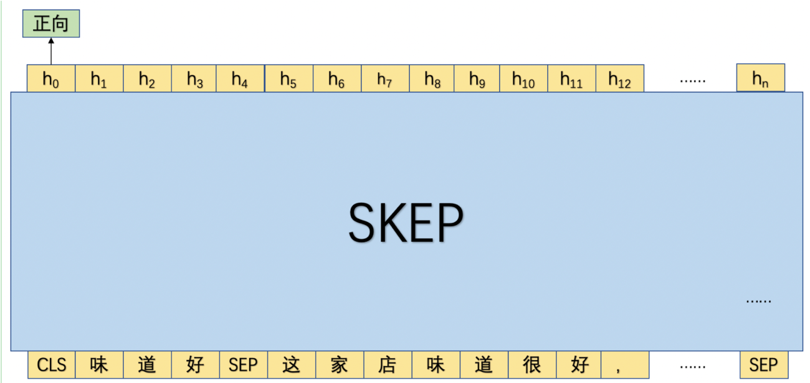

# 细粒度情感分类模型

## 1. 方案设计

本项目将进行属性级别的情感分类，对于给定的一段文本，我们在基于评论观点抽取模型抽取出不同属性对应的观点后，便可以有针对性地对各个属性判别情感极性。具体来讲，本项目将抽取出的评论属性和观点进行拼接，然后和原始语句进行拼接作为一条独立的训练语句。

如图1所示，首先将评论属性和观点词进行拼接为"味道好"，然后将"味道好"和原文进行拼接，然后传入SKEP模型，并使用 "CLS" 位置的向量进行细粒度情感倾向。

<div align="center">
    
    <p>图1 细粒度情感分类模型<p/>
</div>

## 2. 项目结构说明

以下是本项目运行的完整目录结构及说明：

```shell
.
├── data.py          # 数据处理脚本
├── model.py         # 模型组网脚本
├── train.py         # 模型训练脚本
├── evaluate.py      # 模型评估脚本
├── run_train.sh     # 模型训练命令
├── run_evaluate.sh  # 模型评估命令
└── README.md
```

## 3. 数据说明

本实验中，相应的数据集需要包含3列数据：标签、评论观点和原文，下面给出了一些样本示例。

- 1       口味清淡        口味很清淡，价格也比较公道
- 1       经济实惠        经济实惠，环境好，套餐划算
- 0       设施一般        房间大，设施一般

可点击 [cls_data](https://bj.bcebos.com/v1/paddlenlp/data/cls_data.tar.gz) 进行 Demo 数据下载，将数据解压之后放入父目录的 `data/cls_data/` 文件夹下。

## 4. 模型效果展示

在分类模型训练过程中，总共训练了10轮，并选择了评估 F1 得分最高的 best 模型，下表展示了训练过程中使用的训练参数。我们同时开源了相应的模型，可点击下表的 `cls_model` 进行下载，下载后将模型重命名为 `best.pdparams`，然后放入父目录的 `checkpoints/cls_checkpoints` 中。
|Model|训练参数配置|MD5|
| ------------ | ------------ |-----------|
|[cls_model](https://bj.bcebos.com/paddlenlp/models/best_cls.pdparams)|<div style="width: 150pt"> learning_rate: 3e-5, batch_size: 16, max_seq_len:256, epochs：10 </div>|3de6ddf581e665d9b1d035c29b49778a|

我们基于训练过程中的 best 模型在验证集 `dev` 和测试集 `test` 上进行了评估测试，模型效果如下表所示:
|Model|数据集|precision|Recall|F1|
| ------------ | ------------ | ------------ |-----------|------------ |
|SKEP-Large|dev|0.98758|0.99251|0.99004|
|SKEP-Large|test|0.98497|0.99139|0.98817|

**备注**： 以上数据是基于全量数据训练和测试结果，并非 Demo 数据集。

## 5. 模型训练
通过运行以下命令进行分类模型训练：
```shell
sh run_train.sh
```

## 6. 模型测试
通过运行以下命令进行分类模型测试：
```shell
sh run_evaluate.sh
```
