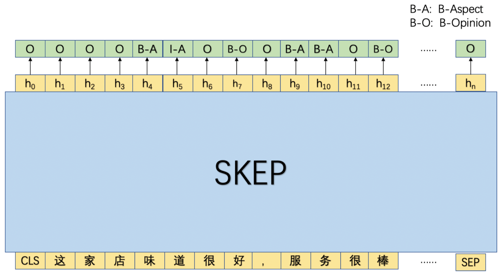

# 评论观点抽取模型

## 1. 方案设计

在本实验中，我们将采用序列标注的方式进行评论观点抽取，需要注意的是，这里会同时抽取评论的属性和观点，为此我们基于 BIO 的序列标注体系进行了标签的拓展：B-Aspect, I-Aspect, B-Opinion, I-Opinion, O，其中前两者用于标注评论属性，后两者用于标注评论观点。

如图1所示，首先将文本串传入 SKEP 模型中，利用 SKEP 模型对该文本串进行语义编码后，然后基于每个位置的输出去预测相应的标签。

<div align="center">
    
    <p>图1 评论观点抽取模型<p/>
</div>

## 2. 项目结构说明

以下是本项目运行的完整目录结构及说明：

```shell
.
├── data.py          # 数据处理脚本
├── model.py         # 模型组网脚本
├── train.py         # 模型训练脚本
├── evaluate.py      # 模型评估脚本
├── run_train.sh     # 模型训练命令
├── run_evaluate.sh  # 模型评估命令
└── README.md
```

## 3. 数据说明

如上所述，本项目将采用序列标注的方式进行抽取评论属性和观点，所以本项目训练集中需要包含两列数据：文本串和相应的序列标签数据，下面给出了一条样本。


- 服务好，环境好，做出来效果也不错        B-Aspect I-Aspect B-Opinion O B-Aspect I-Aspect B-Opinion O O O O B-Aspect I-Aspect O B-Opinion I-Opinion
- 环境很好，交通便利      B-Aspect I-Aspect O B-Opinion O B-Aspect I-Aspect B-Opinion I-Opinion
- 空气清新，景色优美      B-Aspect I-Aspect B-Opinion I-Opinion O B-Aspect I-Aspect O B-Opinion


可点击 [ext_data](https://bj.bcebos.com/v1/paddlenlp/data/ext_data.tar.gz) 进行 Demo 数据下载，将数据解压之后放入父目录的 `data/ext_data/` 文件夹下。

## 4. 模型效果展示
在抽取模型训练过程中，总共训练了10轮，并选择了评估F1得分最高的 best 模型，下表展示了训练过程中使用的训练参数。我们同时开源了相应的模型，可点击下表的 `ext_model` 进行下载，下载后将模型重命名为 `best.pdparams`，然后放入父目录的 `checkpoints/ext_checkpoints` 中。
|Model|训练参数配置|MD5|
| ------------ | ------------ |-----------|
|[ext_model](https://bj.bcebos.com/paddlenlp/models/best_ext.pdparams)|<div style="width: 150pt"> learning_rate: 5e-5, batch_size: 8, max_seq_len:512, epochs：10 </div> |e3358632165aa0338225e175b57cb304|

我们基于训练过程中的 best 模型在验证集 `dev` 和测试集 `test` 上进行了评估测试，模型效果如下表所示:
|Model|数据集|precision|Recall|F1|
| ------------ | ------------ | ------------ |-----------|------------ |
|SKEP-Large|dev|0.87095|0.90056|0.88551|
|SKEP-Large|test|0.87125|0.89944|0.88512|

**备注**：以上数据是基于全量数据训练和测试结果，并非 Demo 数据集。

## 5. 模型训练
通过运行以下命令进行评论观点抽取模型训练：
```shell
sh run_train.sh
```

## 6. 模型测试
通过运行以下命令进行评论观点抽取模型测试：
```shell
sh run_evaluate.sh
```
