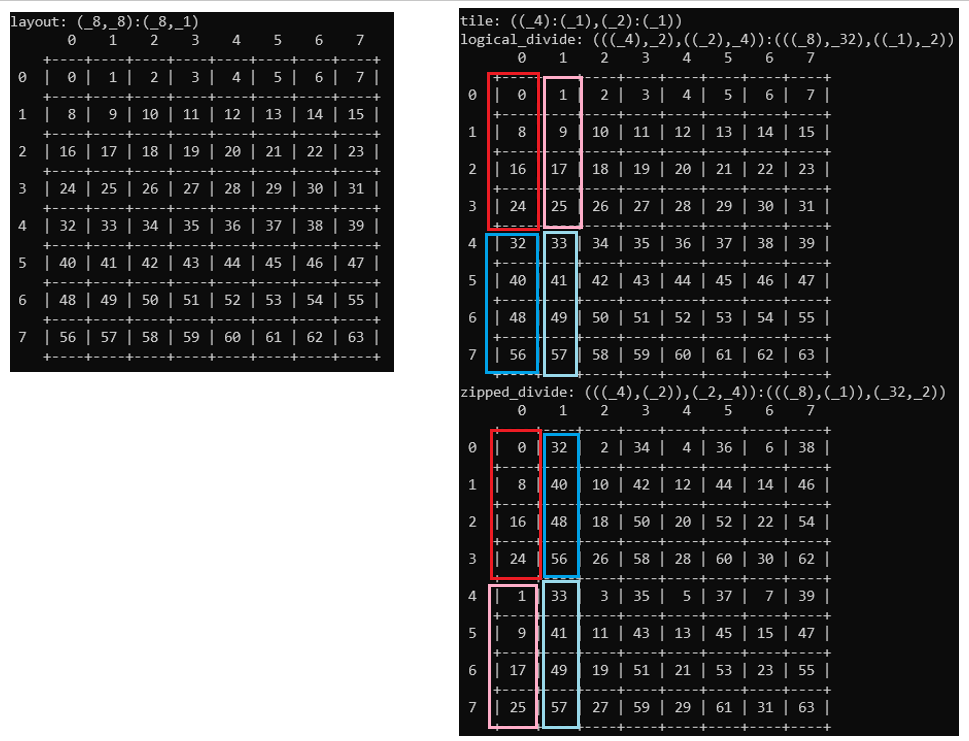
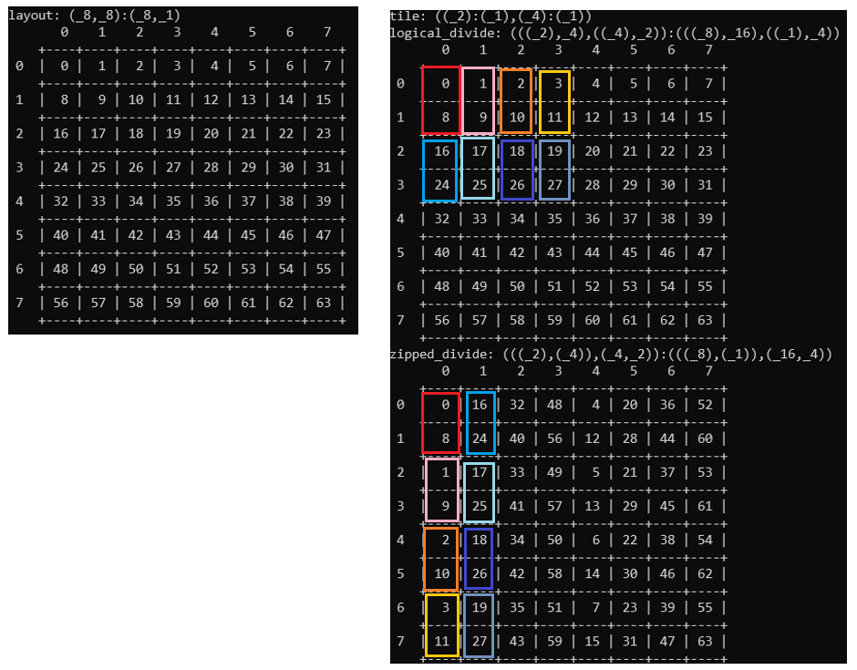

# CuTe Layout Operations

CuTe provides an "algebra of `Layout`s."
`Layout`s can be combined and manipulated
to construct more complicated `Layout`s.
This includes tiling and partitioning `Layout`s across other `Layout`s.
In this section, we explain some of these core operations in detail.

## How do I print CuTe objects on host or device?

CuTe comes with different ways to print CuTe objects.
You can print human-readable text,
or you can print LaTeX commands for generating
a beautifully formatted and colored table
describing the CuTe object.
Both of these can be helpful for reasoning about or debugging
layouts, copy atoms, or matrix multiply atoms
(don't worry, we'll explain all of these things in this tutorial).

CuTe's print functions work on either host or device.
Note that on device, printing is expensive.
Even just leaving print code in place on device,
even if it is never called
(e.g., printing in an `if` branch that is not taken at run time),
may generate slower code.
Thus, be sure to remove code that prints on device after debugging.

The following code examples assume that you have a
`using namespace cute;` statement in scope.

### Printing human-readable text

The `cute::print` function has overloads for almost all CuTe types, including Pointers, Layout, Shape, Stride, and Tensors.  When in doubt, try calling `print` on it.  You might also only want to print on thread 0 of each thread block, or block 0 of the grid.  The `thread0()` function returns true only for global thread 0 of the kernel.  A typical idiom for printing CuTe objects to print only on thread 0 of block 0.

```c++
if (thread0()) {
  print(some_cute_object);
}
```

Some algorithms do different things on different threads or blocks,
so you might sometimes need to print on threads or blocks other than zero.
The header file
[`cute/util/debug.hpp`](../../../include/cute/util/debug.hpp),
among other utilities,
includes the function `bool thread(int tid, int bid)`
that returns `true` if running on thread `tid` and block `bid`.

Some CuTe types have special printing functions that use a different output format.
For example, `print_layout` can display a rank-2 layout in a table
(using plain text formatting).
It has an overload taking a rank-2 matrix layout and a thread layout,
that displays a table with the mapping between threads and values.

Some CuTe types might not have overloads for `print`,
but there are other ways to print their contents.
For example, copy atoms and mma atoms
(see elsewhere in this tutorial)
have a `print_all()` member function.

### Printing LaTeX output

The `cute::print_latex` function works like `cute::print`,
but prints LaTeX commands that you can use
to generate a nicely formatted and colored table.

## Fundamental types

### Layout and its components

This directory includes
[an overview of CuTe's fundamental types for describing layouts](./01_layout.md).

#### Tuple

CuTe starts with a Tuple, which is a finite ordered list of zero or more elements.
In C++, we identify a Tuple with the
[`cute::tuple` class](../../../include/cute/container/tuple.hpp).
`cute::tuple` behaves like `std::tuple`, but it works on device or host,
and it imposes restrictions on its template arguments for performance and simplicity.

#### IntTuple

CuTe then defines an IntTuple as either an integer, or a Tuple of IntTuple.
This recursive definition lets us build arbitrarily nested layouts.
In C++, we identify an IntTuple with [`IntTuple`](../../../include/cute/int_tuple.hpp),
which is just an alias of `cute::tuple`.
Any of the following are thus valid template arguments of IntTuple.

1. "Run-time integers" (or "static integers")
    are just ordinary integral types like `int` or `size_t`.

2. "Compile-time integers" include `std::integral_constant`
    or subclasses of it that CuTe defines,
    such as `Int<Value>` (see below).
    These types all have in common
    that the value is encoded in the type itself
    (as a public `static constexpr value` member).
    CuTe defines aliases `_1`, `_2`, `_3` etc.
    to the types `Int<1>`, `Int<2>`, `Int<3>` etc.

3. `IntTuple` with any valid template arguments.

CuTe reuses IntTuple for many different things,
including Shape, Stride, Step, and Coord
(see [`include/cute/layout.hpp`](../../../include/cute/layout.hpp)).
In C++, Shape, Stride, Step, and Coord are all aliases for IntTuple.

### Layout

A Layout is a tuple of (Shape, Stride).
Semantically, it implements a mapping from
a "logical" Shape-shaped (multidimensional) index,
to a "physical" 1-D index into an array.
Here is an example of a 2 x 3 array with static strides (3, 1).

```c++
Layout layout = make_layout(make_shape (_2{}, _3{}),
                            make_stride(_3{}, _1{}));
print_layout(layout);
for (int i = 0; i < size(layout); ++i) {
  print(layout(i));
  print(", ");
}
print("\n");
print(layout(1, 1));
print("\n");
```

This code produces the following text output.

```text
(_2,_3):(_3,_1)
      0   1   2
    +---+---+---+
 0  | 0 | 1 | 2 |
    +---+---+---+
 1  | 3 | 4 | 5 |
    +---+---+---+
0, 3, 1, 4, 2, 5,
4
```

`print(layout(1, 1))` prints the mapping of
the logical 2-D coordinate (0,1) to 1-D index, which is 4.
You can see that from the table,
which shows the left logical index as the "row,"
and the right logical index as the "column."

### Underscore (`_`)

An Underscore is a special type used for array slices.  The underscore punctuation `_` is a constant instance of Underscore.  It acts like `:` (the colon punctuation) in Python or Fortran array slices.  See [`include/cute/underscore.hpp`](../../../include/cute/underscore.hpp).

### Tile

"A Tile is not a Layout, it's a tuple of Layouts or Tiles or Underscores."
See [`include/cute/tile.hpp`](../../../include/cute/tile.hpp).

The algebraic layout operations discussed below are defined on `Layout`s, but `Tile` allows these operations to recurse and to be applied to sublayouts or particular modes of a given Layout. These are referred to as by-mode operations.

See the section on "Logical Divide" to see an example of using `Tile` to extract portions of a row-mode and portions of a column-mode independently.

## Layout definitions and operations

### Layouts are functions from integers (logical 1-D coordinate) to integers (1-D index)

The `for` loop in the above print example shows how CuTe identifies 1-D coordinates with a column-major layout of logical 2-D coordinates.  Iterating from `i = 0` to `size(layout)` (which is 6), and indexing into our layout with the single integer coordinate `i`, traverses the layout in column-major fashion, even though this is a row-major layout.  You can see this from the output of the `for` loop (0, 3, 1, 4, 2, 5).  CuTe calls this index `i` a "1-D coordinate," versus the "natural coordinate," which would be the logical 2-D coordinate.

If you're familiar with the C++23 feature `mdspan`,
this is an important difference between
`mdspan` layout mappings and CuTe `Layout`s.
`mdspan` layout mappings are *one way*:
they always take a multidimensional logical coordinate,
and they return an integer offset.
Depending on the strides,
the offset may skip over elements of the physical 1-D array.
Thus, `mdspan`'s offset does NOT mean the same thing as
the 1-D logical coordinate `i` in the `for` loop above.
You can iterate correctly over any CuTe `Layout`
by using the 1-D logical coordinate.
`mdspan` doesn't have an idea of a 1-D logical coordinate.

### Rank, depth, size, cosize

*Rank*: the tuple size of the layout's shape.

*Depth*: the depth of the layout's shape.  A single integer has depth 0.  A tuple has depth 1 + the max depth of its components.

*Size*: Size of the shape; size of the domain of the function. This is the product of all extents in the layout's shape.

*Cosize*: Size of the function's codomain (not necessarily the range); for a layout A, A(size(A) - 1) + 1.  (Here, we use size(A) - 1 as a 1-D logical coordinate input.)

### Layout compatibility

We say that layouts A and B are *compatible* if their shapes are compatible.  Shape A is compatible with shape B if any natural coordinate of A is also a valid coordinate for B.

### Flatten

The `flatten` operation "un-nests" a potentially nested Layout.  For example,

```c++
Layout layout = Layout<Shape <Shape <_4, _3>, _1>,
                     Stride<Stride<_3, _1>, _0>>{};
Layout flat_layout = flatten(layout);
```

results in `flat_layout` having the following type

```text
Layout<Shape<_4, _3, _1>, Stride<_3, _1, _0>>
```

and

```c++
Layout layout = Layout<Shape <_4, Shape <_4,  _2>>,
                     Stride<_4, Stride<_1, _16>>>{};
Layout flat_layout = flatten(layout);
```

results in `flat_layout` having the following type

```text
Layout<Shape<_4, _4, _2>, Stride<_4, _1, _16>>
```

Hierarchical Layouts and flattening let us reinterpret tensors in place as matrices, matrices as vectors, vectors as matrices, etc.  This lets us implement arbitrary tensor contractions as batched matrix multiply, by combining the contraction modes into a single mode, and combining the A, B, C, and "batch" modes as needed to reach the desired form.

### Coalesce

The `coalesce` operation first flattens the layout, then combines all the modes that are possible to combine, starting with mode 0 (the leftmost mode) and moving right.  If all the modes can be combined, then this results in a 1-D layout expressing what array elements the original layout accesses.

For example,

```text
layout: (_2,(_1,_6)):(_1,(_6,_2))
coalesce(layout): _12:_1
```

What does it mean to "combine" modes?  In the above example, the flattened layout is (2, 1, 6) : (1, 6, 2).

1. If we look at the leftmost two modes, this is just a vector of length 2 and stride 1.  The middle mode has extent 1, so the corresponding stride 6 would not be observed anyway.  This leaves us with (2, 6) : (1, 2).

2. The intermediate result (2, 6) : (1, 2) is just a 2 x 6 column-major matrix, which can be coalesced into a vector of length 12 and stride 1.

More formally, "combining all the modes" means a left fold, where the binary operation that combines two modes has three cases.

1. If the leftmost layout is s1:d1, and the next layout is 1:d0, then combine into s1:d1.  This generalizes Step 1 above.  If a mode has extent 1, we can't observe its stride, so we can skip the mode.

2. If the leftmost layout is 1:d1, and the next layout is s0:d0, then combine into s0:d0.  Again, if a mode has extent 1, we can't observe its stride, so we can skip the mode.

3. If the leftmost layout is s1:d1, and the next layout is s0 : s1*d1, then combine into s0 * s1 : d1.  This generalizes Step 2 above.  One can call this "noticing a column-major layout sequence."

That's it!  For example, the result of coalescing the row-major layout (2, 2) : (2, 1) is (2, 2) : (2, 1), the same layout, because none of the above three cases applies.

### Complement

#### Definition

The complement B of a layout A with respect to an integer M satisfies the following properties.

1. $A$ and $B$ are *disjoint*: $A(x) \neq B(x)$ for all $x \neq 0$ in the domain of $A$.

2. B is *ordered*: $`B(x-1) < B(x)`$ for all $x$ in $\{0, 1, \dots, size(B) - 1\}$.

3. B is *bounded* by M: $size(B) \geq M / size(A)$, and $cosize(B) \leq floor(M / cosize(A)) * cosize(A)$.

Regarding disjointness: we need to specify $x \neq 0$ because CuTe layouts are linear.  That is, if the domain is nonempty, the range always contains zero.

Regarding the ordered property: CuTe layouts are hierarchically strided, so this implies that if size(B) is nonzero, then the strides of B are all positive.

#### Examples

complement(4:1, 24) is 6:4.

1. The result is disjoint of 4:1, so it must have a stride of at least 4 (since it includes 0, but must skip over 1, 2, 3).

2. The size of the result is $\geq 24 / 4 = 6$.  (This plus Step (1) means that the cosize is at least 24.)

3. The cosize of the result is $\leq (24 / 4) * 4 = 24$.  (This plus Step (2) means that the cosize is exactly 24.)

4. The only (1-D) layout with size 6 and cosize 24 is 6:4.

complement(6:4, 24) is 4:1.

1. 4:1 is disjoint of 6:4, but so is s:d
   for any s > 0 and d > 20.

2. The size of the result is $\geq 24 / 6 = 4$.

3. The cosize of the result is $\leq (24 / 21) * 21 = 21$.

4. The stride cannot be greater than 20
   (else (2) would contradict (3)),
   so it must be less than 4.

5. This leaves 4:1 by elimination.

### Composition

Layouts are functions, so composition of layouts is just composition of functions.  The composition $A \circ B$ means "apply the layout B first, then treat the result as a 1-D logical coordinate input to the layout A, and apply A to it."  Very often, this composition can be represented as another Layout.

#### Rules for computing composition

Both humans and CuTe compute composition using the following rules.

1. $A \circ B$ has a shape that is compatible with B. In function composition, the rightmost function defines the domain. For `Layout`s this means that any valid coordinate for $B$ can also be used as a coordinate for $A \circ B$.

2. Concatenation: A layout can be expressed as the concatenation of its sublayouts.  We denote concatenation with parentheses: $B = (B_0,B_1,...)$.  The CuTe function `make_layout`, when given zero or more `Layout`s, concatenates them.

3. Composition is (left-)distributive with concatenation: $A \circ B = A \circ (B0, B1, ...) = (A \circ B0, A \circ B1, ...)$.

4. "Base case": For layouts $A = a : b$ and $B = c : d$ with integral shape and stride, $A \circ B = R = c : (b * d)$.

5. By-mode composition: Let $\langle B, C \rangle$ (angle brackets, not parentheses)
   denote a tuple of two layouts B and C, not their concatenation.  Let A = (A0, A1).
   Then, $A \circ \langle B, C \rangle = (A0, A1) \circ \langle B, C \rangle = (A0 \circ B, A1 \circ C)$.
   This allows the application of composition independently to sublayouts of $A$.

#### Examples: Reshape a vector into a matrix

This section gives two composition examples.  Both start with a vector with layout $20:2$ (that is, the vector has 20 elements, and the stride between each is 2).  They compose this vector with a 4 x 5 matrix layout.  This effectively "reshapes" the vector in place into a matrix.

##### Example 1

$20:2 \circ (4,5) : (1,4)$.

This describes interpreting the vector $20:2$
as a 4 x 5 column-major matrix.

The resulting layout has shape $(4,5)$,
because in function composition,
the rightmost function defines the domain.
What are the strides?

1. A layout can be expressed as the concatenation of its sublayouts,
   so $(4,5) : (1,4)$ is $(4:1, 5:4)$.

2. Composition is distributive, so
   $20:2 \circ (4:1, 5:4)$ is $(20:2 \circ 4:1, 20:2 \circ 5:4)$.

3. $20:2 \circ 4:1$ has shape 4 (rightmost function defines the domain)
   and stride $2 = 2 \cdot 1$.

4. $20:2 \circ 5:4$ has shape 5 and stride $8 = 2 \cdot 4$.

5. Result: (4:2, 5:8), which by concatenation is (4,5) : (2,8).

#### Example 2

$20:2 \circ (4,5) : (5,1)$.

This describes interpreting the vector 20:2
as a 4 x 5 row-major matrix.

The resulting layout has shape $(4,5)$, just as before.  What are the strides?

1. By deconcatenation, $(4,5) : (5,1)$ is $(4:5, 5:1)$.

2. Composition is distributive, so $20:2 \circ (4:5, 5:1)$ is $(20:2 \circ 4:5, 20:2 \circ 5:1)$.

3. $20:2 \circ 4:5$ has shape $4$ and stride $10 = 2 \cdot 5$.

4. $20:2 \circ 5:1$ has shape $5$ and stride $2 = 2 \cdot 1$.

5. Result: (4:10, 5:2), which by concatenation is (4,5) : (10,2).

### Product

CuTe includes four different kinds of layout products.

1. `logical_product`

2. `blocked_product`

3. `raked_product`

4. `tiled_product`

`logical_product(A, B)` results in a layout where each element of layout B
has been replaced by a "copy" of layout A.
The other three products offer variations of this idea.

#### Example: Tiled matrix

Suppose that I want to make a matrix consisting of 3 x 4 tiles
in a row-major arrangement,
where each tile is a 2 x 2 column-major matrix.

The Layout of each tile (tile) has Shape (2,2) and Stride (1,2).

The Layout of the "matrix of tiles" (`matrix_of_tiles`)
has Shape (3,4) and Stride (4,1).

##### Blocked product: the intuitive tiling

If I were to deduce by hand what the layout of the tiled matrix should be,
it would look like this.

|       | (0,0) | (1,0) | (0,1) | (1,1) | (0,2) | (1,2) | (0,3) | (1,3) |
| ---   | ---   | ---   | ---   | ---   | ---   | ---   | ---   | ---   |
| (0,0) |  0    |  2    |  4    |  6    |  8    | 10    | 12    | 14    |
| (1,0) |  1    |  3    |  5    |  7    |  9    | 11    | 13    | 15    |
| (0,1) | 16    | 18    | 20    | 22    | 24    | 26    | 28    | 30    |
| (1,1) | 17    | 19    | 21    | 23    | 25    | 27    | 29    | 31    |
| (0,2) | 32    | 34    | 36    | 38    | 40    | 42    | 44    | 46    |
| (1,2) | 33    | 35    | 37    | 39    | 41    | 43    | 45    | 47    |

The row and column labels use the equivalence of 1-D logical coordinates and 2-D column-major coordinates.  The left index in each pair is the row resp. column coordinate of the tile, while the right index in each pair is the row resp. column coordinate of the matrix-of-tiles.  The resulting layout has Shape ((2, 3), (2, 4)), and Stride ((1, 16), (2, 4)), and the second mode can be coalesced.  The Shape ((2, 3), (2, 4)) is hierarchical, but it is still rank-2 and can be drawn in 2D as above.  Note how the row mode of the tile remains part of the row mode of the product, and the column mode of the tile remains a column mode of the product.

The above layout is what `blocked_product(tile, matrix_of_tiles)` produces.
A critical use case for blocked product is "tiling" an "atom"
(some tile that relates to a hardware feature) over a matrix.

```c++
Layout tile            = Layout<Shape <_2,_2>,
                                Stride<_1,_2>>{};
Layout matrix_of_tiles = Layout<Shape <_3,_4>,
                                Stride<_4,_1>>{};

print_layout(blocked_product(tile, matrix_of_tiles));
```

##### Logical product

The logical product `logical_product(tile, matrix_of_tiles)`
results in Shape ((2, 2), (3, 4)) and Stride ((1, 2), (16, 4)).

|       | (0,0) | (1,0) | (2,0) | (0,1) | (1,1) | (2,1) | (0,2) | (1,2) | (2,2) | (0,3) | (1,3) | (2,3) |
| ---   | ---   | ---   | ---   | ---   | ---   | ---   | ---   | ---   | ---   | ---   | ---   | ---   |
| (0,0) |  0    | 16    | 32    |  4    | 20    | 36    |  8    | 24    | 40    | 12    | 28    | 44    |
| (1,0) |  1    | 17    | 33    |  5    | 21    | 37    |  9    | 25    | 41    | 13    | 29    | 45    |
| (0,1) |  2    | 18    | 34    |  6    | 22    | 38    | 10    | 26    | 42    | 14    | 30    | 46    |
| (1,1) |  3    | 19    | 35    |  7    | 23    | 39    | 11    | 27    | 43    | 15    | 31    | 47    |

Note how the tile appears in the leftmost column and is reproduced
in each column in the same order as the matrix-of-tiles. That is, 
the tile can be indexed through the first mode of the result and the
matrix-of-tiles can be indexed through the second mode.

```c++
Layout tile            = Layout<Shape <_2,_2>,
                                Stride<_1,_2>>{};
Layout matrix_of_tiles = Layout<Shape <_3,_4>,
                                Stride<_4,_1>>{};

print_layout(logical_product(tile, matrix_of_tiles));
```

##### Raked product

The raked product `raked_product(tile, matrix_of_tiles)` results in
Shape ((3, 2), (4, 2)) and Stride ((16, 1), (4, 2)).

|       | (0,0) | (1,0) | (2,0) | (3,0) | (0,1) | (1,1) | (2,1) | (3,1) |
| ---   | ---   | ---   | ---   | ---   | ---   | ---   | ---   | ---   |
| (0,0) |  0    |  4    |  8    | 12    |  2    |  6    | 10    | 14    |
| (1,0) | 16    | 20    | 24    | 28    | 18    | 22    | 26    | 30    |
| (2,0) | 32    | 36    | 40    | 44    | 34    | 38    | 42    | 46    |
| (0,1) |  1    |  5    |  9    | 13    |  3    |  7    | 11    | 15    |
| (1,1) | 17    | 21    | 25    | 29    | 19    | 23    | 27    | 31    |
| (2,1) | 33    | 37    | 41    | 45    | 35    | 39    | 43    | 47    |

The tile is now interleaved or "raked" with the other 3x4 matrix-of-tiles
instead of appearing as blocks. Other references call this is cyclic 
distribution.

This might look familiar if you have ever used ScaLAPACK.
It expresses a 2-D block cyclic distribution of a 6 x 8 matrix
over 4 processes in a 2 x 2 "process grid."  See
["The Two-dimensional Block-Cyclic Distribution"](https://netlib.org/scalapack/slug/node75.html#sec2dbcd)
and
["Local Storage Scheme and Block-Cyclic Mapping"](https://netlib.org/scalapack/slug/node76.html#seclocalstorage)
in the ScaLAPACK Users' Guide.

In general, `logical_product` and these variations can produce any interleaving,
including blocked, cyclic, by-mode blocked/cyclic, and intermediate interleavings
that don't have common names.

```c++
Layout tile            = Layout<Shape <_2,_2>,
                                Stride<_1,_2>>{};
Layout matrix_of_tiles = Layout<Shape <_3,_4>,
                                Stride<_4,_1>>{};

print_layout(raked_product(tile, matrix_of_tiles));
```

### Division

The previous section covered layout products,
that reproduce one layout over another.
This section covers layout *division*.
Functions that divide a layout into components are useful
as a basis for tiling and partitioning layouts.

For example, consider folding a vector into a matrix.
We could imagine an operation, called `logical_divide`,

```c++
Layout vec = Layout<_16,_3>{};           //  16 : 3
Layout col = Layout< _4,_1>{};           //   4 : 1
Layout mat = logical_divide(vec, col);   // (4,4) : (3,12)
```

that "takes" the first 4 elements of the vector into the first mode
and leaves the "rest" in the second mode. This is a column-major matrix
view of the data in `vec`.
What if we want a row-major matrix view?

```c++
Layout vec = Layout<_16,_3>{};           //  16 : 3
Layout col = Layout< _4,_4>{};           //   4 : 4
Layout mat = logical_divide(vec, col);   // (4,4) : (12,3)
```

Now, every fourth element of the vector is in the first mode and
the "rest" are in the second mode.
Multidimensional, hierarchical indices let us extend this operation
to any layout that "divides" the vector.

```c++
Layout vec = Layout<_16,_3>{};           //  16 : 3
Layout col = Layout< _4,_2>{};           //   4 : 2
Layout mat = logical_divide(vec, col);   // (4,(2,2)) : (6,(3,24))
```

```c++
Layout vec = Layout<_16,_3>{};           //  16 : 3
Layout col = Layout< _4,_2>{};
Layout col = Layout<Shape <_2,_2>,
                    Stride<_4,_1>>{};    // (2,2) : (4,1)
Layout mat = logical_divide(vec, col);   // ((2,2),(2,2)) : ((12,3),(6,24))
```

All of the above examples produce a 4x4 matrix
that can be indexed and treated like a normal 4x4 matrix,
but each has a different underlying layout.
Thus, our algorithms can be written using logical coordinates,
without needing to address the detailed indexing that each layout requires.

CuTe includes 3 different kinds of layout division operations.

1. `logical_divide`

2. `zipped_divide`

3. `tiled_divide`

We will summarize these in the sections that follow.

#### Logical divide : the intuitive tiling

Suppose I have the 6 x 8 matrix from the Raked Product section
and want to "collect" the `tile`, turning the Raked Product into
the Blocked Product.

To do this, we would like to gather two elements from the column
and leave the rest, then gather two elements from the row and leave the rest.
Thus, we want to apply `logical_divide` independently to the rows and cols
in order to retrieve the appropriate elements.

In code, we copy the Layout from the result of the Raked Product section, then
specify the elements in the rows and cols we would like to gather.

```c++
Layout raked_prod = Layout<Shape <Shape < _3,_2>,Shape <_4,_2>>,
                           Stride<Stride<_16,_1>,Stride<_4,_2>>>{};
Tile   subtile    = make_tile(Layout<_2,_3>{},    // Gather elements 2 : 3 from mode 0
                              Layout<_2,_4>{});   // Gather elements 2 : 4 from mode 1

print_layout(logical_divide(raked_prod, subtile));
```

Indeed, this does produce the result from the Blocked Product section.

|       | (0,0) | (1,0) | (0,1) | (1,1) | (0,2) | (1,2) | (0,3) | (1,3) |
| ---   | ---   | ---   | ---   | ---   | ---   | ---   | ---   | ---   |
| (0,0) |  0    |  2    |  4    |  6    |  8    | 10    | 12    | 14    |
| (1,0) |  1    |  3    |  5    |  7    |  9    | 11    | 13    | 15    |
| (0,1) | 16    | 18    | 20    | 22    | 24    | 26    | 28    | 30    |
| (1,1) | 17    | 19    | 21    | 23    | 25    | 27    | 29    | 31    |
| (0,2) | 32    | 34    | 36    | 38    | 40    | 42    | 44    | 46    |
| (1,2) | 33    | 35    | 37    | 39    | 41    | 43    | 45    | 47    |

Of course, any other rearrangement of the rows and cols is also valid.

#### Zipped divide

The `zipped_divide` function applies `logical_divide`, and then gathers the
"subtiles" into a single mode and the "rest" into a single mode.

For example, if we apply `zipped_divide` instead of `logical_divide` in the example above,

```c++
Layout raked_prod = Layout<Shape <Shape < _3,_2>,Shape <_4,_2>>,
                           Stride<Stride<_16,_1>,Stride<_4,_2>>>{};
Tile   subtile    = make_tile(Layout<_2,_3>{},    // Gather elements 2 : 3 from mode 0
                              Layout<_2,_4>{});   // Gather elements 2 : 4 from mode 1

print_layout(zipped_divide(raked_prod, subtile));
```

then we get the result

|       | (0,0) | (1,0) | (2,0) | (0,1) | (1,1) | (2,1) | (0,2) | (1,2) | (2,2) | (0,3) | (1,3) | (2,3) |
| ---   | ---   | ---   | ---   | ---   | ---   | ---   | ---   | ---   | ---   | ---   | ---   | ---   |
| (0,0) |  0    | 16    | 32    |  4    | 20    | 36    |  8    | 24    | 40    | 12    | 28    | 44    |
| (1,0) |  1    | 17    | 33    |  5    | 21    | 37    |  9    | 25    | 41    | 13    | 29    | 45    |
| (0,1) |  2    | 18    | 34    |  6    | 22    | 38    | 10    | 26    | 42    | 14    | 30    | 46    |
| (1,1) |  3    | 19    | 35    |  7    | 23    | 39    | 11    | 27    | 43    | 15    | 31    | 47    |

Note that this is the same layout as the result in the Logical Product section.
That is, the first mode is our original tile (and can be interpreted as a 2x2 matrix itself)
and the second mode is its logical layout within the raked layout.

##### More Examples of Divide

For brevity, shapes can be used with `logical_divide` and `tiled_divide` to quickly split and tile modes of a tensor. For example, this C++ code

```c++
Layout layout     = Layout<Shape <_12, _32,_6>,
                           Stride< _1,_128,_0>>{};
Shape  tile_shape = make_shape(_4{},_8{});
Layout logical_divided_tile = logical_divide(layout, tile_shape);
Layout zipped_divided_tile  =  zipped_divide(layout, tile_shape);

print("layout               :  "); print(layout);               print("\n");
print("tile_shape           :  "); print(tile_shape);           print("\n");
print("logical_divided_tile :  "); print(logical_divided_tile); print("\n");
print("zipped_divided_tile  :  "); print(zipped_divided_tile);  print("\n\n");
```

produces the following output when we vary `layout`.

```text
full_layout          :  (_12,_32,_6):(_1,_128,_0)
tile_shape           :  (_4,_8)
logical_divided_tile :  ((_4,_3),(_8,_4),_6):((_1,_4),(_128,_1024),_0)
zipped_divided_tile  :  ((_4,_8),(_3,_4,_6)):((_1,_128),(_4,_1024,_0))

full_layout          :  (_12,(_4,_8),_6):(_1,(_32,_512),_0)
tile_shape           :  (_4,_8)
logical_divided_tile :  ((_4,_3),((_4,_2),_4),_6):((_1,_4),((_32,_512),_1024),_0)
zipped_divided_tile  :  ((_4,(_4,_2)),(_3,_4,_6)):((_1,(_32,_512)),(_4,_1024,_0))
```

This code

```c++
Layout layout = make_layout(Shape<_8,_8>{},
                            Stride<_8,_1>{});
Layout tile = make_tile(make_layout(Shape<_4>{}),
                        make_layout(Shape<_2>{}));
print("layout: ");
print_layout(layout);
print("\n");
print("tile: ");
print(tile);
print("\n");
print("logical_divide: ");
print_layout(logical_divide(layout, tile));
print("zipped_divide: ");
print_layout(zipped_divide(layout, tile));
```

results in the following layouts.

<p align="center">
  
</p>

This code

```c++
Layout layout = make_layout(Shape<_8,_8>{},
                            Stride<_8,_1>{});
Layout tile = make_tile(make_layout(Shape<_2>{}),
                        make_layout(Shape<_4>{}));
print("layout: ");
print_layout(layout);
print("\n");
print("tile: ");
print(tile);
print("\n");
print("logical_divide: ");
print_layout(logical_divide(layout, tile));
print("zipped_divide: ");
print_layout(zipped_divide(layout, tile));
```

results in the following layouts.

<p align="center">
  
</p>

#### Tiled divide

The `tiled_divide` function works like `zipped_divide`,
except that it unpacks the second mode. This is useful when you have a `Tile` that describes all of the elements for a particular operation, for example, and want to gather those together but retain the logical shape of those tiles within the original layout. That is,

```text
Layout Shape : (M, N, L, ...)
Tile Shape   : <M', N'>
Tiled Result : ((M', N'), m, n, L, ...)
```

where `m` is `M / M'` and `n` is `N / N'`.
We can consider `m` as the "number of `Tile`s in `M`" and `n` as the "number of `Tile`s in `N`". This style of operation is common when applying MMA Atoms and Copy Atoms.
