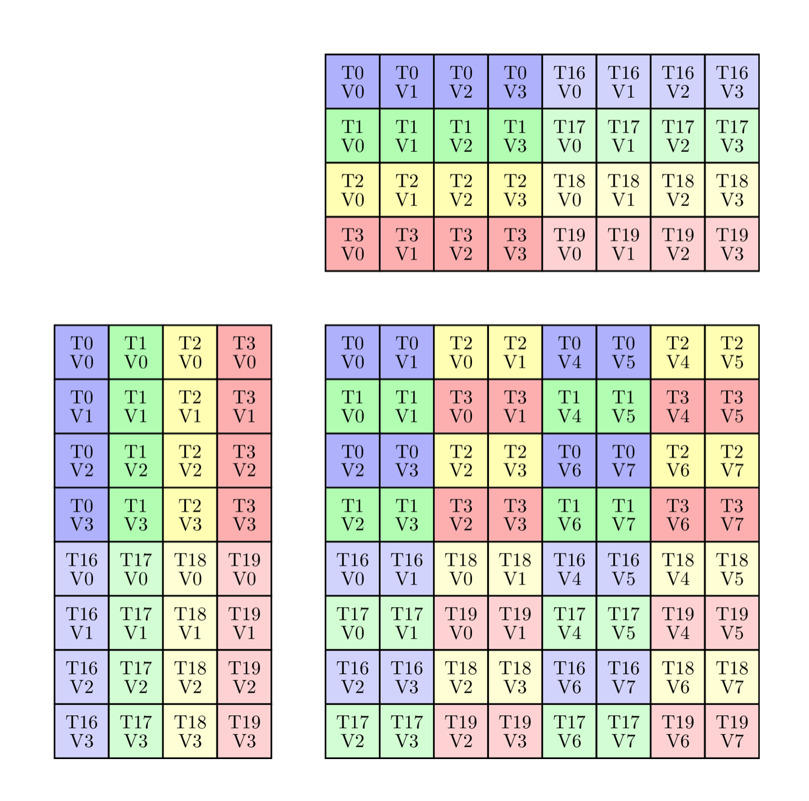
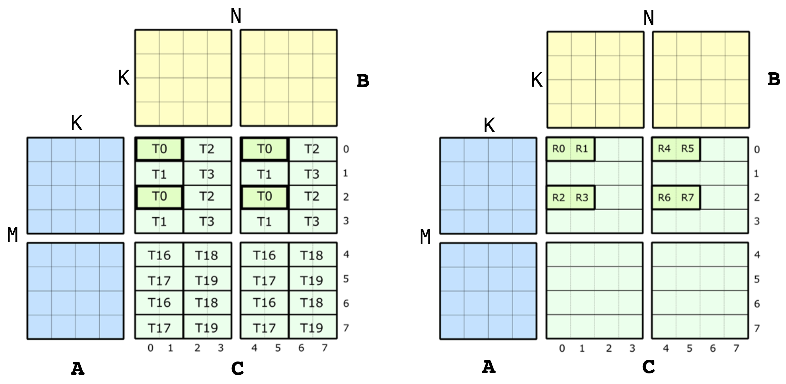
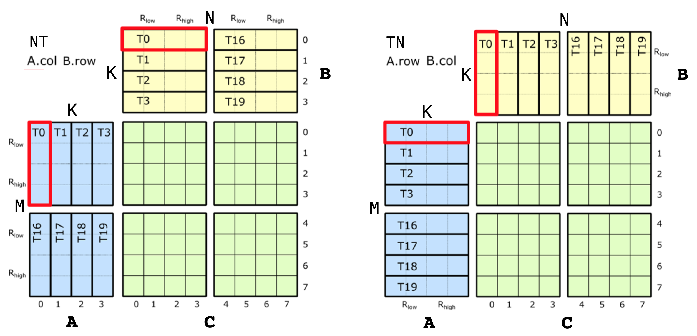
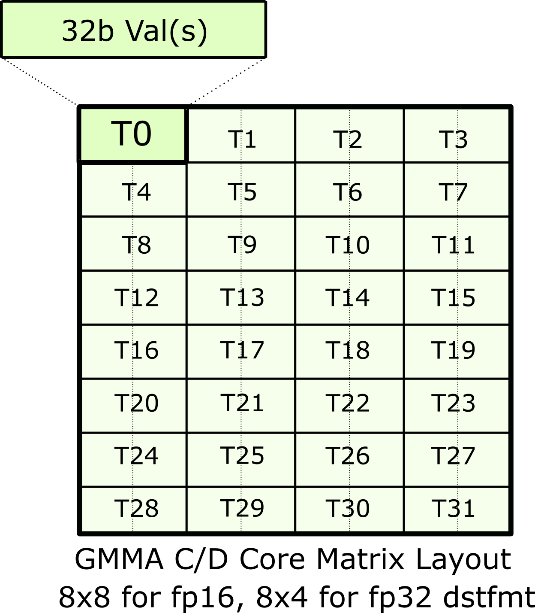

# CuTe's support for Matrix Multiply-Accumulate instructions

In this file, we explain in detail how we support our GPUs'
Matrix Multiply-Accumulate (MMA) hardware instructions in CuTe.

MMAs are architecture-specific.
Different generations of GPU architectures
introduce different sets of MMA instructions.
However, CuTe features such as `Layout`
makes it possible to expose MMAs for use in generic CUDA C++ code.
We do this in two steps.

1. We wrap each MMA's PTX instruction in an "Operation" struct.

2. For each Operation struct, we define a "Traits" struct
   that defines all of the meta-information needed to use the Operation.

## CuTe MMA Atoms

CuTe exposes each MMA to generic CUDA C++ code as a pair of structs:
an "Operation" struct,
and an `MMA_Traits` struct templated on the Operation struct type.

An "Operation" struct exposes the PTX instruction
for that specific operation.
It defines the arguments and interface it expects.
Operation structs have minimal software dependencies -- 
it does not use layouts, tensors, or non-standard numeric data types.
Different structs have different names
that describe what the MMA instruction does.
We will explain the naming scheme below.

A corresponding `MMA_Traits` struct specialization
defines meta-information about the Operation,
such as the compute types, the logical shape of the operation,
and the `Layout`s of threads and values within the operation.
The `MMA_Traits` struct takes the Operation as a template parameter.
CuTe specializes `MMA_Traits` for each Operation type that it supports.

Together, these two types comprise an "Atom" that decouples the complexity of thread and data layouts from the call site of of the PTX instruction.  The Atom's Traits struct exposes information that is relevant to a single MMA operation, no matter the granularity at which it operates.

CuTe MMA atoms expose the semantics of a single MMA operation.
This is true regardless of the hardware level at which the MMA operates.
CuTe supports MMA atoms that operate at a variety of hardware levels,
including

* a single thread (e.g., fused multiply-add (FMA) instruction);

* a quadpair (Volta);

* a single warp (Ampere); and

* a warpgroup (Hopper).

### Operation structs

#### Location of files

CuTe provides its Operations structs in the
[`include/cute/arch`](../../../include/cute/arch)
directory, in header files starting with `mma`.

#### Operation struct's name

A CuTe Operation struct's name encodes information about

* its first supported architecture,

* the M, N, and K dimensions that it accepts,

* the types that it takes, and

* the expected A and B layouts.

For example, the Volta section below will refer to the
`SM70_8x8x4_F32F16F16F32_NT` Operation struct defined in
[`include/cute/arch/mma_sm70.hpp`](../../../include/cute/arch/mma_sm70.hpp).

* "SM70" refers to Volta.

* "8x8x4" refers to M = 8, N = 8, and K = 4,
  the dimensions of the MMA operation that the quadpair performs
  (see below).

* "F32F16F16F32" refers to the element types
  of the four matrix operands A, B, C, and D.
  An MMA computes D = C + A * B,
  so we read the types from left to right:
  D is F32 (`float`), A is F16 (half),
  B is F16 (half), and C is F32 (`float`).

* "NT" means that A is M-major (not transposed)
  and B is N-major (transposed).

#### Contents

An Operation struct has the following members.

##### Type aliases

An Operation struct has four public type aliases:
`DRegisters`, `ARegisters`, `BRegisters`, and `CRegisters`.
For example, the `SM70_8x8x4_F32F16F16F32_NT` Operation struct defined in
[`include/cute/arch/mma_sm70.hpp`](../../../include/cute/arch/mma_sm70.hpp)
defines these as follows.

```c++
using DRegisters = float[8];
using ARegisters = uint32_t[2];
using BRegisters = uint32_t[2];
using CRegisters = float[8];
```

This shows how many values each thread will pass into the PTX instruction
for each of the matrices A, B, C, and D.  For this Operation,
each thread passes 8 F32 values each for C and D (hence `float[8]`),
and 4 F16 values each for A and B (hence `uint32_t[2]`;
the instruction packs two 16-bit F16 values
in each of the two 32-bit `uint32_t` values).

##### `fma` static member device function

An operation struct defines a public `static void fma` function.
It is marked with the `CUTE_HOST_DEVICE` macro,
which adds the `__host__ __device__` annotations.
Different Operations define `fma` to take different numbers of arguments,
depending on the PTX MMA instruction.
The implementation protects use of the PTX instruction with a macro,
and raises an `assert` if `fma` is called when the macro is not defined.
This ensures that tests and examples that use this Operation in an Atom
can still compile, even if the PTX instruction is not available.

### Traits

#### Location of files

CuTe provides its Traits structs in the
[`include/cute/atom`](../../../include/cute/atom)
directory, in header files starting with `mma_traits`.

#### Contents

An `MMA_Traits` specialization defines the following public type aliases.

* `ElementDVal`: Compute type of the D matrix

* `ElementAVal`: Compute type of the A matrix

* `ElementBVal`: Compute type of the B matrix

* `ElementCVal`: Compute type of the C matrix

* `Shape_MNK`: Logical MxNxK shape of the MMA operation

* `ThrID`: Logical thread mapping within the single MMA operation
  (specifying the quadpair, warp, or warpgroup view)

* `ALayout`: Mapping of (thread,value) pairs to the logical MxK A matrix

* `BLayout`: Mapping of (thread,value) pairs to the logical NxK B matrix

* `CLayout`: Mapping of (thread,value) pairs to the logical MxN C matrix

#### Example

The specialization of MMA_Traits for the
`SM70_8x8x4_F32F16F16F32_NT` Operation lives in the header file
[`include/cute/atom/mma_traits_sm70.hpp`](../../../include/cute/atom/mma_traits_sm70.hpp).
It looks like this.

```c++
template <>
struct MMA_Traits<SM70_8x8x4_F32F16F16F32_NT>
{
  using ElementDVal = float;
  using ElementAVal = half_t;
  using ElementBVal = half_t;
  using ElementCVal = float;

  using Shape_MNK = Shape<_8,_8,_4>;
  using ThrID   = SM70_QuadPair;
  using ALayout = SM70_8x4_Col;
  using BLayout = SM70_8x4_Col;
  using CLayout = SM70_8x8_32b;
};
```

The next section will explain these type aliases in detail.

## Volta

This and the following sections show examples of how to construct MMA atoms.
We don't try to explain this for all GPU architectures and MMAs.
Instead, we use selected examples to illustrate the process
of developing new atoms.

Volta architecture implements an HMMA instruction where a group of 8 threads called a quadpair (QP) collaborate to share data and perform an 8x8x4 (fp32 or fp16) matrix multiply-accumulate. (since a warp is 32 threads wide, it would perform an MMA across 4 QPs for a tile size of 16x16x4).

We first take a look at how we would take the ISA semantics of thread and data partitioning for the HMMA instruction, and encode it in a Traits struct. The HMMA NT instruction has the thread-data layout:

<p align="center">
  
</p>

### Types

The HMMA NT above uses types:

```cpp
  using ElementDVal = float;
  using ElementAVal = half_t;
  using ElementBVal = half_t;
  using ElementCVal = float;
```

The rest of the `MMA_Traits` will be described in units of these types.

### Shape

The HMMA NT above has shape 8x8x4:

```cpp
  // Logical shape of the MMA
  using Shape_MNK = Shape <_8,_8,_4>;
```

### Thread ID

If the 32 threads in a warp are logically indexed by [0 ... 31], then the above image contains threads [0,1,2,3]U[16,17,18,19]. These threads make up the 0th quadpair. We can write a thread mapping that maps eight logical thread ids [0,1,2,3,4,5,6,7] of the MMA to a quadpair thread index [0,1,2,3]U[16,17,18,19] of a warp. The layout function has 4 elements with a stride of 1 and 2 of those with a stride of 16. With this, we write a layout that represents a quadpair:

```cpp
  // Mapping from (logical thread id) -> (thread idx)
  using ThrID = Layout<Shape <_4, _2>,
                       Stride<_1,_16>>;
```

Again, this layout function maps the logical thread id [0,8) of the MMA operation onto the quadpair thread index [0,4)U[16,20) of a warp.

### Accumulator Mapping

Let us look at exactly how the 8 threads within a QP are mapped to the A, B and C matrices. For the C and D matrices, the above image is broken down a bit more below. On the left is shown the whole QP level view, and on the right is shown the values owned by just thread 0.

<p align="center">
  
</p>

The metainformation of this single instruction level view is what we want to encode in CuTe. Specifically, the QP level view in this diagram corresponds to the four MMA traits for [SM70_F32F16F16F32](../../../include/cute/arch/mma_sm70.hpp). These structs contain the `Element` types, the `Shape_MNK`, and the `ThrID` mapping we constructed above. Now, let us take a look at the definition of `CLayout`, the thread-data layout of accumulators. The job of `CLayout` is to construct a mapping between the `(logical_thr_id, logical_val_id)` and `(m, n)` coordinate in the C matrix which can then be used to build up more complicated layouts and operations like the 16x16x4 WMMA.

We can start constructing a `CLayout` from the picture above. As with any CuTe layout, it is a pair of `Shape` and corresponding `Stride`. Let us just look at the shape for now. We know that the HMMA uses 8 threads each of which own 8 values. Therefore, the shape of our mapping must have a size of 8 along two modes. With this, we have

```cpp
  // (T8,V8) -> (m,n) 
  using CLayout = Layout<Shape <_8, _8>,
                         Stride<_?, _?>;  // Stride to be filled in below
```

This is not to be confused with the logical 8x8 shape of the C matrix. This is 8-threads by 8-values. We now want to map those to (m,n) coordinates. Since CuTe layouts return indices rather than coordinates, we choose a column-major encoding of the (m,n) coordinates:

```
(logical_thr_id, logical_val_id) -> (m, n) == m + n * M
```

With this in place, we can start thinking about how to construct the strides in `CLayout`. Let's begin by looking at the strides between threads. Note that 
* `(T0,V0)` is located at `(m,n) = (0,0) = 0`
* `(T1,V0)` is located at `(m,n) = (1,0) = 1`
* `(T2,V0)` is located at `(m,n) = (0,2) = 16`
* `(T3,V0)` is located at `(m,n) = (1,2) = 17`
* `(T4,V0)` is located at `(m,n) = (4,0) = 4`
* `(T5,V0)` is located at `(m,n) = (5,0) = 5`
* `(T6,V0)` is located at `(m,n) = (4,2) = 20`
* `(T7,V0)` is located at `(m,n) = (5,2) = 21`

where `T4`,`T5`,`T6`,`T7` are the 4th,5th,6th,7th logical thread id of the MMA corresponding to thread indices of 16,17,18,19 of the warp (recorded in the `ThrID` mapping!).

We note that the pattern can be transcribed to a layout. We can find the position of the 8 threads via

```cpp
  using CLayout = Layout<Shape <Shape <_2,  _2, _2>, _8>,
                         Stride<Stride<_1, _16, _4>, _?>;
```

With the exact same approach, we can construct the stride along the `logical value id` mode. 
* `(T0,V0)` is located at `(m,n) = (0,0) = 0`
* `(T0,V1)` is located at `(m,n) = (0,1) = 8`
* `(T0,V2)` is located at `(m,n) = (2,0) = 2`
* `(T0,V3)` is located at `(m,n) = (2,1) = 10`
* `(T0,V4)` is located at `(m,n) = (0,4) = 32`
* `(T0,V5)` is located at `(m,n) = (0,5) = 40`
* `(T0,V6)` is located at `(m,n) = (2,4) = 34`
* `(T0,V7)` is located at `(m,n) = (2,5) = 42`

We note that this pattern can also be transcribed to a layout. We can find the position of the 8 values via

```cpp
  // (T8,V8) -> (m,n)
  using CLayout = Layout<Shape <Shape <_2, _2,_2>, Shape <_2,_2, _2>>,
                         Stride<Stride<_1,_16,_4>, Stride<_8,_2,_32>>>;
```

And that's all! We can verify that each `(tid,vid)` coordinate in this layout is reliably mapped to the correct (encoded) `(m,n)` coordinate.

In the case of F16 accumulators, the layout is way less complex. Each row of accumulators `(m, :)` is held by a single thread, which makes the layout:

```cpp
  using CLayout = Layout<Shape <_8,_8>,
                         Stride<_1,_8>>;
```

### A and B Layout Mapping

A and B matrix layouts depend on whether the sources are transposed or not. The diagram below shows the thread ID to data ownership map for A and B matrices in the case of NT and TN transposes.

<p align="center">
  
</p>

Let's look at the TN layout for A matrix first (right side in the diagram). Again, there are the same 8 logical threads, but each threads owns only 4 elements this time. The shape of `ALayout` will then be `Shape<_8, _4>`. As for the strides, we again need a similar mapping between `(m, k) == m + k * M`. Looking down the `M` mode, we go from `(T0, V0)` to `(T1, V0)` which is a stride of 1 for all 8 threads. For the `K` mode, as we go across, we go from `(T0, V0)` to `(T0, V1)`, which makes a stride of 8 for all 4 values. Therefore, the A layout is:

```cpp
  // (T8,V4) -> (m,k) 
  using ALayout = Layout<Shape <_8,_4>,
                         Stride<_1,_8>>;
```

Source B layout is constructed similarly for the TN HMMA, except that we want write it as `(N,K)` rather than `(K,N)` for convenience. For the strides, as we go across the `N` mode, we go from `(T0, V0)` to `(T1, V0)`, making this a stride of 1 for all 8 threads. As we go down the `K` mode, `(T0, V0)` to `(T0, V1)` which is a stride of 8 for all 4 values. So the B layout is the same as A:

```cpp
  // (T8,V4) -> (n,k) 
  using BLayout = Layout<Shape <_8,_4>,
                         Stride<_1,_8>>;
```

The layouts in the case of NT are a bit more complicated (left side of the diagram). Going down the `M` mode of `A`, we see the four values of `T0` first and then we see the four values of `T4`. This means we first have a stride of 1 for 4 values, followed by a stride of 4 from `T0` to `T4`. So we have two sub-strides along the `M` mode. For the `K` mode, as we go across, we simply increment the `thr_id`, keeping `val_id` the same, making the stride 8 for 4 threads. This makes the A layout:

```cpp
  // (T8,V4) -> (m,k)
  using ALayout = Layout<Shape <Shape <_4,_2>,_4>,
                         Stride<Stride<_8,_4>,_1>>;
```

With the `(N,K)` ordering for B, the layout is the same.

```cpp
  // (T8,V4) -> (n,k)
  using BLayout = Layout<Shape <Shape <_4,_2>,_4>,
                         Stride<Stride<_8,_4>,_1>>;
```

For the NN and TT transposes, they are simply combinations of the two layouts we have seen for A and B so far.

## Hopper

Now, we are ready to take a look at the much larger GMMA operation (Group MMA) first introduced with Hopper architecture. These MMA instructions operate at the granularity of 128 threads (4 warps), which are collectively referred to as a warpgroup.

### Thread ID

In the case of Hopper GMMAs, the thread IDs are assigned based on the simple 1D contiguous layout, which makes `thrID` trivial:

```cpp
using ThrID = Layout<_128, _1>;
```

### Accumulator Mapping

Accumulators are mapped hierarchically in GMMA, starting from the concept of a core matrix and building up to a layout for the whole C matrix tile. Let's look at this core matrix first. We only consider fp16 accumulators here, but extensions of fp32 accumulators as trivial as we will see later.

Each core matrix has the layout as shown in the diagram below.
<p align="center">
  
</p>

As in the Volta examples, the thread IDs are logical only, and which of the four warps they belong to in the warpgroup is not important.

Then GMMA tiles this core matrix first vertically along the M mode, and then repeats that column of core matrices along the N mode to construct the full MxN tile. This tiling is shown in the image below.

<p align="center">
  
</p>

With this image, we are again ready to start building the `CLayout` for `SM90_64x128x16_F16F16F16F16_TN` atom. Same as before, we are constructing a mapping between the `(logical_thr_id, logical_val_id) -> (m, n)` coordinate spaces.

To begin, let's follow the first few threads and values. We immediately see that they are arranged along the `N`-mode with pairs of values and four threads. This gives us

```cpp
// (T128,V4) -> (M64,N8)
using CLayout = Layout<Shape <Shape <  _4, ...>, Shape < _2, ...>>,
                       Stride<Stride<_128, ...>, Stride<_64, ...>>>;
```

To complete the first 8x8 core matrix, the four threads repeat eight times down the `M`-mode:

```cpp
// (T128,V4) -> (M64,N8)
using CLayout = Layout<Shape <Shape <  _4, _8, ...>, Shape < _2, ...>>,
                       Stride<Stride<_128, _1, ...>, Stride<_64, ...>>>;
```

Then, as we go to the next core matrix, we wrap back again to `T0`, but this time to `(T0, V2)`.

```cpp
// (T128,V4) -> (M64,N8)
using CLayout = Layout<Shape <Shape <  _4, _8, ...>, Shape < _2, _2>>,
                       Stride<Stride<_128, _1, ...>, Stride<_64, _8>>>;
```

Finally, we get this entire pattern repeating four times, once for each warp, down the `M`-mode starting at `(m,n) = (16,0) = 16`. where two core matrices that belong to the same warp are stacked on top of each other. This makes the size of the final sub-mode of M 4. As for the stride, this time we go to `(T32, V0)`, which makes it a stride of 32. 

```cpp
// (T128,V4) -> (M64,N8)
using CLayout = Layout<Shape <Shape <  _4, _8,  _4>, Shape < _2, _2>>,
                       Stride<Stride<_128, _1, _16>, Stride<_64, _8>>>;
```

This is the full `CLayout` for 64x8 accumulators. The GMMA instructions include 64xN variants with `N = [16,32,64,128,256]` where this 64x8 pattern is repeated giving each thread additional values. As this starts at `(m,n) = (0,8) = 512`, this is easy to account for in our `CLayout`. For example, the 64x128 `CLayout` is

```cpp
// (T128,V64) -> (M64,N128)
using CLayout = Layout<Shape <Shape <  _4, _8,  _4>, Shape < _2, _2,  _16>>,
                       Stride<Stride<_128, _1, _16>, Stride<_64, _8, _512>>>;
```

where we see 16 copies of the 64x8 tile.

### A and B Layout Mapping

GMMA atoms that consume A and B sources directly from shared memory are a bit interesting. The GMMA Descriptor is constructed on an entore tile of A and/or B data in shared memory rather than being partitioned by threads. That is, every thread sees the entire tile of data and the tile is not reordered so that the descriptor can be constructed on it. In `ALayout` form, this can be expressed

```cpp
// (T128,V64x8) -> (M64,K16)
using ALayout = Layout<Shape <_128, Shape <_64,_16>>,
                       Stride<  _0, Stride< _1,_64>>>;
```

That is, all threads are mapped the to `(m,k) = (0,0) = 0` element and the values (and shape of the values) remains unchanged. The GMMA Descriptor Constructor can then inspect the `(M,K)` layout of this data and create an appropriate GMMA Descriptor or produce an error message saying the data is in an invalid layout for GMMA.
