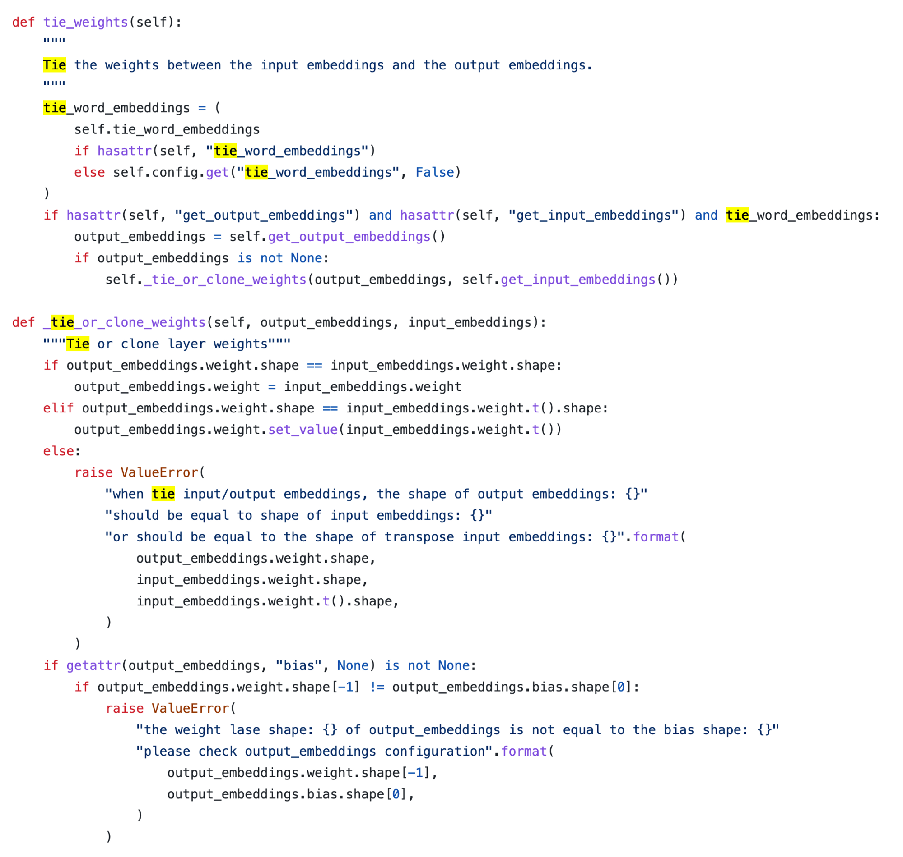
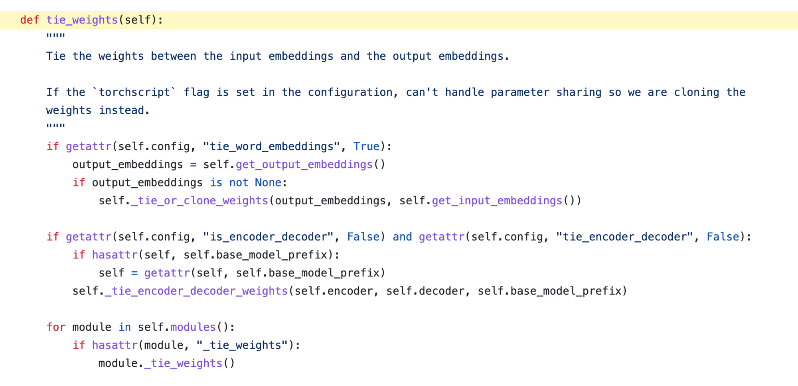
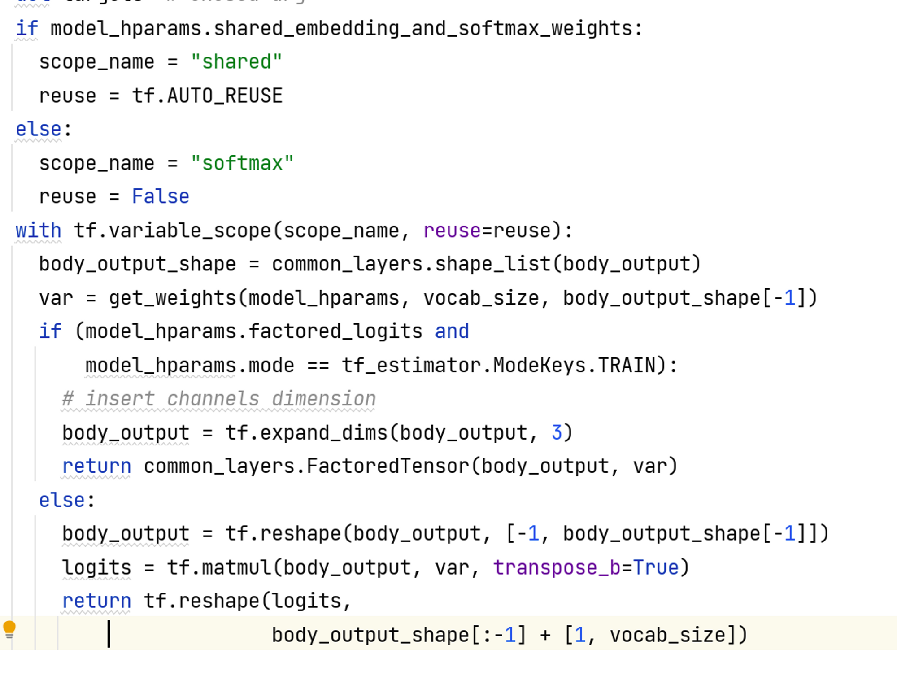
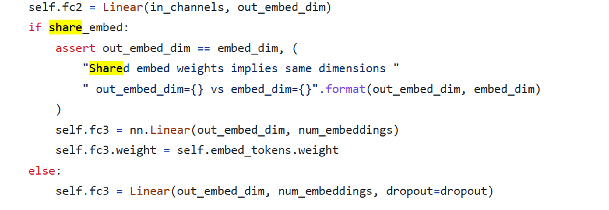

# 标题

标题如：paddle.io.dataset 设计文档

|API名称 | 新增API名称                                            |
|---|----------------------------------------------------|
|提交作者<input type="checkbox" class="rowselector hidden"> | 丘文波, 刘旺旺                                           |
|提交时间<input type="checkbox" class="rowselector hidden"> | 2022-03-04                                         |
|版本号 | V1                                                 |
|依赖飞桨版本<input type="checkbox" class="rowselector hidden"> | 如无特殊情况，都应基于develop版本开发                             |
|文件名 | 20230304_api_design_for_tie_weight_task_103.md  |

# 一、概述
## 1、相关背景
对应任务是 No.103：新增tie_weights能力 

权重绑定, 一般是指将输入层embedding和 输出层embeding共享权重, 从而在减少网络的参数量, 使得embeding层参数训练更加充分.

其中《attention is all you need》中的提到的transformer模型也使用到了tie weigh这个技巧, 论文3.4节提到将encoder输入embedding与decoder输入embedding以及输出线性层权重共享 这个技巧的有效性在论文《Using the output embedding to improve language models》进行了验证 .

所以预训练语言模型需要实现一个输入层embedding和 输出层embeding共享权重共享功能,方便使用者进行调用.

相关issue:
* [https://github.com/PaddlePaddle/PaddleNLP/issues/4740](https://github.com/PaddlePaddle/PaddleNLP/issues/4740)

## 2、功能目标
给预训练语言模型增加一个基础函数, 实现输入层embeding和输出层embedding的权重共享绑定:

- 为PaddleNLP新增tie_weights功能，能够对齐HuggingFace Transformers中的[tie_weights](https://huggingface.co/docs/transformers/main_classes/model#transformers.PreTrainedModel.tie_weights)功能
- 参考: [https://github.com/huggingface/transformers/blob/v4.26.1/src/transformers/modeling_utils.py#L1172](https://github.com/huggingface/transformers/blob/v4.26.1/src/transformers/modeling_utils.py#L1172)

## 3、意义
实现权重绑定的函数, 作为一种模型技巧来提升训练效果.减少模型参数,

权重绑定的函数作为模型的一个基本函数, 在基于预训练模型组网的时候 方便进行调用进行实验, 减少模型参数,提升模型效果.

# 二、飞桨现状
对飞桨框架目前支持此功能的现状调研，如果不支持此功能，如是否可以有替代实现的API，是否有其他可绕过的方式，或者用其他API组合实现的方式；

paddle 中并没有对tie weight的统一实现,调用者需自己写代码实现这部分功能.

paddleNLP中的一些示例代码中也找到了一个tie weight的实现.

最好是给基础模型加上tie weight的函数,减少调用者的开发.

# 三、业内方案调研
描述业内深度学习框架如何实现此功能，包括与此功能相关的现状、未来趋势；调研的范围包括不限于TensorFlow、PyTorch、NumPy等

(1)目前huggingface的transformers库中实现了这个tieweight 这个基础函数.

(2) tensor2tensor库 tieweight 实现代码

(3) fairseq库 中 tie weight实现函数

# 四、对比分析
paddle和 huggingface的transformers 都是基于动态图进行开发, 所以准备参照huggingface的transformers  的 tie weight 函数思路去实现功能.

# 五、设计思路与实现方案

参考huggingface的 transformers中的实现思路来基于paddle进行开发

实现tie_weight函数步骤:

1. 获取模型input embedding  权重对象 A
2. 获取模型 output embedding 权重对象 B
3. 让A和B 都指向同一个权重值

## 命名与参数设计
参考：[飞桨API 设计及命名规范](https://www.paddlepaddle.org.cn/documentation/docs/zh/develop/dev_guides/api_contributing_guides/api_design_guidelines_standard_cn.html)
## 底层OP设计
## API实现方案

# 六、测试和验收的考量
参考：[新增API 测试及验收规范](https://www.paddlepaddle.org.cn/documentation/docs/zh/develop/dev_guides/api_contributing_guides/api_accpetance_criteria_cn.html)

# 七、可行性分析和排期规划
时间和开发排期规划，主要milestone
- 3.10 跟官方确认好开发思路
- 3.17 提交实现代码

# 八、影响面
需要进一步讨论的问题，开放性问题，有争议问题；对其他模块是否有影响

# 名词解释

# 附件及参考资料
