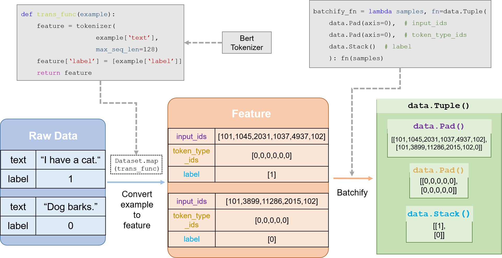

============
整体介绍
============

数据集和数据处理部分一直是NLP任务中最重要的环节之一。为了方便用户以更低的学习成本完成这一环节，PaddleNLP提供了以下特性：

- 功能强大的API。可以帮助用户完成大部分常见NLP任务的数据处理流程。
- 更灵活的封装。各个模块保持低耦合，高内聚，保证用户可以通过继承和改写满足特定的数据处理需求。
- 内置数据集涵盖大部分NLP任务，搭配简洁易用的数据集加载协议和贡献协议。对新手和社区贡献者更加友好。

核心API
----------

- :func:`load_dataset` ：数据集快速加载接口，通过传入数据集读取脚本的名称和其他参数调用 :class:`DatasetBuilder` 子类的相关方法生成数据集。关于加载数据集的详细方法，请查阅 :doc:`加载数据集 <./dataset_load>` 。
- :class:`DatasetBuilder` ： :class:`DatasetBuilder` 是一个基类，所有的内置数据集都继承自该类，该类的主要功能是下载和读取数据集文件并生成Dataset。其中大部分方法已经封装，不对贡献者暴露。贡献者通过重写 :func:`_get_data` 和 :func:`_read` 等方法像社区贡献数据集。详细信息请查阅 :doc:`如何贡献数据集 </community/contribute_dataset>` 。
- :class:`MapDataset/IterDataset` ：PaddleNLP内置数据集类型，分别是对 :class:`paddle.io.Dataset` 和 :class:`paddle.io.IterableDataset` 的扩展。内置诸如 :func:`map` , :func:`filter` 等适用于NLP任务的数据处理功能。同时还能帮助用户简单创建自定义数据集。详细信息请查阅***和 :doc:`如何自定义数据集 <./dataset_self_defined>` 。

数据处理流程设计
-----------------

目前PaddleNLP的通用数据处理流程如下：

#. 加载数据集（内置数据集或者自定义数据集，数据集返回 **原始数据**）。
#. 定义 :func:`trans_func` ，包括tokenize，token to id等操作，并传入数据集的 :func:`map` 方法，将原始数据转为 *feature* 。
#. 根据上一步数据处理的结果定义 **batchify** 方法和 :class:`BatchSampler` 。
#. 定义 :class:`DataLoader` ， 传入 :class:`BatchSampler` 和 :func:`batchify_fn` 。

下面是基于Bert的文本分类任务的数据处理流程图：

关于数据处理的详细信息，请查阅 :doc:`./data_preprocess` 。
