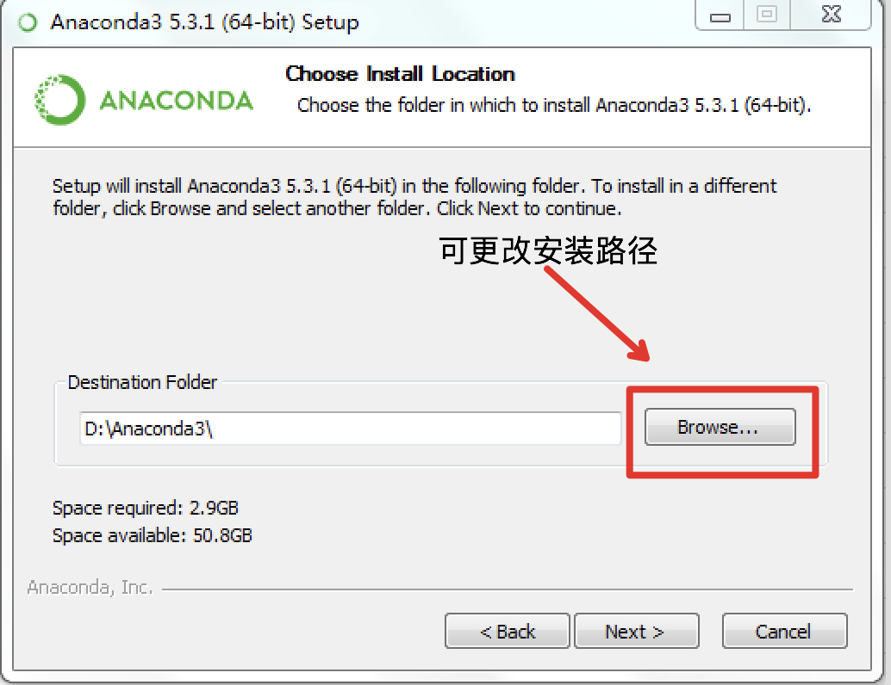

安装PaddleNLP
^^^^^^^^
以下安装过程默认用户已安装好paddlepaddle-gpu或paddlepaddle(版本大于或等于2.0)，paddlepaddle安装方式参照 飞桨官网_。

.. _飞桨官网: https://www.paddlepaddle.org.cn/install/quick?docurl=/documentation/docs/zh/2.0/install/pip/windows-pip.html

pip安装
--------
.. code-block::

  pip install --upgrade paddlenlp>=2.0.0rc -i https://pypi.org/simple

Anaconda安装
--------
Anaconda是一个开源的Python发行版本，其包含了conda、Python等180多个科学包及其依赖项。使用Anaconda可以通过创建多个独立的Python环境，避免用户的Python环境安装太多不同版本依赖导致冲突。

1、windows安装Anaconda
>>>>>>>>>

第一步 下载
:::::::::
* 在 Anaconda官网_ 选择下载Windows Python3.7 64-Bit版本。

.. _Anaconda官网: https://www.anaconda.com/products/individual

* 确保已经安装Visual C++ Build Tools(可以在开始菜单中找到)，如未安装，请点击 下载安装_。

.. _下载安装: https://go.microsoft.com/fwlink/?Linkid=691126

第二步 安装
:::::::::
运行下载的安装包(以.exe为后辍)，根据引导完成安装, 用户可自行修改安装目录（如下图）。

第三步 使用
:::::::::
* 点击Windows系统左下角的Windows图标，打开：所有程序->Anaconda3/2（64-bit）->Anaconda Prompt
* 在命令行中执行下述命令

.. code-block::

  # 创建名为my_paddlenlp的环境，指定Python版本为3.7
  conda create -n my_paddlenlp python=3.7
  # 进入my_paddlenlp环境
  conda activate my_paddlenlp
  # 安装PaddleNLP
  pip install --upgrade paddlenlp>=2.0.0rc -i https://pypi.org/simple

按如上方式配置后，即可在环境中使用PaddleNLP了，命令行输入python回车后，import paddlenlp试试吧，之后再次使用都可以通过打开'所有程序->Anaconda3/2（64-bit）->Anaconda Prompt'，再执行conda activate my_paddlenlp进入环境后，即可再次使用PaddleNLP。

2、Linux/Mac安装安装Anaconda
>>>>>>>>>

第一步 下载
:::::::::
在 Anaconda官网_ 选择下载对应系统 Python3.7版本下载（Mac下载Command Line Installer版本即可)。

.. _Anaconda官网: https://www.anaconda.com/products/individual

第二步 安装
:::::::::
打开终端，在终端安装Anaconda

.. code-block::

  # ~/Downloads/Anaconda3-2019.07-Linux-x86_64.sh即下载的文件
  bash ~/Downloads/Anaconda3-2019.07-Linux-x86_64.sh
  
安装过程中一直回车即可，如提示设置安装路径，可根据需求修改，一般默认即可。

第三步 使用
:::::::::

.. code-block::

  # 创建名为my_paddlenlp的环境，指定Python版本为3.7
  conda create -n my_paddlenlp python=3.7
  # 进入my_paddlenlp环境
  conda activate my_paddlenlp
  # 安装PaddleNLP
  pip install --upgrade paddlenlp>=2.0.0rc -i https://pypi.org/simple

按如上方式配置后，即可在环境中使用PaddleNLP了，命令行输入python回车后，import paddlenlp试试吧，之后再次使用都可以通过打开'所有程序->Anaconda3/2（64-bit）->Anaconda Prompt'，再执行conda activate my_paddlenlp进入环境后，即可再次使用PaddleNLP。

代码安装
---------
github代码会跟随开发进度不断更新

.. code-block::

  git clone https://github.com/PaddlePaddle/PaddleNLP.git
  cd PaddleNLP
  git checkout develop

使用Docker镜像体验PaddleNLP
^^^^^^^^

如果您没有Docker运行环境，请参考 `Docker官网`_ 进行安装

.. _Docker官网: https://www.docker.com

PaddleNLP提供了带有最新代码的docker镜像供您使用，您只需要*拉取docker镜像*，然后*运行docker镜像*，无需其他任何额外操作，即可开始使用PaddleNLP的所有功能。

在 `Docker Hub`_ 中获取这些镜像及相应的使用指南，包括CPU、GPU、ROCm版本。

.. _Docker Hub: https://hub.docker.com/repository/docker/paddlecloud/paddlenlp

如果您对自动化制作docker镜像感兴趣，或有自定义需求，请访问 `PaddlePaddle/PaddleCloud`_ 做进一步了解。

.. _PaddlePaddle/PaddleCloud: https://github.com/PaddlePaddle/PaddleCloud/tree/main/tekton
