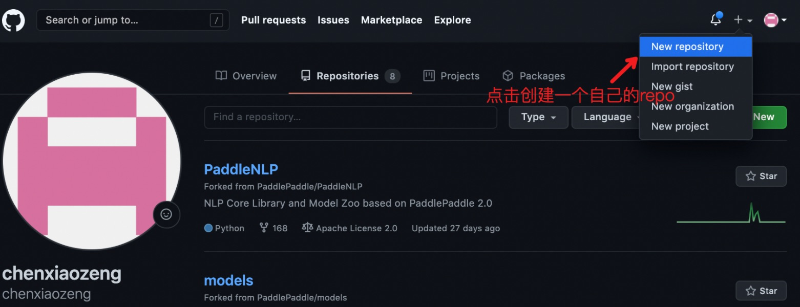
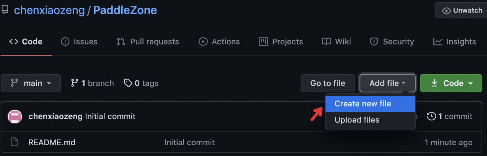
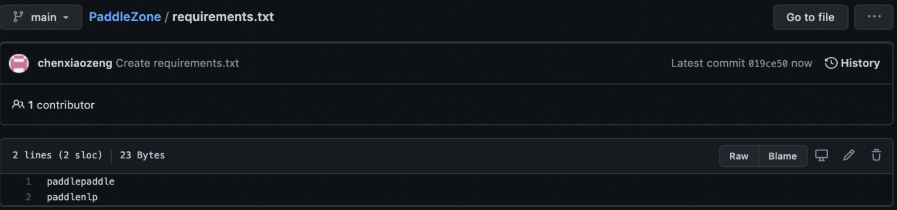
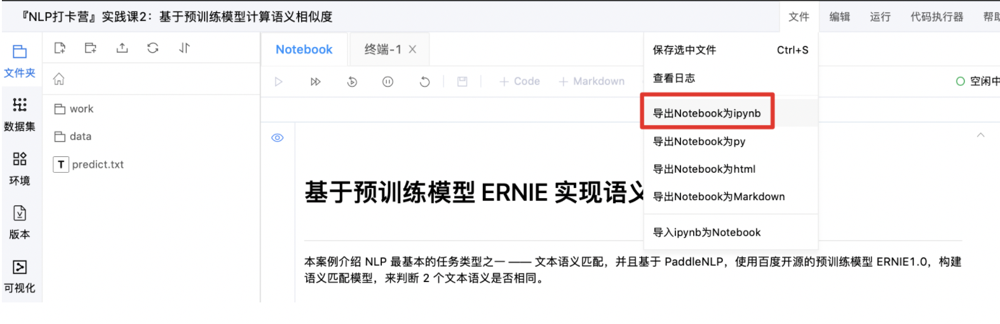
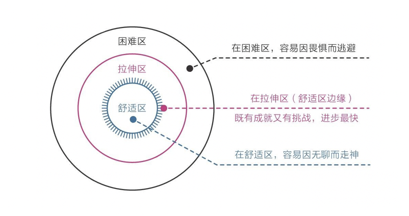

# NLP 12日直播打卡营

欢迎加入《基于深度学习的自然语言处理》直播打卡课程，百度自然语言处理部 & PaddlePaddle研发团队直播授课，深入剖析NLP前沿技术和实践应用，提供基于最新飞桨框架和飞桨PaddleNLP文本领域开发库的代码实践。

直播链接：

6.24部署课直播链接：https://live.bilibili.com/21863531

6.25打卡营结营直播链接：http://live.bilibili.com/21689802

## 😍GitHub提交作业指南😍

**Bonus🤩：大家可以在GitHub上建立repo开源自己的作品（有自己思考与改进的作业、开放性项目、比赛方案均可|内容可与AI Studio项目相同），并将PaddleNLP加入你的repo的requirements.txt中，最后将repo链接登记在AI Studio课程讨论区即可被评选为优秀，算力、键盘、超级会员等你来领°˖✧◝(⁰▿⁰)◜✧˖°。**

**这里给大家简单提示下如何在GitHub上建立repo来开源自己的作品，奖项评选标准和截止日期往下滑就可以看到哦**

### Step 0：创建GitHub账号

对于还未创建GitHub账号的同学们，可以先创建账号，创建后，**可以先对[PaddleNLP](https://github.com/PaddlePaddle/PaddleNLP)点击Star完成关注哟⸜(ّᶿധّᶿ)⸝**，这样你就能及时掌握repo的资讯更新啦~

### Step 1：创建自己的GitHub repo

对于还未有自己的repo的同学（fork他人项目不算噢）可以点进自己的主页，点击【New】创建一个新的repo，并予以命名。

  

### Step 2：新增requirements.txt文件

Requirements.txt文件中包含了你创建的repo中所使用其他开发者的repo名称，代表了对于其他开发者的内容版权的尊重，类似于【转载自】。

点击Step 1	中新创建的repo，选择【Add file】中的【Create new file】，将其命名为【requirements.txt】。

  

这样，文件列表中即新增【requirements.txt】~

### Step 3：在requirements.txt文件中加上”paddlenlp“

点击step 3中创建的【requirements.txt】，在其中增加”paddlenlp“即可。

  

### Step 4：提交作业

从AI Studio中将作业导出为ipynb格式：

  

回到Step 1中创建的repo的主页，同创建【requirements.txt】步骤一样，选择【Add file】中的【Upload files】上传自己作业即可。

### Step 5：在课程讨论区登记GitHub repo链接（repo里别忘了写requirements.txt哦）

**期待大家的作品噢(〜￣▽￣)〜〜(￣▽￣〜)**

## ⭐️⭐️ 奖项评选标准和截止日期

**1、结业证书与奖学金｜6月25日截止**

**【结业标准与奖励】**

  结业标准：完成**作业区全部作业且均达到及格** + **大作业（指定NLP比赛：情感分析｜提交截止6月25日10:00）**

  你将获得：百度飞桨官方颁发的**结业证书**（写有你的名字）+ 100小时的 Tesla V100 GPU**算力卡**

 （**大作业比赛报名地址：https://aistudio.baidu.com/aistudio/competition/detail/50**）

**【领取奖学金】**

  评选依据：**作业总成绩**（含预习作业、客观题、实战题、大作业的成绩）

  奖学金标准（京东卡）：Top10获得**500元**奖学金、Top20获得**200元**奖学金、Top50获得**100元**奖学金

【结业与奖学金颁奖】6月25日 20:30 直播结营与颁奖典礼｜欢迎各位同学直播连线！

**2、优秀奖（开放性项目、指定千言比赛）7月25日截止**
 优秀奖奖励：百度网盘超级会员月卡+100小时GPU算力卡
 评选标准：以下三项内容完成一项即可获得优秀奖，完成多项可累加奖励，上不封顶！
 基本要求：所有比赛、项目代码**必须开源在AI Studio及Github上，并且在讨论区登记！！！**否则评分的老师们很难找到你的作品哦～

 **(1)**课程中任何一次实战题表现突出

 **(2)**自选任意感兴趣的开放性项目，完成并将项目开源在AI Studio及Github上
    基于情感分析课程，完成观点抽取任务，将项目发布在AI Studio上，加精即可获奖
    更多选题随课开放，也可自行发挥～

 **(3)**基于Paddle完成指定NLP比赛（见下）并进入比赛总成绩排行榜前50名（榜单见课程左侧讨论区）
    文本相似度、信息抽取、阅读理解、语义解析、开放域对话、机器同传
    以上比赛地址：https://aistudio.baidu.com/aistudio/competition/4/1
   （前300位课程学员，报名即可获得100h算力支持）

**3、开源贡献奖｜7月25日截止**
 评选标准：为Paddle框架、PaddleNLP开发库贡献 issues、产品建议等｜需在此登记，我们将选出其中最有价值部分予以鼓励（至少10个）
 你将获得：Cherry机械键盘

## 萌新学习经验 ：不求全部吸收，但求各有收货

这套课程内容，乍看是不是，有点头大？萌新产品小妹建议你：

第一步：了解课程整体内容、难度梯度

第二步：结合自身知识水平，有选择得学习，在拉伸区努力！

  

| **精心设置学习梯度**  | **低、中（必修）**                                           | 中、高                                                       |
| --------------------- | ------------------------------------------------------------ | ------------------------------------------------------------ |
| 课程上半场 - 理论课   | 课程上半场 - 理论课                                          | Paper解读、模型理论推导、技术难点拆解                        |
| 课程下半场 - 代码实践 | 1. 学习使用AI Studio、安装飞桨框架和PaddleNLP 2. 学习深度学习NLP任务通用流程 3. 使用飞桨PaddleNLP跑通完整案例 | 1. 深入学习PaddleNLP重点API； 2. 学习模型调优策略、模型复现、模型创新； 3.  学以致用：更换数据集解决自己实际业务问题 |
| 作业1 - 选择题        | 巩固课上重要知识点                                           | 无                                                           |
| 作业2 - 代码实践题    | 1. 跑通baseline参加千言竞赛 2. 简单实践，如将BOW网络换RNN 3. 模型压缩和部署 | 1. 通过模型调优等方式提高千言竞赛成绩 2. 模型复现、模型创新 3. 花样部署 |
| 代码3 - 开放题        | 无                                                           | 闲聊；机器同传                                               |

致敬开源、鼓励分享：开课期间发布原创优秀技术经验贴、有价值的开源项目、视频等，即可获得额外加分，加分直接体现在总成绩上。希望你收获更强的自己，如有问题，欢迎加入课程qq群（618354318）交流讨论。

  

##

## 课程安排

**6月7日 20:30-21:30	导论: 走进自然语言处理 **

**6月8日 20:30-21:30	Day1 前预训练时代的自监督学习**

**6月9日 20:30-21:30	Day2 预训练语言模型及应用**

**6月10日 20:30-21:30	Day3 词法分析技术及应用**

**6月11日 20:30-21:30 Day4 信息抽取技术及应用**

**6月15日 20:30-21:30 Day5 情感分析技术及应用**

**6月16日 20:30-21:30 Day6 检索式文本问答**

**6月17日 20:30-21:30 Day7 结构化数据问答**

**6月18日 20:30-21:30 Day8 文本翻译技术及应用**

**6月19日 20:30-21:30 Day9 机器同传技术及应用**

**6月22日 20:30-21:30 Day10 任务式对话系统 - 基于预训练模型识别对话意图**

**6月23日 20:30-21:30 Day11 开放域对话系统 - 动手搭建中文闲聊机器人**

**6月24日 20:30-21:30 Day12 预训练模型产业实践课**

**6月25日 20:30-21:30 结营啦**

## 奖品列表

为了鼓励大家积极认真的参与课程，完成课后作业，我们为大家准备了丰厚的奖品！

我们会根据大家课程打卡以及作业完成的情况计算大家的总成绩，给大家发奖~

- 结业证书
- 优秀学员证书
-  GPU算力
- 京东卡

- 机械键盘、小度等可爱奖品
- 你想要什么周边，撩班班吧😍😍

## 优秀作业公示

敬请期待

## 奖品名单公布

敬请期待
