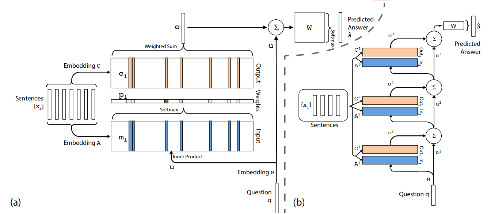
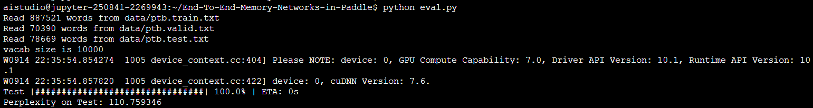
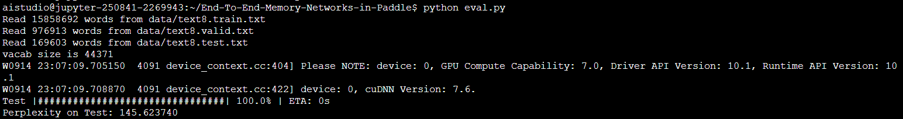

# End-To-End-Memory-Networks-in-Paddle
## 一、简介

用Paddle来复现论文End-To-End Memory Networks 



原论文地址：[Sainbayar Sukhbaatar, Arthur Szlam, Jason Weston, Rob Fergus: “End-To-End Memory Networks”, 2015.](https://arxiv.org/pdf/1503.08895v5.pdf)

复现repo：[yulangz/End-to-End-Memory-Networks-in-Paddle](https://github.com/yulangz/End-to-End-Memory-Networks-in-Paddle)

参考repo：[https://github.com/facebookarchive/MemNN](https://github.com/facebookarchive/MemNN)

项目AiStudio地址：[https://aistudio.baidu.com/aistudio/projectdetail/2381004](https://aistudio.baidu.com/aistudio/projectdetail/2381004)

## 二、复现精度

相应模型已包含在本repo中，分别位于目录`models_ptb`与`models_text8`下

| Dataset | Paper Perplexity | Our Perplexity |
| :-----: | :--------------: | :------------: |
|   ptb   |       111        |     110.75     |
|  text8  |       147        |     145.62     |

## 三、数据集

* Penn Treetank:

    * [Penn Treebank](https://aistudio.baidu.com/aistudio/datasetdetail/108805) 

        train：887k words

        valid：70k words

        test：78k words

        vocabulary  size：10k

    * [text8](https://aistudio.baidu.com/aistudio/datasetdetail/108807)

        train：总共100M个字符，划分为93.3M/5.7M/1M字符(train/valid/test)，将出现次数少于10次的单词替换为<UNK>

## 四、环境依赖

* 硬件：GPU
* 框架：Paddle >= 2.0.0，progress库

## 五、快速开始

请先到[yulangz/End-to-End-Memory-Networks-in-Paddle](https://github.com/yulangz/End-to-End-Memory-Networks-in-Paddle)下载数据集和预训练模型。

### 训练

训练参数可在`config.py`文件中调整。

Note: 由于本模型受随机因素影响较大，故每次训练的结果差异较大，即使固定随机种子，由于GPU的原因训练结果仍然无法完全一致。

#### 在ptb数据集上训练

```bash
cp config/config_ptb config.py
python train.py
```

#### 寻找最佳模型

由于模型受随机因素影响较大，故要进行多次训练来找到最优模型，原论文中在ptb数据集上进行了10次训练，并保留了在test集上表现最好的模型。本复现提供了一个脚本，来进行多次训练以获得能达到足够精度的模型。

```bash
cp config/config_ptb config.py
python train_until.py --target 111.0
```

以下是在ptb数据集上进行多次训练以达到目标精度的[log](./log/ptb_train_until.log)

#### 在text8数据集上训练

```bash
cp config/config_text8 config.py
python train.py
```

### 测试

保持`config.py`文件与训练时相同

```
python eval.py
```

### 使用预训练模型

#### ptb数据集上

```bash
cp config/config_ptb_test config.py
python eval.py
```

将得到以下结果



#### text8数据集上

```bash
cp config/config_text8_test config.py
python eval.py
```

结果如下



## 六、代码结构详细说明

### 6.1 代码结构

```
├── checkpoints
├── config										# 配置文件模板
│   ├── config_ptb
│   ├── config_ptb_test
│   ├── config_text8
│   └── config_text8_test
├── data										# 数据集（请在复现repo下载）
│   ├── ptb.test.txt
│   ├── ptb.train.txt
│   ├── ptb.valid.txt
│   ├── ptb.vocab.txt
│   ├── text8.test.txt
│   ├── text8.train.txt
│   ├── text8.valid.txt
│   └── text8.vocab.txt
├── models_ptb									# ptb数据集上的预训练模型（请在复现repo下载）
│   └── model_17814_110.75
├── models_text8								# text8数据集上的预训练模型（请在复现repo下载）
│   └── model_500_7_100_145.62
├── image
│   ├── model_introduction.png
│   ├── test_ptb.png
│   └── test_text8.png
├── log
│   └── ptb_train_until.log
├── README_cn.md
├── README.md
├── requirements.txt
├── config.py
├── model.py
├── data.py
├── train.py									# 训练脚本
├── eval.py										# 测试脚本
├── train_until.py
└── utils.py
```

### 6.2 参数说明

可以在`config.py`中设置以下参数

```
config.edim = 150                       # internal state dimension
config.lindim = 75                      # linear part of the state
config.nhop = 7                         # number of hops
config.mem_size = 200                   # memory size
config.batch_size = 128                 # batch size to use during training
config.nepoch = 100                     # number of epoch to use during training
config.init_lr = 0.01                   # initial learning rate
config.init_hid = 0.1                   # initial internal state value
config.init_std = 0.05                  # weight initialization std
config.max_grad_norm = 50               # clip gradients to this norm
config.data_dir = "data"                # data directory
config.checkpoint_dir = "checkpoints"   # checkpoint directory
config.model_name = "model"             # model name for test and recover train
config.recover_train = False            # if True, load model [model_name] before train
config.data_name = "ptb"                # data set name
config.show = True                      # print progress, need progress module
config.srand = 17814                    # initial random seed
```

