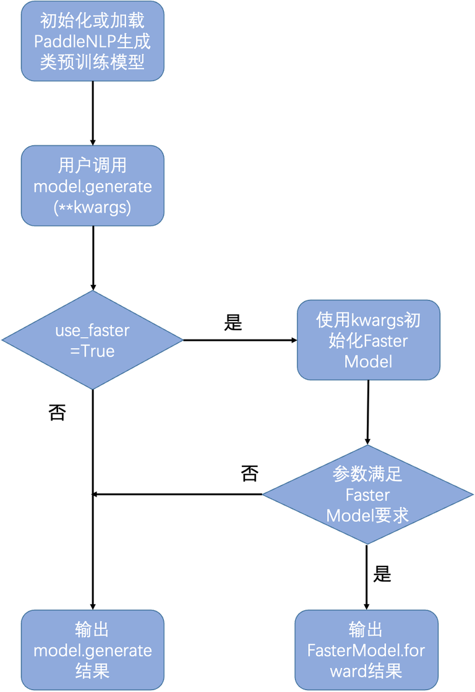

# FasterGeneration

FasterGeneration是PaddleNLP v2.2版本加入的一个高性能推理功能，可实现基于CUDA的序列解码。该功能可以用于多种生成类的预训练NLP模型，例如GPT、BART、UnifiedTransformer等，并且支持多种解码策略。因此该功能主要适用于机器翻译，文本续写，文本摘要，对话生成等任务。

功能底层依托于[FasterTransformer](https://github.com/NVIDIA/FasterTransformer)，该库专门针对Transformer系列模型及各种解码策略进行了优化。功能顶层封装于`model.generate`函数。功能的开启和关闭通过传入`use_faster`参数进行控制（默认为关闭状态）。通过调用generate函数，用户可以简单实现模型的高性能推理功能。下图展示了FasterGeneration的启动流程：


<p align="center">
  
</p>

## Featrues

- 全面支持生成式预训练模型。包括GPT、BART、mBART、UnifiedTransformer和UNIMO-text。
- 支持大多数主流解码策略。包括Beam Search、Sampling、Greedy Search。以及Diverse Sibling Search、Length Penalty等子策略。
- 解码速度快。最高可达非加速版generate函数的**18倍**。**并支持FP16混合精度计算**。
- 易用性强。功能的入口为`model.generate`，与非加速版生成api的使用方法相同，当满足加速条件时使用jit即时编译高性能算子并用于生成，不满足则自动切换回非加速版生成api。

### Inference Model Support
下表为PaddleNLP FasterGeneration对预训练模型和解码策略的支持情况（GPU）。

| Model Name | GPT2 |BART |mBART | UnifiedTransformer |
|:---:| :----:| :-----:|:-----:| :------------------: |
| Model Structure| Decoder |Encoder-Decoder |  Encoder-Decoder | Prefix-LM  |
|Beam Search           | ❌  | ✅  | ✅  | ✅  |
|Top-K Sampling        | ✅  | ✅  | ✅  | ✅  |
|Top-P Sampling        | ✅  | ✅  | ✅  | ✅  |
|Diverse Sibling Search| ❌  | ✅  | ✅  | ✅  |
|Forced Decoding       | ❌  | ❌  | ✅  | ❌  |
|Length Penalty        | ❌  | ✅  | ✅  | ✅  |
|Temperature           | ✅  | ✅  | ✅  | ✅  |
|Repetition Penalty    | ✅  | ❌  | ❌  | ❌  |


## Performence

FasterGeneration的高性能解码相比原版generate方法加速明显，并且与竞品相比有也有极大的速度优势。以下为性能对比图：

- **batch_size = 4, out_seq_len = 32**
- Device: Tesla V100-SXM2-16GB
- CUDA version 11.2
- cudnn version 8
- torch version 1.10.0+cu113
- transformers version 4.12.5

**BART** (bart-base, batch_size=4, max_length=32)

<p align="left">
  
</p>

**GPT** (gpt2, batch_size=4, max_length=32)

<p align="left">
  
</p>

更详细的性能数据请参见[这里](https://github.com/PaddlePaddle/PaddleNLP/tree/develop/examples/faster/faster_generation/perf)

## Quick Start

为体现FasterGeneration的易用性，我们在`samples`文件夹中内置了几个典型任务示例，下面以基于GPT模型的中文文本续写任务为例：

```sh
python samples/gpt_sample.py
```

如果是第一次执行，PaddleNLP会启动即时编译（[JIT Compile](https://www.paddlepaddle.org.cn/documentation/docs/zh/guides/07_new_op/new_custom_op_cn.html#jit-compile)）自动编译高性能解码算子。

```sh
...
2021-11-17 13:42:56,771 - INFO - execute command: cd /10.2/hub/PaddleNLP/paddlenlp/ops/extenstions && /usr/local/bin/python FasterTransformer_setup.py build
INFO:utils.cpp_extension:execute command: cd /10.2/hub/PaddleNLP/paddlenlp/ops/extenstions && /usr/local/bin/python FasterTransformer_setup.py build
grep: warning: GREP_OPTIONS is deprecated; please use an alias or script
running build
running build_ext
-- The C compiler identification is GNU 8.2.0
-- The CXX compiler identification is GNU 8.2.0
-- The CUDA compiler identification is NVIDIA 10.2.89
-- Check for working C compiler: /usr/bin/cc
-- Check for working C compiler: /usr/bin/cc -- works
-- Detecting C compiler ABI info
-- Detecting C compiler ABI info - done
-- Detecting C compile features
-- Detecting C compile features - done
-- Check for working CXX compiler: /usr
...
```

编译过程通常会花费几分钟的时间编译只会进行一次，之后再次使用高性能解码就不需要重新编译了，编译完成后会继续运行，可以看到生成的结果如下：

```
Model input: 花间一壶酒，独酌无相亲。举杯邀明月，
Result: 对影成三人。
```

打开示例代码 `samples/gpt_sample.py` ，我们可以看到如下代码：

```
...
model = GPTLMHeadModel.from_pretrained(model_name)
...
outputs, _ = model.generate(
    input_ids=inputs_ids, max_length=10, decode_strategy='greedy_search',
    use_faster=True)
...
```

可以看到，FasterGeneration的使用方法与 `model.generate()` 相同，只需传入输入tensor和解码相关参数即可，使用非常简便。如果要使用非加速版的 `model.generate()` 方法，只需传入 `use_faster=False` 即可，示例如下：

```
...
outputs, _ = model.generate(
    input_ids=inputs_ids, max_length=10, decode_strategy='greedy_search', use_faster=False)
...
```

**NOTE:** 需要注意的是，如果传入 `model.generate()` 的参数不满足高性能版本的要求。程序会做出提示并自动切换为非加速版本，例如我们在上面的例子中传入 `min_length=1` ，会得到如下提示：

```
...
[2021-11-17 14:21:06,132] [ WARNING] - 'min_length != 0' is not supported yet in the faster version
[2021-11-17 14:21:06,132] [ WARNING] - FasterGeneration is not available, and the original version would be used instead.
...
```

关于该函数的详细介绍可以参考API文档[generate](https://paddlenlp.readthedocs.io/zh/latest/source/paddlenlp.transformers.generation_utils.html)和**Aistudio教程[文本生成任务实战：如何使用PaddleNLP实现各种解码策略](https://aistudio.baidu.com/aistudio/projectdetail/3243711?contributionType=1)。**`samples`文件夹中的其他示例的使用方法相同。

## Generate Examples

除了以上示例之外，PaddleNLP的examples中大多使用了`model.generate`的示例都可以通过调整到合适的参数使用高性能推理。具体如下：

- [examples/dialogue/unified_transformer](https://github.com/PaddlePaddle/PaddleNLP/tree/develop/examples/dialogue/unified_transformer)
- [examples/language_model/gpt/faster_gpt](https://github.com/PaddlePaddle/PaddleNLP/tree/develop/examples/language_model/gpt/faster_gpt)
- [examples/text_generation/unimo-text](https://github.com/PaddlePaddle/PaddleNLP/tree/develop/examples/text_generation/unimo-text)
- [examples/text_summarization/bart](https://github.com/PaddlePaddle/PaddleNLP/tree/develop/examples/text_summarization/bart)

下面我们以基于 `Unified Transformer` 的任务型对话为例展示一下FasterGeneration的加速效果：

打开以上链接中Unified Transformer对应的example，找到README中对应预测的脚本。稍作修改如下：

```sh
export CUDA_VISIBLE_DEVICES=0
    python infer.py \
    --model_name_or_path=unified_transformer-12L-cn-luge \
    --output_path=./predict.txt \
    --logging_steps=10 \
    --seed=2021 \
    --max_seq_len=512 \
    --max_knowledge_len=256 \
    --batch_size=4 \
    --min_dec_len=1 \
    --max_dec_len=64 \
    --num_return_sequences=1 \
    --decode_strategy=sampling \
    --top_k=5 \
    --faster
    --device=gpu
```

由于这里只是展示性能，我们直接在 `model_name_or_path` 填入PaddleNLP预训练模型名称 `unified_transformer-12L-cn-luge` 。

可以看到，由于该任务为对话任务，我们为了防止模型生成过多安全回复（如：哈哈哈、不错等），保证生成结果具有更多的随机性，我们选择TopK-sampling作为解码策略，并让k=5。

打开 `infer.py` ，可以看到我们传入的脚本参数大多都提供给了 `model.generate()` 方法：

```
output = model.generate(
        input_ids=input_ids,
        token_type_ids=token_type_ids,
        position_ids=position_ids,
        attention_mask=attention_mask,
        seq_len=seq_len,
        max_length=args.max_dec_len,
        min_length=args.min_dec_len,
        decode_strategy=args.decode_strategy,
        temperature=args.temperature,
        top_k=args.top_k,
        top_p=args.top_p,
        num_beams=args.num_beams,
        length_penalty=args.length_penalty,
        early_stopping=args.early_stopping,
        num_return_sequences=args.num_return_sequences,
        use_fp16_decoding=args.use_fp16_decoding,
        use_faster=args.faster)
```

运行脚本，输出结果如下：

```sh
step 10 - 1.695s/step
step 20 - 1.432s/step
step 30 - 1.435s/step
```

可以看到，非加速版 `generate()` 方法的预测速度为每个step耗时1.5秒左右。

下面我们在启动脚本中传入 `--faster` 参数，该参数会向 `generate()` 方法传入 `use_faster=True` ，启动加速模式。同时我们需要设置 `--min_dec_len=0` ，因为FasterGeneration当前还不支持该参数。新的脚本启动参数如下：

```sh
export CUDA_VISIBLE_DEVICES=0
    python infer.py \
    --model_name_or_path=unified_transformer-12L-cn-luge \
    --output_path=./predict.txt \
    --logging_steps=10 \
    --seed=2021 \
    --max_seq_len=512 \
    --max_knowledge_len=256 \
    --batch_size=4 \
    --min_dec_len=0 \
    --max_dec_len=64 \
    --num_return_sequences=1 \
    --decode_strategy=sampling \
    --top_k=5 \
    --device=gpu \
    --faster
```

再次运行脚本，输出结果如下（由于我们已经编译过高性能算子，所以这里不会重新编译）：

```sh
[2021-11-23 13:38:09,200] [   DEBUG] - skipping 'FasterTransformer' extension (up-to-date) build
step 10 - 0.250s/step
step 20 - 0.156s/step
step 30 - 0.141s/step
```

可以看到，FasterGeneration的预测速度为每个step耗时0.15秒左右，相比非加速版提速超过9倍。
