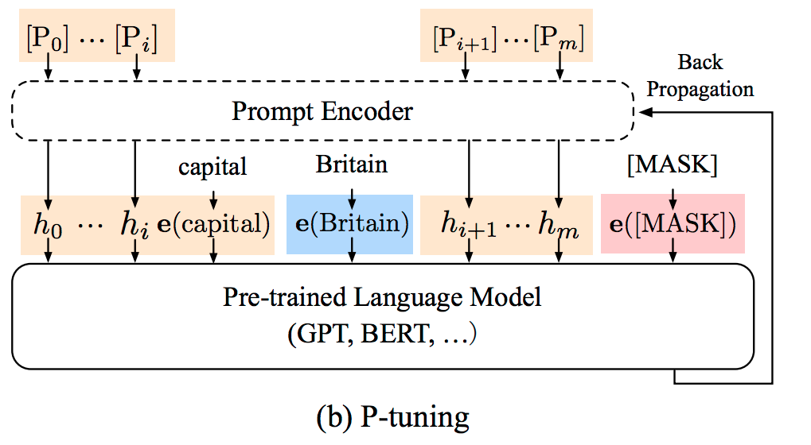

# [P-tuning](https://arxiv.org/pdf/2103.10385.pdf)
P-tuning 引入可学习的 prompt embeddings 参数, 让模型自己去学习最优的 prompt embedding, 而不再依赖人工去设置自然语言形式的 Prompt 信息。



## 代码结构及说明
```
|—— ptuning.py # P-tuning 策略的训练、评估主脚本
|—— dataset.py # P-tuning 策略针对 FewCLUE 9 个数据集的任务转换逻辑，以及明文 -> 训练数据的转换
|—— model.py # P-tuning 的网络结构
|—— evaluate.py # 针对 FewCLUE 9 个数据集的评估函数
|—— predict.py # 针对 FewCLUE 9 个数据集进行预测
```

## 基于 FewCLUE 进行 P-tuning 实验
PaddleNLP 内置了 FewCLUE 数据集，可以直接用来进行 P-tuning 策略训练、评估、预测，并生成 FewCLUE 榜单的提交结果，参与 FewCLUE 竞赛。

###  数据准备
基于 FewCLUE 数据集进行实验只需要  1 行代码，这部分代码在 `ptuning.py` 脚本中

```
from paddlenlp.datasets import load_dataset

# 通过指定 "fewclue" 和数据集名字 name="tnews" 即可一键加载 FewCLUE 中的 tnews 数据集
train_ds, dev_ds, public_test_ds = load_dataset("fewclue", name="tnews", splits=("train_0", "dev_0", "test_public"))
````
### 模型训练&评估
通过如下命令，指定 GPU 0 卡, 使用 1 个 P-embedding 在 FewCLUE 的 `tnews` 数据集上进行训练&评估
```
python -u -m paddle.distributed.launch --gpus "0" \
    ptuning.py \
    --task_name "tnews" \
    --device gpu \
    --p_embedding_num 1 \
    --save_dir "checkpoints" \
    --batch_size 32 \
    --learning_rate 5E-5 \
    --epochs 10 \
    --max_seq_length 512 \
    --rdrop_coef 0 \
```
参数含义说明
- `task_name`: FewCLUE 中的数据集名字
- `p_embedding_num`: P-embedding 的个数
- `device`: 使用 cpu/gpu 进行训练
- `save_dir`: 模型存储路径
- `max_seq_length`: 文本的最大截断长度
- `rdrop_coef`: R-Drop 策略 Loss 的权重系数，默认为 0， 若为 0 则未使用 R-Drop 策略

模型每训练 1 个 epoch, 会在验证集和测试集上进行评估。

### 模型预测
通过如下命令，指定 GPU 0 卡，使用 1 个 P-embedding 在 `FewCLUE` 的 `iflytek` 数据集上进行预测
```
python -u -m paddle.distributed.launch --gpus "0" predict.py \
        --task_name "iflytek" \
        --device gpu \
        --init_from_ckpt "${model_params_file}" \
        --p_embedding_num 1 \
        --output_dir "./output" \
        --batch_size 32 \
        --max_seq_length 512
```

## 基于自定义数据进行 P-tuning 实验

### 准备数据
1.  实现读取函数，以字典形式返回明文数据, eg:
```
# 假设明文数据为 \t 分隔的 2 列数据: text \t label
def read_fn(data_file):
    examples = []
    with open(data_file, 'r', encoding="utf-8") as f:
        for line in f：
            text, label = line.rstrip().split("\t")
            example = {"sentence1": text, "label": label}
            # 如果有 2 列文本，则
            # example = {"sentence1": text1, "sentence2": text2，"label": label}
            examples.append(example)
    return examples
```
2.  在 `./label_normalized/` 目录下创建名为 `my_task.json` 的 Label map 词典，负责对 Label 进行标准化, eg:
```
# 以 label 为 0, 1 的情感分类任务为例
{
    "0": "高兴",
    "1": "伤心"
}
# 以 label 为 "entailment"、"contradiction"、"neutral" 的蕴含分类任务为例
{
    "entailment": "蕴含",
    "contradiction": "矛盾",
    "neutral": "中立"
}
```
**Note: 映射之后的 Label 字符个数必须等长， 便于在预测阶段对 Label 的概率可比**
### 模型训练&评估
通过如下命令，指定 GPU 0 卡, 使用 1 个 P-embedding 在 `my_task` 数据集上进行训练&评估
```
python -u -m paddle.distributed.launch --gpus "0" \
    ptuning.py \
    --task_name "my_task"
    --device gpu \
    --p_embedding_num 1 \
    --save_dir "checkpoints" \
    --batch_size 32 \
    --learning_rate 5E-5 \
    --epochs 10 \
    --max_seq_length 512
```

## References
[1]X. Liu et al., “GPT Understands, Too,” arXiv:2103.10385 [cs], Mar. 2021, Accessed: Mar. 22, 2021. [Online]. Available: http://arxiv.org/abs/2103.10385
