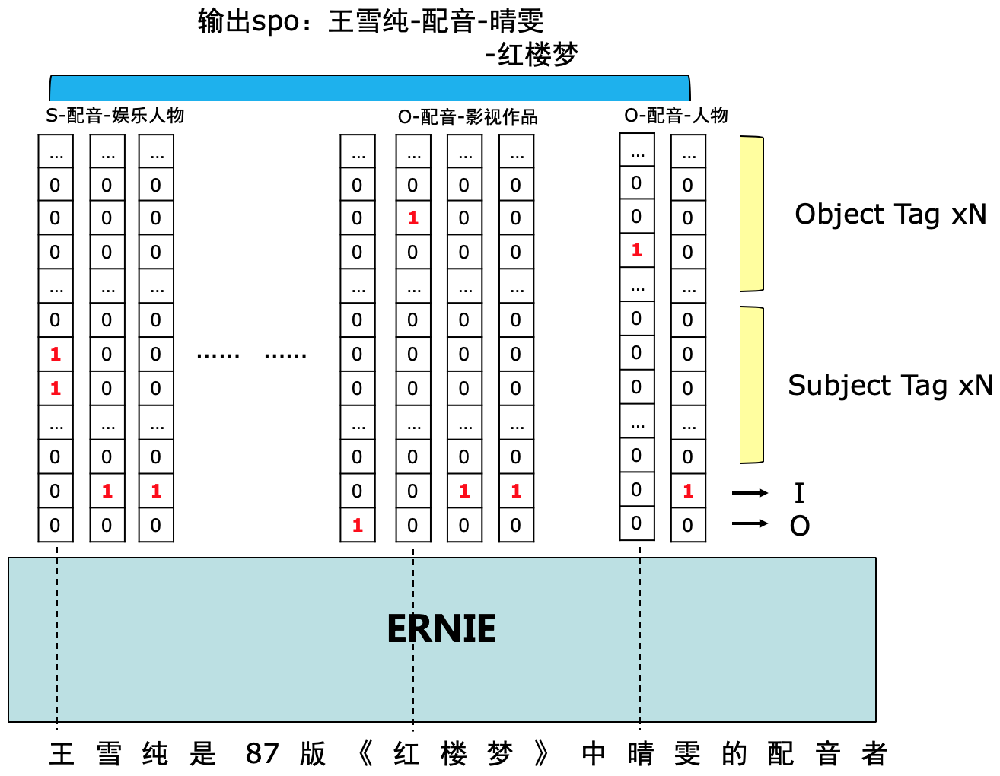

# LIC2021 DuIE 关系抽取基线

信息抽取旨在从非结构化自然语言文本中提取结构化知识，如实体、关系、事件等。关系抽取的目标是对于给定的自然语言句子，根据预先定义的schema集合，抽取出所有满足schema约束的SPO三元组。schema定义了关系P以及其对应的主体S和客体O的类别。
本基线系统基于预训练语言模型ERNIE设计了结构化的标注策略，可以实现多条、交叠的SPO抽取。

该示例展示了如何使用PaddleNLP快速复现[LIC2021关系抽取比赛](http://lic2021.ccf.org.cn/)基线并进阶优化模型基线。

同时，我们提供了该示例在线运行展示教程：
[PaddleNLP实战——LIC2021关系抽取任务基线](https://aistudio.baidu.com/aistudio/projectdetail/1639963)


## 目录结构

以下是本项目主要目录结构及说明：

```text
DuIE/
├── data_loader.py # 加载数据
├── extract_chinese_and_punct.py # 文本数据预处理
├── README.md # 文档说明
├── re_official_evaluation.py # 比赛评价脚本
├── run_duie.py # 模型训练脚本
├── train.sh # 启动脚本
└── utils.py # 效能函数
```

## 关系抽取基线

针对 DuIE2.0 任务中多条、交叠SPO这一抽取目标，比赛对标准的 'BIO' 标注进行了扩展。
对于每个 token，根据其在实体span中的位置（包括B、I、O三种），我们为其打上三类标签，并且根据其所参与构建的predicate种类，将 B 标签进一步区分。给定 schema 集合，对于 N 种不同 predicate，以及头实体/尾实体两种情况，我们设计对应的共 2*N 种 B 标签，再合并 I 和 O 标签，故每个 token 一共有 (2*N+2) 个标签，如下图所示。

<div align="center">

</div>

### 评价方法

对测试集上参评系统输出的SPO结果和人工标注的SPO结果进行精准匹配，采用F1值作为评价指标。注意，对于复杂O值类型的SPO，必须所有槽位都精确匹配才认为该SPO抽取正确。针对部分文本中存在实体别名的问题，使用百度知识图谱的别名词典来辅助评测。F1值的计算方式如下：

F1 = (2 * P * R) / (P + R)，其中

- P = 测试集所有句子中预测正确的SPO个数 / 测试集所有句子中预测出的SPO个数
- R = 测试集所有句子中预测正确的SPO个数 / 测试集所有句子中人工标注的SPO个数

### 快速复现基线Step1：构建模型

该任务可以看作一个序列标注任务，所以基线模型采用的是ERNIE序列标注模型。

**PaddleNLP提供了ERNIE预训练模型常用序列标注模型，可以通过指定模型名字完成一键加载.PaddleNLP为了方便用户处理数据，内置了对于各个预训练模型对应的Tokenizer，可以完成文本token化，转token ID，文本长度截断等操作。**

```python
from paddlenlp.transformers import AutoModelForTokenClassification, AutoTokenizer

model = AutoModelForTokenClassification.from_pretrained("ernie-3.0-medium-zh", num_classes=(len(label_map) - 2) * 2 + 2)
tokenizer = AutoTokenizer.from_pretrained("ernie-3.0-medium-zh")
```

文本数据处理直接调用tokenizer即可输出模型所需输入数据。

```python
inputs = tokenizer(text="请输入测试样例", max_seq_len=20)
# {'input_ids': [1, 647, 789, 109, 558, 525, 314, 656, 2, 0, 0, 0, 0, 0, 0, 0, 0, 0, 0, 0],
# 'token_type_ids': [0, 0, 0, 0, 0, 0, 0, 0, 0, 0, 0, 0, 0, 0, 0, 0, 0, 0, 0, 0],
# 'seq_len': 9}
```

### 快速复现基线Step2：加载并处理


从比赛官网[下载数据集](https://aistudio.baidu.com/aistudio/competition/detail/65)，解压存放于data/目录下并重命名为train_data.json, dev_data.json, test_data.json.

我们可以加载自定义数据集。通过继承[`paddle.io.Dataset`](https://www.paddlepaddle.org.cn/documentation/docs/zh/api/paddle/io/Dataset_cn.html#dataset)，自定义实现`__getitem__` 和 `__len__`两个方法。


如下代码已完成加载数据集操作：

```python
train_dataset = DuIEDataset.from_file(
    os.path.join(args.data_path, 'train_data.json'),
    tokenizer,
    args.max_seq_length,
    True)
test_dataset = DuIEDataset.from_file(
    os.path.join(args.data_path, 'dev_data.json'),
    tokenizer,
    args.max_seq_length,
    True)
```

### 快速复现基线Step3：定义损失函数和优化器，开始训练

在该基线上，我们选择均方误差作为损失函数，使用[`paddle.optimizer.AdamW`](https://www.paddlepaddle.org.cn/documentation/docs/zh/api/paddle/optimizer/adamw/AdamW_cn.html#adamw)作为优化器。


启动训练：
```shell
sh train.sh
```

在训练过程中，模型保存在当前目录checkpoints文件夹下。同时在训练的同时使用官方评测脚本进行评估，输出P/R/F1指标。
在验证集上F1可以达到69.42。


### 快速复现基线Step4：提交预测结果

将训练保存的模型加载后进行预测

```shell
sh predict.sh
```

预测结果会被保存在data/predictions.json，data/predictions.json.zip，其格式与原数据集文件一致。

之后可以使用官方评估脚本评估训练模型在dev_data.json上的效果。如：

```shell
python re_official_evaluation.py --golden_file=dev_data.json  --predict_file=predicitons.json.zip [--alias_file alias_dict]
```
输出指标为Precision, Recall 和 F1，Alias file包含了合法的实体别名，最终评测的时候会使用，这里不予提供。

之后在test_data.json上预测，然后预测结果（.zip文件）至[评测网站](http://aistudio-bce.bcc-bdbl.baidu.com/aistudio/competition/detail/141)。


## 进阶优化基线效果

基线采用的预训练模型为ERNIE，PaddleNLP提供了丰富的预训练模型，如BERT，RoBERTa，Electra，XLNet等
参考[PaddleNLP预训练模型介绍](https://paddlenlp.readthedocs.io/zh/latest/model_zoo/index.html#transformer)

如可以选择RoBERTa large中文模型优化模型效果，只需更换模型和tokenizer即可无缝衔接。

```python
from paddlenlp.transformers import RobertaForTokenClassification, RobertaTokenizer

model = RobertaForTokenClassification.from_pretrained(
    "roberta-wwm-ext-large",
    num_classes=(len(label_map) - 2) * 2 + 2)
tokenizer = RobertaTokenizer.from_pretrained("roberta-wwm-ext-large")
```
## Reference

- [DuIE: A Large-scale Chinese Dataset for Information Extraction](http://tcci.ccf.org.cn/conference/2019/papers/EV10.pdf)
