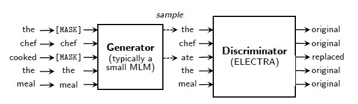

# ELECTRA with PaddleNLP

[ELECTRA](https://openreview.net/pdf?id=r1xMH1BtvB) 在[BERT](https://arxiv.org/abs/1810.04805)的基础上对其预训练过程进行了改进：预训练由两部分模型网络组成，称为Generator和Discriminator，各自包含1个BERT模型。Generator的预训练使用和BERT一样的Masked Language Model(MLM)任务，但Discriminator的预训练使用Replaced Token Detection(RTD)任务（主要改进点）。预训练完成后，使用Discriminator作为精调模型，后续的Fine-tuning不再使用Generator。


图片来源：来自[electra论文](https://openreview.net/pdf?id=r1xMH1BtvB)

根据论文中给出的实验结果，在和BERT具有相同的模型参数、预训练计算量一样的情况下，GLUE得分比BERT明显好，small模型为79.9：75.1，Base模型为85.1：82.2，Large模型为89.0：87.2。

本项目是 ELECTRA 在 Paddle 2.0上的开源实现。

## **环境依赖**

- jieba, 安装方式：`pip install jieba`
- colorlog, 安装方式：`pip install colorlog`
- colorama, 安装方式：`pip install colorama`
- seqeval, 安装方式：`pip install seqeval`

## **数据准备**
### 建议的预训练数据
论文中提到预训练需要两部分数据：Book Corpus数据 和 Wikipedia Corpus数据，均为英文文本，utf-8编码。但是当前BookCorpus数据已不再开源，可以使用其它数据替代，只要是纯英文文本数据，utf-8编码即可。
例如[Gutenberg Dataset](https://web.eecs.umich.edu/~lahiri/gutenberg_dataset.html)
。另外，Wikipedia Corpus数据建议从[官方获取](https://www.english-corpora.org/wiki/)，下面例子假设这些数据都已获取并都放在./BookCorpus/train.data 文件中，每行一句英文文本

### 自定义预训练数据
支持用户自定义数据进行训练，自定义数据为文本形式，每行一句英文文本，utf-8编码，下面例子假设数据在./BookCorpus/train.data

### Fine-tuning数据
Fine-tuning 使用GLUE数据，这部分Paddle已提供，在执行第4章 Fine-tuning 命令时会自动下载并加载

### 推理数据
可以使用GLUE test数据集（Paddle已提供，在Fine-tuning时会自动下载），或者也可以自定义，格式要求和2.2 自定义预训练数据一样，每行一句英文文本，utf-8编码

## **模型预训练**

**特别注意**：预训练模型如果想要达到较好的效果，需要训练几乎全量的Book Corpus数据 和 Wikipedia Corpus数据，原始文本接近20G，建议用GPU进行预训练，最好4片GPU以上。如果资源较少，Paddle提供已经预训练好的模型进行Fine-tuning，可以直接跳转到下面：运行Fine-tuning-使用Paddle提供的预训练模型运行 Fine-tuning

### 单机单卡
```shell
export CUDA_VISIBLE_DEVICES="0"
export DATA_DIR=./BookCorpus/

python -u ./run_pretrain.py \
    --model_type electra \
    --model_name_or_path electra-small \
    --input_dir $DATA_DIR \
    --output_dir ./pretrain_model/ \
    --train_batch_size 64 \
    --learning_rate 5e-4 \
    --max_seq_length 128 \
    --weight_decay 1e-2 \
    --adam_epsilon 1e-6 \
    --warmup_steps 10000 \
    --num_train_epochs 4 \
    --logging_steps 100 \
    --save_steps 10000 \
    --max_steps -1
```
其中参数释义如下：
- `model_type` 表示模型类型，默认为ELECTRA模型。
- `model_name_or_path` 如果配置1个名字，则表示预训练模型的规模，当前支持的名字为：electra-small（约1400万参数）、electra-base（约1.1亿参数）、electra-large（约3.35亿参数）。如果配置1个路径，则表示按照路径中的模型规模进行训练，这时需配置 --init_from_ckpt 参数一起使用，一般用于断点恢复训练场景。
- `input_dir` 表示输入数据的目录，该目录下需要有1个train.data纯英文文本文件，utf-8编码。
- `output_dir` 表示将要保存预训练模型的目录。
- `train_batch_size` 表示 每次迭代**每张卡**上的样本数目。此例子train_batch_size=64 运行时大致需要单卡12G显存，如果实际GPU显存小于12G或大大多于12G，可适当调小/调大此配置。
- `learning_rate` 表示基础学习率大小，将于learning rate scheduler产生的值相乘作为当前学习率。
- `max_seq_length` 表示最大句子长度，超过该长度将被截断。
- `weight_decay` 表示每次迭代中参数缩小的比例，该值乘以学习率为真正缩小的比例。
- `adam_epsilon` 表示adam优化器中的epsilon值。
- `warmup_steps` 表示学习率逐渐升高到基础学习率（即上面配置的learning_rate）所需要的迭代数，最早的使用可以参考[这篇论文](https://arxiv.org/pdf/1706.02677.pdf)。
- `num_train_epochs` 表示训练轮数。
- `logging_steps` 表示日志打印间隔。
- `save_steps` 表示模型保存间隔。
- `max_steps` 如果配置且大于0，表示预训练最多执行的迭代数量；如果不配置或配置小于0，则根据输入数据量、train_batch_size和num_train_epochs来确定预训练迭代数量

另外还有一些额外参数不在如上命令中：
- `use_amp` 表示是否开启混合精度(float16)进行训练，默认不开启。如果在命令中加上了--use_amp，则会开启。
- `init_from_ckpt` 表示是否从某个checkpoint继续训练（断点恢复训练），默认不开启。如果在命令中加上了--init_from_ckpt，且 --model_name_or_path 配置的是路径，则会开启从某个checkpoint继续训练。例如下面的命令从第40000步的checkpoint继续训练：
```shell
export CUDA_VISIBLE_DEVICES="0"
export DATA_DIR=./BookCorpus/

python -u ./run_pretrain.py \
    --model_type electra \
    --model_name_or_path ./pretrain_model/model_40000.pdparams/ \
    --input_dir $DATA_DIR \
    --output_dir ./pretrain_model/ \
    --train_batch_size 64 \
    --learning_rate 5e-4 \
    --max_seq_length 128 \
    --weight_decay 1e-2 \
    --adam_epsilon 1e-6 \
    --warmup_steps 10000 \
    --num_train_epochs 4 \
    --logging_steps 100 \
    --save_steps 10000 \
    --max_steps -1 \
    --init_from_ckpt
```

训练过程将按照 `logging_steps`的设置打印如下日志：

```
global step 100/322448, epoch: 0, loss: 46.2487393681735099, lr: 0.000100000000, speed: 0.6439 step/s
global step 200/322448, epoch: 0, loss: 45.2436411214760099, lr: 0.000200000000, speed: 0.6041 step/s
global step 300/322448, epoch: 0, loss: 43.2906827821215998, lr: 0.000300000000, speed: 0.5991 step/s
```

### 单机多卡
```shell
export CUDA_VISIBLE_DEVICES="0,1,2,3"
export DATA_DIR=./BookCorpus/

python -u ./run_pretrain.py \
    --model_type electra \
    --model_name_or_path electra-small \
    --input_dir $DATA_DIR \
    --output_dir ./pretrain_model/ \
    --train_batch_size 64 \
    --learning_rate 5e-4 \
    --max_seq_length 128 \
    --weight_decay 1e-2 \
    --adam_epsilon 1e-6 \
    --warmup_steps 10000 \
    --num_train_epochs 4 \
    --logging_steps 100 \
    --save_steps 10000 \
    --max_steps -1 \
    --n_gpu 4
```
其中绝大部分和单机单卡一样，这里描述不一样的参数：
- 环境变量CUDA_VISIBLE_DEVICES可配置多个GPU-id，配置后预训练程序只能使用配置中的GPU，不会使用未配置的GPU
- 参数`n_gpu` 表示使用的 GPU 卡数。若希望使用多卡训练，将其设置为指定数目即可，最大数量不能超过环境变量CUDA_VISIBLE_DEVICES配置的GPU个数；若配置为0，则使用CPU。

## **Fine-tuning**
### 从预训练模型得到Fine-tuning所需模型
由第一段简介得知，Electra Fine-tuning时只需要Discriminator部分，所以通过如下命令从预训练模型中提取出Discriminator，得到Fine-tuning所需模型
```shell
python -u ./get_ft_model.py \
    --model_dir ./pretrain_model/model_40000.pdparams/
```
其中参数释义如下：
- `model_dir` 表示预训练模型所在目录，这里例子取预训练40000步的checkpoint来生成Fine-tuning所需模型，生成的用于Fine-tuning的模型也会在这个目录下。

此命令可多次执行，但只有第1次会生成Fine-tuning所需模型

**特别注意**：如果使用windows系统执行此命令，需使用**管理员**权限运行，否则会出错。Linux无此限制

### 运行Fine-tuning
使用./run_glue.py运行，有两种方式：
#### **使用Paddle提供的预训练模型运行 Fine-tuning**
此方式无需在本地进行预训练，即可以跳过上面 模型预训练 和 从预训练模型得到Fine-tuning所需模型 的介绍，直接运行Fine-tuning。

以 GLUE/SST-2 任务为例，启动 Fine-tuning 的方式如下：
```shell
export CUDA_VISIBLE_DEVICES=0,1
export TASK_NAME=SST-2

python -u ./run_glue.py \
    --model_type electra \
    --model_name_or_path electra-small \
    --task_name $TASK_NAME \
    --max_seq_length 128 \
    --batch_size 32   \
    --learning_rate 1e-4 \
    --num_train_epochs 3 \
    --logging_steps 100 \
    --save_steps 100 \
    --output_dir ./$TASK_NAME/ \
    --n_gpu 1
```
其中参数释义如下：
- `model_type` 指示了模型类型，当前支持BERT、ELECTRA、ERNIE模型。
- `model_name_or_path` 如果配置模型名（electra模型当前支持electra-small、electra-base、electra-large几种规格）则为本节介绍的方式。如果配置本地目录（例如执行get_ft_model.py 命令得到Fine-tuning所需模型，配置其所在的目录 pretrain_model/model_40000.pdparams/）则为下一节中介绍的方式。
- `task_name` 表示 Fine-tuning 的任务，当前支持CoLA、SST-2、MRPC、STS-B、QQP、MNLI、QNLI、RTE。
- `max_seq_length` 表示最大句子长度，超过该长度将被截断。
- `batch_size` 表示每次迭代**每张卡**上的样本数目。
- `learning_rate` 表示基础学习率大小，将于learning rate scheduler产生的值相乘作为当前学习率。
- `num_train_epochs` 表示训练轮数。
- `logging_steps` 表示日志打印间隔。
- `save_steps` 表示模型保存及评估间隔。
- `output_dir` 表示模型保存路径。
- `n_gpu` 表示使用的 GPU 卡数。若希望使用多卡训练，将其设置为指定数目即可,最大数量不能超过环境变量CUDA_VISIBLE_DEVICES配置的GPU个数；若为0，则使用CPU。

#### **使用本地预训练模型运行 Fine-tuning**
按照上面模型预训练的介绍，在本地运行 ELECTRA 模型的预训练后，执行get_ft_model.py命令得到Fine-tuning所需模型，然后运行 Fine-tuning。

以 GLUE/SST-2 任务为例，启动 Fine-tuning 的方式如下：
```shell
export CUDA_VISIBLE_DEVICES=0,1
export TASK_NAME=SST-2

python -u ./run_glue.py \
    --model_type electra \
    --model_name_or_path ./pretrain_model/model_40000.pdparams/ \
    --task_name $TASK_NAME \
    --max_seq_length 128 \
    --batch_size 32   \
    --learning_rate 1e-4 \
    --num_train_epochs 3 \
    --logging_steps 100 \
    --save_steps 100 \
    --output_dir ./$TASK_NAME/ \
    --n_gpu 1
```
其中绝大部分参数和上节中一样，只有参数model_name_or_path配置了本地预训练模型的路径

无论使用哪种方式进行 Fine-tuning，过程将按照 `logging_steps` 和 `save_steps` 的设置打印如下格式的日志：

```
global step 100/6315, epoch: 0, batch: 99, rank_id: 0, loss: 0.687738, lr: 0.0000158479, speed: 3.3566 step/s
eval loss: 0.693736, acc: 0.5137614678899083, eval done total : 2.0170159339904785 s
global step 200/6315, epoch: 0, batch: 199, rank_id: 0, loss: 0.342201, lr: 0.0000316957, speed: 3.1531 step/s
eval loss: 0.715023, acc: 0.8256880733944955, eval done total : 1.9682419300079346 s
global step 300/6315, epoch: 0, batch: 299, rank_id: 0, loss: 0.516034, lr: 0.0000475436, speed: 3.1663 step/s
eval loss: 0.653879, acc: 0.8658256880733946, eval done total : 1.9738705158233643 s
global step 400/6315, epoch: 0, batch: 399, rank_id: 0, loss: 0.228789, lr: 0.0000633914, speed: 3.1512 step/s
eval loss: 0.863306, acc: 0.8600917431192661, eval done total : 1.960683822631836 s
global step 500/6315, epoch: 0, batch: 499, rank_id: 0, loss: 0.320570, lr: 0.0000792393, speed: 3.1495 step/s
eval loss: 0.732358, acc: 0.8704128440366973, eval done total : 1.9749321937561035 s
```

使用electra-small预训练模型进行单卡 Fine-tuning ，在验证集上有如下结果（这里各类任务的结果是运行3次取最好得到）：

| Task  | Metric                       | Result      |
|-------|------------------------------|-------------|
| CoLA  | Matthews corr                | 58.22       |
| SST-2 | acc.                         | 91.85       |
| MRPC  | acc./F1                      | 88.24       |
| STS-B | Pearson/Spearman corr        | 87.24       |
| QQP   | acc./F1                      | 88.83       |
| MNLI  | matched acc./mismatched acc. | 82.45       |
| QNLI  | acc.                         | 88.61       |
| RTE   | acc.                         | 66.78       |

注：acc.是Accuracy的简称，表中Metric字段名词取自[GLUE论文](https://openreview.net/pdf?id=rJ4km2R5t7)

## **推理部署**
运行某个GLUE任务后（还是继续以GLUE/SST-2 情感分类任务为例），想要将Fine-tuning模型导出以加速类似场景更多数据的推理，可以按照如下步骤完成推理部署

### 导出推理模型
```shell
python -u ./export_model.py \
    --input_model_dir ./SST-2/sst-2_ft_model_6000.pdparams/ \
    --output_model_dir ./ \
    --model_name electra-deploy
```
其中参数释义如下：
- `input_model_dir` 表示输入的预训练模型所在目录，这里例子取SST-2 Fine-tuning 6000步的checkpoint来导出推理模型。
- `output_model_dir` 表示将要保存推理模型的目录，这里例子取当前路径。
- `model_name` 表示输出推理模型的名字前缀，任意字符串均可，默认为electra-deploy。

例如，执行如上命令后，可以看到在output_model_dir配置的目录下，导出的推理模型包括3个文件：
| 文件                          | 说明                                   |
|-------------------------------|----------------------------------------|
| electra-deploy.pdiparams      | 模型权重文件，供推理时加载使用            |
| electra-deploy.pdiparams.info | 模型权重信息文件                         |
| electra-deploy.pdmodel        | 模型结构文件，供推理时加载使用            |

### **使用Paddle Inference API进行推理**
有如下两种方法

#### 从命令行读取输入数据进行推理
```shell
python -u ./deploy/python/predict.py \
    --model_file ./electra-deploy.pdmodel \
    --params_file ./electra-deploy.pdiparams \
    --predict_sentences "uneasy mishmash of styles and genres ." "director rob marshall went out gunning to make a great one ." \
    --batch_size 2 \
    --max_seq_length 128 \
    --model_name electra-small
```
其中参数释义如下：
- `model_file` 表示推理需要加载的模型结构文件。例如上节中生成的electra-deploy.pdmodel。
- `params_file` 表示推理需要加载的模型权重文件。例如上节中生成的electra-deploy.pdiparams。
- `predict_sentences` 表示用于推理的（句子）数据，可以配置1条或多条。如果此项配置，则predict_file不用配置。
- `batch_size` 表示每次推理的样本数目。
- `max_seq_length` 表示输入的最大句子长度，超过该长度将被截断。
- `model_name` 表示推理模型的类型，当前支持electra-small（约1400万参数）、electra-base（约1.1亿参数）、electra-large（约3.35亿参数）。

另外还有一些额外参数不在如上命令中：
- `use_gpu` 表示是否使用GPU进行推理，默认不开启。如果在命令中加上了--use_gpu，则使用GPU进行推理。
- `use_trt` 表示是否使用TensorRT进行推理，默认不开启。如果在命令中加上了--use_trt，且配置了--use_gpu，则使用TensorRT进行推理。前提条件：1）需提前安装TensorRT或使用[Paddle提供的TensorRT docker镜像](https://github.com/PaddlePaddle/Serving/blob/v0.5.0/doc/DOCKER_IMAGES_CN.md)。2）需根据cuda、cudnn、tensorRT和python的版本，安装[匹配版本的Paddle包](https://www.paddlepaddle.org.cn/documentation/docs/zh/install/Tables.html)

#### 从文件读取输入数据进行推理
```shell
python -u ./deploy/python/predict.py \
    --model_file ./electra-deploy.pdmodel \
    --params_file ./electra-deploy.pdiparams \
    --predict_file "./sst-2.test.tsv.1" "./sst-2.test.tsv.2" \
    --batch_size 2 \
    --max_seq_length 128 \
    --model_name electra-small
```
其中绝大部分和从命令行读取输入数据一样，这里描述不一样的参数：
- `predict_file` 表示用于推理的文件数据，可以配置1个或多个文件，每个文件和预训练数据格式一样，为utf-8编码的文本数据，每行1句文本。如果此项配置，则predict_sentences不用配置。

模型对每1句话分别推理出1个结果，例如下面为使用第一种方法中的命令得到的SST-2情感分类推理结果，0表示句子是负向情感，1表示句子为正向情感。因为batch_size=2，所以只有1个batch：
```shell
===== batch 0 =====
Input sentence is : [CLS] uneasy mishmash of styles and genres . [SEP]
Output data is : 0
Input sentence is : [CLS] director rob marshall went out gunning to make a great one . [SEP]
Output data is : 1
inference total 1 sentences done, total time : 0.0849156379699707 s
```
此推理结果表示：第1句话是负向情感，第2句话是正向情感。

### **使用Paddle Serving API进行推理**
上面介绍的Paddle Inference为使用本地模型推理，Paddle Serving 可以实现在服务器端部署推理模型，客户端远程通过RPC/HTTP方式发送数据进行推理，实现模型推理的服务化，下面以RPC方式为例进行说明。

#### 在服务器端和客户端启动Serving的docker容器
建议在docker容器中运行服务器端和客户端以避免一些系统依赖库问题，启动docker镜像的命令参考：[Serving readme](https://github.com/PaddlePaddle/Serving/tree/v0.5.0)

#### 在服务器端安装相关模块
```shell
pip install paddle-serving-app paddle-serving-client paddle-serving-server
```
如果服务器端可以使用GPU进行推理，则安装server的gpu版本，安装时要注意参考服务器当前CUDA、TensorRT的版本来安装对应的版本：[Serving readme](https://github.com/PaddlePaddle/Serving/tree/v0.5.0)
```shell
pip install paddle-serving-app paddle-serving-client paddle-serving-server-gpu
```

#### 在客户端安装相关模块
```shell
pip install paddle-serving-app paddle-serving-client
```

#### 从Inference模型生成Serving的模型和配置
以上一节中Inference使用的推理模型 electra-deploy.pdmodel/electra-deploy.pdiparams 为例：
```shell
python -u ./deploy/serving/covert_inference_model_to_serving.py \
    --inference_model_dir ./ \
    --inference_model_name electra-deploy
```
其中参数释义如下：
- `inference_model_dir` 表示Inference推理模型所在目录，这里假设为当前目录。
- `inference_model_name` 表示Inference推理模型的前缀名。如上节中从Fine-tuning模型导出的推理模型，其前缀名为 electra-deploy。

执行命令后，会在当前目录下生成2个目录：serving_server 和 serving_client。serving_server目录包含服务器端所需的模型和配置，需将其cp到服务器端容器中；serving_client目录包含客户端所需的配置，需将其cp到客户端容器中

#### 启动server
在服务器端容器中，使用上一步得到的serving_server目录启动server
```shell
python -m paddle_serving_server_gpu.serve \
    --model ./serving_server \
    --port 8383
```
其中参数释义如下：
- `model` 表示server加载的模型和配置所在目录。
- `port` 表示server开启的服务端口8383。

如果服务器端可以使用GPU进行推理计算，则启动服务器时可以配置server使用的GPU id
```shell
python -m paddle_serving_server_gpu.serve \
    --model ./serving_server \
    --port 8383 \
    --gpu_id 0
```
- `gpu_id` 表示server使用0号GPU。

#### 启动client进行推理
在客户端容器中，使用前面得到的serving_client目录启动client发起RPC推理请求。和使用Paddle Inference API进行推理一样，有如下两种方法:
##### 从命令行读取输入数据发起推理请求
```shell
python -u ./deploy/serving/client.py \
    --client_config_file ./serving_client/serving_client_conf.prototxt \
    --server_ip_port 127.0.0.1:8383 \
    --predict_sentences "uneasy mishmash of styles and genres ." "director rob marshall went out gunning to make a great one ." \
    --batch_size 2 \
    --max_seq_length 128 \
    --model_name electra-small
```
其中参数释义如下：
- `client_config_file` 表示客户需要加载的配置文件。
- `server_ip_port` 表示服务器端的ip和port。默认为127.0.0.1:8383。
- `predict_sentences` 表示用于推理的（句子）数据，可以配置1条或多条。如果此项配置，则predict_file不用配置。
- `batch_size` 表示每次推理的样本数目。
- `max_seq_length` 表示输入的最大句子长度，超过该长度将被截断。
- `model_name` 表示推理模型的类型，当前支持electra-small（约1400万参数）、electra-base（约1.1亿参数）、electra-large（约3.35亿参数）。

##### 从文件读取输入数据发起推理请求
```shell
python -u ./eploy/serving/client.py \
    --client_config_file ./serving_client/serving_client_conf.prototxt \
    --server_ip_port 127.0.0.1:8383 \
    --predict_file "./sst-2.test.tsv.1" "./sst-2.test.tsv.2" \
    --batch_size 2 \
    --max_seq_length 128 \
    --model_name electra-small
```
其中绝大部分和从命令行读取输入数据一样，这里描述不一样的参数：
- `predict_file` 表示用于推理的文件数据，可以配置1个或多个文件，每个文件和预训练数据格式一样，为utf-8编码的文本数据，每行1句文本。如果此项配置，则predict_sentences不用配置。

使用Paddle Serving API进行推理的结果和使用Inference API的结果是一样的：
```shell
===== batch 0 =====
Input sentence is : [CLS] uneasy mishmash of styles and genres . [SEP]
Output data is : 0
Input sentence is : [CLS] director rob marshall went out gunning to make a great one . [SEP]
Output data is : 1
inference total 2 sentences done, total time : 4.729415416717529 s
```
此推理结果表示：第1句话是负向情感，第2句话是正向情感。

### **使用Paddle Lite API进行推理**
上面介绍的Paddle Inference和Serving主要在服务器上进行推理，而在移动设备（手机、平板等）上需要使用Paddle Lite进行推理。[Paddle Lite](https://github.com/PaddlePaddle/Paddle-Lite)是飞桨轻量化推理引擎，为手机、IOT端提供高效推理能力，并广泛整合跨平台硬件，为端侧部署及应用落地问题提供轻量化的部署方案。下面以Android手机(Armv7或Armv8)为例，使用Paddle Lite进行ELECTRA模型的推理。

#### 准备环境
- 电脑。用于保存代码和数据；编译Paddle Lite（看需要）
- 手机。Android手机(Armv7或Armv8)，手机要能直接连接电脑，或者手机直连某个设备，其能连接到电脑。

如果在其它特殊硬件上或想要自己编译Paddle Lite预测库和优化工具，则电脑上还需准备：
- 交叉编译环境。不同开发环境的编译流程请参考对应文档。
   - [Docker](https://paddle-lite.readthedocs.io/zh/latest/source_compile/compile_env.html#docker)
   - [Linux](https://paddle-lite.readthedocs.io/zh/latest/source_compile/compile_env.html#linux)
   - [MAC OS](https://paddle-lite.readthedocs.io/zh/latest/source_compile/compile_env.html#mac-os)

#### 准备Paddle Lite预测库
有两种方法：
- 直接下载。[官方预测库下载地址](https://paddle-lite.readthedocs.io/zh/latest/quick_start/release_lib.html)，注意选择和手机arm系统版本匹配的，并带with_extra=ON的下载链接。
- 编译Paddle-Lite得到预测库。**需要先准备好交叉编译环境**，然后依次执行如下命令，例如编译在 armv8 硬件上运行的预测库并打开extra op：
```shell
git clone https://github.com/PaddlePaddle/Paddle-Lite.git
cd Paddle-Lite
git checkout develop
./lite/tools/build_android.sh --arch=armv8 --with_extra=ON
```
直接下载预测库并解压后，可以得到`inference_lite_lib.android.armv8/`文件夹，通过编译Paddle-Lite得到的预测库位于`Paddle-Lite/build.lite.android.armv8.gcc/inference_lite_lib.android.armv8/`文件夹。无论使用哪种方法，得到的预测库的文件目录结构都如下，为了方便统一说明，预测库位于${Paddle-Lite-root}/inference_lite_lib.android.armv8/目录中：
```
${Paddle-Lite-root}/inference_lite_lib.android.armv8/
|-- cxx                                        C++ 预测库和头文件
|   |-- include                                C++ 头文件
|   |   |-- paddle_api.h
|   |   |-- paddle_image_preprocess.h
|   |   |-- paddle_lite_factory_helper.h
|   |   |-- paddle_place.h
|   |   |-- paddle_use_kernels.h
|   |   |-- paddle_use_ops.h
|   |   `-- paddle_use_passes.h
|   `-- lib                                           C++预测库
|       |-- libpaddle_api_light_bundled.a             C++静态库
|       `-- libpaddle_light_api_shared.so             C++动态库
|-- java                                     Java预测库
|   |-- jar
|   |   `-- PaddlePredictor.jar
|   |-- so
|   |   `-- libpaddle_lite_jni.so
|   `-- src
|-- demo                                     C++和Java示例代码
|   |-- cxx                                  C++  预测库demo
|   `-- java                                 Java 预测库demo
```

#### 准备Paddle Lite模型优化工具
因为移动设备上对模型的要求很严格，所以需要使用Paddle Lite模型优化工具将Inference模型优化后才能将模型部署到移动设备上进行推理，准备Paddle Lite模型优化工具也有两种方法：
- 直接下载。
```shell
pip install paddlelite。
```
- 编译Paddle-Lite得到模型优化工具。**需要先准备好交叉编译环境**，然后依次执行如下命令：
```shell
# 如果准备环境时已经clone了Paddle-Lite，则不用重新clone Paddle-Lite
git clone https://github.com/PaddlePaddle/Paddle-Lite.git
cd Paddle-Lite
git checkout develop
# 启动编译
./lite/tools/build.sh build_optimize_tool
```
如果是直接下载，工具可执行文件为`paddle_lite_opt`，并放在系统环境变量PATH中，所以无需进入到工具所在目录就可以直接执行；如果是编译得到，则工具可执行文件为`Paddle-Lite/build.opt/lite/api/opt`，为了后面统一说明，可将工具统一命名为`paddle_lite_opt`，并将其所处目录添加到系统环境变量PATH中，通过如下方式查看其运行选项和使用方式；
```shell
cd build.opt/lite/api/ && mv opt paddle_lite_opt
./paddle_lite_opt
```

#### 使用Paddle Lite模型优化工具转换Inference模型
以上面Inference使用的推理模型 electra-deploy.pdmodel/electra-deploy.pdiparams 为例，执行：
```shell
paddle_lite_opt \
    --model_file ./electra-deploy.pdmodel \
    --param_file ./electra-deploy.pdiparams \
    --optimize_out ./electra-deploy-lite \
    --optimize_out_type protobuf \
    --valid_targets arm \
    --record_tailoring_info false
```
其中参数释义如下：
- `model_file` 表示需要优化的模型结构文件。例如上面Inference生成的electra-deploy.pdmodel。
- `params_file` 表示需要优化的模型权重文件。例如上面Inference生成的electra-deploy.pdiparams。
- `optimize_out` 表示输出的Lite模型**名字前缀**。例如配置./electra-deploy-lite，最终得到的Lite模型为./electra-deploy-lite.nb。
- `optimize_out_type` 表示输出模型类型，目前支持两种类型：protobuf和naive_buffer，其中naive_buffer是一种更轻量级的序列化/反序列化实现。若您需要在mobile端执行模型预测，请将此选项设置为naive_buffer。默认为protobuf。
- `valid_targets` 表示模型将要运行的硬件类型，默认为arm。目前可支持x86、arm、opencl、npu、xpu，可以同时指定多个backend(以空格分隔)，Model Optimize Tool将会自动选择最佳方式。如果需要支持华为NPU（Kirin 810/990 Soc搭载的达芬奇架构NPU），应当设置为npu, arm。
- `record_tailoring_info` 表示是否使用 根据模型裁剪库文件 功能，如使用则设置该选项为true，以记录优化后模型含有的kernel和OP信息，默认为false。

如上命令执行后，得到Lite模型为./electra-deploy-lite.nb

#### 预处理输入数据，并和Lite预测库、Lite模型、编译好的C++代码/配置 一起打包。
```shell
python -u ./deploy/lite/prepare.py \
    --lite_lib_path ${Paddle-Lite-root}/inference_lite_lib.android.armv8/ \
    --lite_model_file ./electra-deploy-lite.nb \
    --predict_file ./test.txt \
    --max_seq_length 128 \
    --model_name electra-small

# 进入lite demo的工作目录
cd ${Paddle-Lite-root}/inference_lite_lib.android.armv8/demo/cxx/electra/
make -j && mv electra_lite debug
```
其中prepare.py的参数释义如下：
- `lite_lib_path` 表示预测库所在目录。
- `lite_model_file` 表示Lite模型路径。
- `predict_file` 表示用于推理的文件数据，可以配置1个或多个文件，每个文件和预训练数据格式一样，为utf-8编码的文本数据，每行1句文本。
- `max_seq_length` 表示输入的最大句子长度，超过该长度将被截断。
- `model_name` 表示推理模型的类型，当前支持electra-small（约1400万参数）、electra-base（约1.1亿参数）、electra-large（约3.35亿参数）。

如上命令执行完后，${Paddle-Lite-root}/inference_lite_lib.android.armv8/demo/cxx/electra/文件夹下将有如下文件，只有其中的**debug目录**会传到手机：
```
demo/cxx/electra/
|-- debug/
|   |--config.txt                       推理配置和超参数配置
|   |--electra-deploy-lite.nb           优化后的Lite模型文件
|   |--electra_lite                     编译好的在手机上执行推理的可执行文件
|   |--libpaddle_light_api_shared.so    C++预测库文件
|   |--predict_input.bin                预处理好的输入数据（二进制）
|   |--predict_input.txt                输入数据明文
|   |--sst2_label.txt                   类别说明文件
|-- config.txt                              推理配置和超参数配置
|-- Makefile                                编译文件
|-- sentiment_classfication.cpp                推理代码文件
```

#### 与目标设备连接执行推理
如果电脑和Android手机直接连接，则在电脑上安装[ADB工具](https://developer.android.com/studio/command-line/adb)，通过ADB工具来连接和操作Android设备：
```shell
# 检查是否连接上设备
adb devices
# 将debug目录推送到设备的/data/local/tmp/electra/目录下，需事先在设备上创建
adb push debug /data/local/tmp/electra/
# 登录设备并打开设备上的shell
adb shell
# 准备相关环境。进入程序目录，配置好动态链接库的环境变量并给程序添加执行权限
cd /data/local/tmp/electra/debug && export LD_LIBRARY_PATH=$LD_LIBRARY_PATH:/data/local/tmp/electra/debug/ && chmod +x electra_lite
# 输入数据，运行Lite推理
./electra_lite ./config.txt
```
如果电脑和Android手机没有直接连接，Android手机直连某个设备，则需将debug目录cp到那个设备上，并在那个设备上安装ADB工具以执行如上代码。

执行如上推理命令后得到如下结果，同样数据在Paddle Lite推理的结果应该和使用Inference/Serving的结果是一样的
```shell
=== electra predict result: ./predict_input.txt===
sentence: [CLS] uneasy mishmash of styles and genres . [SEP], class_id: 0(negative), logits: 2.22824
sentence: [CLS] director rob marshall went out gunning to make a great one . [SEP], class_id: 1(positive), logits: 0.241332
total time : 0.399562 s.
```

如果修改了代码，则需要先执行prepare.py，再重新编译并打包push到手机上；如果只修改输入数据，则只需要执行prepare.py并打包push到手机上，不用重新编译。

## Reference
[ELECTRA论文](https://openreview.net/pdf?id=r1xMH1BtvB)
