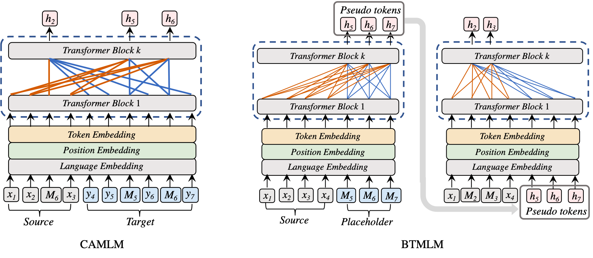

# ERNIE-M

* [模型简介](#模型简介)
* [快速开始](#快速开始)
  * [通用参数释义](#通用参数释义)
  * [自然语言推断任务](#自然语言推断任务)
* [参考论文](#参考论文)

## 模型简介

[ERNIE-M](https://arxiv.org/abs/2012.15674) 是百度提出的一种多语言语言模型。原文提出了一种新的训练方法，让模型能够将多种语言的表示与单语语料库对齐，以克服平行语料库大小对模型性能的限制。原文的主要想法是将回译机制整合到预训练的流程中，在单语语料库上生成伪平行句对，以便学习不同语言之间的语义对齐，从而增强跨语言模型的语义建模。实验结果表明，ERNIE-M 优于现有的跨语言模型，并在各种跨语言下游任务中提供了最新的 SOTA 结果。
原文提出两种方法建模各种语言间的对齐关系:

- **Cross-Attention Masked Language Modeling(CAMLM)**: 该算法在少量双语语料上捕捉语言间的对齐信息。其需要在不利用源句子上下文的情况下，通过目标句子还原被掩盖的词语，使模型初步建模了语言间的对齐关系。
- **Back-Translation masked language modeling(BTMLM)**: 该方法基于回译机制从单语语料中学习语言间的对齐关系。通过CAMLM 生成伪平行语料，然后让模型学习生成的伪平行句子，使模型可以利用单语语料更好地建模语义对齐关系。




本项目是 ERNIE-M 的 PaddlePaddle 动态图实现， 包含模型训练，模型验证等内容。以下是本例的简要目录结构及说明：

```text
.
├── README.md                   # 文档
├── run_classifier.py           # 自然语言推断任务
```

## 快速开始

### 通用参数释义

- `task_type` 表示了自然语言推断任务的类型，目前支持的类型为："cross-lingual-transfer", "translate-train-all"
  ，分别表示在英文数据集上训练并在所有15种语言数据集上测试、在所有15种语言数据集上训练和测试。
- `model_name_or_path` 指示了 Fine-tuning 使用的具体预训练模型以及预训练时使用的tokenizer，目前支持的预训练模型有："ernie-m-base"， "ernie-m-large"
  。若模型相关内容保存在本地，这里也可以提供相应目录地址，例如："./checkpoint/model_xx/"。
- `output_dir` 表示模型保存路径。
- `max_seq_length` 表示最大句子长度，超过该长度将被截断，不足该长度的将会进行 padding。
- `memory_length` 表示当前的句子被截取作为下一个样本的特征的长度。
- `learning_rate` 表示基础学习率大小，将于 learning rate scheduler 产生的值相乘作为当前学习率。
- `num_train_epochs` 表示训练轮数。
- `logging_steps` 表示日志打印间隔步数。
- `save_steps` 表示模型保存及评估间隔步数。
- `batch_size` 表示每次迭代**每张**卡上的样本数目。
- `weight_decay` 表示AdamW的权重衰减系数。
- `layerwise_decay` 表示 AdamW with Layerwise decay 的逐层衰减系数。
- `adam_epsilon` 表示AdamW优化器的 epsilon。
- `warmup_proportion` 表示学习率warmup系数。
- `max_steps` 表示最大训练步数。若训练`num_train_epochs`轮包含的训练步数大于该值，则达到`max_steps`后就提前结束。
- `seed` 表示随机数种子。
- `device` 表示训练使用的设备, 'gpu'表示使用 GPU, 'xpu'表示使用百度昆仑卡, 'cpu'表示使用 CPU。
- `use_amp` 表示是否启用自动混合精度训练。
- `scale_loss` 表示自动混合精度训练的参数。

### 自然语言推断任务

#### 数据集介绍
XNLI 是 MNLI 的子集，并且已被翻译成14种不同的语言（包含一些较低资源语言）。与 MNLI 一样，目标是预测文本蕴含（句子 A 是否暗示/矛盾/都不是句子 B ）。

#### 单卡训练

```shell
python run_classifier.py \
    --task_type cross-lingual-transfer \
    --batch_size 16 \
    --model_name_or_path ernie-m-base \
    --save_steps 12272 \
    --output_dir output
```

#### 多卡训练

```shell
python -m paddle.distributed.launch --gpus 0,1 --log_dir output run_classifier.py \
    --task_type cross-lingual-transfer \
    --batch_size 16 \
    --model_name_or_path ernie-m-base \
    --save_steps 12272 \
    --output_dir output
```

在XNLI数据集上微调 cross-lingual-transfer 类型的自然语言推断任务后，在测试集上有如下结果
| Model | en | fr | es | de | el | bg | ru | tr | ar | vi | th | zh | hi | sw | ur | Avg |
| --- | --- | --- | --- | --- | --- | --- | --- | --- | --- | --- | --- | --- | --- | --- | --- | --- |
| Cross-lingual Transfer |  |  |  |  |  |  |  |  |  |  |  |  |  |  |  |  |
| XLM | 85.0 | 78.7 | 78.9 | 77.8 | 76.6 | 77.4 | 75.3 | 72.5 | 73.1 | 76.1 | 73.2 | 76.5 | 69.6 | 68.4 | 67.3 | 75.1 |
| Unicoder | 85.1 | 79.0 | 79.4 | 77.8 | 77.2 | 77.2 | 76.3 | 72.8 | 73.5 | 76.4 | 73.6 | 76.2 | 69.4 | 69.7 | 66.7 | 75.4 |
| XLM-R | 85.8 | 79.7 | 80.7 | 78.7 | 77.5 | 79.6 | 78.1 | 74.2 | 73.8 | 76.5 | 74.6 | 76.7 | 72.4 | 66.5 | 68.3 | 76.2 |
| INFOXLM | **86.4** | **80.6** | 80.8 | 78.9 | 77.8 | 78.9 | 77.6 | 75.6 | 74.0 | 77.0 | 73.7 | 76.7 | 72.0 | 66.4 | 67.1 | 76.2 |
| **ERNIE-M** | 85.5 | 80.1 | **81.2** | **79.2** | **79.1** | **80.4** | **78.1** | **76.8** | **76.3** | **78.3** | **75.8** | **77.4** | **72.9** | **69.5** | **68.8** | **77.3** |
| XLM-R Large | 89.1 | 84.1 | 85.1 | 83.9 | 82.9 | 84.0 | 81.2 | 79.6 | 79.8 | 80.8 | 78.1 | 80.2 | 76.9 | 73.9 | 73.8 | 80.9 |
| INFOXLM Large | **89.7** | 84.5 | 85.5 | 84.1 | 83.4 | 84.2 | 81.3 | 80.9 | 80.4 | 80.8 | 78.9 | 80.9 | 77.9 | 74.8 | 73.7 | 81.4 |
| VECO Large | 88.2 | 79.2 | 83.1 | 82.9 | 81.2 | 84.2 | 82.8 | 76.2 | 80.3 | 74.3 | 77.0 | 78.4 | 71.3 | **80.4** | **79.1** | 79.9 |
| **ERNIR-M Large** | 89.3 | **85.1** | **85.7** | **84.4** | **83.7** | **84.5** | 82.0 | **81.2** | **81.2** | **81.9** | **79.2** | **81.0** | **78.6** | 76.2 | 75.4 | **82.0** |
| Translate-Train-All |  |  |  |  |  |  |  |  |  |  |  |  |  |  |  |  |
| XLM | 85.0 | 80.8 | 81.3 | 80.3 | 79.1 | 80.9 | 78.3 | 75.6 | 77.6 | 78.5 | 76.0 | 79.5 | 72.9 | 72.8 | 68.5 | 77.8 |
| Unicoder | 85.6 | 81.1 | 82.3 | 80.9 | 79.5 | 81.4 | 79.7 | 76.8 | 78.2 | 77.9 | 77.1 | 80.5 | 73.4 | 73.8 | 69.6 | 78.5 |
| XLM-R | 85.4 | 81.4 | 82.2 | 80.3 | 80.4 | 81.3 | 79.7 | 78.6 | 77.3 | 79.7 | 77.9 | 80.2 | 76.1 | 73.1 | 73.0 | 79.1 |
| INFOXLM | 86.1 | 82.0 | 82.8 | 81.8 | 80.9 | 82.0 | 80.2 | 79.0 | 78.8 | 80.5 | 78.3 | 80.5 | 77.4 | 73.0 | 71.6 | 79.7 |
| **ERNIE-M** | **86.2** | **82.5** | **83.8** | **82.6** | **82.4** | **83.4** | **80.2** | **80.6** | **80.5** | **81.1** | **79.2** | **80.5** | **77.7** | **75.0** | **73.3** | **80.6** |
| XLM-R Large | 89.1 | 85.1 | 86.6 | 85.7 | 85.3 | 85.9 | 83.5 | 83.2 | 83.1 | 83.7 | 81.5 | **83.7** | **81.6** | 78.0 | 78.1 | 83.6 |
| VECO Large | 88.9 | 82.4 | 86.0 | 84.7 | 85.3 | 86.2 | **85.8** | 80.1 | 83.0 | 77.2 | 80.9 | 82.8 | 75.3 | **83.1** | **83.0** | 83.0 |
| **ERNIE-M Large** | **89.5** | **86.5** | **86.9** | **86.1** | **86.0** | **86.8** | 84.1 | **83.8** | **84.1** | **84.5** | **82.1** | 83.5 | 81.1 | 79.4 | 77.9 | **84.2** |
## 参考论文

 [Ouyang X ,  Wang S ,  Pang C , et al. ERNIE-M: Enhanced Multilingual Representation by Aligning Cross-lingual Semantics with Monolingual Corpora[J].  2020.](https://arxiv.org/abs/2012.15674)
