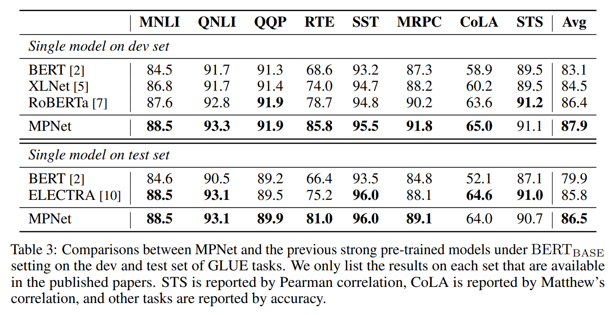
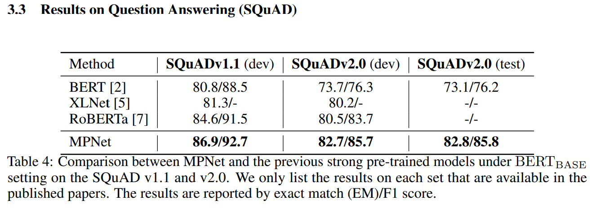

# MPNet with PaddleNLP

[MPNet: Masked and Permuted Pre-training for Language Understanding - Microsoft Research](https://www.microsoft.com/en-us/research/publication/mpnet-masked-and-permuted-pre-training-for-language-understanding/)

**摘要:**
BERT adopts masked language modeling (MLM) for pre-training and is one of the most successful pre-training models. Since BERT neglects dependency among predicted tokens, XLNet introduces permuted language modeling (PLM) for pretraining to address this problem. However, XLNet does not leverage the full position information of a sentence and thus suffers from position discrepancy between pre-training and fine-tuning. In this paper, we propose MPNet, a novel pre-training method that inherits the advantages of BERT and XLNet and avoids their limitations. MPNet leverages the dependency among predicted tokens through permuted language modeling (vs. MLM in BERT), and takes auxiliary position information as input to make the model see a full sentence and thus reducing the position discrepancy (vs. PLM in XLNet). We pre-train MPNet on a large-scale dataset (over 160GB text corpora) and fine-tune on a variety of down-streaming tasks (GLUE, SQuAD, etc). Experimental results show that MPNet outperforms MLM and PLM by a large margin, and achieves better results on these tasks compared with previous state-of-the-art pre-trained methods (e.g., BERT, XLNet, RoBERTa) under the same model setting. The code and the pre-trained models are available at: https://github.com/microsoft/MPNet.

本项目是 MPNet 在 Paddle 2.x上的开源实现。

## 原论文效果
<p align="center">
    
</p>
<p align="center">
    
</p>

## 快速开始

### 模型精度对齐
运行`python compare.py`，对比huggingface与paddle之间的精度，我们可以发现精度的平均误差在10^-6量级，最大误差在10^-5量级（更换不同的输入，误差会发生变化）。
```python
python compare.py
# meandif tensor(6.5154e-06)
# maxdif tensor(4.1485e-05)
```

### 下游任务微调

#### 1、GLUE
以QQP数据集为例，运行其他glue数据集，请参考`train.sh`文件。（超参数遵循原论文的仓库的[README](https://github.com/microsoft/MPNet/blob/master/MPNet/README.glue.md)）

##### （1）模型微调：
```shell
unset CUDA_VISIBLE_DEVICES
cd glue
python -m paddle.distributed.launch --gpus "0" run_glue.py \
    --model_type mpnet \
    --model_name_or_path mpnet-base \
    --task_name qqp \
    --max_seq_length 128 \
    --batch_size 32 \
    --learning_rate 1e-5 \
    --scheduler_type linear \
    --weight_decay 0.1 \
    --warmup_steps 5666 \
    --max_steps 113272 \
    --logging_steps 500 \
    --save_steps 2000 \
    --seed 42 \
    --output_dir qqp/ \
    --device gpu
```
其中参数释义如下：
- `model_type` 指示了模型类型，当前支持BERT、ELECTRA、ERNIE、CONVBERT、MPNET模型。
- `model_name_or_path` 模型名称或者路径，其中mpnet模型当前仅支持mpnet-base几种规格。
- `task_name` 表示 Fine-tuning 的任务，当前支持CoLA、SST-2、MRPC、STS-B、QQP、MNLI、QNLI、RTE和WNLI。
- `max_seq_length` 表示最大句子长度，超过该长度将被截断。
- `batch_size` 表示每次迭代**每张卡**上的样本数目。
- `learning_rate` 表示基础学习率大小，将于learning rate scheduler产生的值相乘作为当前学习率。
- `scheduler_type` scheduler类型，可选linear和cosine。
- `warmup_steps` warmup步数。
- `max_steps` 表示最大训练步数。
- `logging_steps` 表示日志打印间隔。
- `save_steps` 表示模型保存及评估间隔。
- `output_dir` 表示模型保存路径。
- `device` 表示使用的设备类型。默认为GPU，可以配置为CPU、GPU、XPU。若希望使用多GPU训练，将其设置为GPU，同时环境变量CUDA_VISIBLE_DEVICES配置要使用的GPU id。

##### （2）模型预测：
```bash
cd glue
python run_predict.py --task_name qqp  --ckpt_path qqp/best-qqp_ft_model_106000.pdparams
```

##### （3）压缩template文件夹为zip文件，然后提交到[GLUE排行榜](https://gluebenchmark.com/leaderboard)：

###### GLUE排行榜结果：
<p align="center">
    
</p>


###### GLUE开发集结果：

| task                      | cola  | sst-2  | mrpc        | sts-b             | qqp         | mnli       | qnli | rte   | avg |
|--------------------------------|-------|-------|-------------|------------------|-------------|------|-------|-------|-------|
| **metric** | **mcc** | **acc** | **acc/f1** | **pearson/spearman** | **acc/f1**  | **acc(m/mm)**  | **acc** | **acc** |    |
| Paper | **65.0** | **95.5** | **91.8**/空 | 91.1/空 | **91.9**/空 | **88.5**/空 | 93.3 | 85.8 | **87.9** |
| Mine | 64.4 | 95.4 | 90.4/93.1 | **91.6**/91.3 | **91.9**/89.0 | 87.7/88.2 | **93.6** | **86.6** | 87.7 |

###### GLUE测试集结果对比：

| task                      | cola  | sst-2  | mrpc  | sts-b  | qqp | mnli-m | qnli  | rte   | avg      |
|--------------------------------|-------|-------|-------|-------|-----|-------|-------|-------|----------|
| **metric** | **mcc** | **acc** | **acc/f1** | **pearson/spearman** | **acc/f1**  | **acc(m/mm)**  | **acc** | **acc** |  |
| Paper | **64.0** | **96.0** | 89.1/空 | 90.7/空 | **89.9**/空 | **88\.5**/空 | 93\.1 | 81.0 | **86.5** |
| Mine | 60.5     | 95.9 | **91.6**/88.9 | **90.8**/90.3 | 89.7/72.5 | 87.6/86.6 | **93.3** | **82.4** | **86.5** |

#### 2、SQuAD v1.1

使用Paddle提供的预训练模型运行SQuAD v1.1数据集的Fine-tuning

```bash
unset CUDA_VISIBLE_DEVICES
cd squad
python -m paddle.distributed.launch --gpus "0" run_squad.py \
    --model_type mpnet \
    --model_name_or_path mpnet-base \
    --max_seq_length 512 \
    --batch_size 16 \
    --learning_rate 2e-5 \
    --num_train_epochs 4 \
    --scheduler_type linear \
    --logging_steps 25 \
    --save_steps 25 \
    --warmup_proportion 0.1 \
    --weight_decay 0.1 \
    --output_dir squad1.1/ \
    --device gpu \
    --do_train \
    --seed 42 \
    --do_predict
```

训练过程中模型会自动对结果进行评估，其中最好的结果如下所示：

```python
{
  "exact": 86.84957426679281,
  "f1": 92.82031917884066,
  "total": 10570,
  "HasAns_exact": 86.84957426679281,
  "HasAns_f1": 92.82031917884066,
  "HasAns_total": 10570
}
```

#### 3、SQuAD v2.0
对于 SQuAD v2.0,按如下方式启动 Fine-tuning:

```bash
unset CUDA_VISIBLE_DEVICES
cd squad
python -m paddle.distributed.launch --gpus "0" run_squad.py \
    --model_type mpnet \
    --model_name_or_path mpnet-base \
    --max_seq_length 512 \
    --batch_size 16 \
    --learning_rate 2e-5 \
    --num_train_epochs 4 \
    --scheduler_type linear \
    --logging_steps 200 \
    --save_steps 200 \
    --warmup_proportion 0.1 \
    --weight_decay 0.1 \
    --output_dir squad2/ \
    --device gpu \
    --do_train \
    --seed 42 \
    --do_predict \
    --version_2_with_negative
```

* `version_2_with_negative`: 使用squad2.0数据集和评价指标的标志。

训练过程中模型会自动对结果进行评估，其中最好的结果如下所示：

```python
{
  "exact": 82.27912069401162,
  "f1": 85.2774124891565,
  "total": 11873,
  "HasAns_exact": 80.34750337381917,
  "HasAns_f1": 86.35268530427743,
  "HasAns_total": 5928,
  "NoAns_exact": 84.20521446593776,
  "NoAns_f1": 84.20521446593776,
  "NoAns_total": 5945,
  "best_exact": 82.86869367472417,
  "best_exact_thresh": -2.450321674346924,
  "best_f1": 85.67634263296013,
  "best_f1_thresh": -2.450321674346924
}
```

# Tips:
- 对于SQUAD任务：根据这个[issues](https://github.com/microsoft/MPNet/issues/3)所说,论文中汇报的是`best_exact`和`best_f1`。
- 对于GLUE任务：根据这个[issues](https://github.com/microsoft/MPNet/issues/7)所说，部分任务采用了热启动初始化的方法。

# Reference

```bibtex
@article{song2020mpnet,
    title={MPNet: Masked and Permuted Pre-training for Language Understanding},
    author={Song, Kaitao and Tan, Xu and Qin, Tao and Lu, Jianfeng and Liu, Tie-Yan},
    journal={arXiv preprint arXiv:2004.09297},
    year={2020}
}
```
