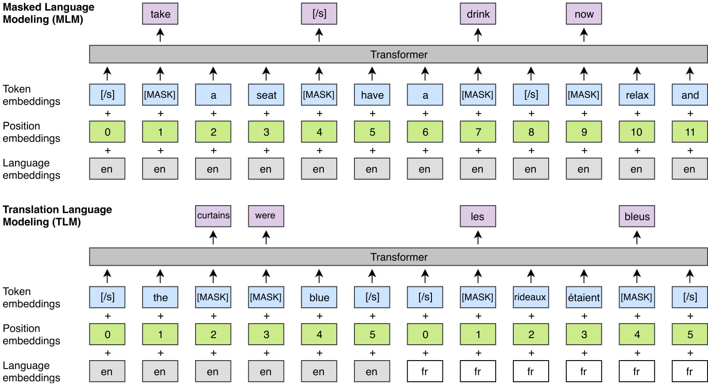

# XLM—Enhancing BERT for Cross-lingual Language Model

## 目录
* [模型简介](#模型简介)
* [模型实现的注意点](#模型实现的注意点)
* [快速开始](#快速开始)
  * [通用参数释义](#通用参数释义)
  * [自然语言推断任务](#自然语言推断任务)
* [参考资料](#参考资料)

## 模型简介

[XLM—Enhancing BERT for Cross-lingual Language Model](https://arxiv.org/abs/1901.07291) 是facebook团队提出的一个跨语言模型。

在这项工作中，他们将这种方法扩展到多种语言，并展示了跨语言预训练的有效性。论文提出了两种学习跨语言语言模型 (XLM) 的方法：一种是**仅依赖单语数据的无监督方法**，另一种是**利用具有新的跨语言语言模型目标的并行数据的监督方法**。该方法在跨语言分类、无监督和有监督机器翻译方面获得了最先进的结果。在 XNLI 上，该方法以4.9% 的绝对精度提升了最新技术水平。在无监督机器翻译上，该方法在 WMT'16 German-English 上获得 34.3 BLEU，将之前的最新技术提高了9BLEU 以上。在有监督的机器翻译上，该方法在WMT'16罗马尼亚语-英语上获得了 38.5 BLEU 的最新技术水平，比之前的最佳方法高出 4 BLEU 以上。

XLM论文中一共提出了三种预训练任务：**CLM**、**MLM**和**TLM**。
- **CLM：Causal Language Model**，无监督单语单向LM训练任务，就是用`Transformer`进行LM的单向训练。
- **MLM：Masked Language Model**，无监督单语双向LM训练任务，与`BERT`一样。
- **TLM：Translation Language Model**，有监督翻译LM训练，拼接平行双语语料，然后执行MLM，以期这样能学到翻译的对齐信息。



## 模型实现的注意点
本仓库的模型在复现过程中主要参考了huggingface的实现，故在实现过程中与facebook团队的官方实现相比存在一定的不同。
- 对于`token_pair`任务，`huggingface`的`tokenizer`会额外添加`<s> A </s> B </s>`的标记，而`facebook`的`tokenizer`会添加`</s> A </s> B </s>`的标记，本仓库的实现遵循了`huggingface`的实现，主要区别在于第一个特殊标记使用了`<s>`而不是`</s>`。
- facebook的XLM模型由于并未使用`token_type_id`参数，因此我们在实际使用`tokenizer`的时候需要人工传入`return_token_type_ids=False`，如：`tokenizer(text, return_token_type_ids=False)`，这样就不会返回`token_type_id`了。
- 考虑到现有已开源预训练权重的XLM模型，在`XLMPredLayer`处并未使用到`adaptive_softmax`，因此本仓库仅实现了带有`cross_entropy`的`XLMPredLayer`。

本文件夹内包含了`XLM模型`在`xnli任务`上的训练和验证内容。以下是本例的简要目录结构及说明：

```text
.
├── README.md                   # README文档
├── xnli_train.py               # 自然语言推断训练代码
├── xnli_eval.py                # 自然语言推断评估代码
```

## 快速开始

### xlm tokenizer依赖安装

```shell
# sacremoses
pip install sacremoses
# Thai tokenizer
pip install pythainlp
# Japanese tokenizer
git clone https://github.com/neubig/kytea.git
cd kytea
autoreconf -i
./configure --prefix=$HOME/local
make && make install
pip install kytea
# Chinese tokenizer
pip install jieba
```

### 通用参数释义
- `model_name_or_path` 指示了 Fine-tuning 使用的具体预训练模型以及预训练时使用的tokenizer，目前支持的预训练模型有："xlm-mlm-tlm-xnli15-1024"。若模型相关内容保存在本地，这里也可以提供相应目录地址，例如："./checkpoint/model_xx/"。
- `output_dir` 表示模型保存路径。
- `max_seq_length` 表示最大句子长度，超过该长度将被截断，不足该长度的将会进行 padding。
- `learning_rate` 表示基础学习率大小，本代码并未使用学习率warmup和衰减。
- `num_train_epochs` 表示训练轮数。
- `logging_steps` 表示日志打印间隔步数。
- `save_steps` 表示模型保存及评估间隔步数。
- `batch_size` 表示每次迭代**每张**卡上的样本数目。
- `adam_epsilon` 表示Adam优化器的epsilon。
- `max_steps` 表示最大训练步数。若训练`num_train_epochs`轮包含的训练步数大于该值，则达到`max_steps`后就提前结束。
- `seed` 表示随机数种子。
- `device` 表示训练使用的设备, `'gpu'`表示使用 GPU, `'xpu'`表示使用百度昆仑卡, `'cpu'`表示使用 CPU。
- `use_amp` 表示是否启用自动混合精度训练。
- `scale_loss` 表示自动混合精度训练的参数。

### 自然语言推断任务

#### 数据集介绍
XNLI 是 MNLI 的子集，并且已被翻译成14种不同的语言（包含一些较低资源语言）。与 MNLI 一样，目标是预测文本蕴含（句子 A 是否暗示/矛盾/都不是句子 B ）。

#### 单卡训练

```shell
python xnli_train.py \
    --batch_size 8 \
    --model_name_or_path xlm-mlm-tlm-xnli15-1024 \
    --save_steps 24544 \
    --output_dir outputs
```

#### 单卡评估

```shell
python xnli_eval.py \
    --batch_size 8 \
    --model_name_or_path outputs/best_model
```

#### 多卡训练

```shell
python -m paddle.distributed.launch --gpus 0,1 --log_dir outputs xnli_train.py \
    --batch_size 8 \
    --model_name_or_path xlm-mlm-tlm-xnli15-1024 \
    --save_steps 24544 \
    --output_dir outputs
```

在XNLI数据集上微调 cross-lingual-transfer 类型的自然语言推断任务后，在测试集上有如下结果
| Model | en | fr | es | de | el | bg | ru | tr | ar | vi | th | zh | hi | sw | ur | Avg |
| --- | --- | --- | --- | --- | --- | --- | --- | --- | --- | --- | --- | --- | --- | --- | --- | --- |
| XLM | 84.6 | 79.2 | 79.8 | 76.9 | 76.6 | 77.6 | 76.2 | 71.7 | 73.8 | 74.5 | 71.1 | 74.8 | 68.8 | 69.2 | 65.8 | 74.7 |


## 参考资料
- https://github.com/facebookresearch/XLM
- https://github.com/huggingface/transformers/tree/main/src/transformers/models/xlm

## 引用

Bibtex:
```tex
@article{lample2019cross,
  title={Cross-lingual Language Model Pretraining},
  author={Lample, Guillaume and Conneau, Alexis},
  journal={Advances in Neural Information Processing Systems (NeurIPS)},
  year={2019}
}
```
