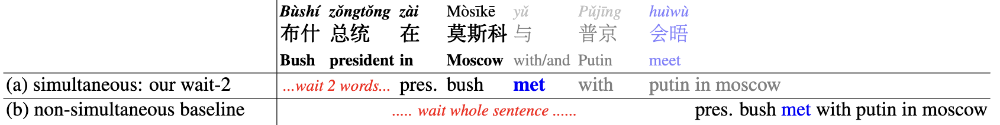

# Text Simultaneous Translation using Prefix-to-Prefix Framework: STACL

同声传译（Simultaneous Translation），即在句子完成之前进行翻译，同声传译的目标是实现同声传译的自动化，它可以与源语言同时翻译，延迟时间只有几秒钟。

本项目是基于机器翻译领域主流模型 Transformer[1]的 PaddlePaddle 实现，包含模型训练，预测以及使用自定义数据等内容。用户可以基于发布的内容搭建自己的同传翻译模型。

## 模型介绍
STACL 是论文 [STACL: Simultaneous Translation with Implicit Anticipation and Controllable Latency using Prefix-to-Prefix Framework](https://www.aclweb.org/anthology/P19-1289/) 中新提出的前缀到前缀框架，该框架仅使用源句子的前缀来预测目标词[2]。

<p align="center">
 <br />
图 1. Seq2Seq vs. STACL
</p>

和传统的机器翻译模型主要的区别在于翻译时是否需要利用全句的源句。上图中，Seq2Seq模型需要等到全句的源句（1-5）全部输入Encoder后，Decoder才开始解码进行翻译；而STACL框架采用了Wait-k（图中Wait-2）的策略，当源句只有两个词（1和2）输入到Encoder后，Decoder即可开始解码预测目标句的第一个词。

该框架主要具有以下优势：

- 前缀到前缀框架是为同声传译量身定制的，并且可以在不使用全句模型的情况下从头开始训练；

- 该框架可以不需要全句的源句，直接预测目标句；

### 模型特点

该项目基于Transformer实现。

Transformer 中的 Encoder 由若干相同的 layer 堆叠组成，每个 layer 主要由多头注意力（Multi-Head Attention）和全连接的前馈（Feed-Forward）网络这两个 sub-layer 构成。 此外，每个 sub-layer 后还施以 Residual Connection [3]和 Layer Normalization [4]来促进梯度传播和模型收敛。

<p align="center">
 <br />
图 2. Transformer
</p>
Decoder 具有和 Encoder 类似的结构，只是相比于组成 Encoder 的 layer ，在组成 Decoder 的 layer 中还多了一个 Multi-Head Attention 的 sub-layer 来实现对 Encoder 输出的 Attention，这个 Encoder-Decoder Attention 在其他 Seq2Seq 模型中也是存在的。

### Wait-k 策略
Wait-k策略首先等待源句单词，然后与源句的其余部分同时翻译，即输出总是隐藏在输入后面。这是受到同声传译人员的启发，同声传译人员通常会在几秒钟内开始翻译演讲者的演讲，在演讲者结束几秒钟后完成。例如，如果k=2，第一个目标词使用前2个源词预测，第二个目标词使用前3个源词预测，以此类推。下图3中，(a)simultaneous: our wait-2 等到"布什"和"总统"输入后就开始解码预测"pres."，而(b) non-simultaneous baseline 为传统的翻译模型，需要等到整句"布什 总统 在 莫斯科 与 普京 会晤"才开始解码预测。
<p align="center">
 <br />
图 3. Wait-k 例子
</p>

## 环境依赖
 - attrdict==2.0.1
 - PyYAML==5.4.1

安装命令：`pip install -r requirements.txt`

## 数据准备

数据格式：中文需要首先经过[jieba分词](https://github.com/fxsjy/jieba/)，然后经过[BPE分词(Byte Pair Encoding)](https://github.com/rsennrich/subword-nmt)；英文需要经过BPE分词。每行数据为分词后的中英文，用制表符分割。

```
兵营 是 双@@ 枪 老@@ 大@@ 爷 的 前提 建筑 之一 。	it serves as a prerequisite for Re@@ apers to be built at the Bar@@ rac@@ ks .
```

## 单机训练

### 单机单卡
可以执行以下命令进行模型训练：
``` sh
# Setting visible devices for training
export CUDA_VISIBLE_DEVICES=0
python train.py --config ./config/transformer.yaml
```

可以在`config/transformer.yaml` 文件中设置相应的参数。如果执行不提供 `--config` 选项，程序将默认使用`config/transformer.yaml` 的配置。

### 单机多卡

同样，可以执行如下命令实现八卡训练：

``` sh
export CUDA_VISIBLE_DEVICES=0,1,2,3,4,5,6,7
python -m paddle.distributed.launch --gpus "0,1,2,3,4,5,6,7" train.py --config ./config/transformer.yaml
```

与上面的情况相似，可以在`config/transformer.yaml` 文件中设置相应的参数。如果执行不提供 `--config` 选项，程序将默认使用`config/transformer.yaml` 的配置。

## 模型推理

模型训练完成后可以执行以下命令对指定文件中的文本进行翻译：

``` sh
# setting visible devices for prediction
export CUDA_VISIBLE_DEVICES=0
python predict.py --config ./config/transformer.yaml
```

翻译结果会输出到 `output_file` 指定的文件。执行预测时需要设置 `init_from_params` 来给出模型所在目录，更多参数的使用可以在 `config/transformer.yaml`文件中查阅注释说明并进行更改设置。如果执行不提供 `--config` 选项，程序将默认使用 `config/transformer.yaml` 的配置。

需要注意的是，目前预测仅实现了单卡的预测，原因在于，翻译后面需要的模型评估依赖于预测结果写入文件顺序，多卡情况下，目前暂未支持将结果按照指定顺序写入文件。


## 模型评估

预测结果中每行输出是对应行输入的得分最高的翻译，对于使用 BPE 的数据，预测出的翻译结果也将是 BPE 表示的数据，要还原成原始的数据（这里指 tokenize 后的数据）才能进行正确的评估。评估过程具体如下（BLEU 是翻译任务常用的自动评估方法指标）：

``` sh
# 还原 predict.txt 中的预测结果为 tokenize 后的数据
sed -r 's/(@@ )|(@@ ?$)//g' predict.txt > predict.tok.txt
# 若无 BLEU 评估工具，需先进行下载
git clone https://github.com/moses-smt/mosesdecoder.git
# 以中英翻译 newstest2017 测试数据为例
perl mosesdecoder/scripts/generic/multi-bleu.perl newstest2017.tok.en < predict.tok.txt
```

## 模型下载（更新中）
我们提供基于NIST（中->英，共2M中英句对）预训练模型，供大家下载。
| Wait-k策略     | 模型连接     | 4-ref BLEU on NIST 2008|
| ------------ | --------------- |---------|
| Wait-1 | [下载]() |30.94|
| Wait-3   |[下载]()|34.62 |
| Wait-∞(整句模型)   |[下载]()|41.41 |


## 参考文献
1. Vaswani A, Shazeer N, Parmar N, et al. [Attention is all you need](http://papers.nips.cc/paper/7181-attention-is-all-you-need.pdf)[C]//Advances in Neural Information Processing Systems. 2017: 6000-6010.
2. Ma M ,  Huang L ,  Xiong H , et al. [STACL: Simultaneous Translation with Implicit Anticipation and Controllable Latency using Prefix-to-Prefix Framework](https://www.aclweb.org/anthology/P19-1289/)[J]//Proceedings of the 57th Annual Meeting of the Association for Computational Linguistics. 2018: 3025–3036.
3. He K, Zhang X, Ren S, et al. [Deep residual learning for image recognition](http://openaccess.thecvf.com/content_cvpr_2016/papers/He_Deep_Residual_Learning_CVPR_2016_paper.pdf)[C]//Proceedings of the IEEE conference on computer vision and pattern recognition. 2016: 770-778.
4. Ba J L, Kiros J R, Hinton G E. [Layer normalization](https://arxiv.org/pdf/1607.06450.pdf)[J]. arXiv preprint arXiv:1607.06450, 2016.
