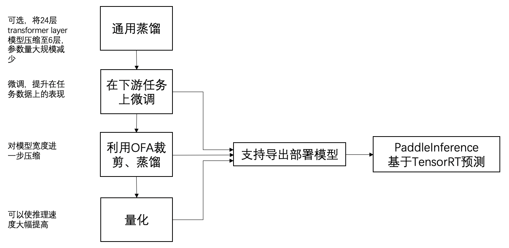

# PP-MiniLM中文小模型

PP-MiniLM 中文特小模型案例旨在提供训推一体的高精度、高性能小模型解决方案。

当前解决方案依托业界领先的 Task Agnostic 模型蒸馏技术、裁剪技术、量化技术，使得小模型兼具推理速度快、模型效果好、参数规模小的 3 大特点。

- 推理速度快：我们集成了 PaddleSlim 的裁剪、量化技术进一步对小模型进行压缩，保证模型推理速度达到原先的2.18倍；

- 精度高： 我们以 MiniLMv2 提出的 Multi-Head Self-Attention Relation Distillation 技术为基础，通过引入样本间关系知识蒸馏做了进一步算法优化。我们的6层、hidden size为768的模型，在CLUE上的平均准确率分别高于TinyBERT、UER-py RoBERTa同样大小的模型2.66%、1.51%。

- 参数规模小：依托 PaddleSlim 裁剪技术，在精度几乎无损(-0.15)条件下将模型宽度压缩 1/4。

整体效果一览：

| Model                   | #Params       | Speedup | AFQMC | TNEWS | IFLYTEK | CMNLI | OCNLI | WSC   | CSL   | CLUE平均值 |
| ----------------------- | ------------- | ------- | ----- | ----- | ------- | ----- | ----- | ----- | ----- | ---------- |
| Bert-base               | 102.3M        | 1.00x   | 74.17 | 57.17 | 61.14   | 81.14 | 75.08 | 80.26 | 81.47 | 72.92      |
| TinyBERT<sub>6</sub>    | 59.7M         | 1.64x   | 72.22 | 55.82 | 58.10   | 79.53 | 74.00 | 75.99 | 80.57 | 70.89      |
| UER-py RoBERTa L6- H768 | 59.7M         | 1.64x   | 69.74 | 66.36 | 59.95   | 77.00 | 71.39 | 71.05 | 82.83 | 71.19      |
| ERNIE-Tiny              | 90.7M         | 1.76x   | 70.78 | 55.70 | 59.95   | 75.40 | 70.98 | 67.43 | 76.60 | 68.12      |
| PP-MiniLM 6L-768H       | 59.7M         | 1.64x   | 74.28 | 57.33 | 61.72   | 81.06 | 76.20 | 86.51 | 78.77 | 73.70      |
| PP-MiniLM裁剪后          | 49.1M         | 1.88x   | 73.82 | 57.33 | 61.60   | 81.38 | 76.20 | 85.52 | 79.00 | 73.55      |
| PP-MiniLM量化后          | 49.2M         | 3.56x   | 73.61 | 57.18 | 61.49   | 81.26 | 76.31 | 84.54 | 77.67 | 73.15      |

**NOTE** 量化后的模型比量化前多0.1M是因为保存了scale值。

方案流程一览：

<p align="center">
<br />
整体流程图
</p>

以下是本范例模型的简要目录结构及说明：

```shell
.
├── general_ditill               # 通用蒸馏目录
│ └── general_distill.py         # 通用蒸馏脚本
│ └── run.sh                     # 通用蒸馏启动脚本
├── finetuning                   # 下游任务训练目录
│ └── run_clue.py                # clue上的微调脚本
│ └── run_clue.sh                # clue上的微调启动脚本
│ └── run_one_search.sh          # 单数据集下精调脚本
│ └── run_all_search.sh          # clue数据集下精调脚本
│ └── export_model.sh            # 导出部署模型脚本
├── ofa                          # ofa裁剪、蒸馏目录
│ └── run_ofa.py                 # ofa裁剪、蒸馏脚本
│ └── run_ofa.sh                 # ofa裁剪、蒸馏启动脚本
│ └── export_model.py            # 导出ofa训练得到的子模型
├── quantization                 # 离线量化目录
│ └── quant_post.py              # 离线量化脚本
│ └── quant.sh                   # 离线量化脚本
├── inference                    # 预测目录
│ └── infer.py                   # 预测脚本
│ └── infer.sh                   # 预测启动脚本
│ └── infer_all.sh               # 批量预测量化模型启动脚本
└── README                       # 文档，本文件

```

## 通用蒸馏（可选）

### 环境建议

本实验基于NVIDIA Tesla V100 32G 8卡进行，训练周期约为2-3天。若资源有限，可以直接下载这一步得到的模型跳过此步骤，直接使用链接的模型用下游任务数据进行微调。


### 原理介绍

PP-MiniLM模型的蒸馏方法介绍


本方法参考了MiniLMv2提出的Multi-Head Self-Attention Relation Distillation蒸馏算法。原始的MiniLMv2算法引入了用24层large-size的模型蒸馏6层模型的思想，即用24层的Roberta-wwm-ext-large教师模型的倒数几层的Q-Q、K-K、V-V之间的relation 去蒸馏6层学生模型的最后一层。在论文中，这种relation是一种token-token relation。

本方案在MiniLMv2的基础上，通过引入样本间关系知识蒸馏做了进一步算法优化，主要利用第20层的Q-Q、K-K、V-V之间的sample-sample relation对6层学生模型PP-MiniLM第6层的Q-Q、K-K、V-V之间的sample-sample relation进行蒸馏。具体的做法是，首先将学生、教师用于蒸馏的层上的head数进行统一，然后将Q、K、V的shape均转置成[seq_len, head_num, batch_size, head_dim]，再对Q-Q、K-K、V-V之间的关系进行蒸馏。这种方法比使用原始MiniLMv2算法在CLUE上平均准确率高0.36。


### 数据介绍

将数据分割成64个文件，放在目录dataset下。


### 运行方式

```shell
cd general_distill
sh run.sh # 包含general_distill.py的运行配置
cd ..
```

其中general_distill.py参数释义如下：

- `model_type` 指示了学生模型类型，当前仅支持'ernie'、'roberta'。
- `num_relation_heads` relation heads的个数，一般对于large size的教师模型是64，对于base size的教师模型是48。
- `teacher_model_type`指示了教师模型类型，当前仅支持'ernie'、'roberta'。
- `teacher_layer_index`蒸馏时使用的教师模型的层
- `student_layer_index` 蒸馏时使用的学生模型的层
- `teacher_model_name_or_path`教师模型的名称，例如`'roberta-wwm-ext-large'`
- `max_seq_length` 最大的样本长度
- `num_layers` 学生模型的层数，目前仅支持2，4，6
- `logging_steps` 日志间隔
- `max_steps` 最大迭代次数
- `warmup_steps` 学习率增长得到`learning_rate`所需要的步数
- `save_steps`保存模型的间隔步数
- `weight_decay` 表示AdamW优化器中使用的weight_decay的系数。
- `output_dir`训练相关文件以及模型保存的输出路径
- `device`设备选择，推荐使用gpu
- `input_dir` 训练数据目录
- `use_amp` 是否使用混合精度训练，默认False
- `alpha`head间关系的权重，默认0.0
- `beta`样本间关系的权重，默认0.0

将最终得到的模型绝对路径保存至`$GENERAL_MODEL_DIR`，例如：

```shell
GENERAL_MODEL_DIR=PaddleNLP/examples/model_compression/PP-MiniLM/general_distill/pretrain/model_400000
```

## 在下游任务上Fine-tuning

### 数据介绍

本实验基于 CLUE 数据集，运行 Fine-tune 脚本会自动下载该数据集到 `~/.paddlenlp/datasets/Clue/` 目录（linux下）。

使用以下超参范围对第一步通用蒸馏得到的通用模型`GENERAL_MODEL_DIR`进行精调：

- batch sizes: 16, 32, 64
- learning rates: 3e-5, 5e-5, 1e-4

### 启动方式

基于如下超参范围对第一步蒸馏产出的小模型 `GENERAL_MODEL_DIR` 进行 Grid Search 超参寻优：

```shell
cd finetuning
sh run_all_search.sh $GENERAL_MODEL_DIR
```

如果只是单个数据集上特定batch_size、learning_rate的微调，可以参考：

```
sh run_clue.sh CLUEWSC2020 1e-4 32 3 128 0 $GENERAL_MODEL_DIR
```

其中每个参数依次表示：clue中的任务名称、learning_rate、batch_size、epochs、max_seq_len、card id

### 模型精度

经过精调后，CLUE上各个任务上的精度如下表：

| AFQMC | TNEWS | IFLYTEK | CMNLI | OCNLI | WSC   | CSL   | CLUE平均值 |
| ----- | ----- | ------- | ----- | ----- | ----- | ----- | ---------- |
| 74.28 | 57.33 | 61.72   | 81.06 | 76.20 | 86.51 | 78.77 | 73.70      |

### 导出Fine-tuning之后的模型

假设fine-tuning之后的模型保存的地址为`$GENERAL_MODEL_DIR/models/CLUEWSC2020/1e-4_32`，可以运行下方命令对动态图模型导出为可用于部署的静态图模型：

```shell
python export_model.py --model_type ernie --model_path $GENERAL_MODEL_DIR/models/CLUEWSC2020/1e-4_32  --output_path fine_tuned_infer_model/float
```

## 使用PaddleSlim OFA对任务上的模型进行裁剪

这一步主要使用PaddleSlim ofa功能对下游任务上的模型宽度进行裁剪。如果执行这部分内容，需要安装paddleslim的最新包：

```shell
pip install -U paddleslim -i https://pypi.org/simple
cd ofa
```
该过程会以finetuning后得到的模型当作教师模型，蒸馏宽度为3/4的学生模型。经过我们的实验，在6L768H 条件下，模型宽度压缩为原来的 3/4, 精度几乎无损（-0.15)。

### 裁剪、蒸馏过程的启动脚本

假设需要对上一步finetuning得到的模型`$GENERAL_MODEL_DIR/models/CLUEWSC2020/1e-4_32`进行进一步的裁剪，其中learning_rate、batch_size可以继续使用fine-tuning时的参数，例如：可以使用如下命令：

```shell
sh run_ofa.sh CLUEWSC2020 5e-5 16 50 128 4  ../general_distill/ernie-batchbatch-50w_400000/models/CLUEWSC2020/1e-4_32/
```

执行完成后，模型保存的路径位于`ofa_models/CLUEWSC2020/0.75/best_model/`。

### 导出裁剪后的模型

这一步可以同时得到动态图、静态图的模型参数

以CLUEWSC2020数据集为例，导出模型：

```shell
MODEL_PATH=ofa_models
TASK_NAME=CLUEWSC2020
sh export.sh $MODEL_PATH $TASK_NAME
```

或者可以批量导出各个任务上的模型：

```shell
sh export_all.sh
```

最终模型保存的位置位于` ${MODEL_PATH}/${TASK_NAME}/0.75/sub_static/float`

```shell
cd ..
```

### 模型精度

经过裁剪、蒸馏后，CLUE上各个任务上的精度如下表所示。相比起裁剪前，CLUE数据集上平均值下降0.15。模型的参数量由59.7M到49.1M。

| AFQMC | TNEWS | IFLYTEK | CMNLI | OCNLI | WSC   | CSL   | CLUE平均值 |
| ----- | ----- | ------- | ----- | ----- | ----- | ----- | ---------- |
| 74.28 | 57.33 | 61.60   | 81.38 | 76.20 | 85.52 | 79.00 | 73.55      |


## 借助PaddleSlim的量化功能进一步减少模型大小

```shell
cd quantization
```

离线量化的介绍：

这一步我们可以将float32的模型通过paddleslim提供的离线量化API，无需再次训练，直接得到量化的模型。这一步使用了mse、avg、abs_max、hist多种策略，并使用4、8两种量化时的校准集数量。

运行如下的脚本可以得到

```shell
python quant_post.py --task_name $TASK_NAME --input_dir ${MODEL_DIR}/${TASK_NAME}/0.75/sub_static
```

可以批量对所有数据集下的float模型进行量化：

```shell
sh quant_all.sh
```

```
cd ..
```

### 模型精度

再经过量化后，CLUE上各个任务上的精度如下表，比上一步（裁剪后）下降了0.4：

| AFQMC | TNEWS | IFLYTEK | CMNLI | OCNLI | WSC   | CSL   | CLUE平均值 |
| ----- | ----- | ------- | ----- | ----- | ----- | ----- | ---------- |
| 73.61 | 57.18 | 61.49   | 81.26 | 76.31 | 84.54 | 77.67 | 73.15      |

## 利用Paddle Inference进行预测部署

### 环境要求：

这一步需要依赖paddle2.2.1中Paddle Inference进行预测，如果需要得到更明显的加速效果，推荐在NVIDA Tensor Core GPU（如T4、A10、A100)上进行测试，本案例基于T4测试。若在V系列卡上测试，由于其不支持Int8 Tensor Core，加速效果将达不到本文档表格中的加速效果。

由于开启了动态shape功能，因此需要设置获取shape的范围。Paddle Inference提供了相应的接口，即首先通过离线输入数据来统计出所有临时tensor的shape范围，TRT子图的tensor输入shape范围可直接根据上一步tune出来的结果来设置，即可完成自动shape范围设置。统计完成后，只需设置统计结果路径，即可启用tuned_dynamic_shape功能。在本案例中，只需要先设置--collect_shape参数，运行infer.py，然后再取消传入这个参数，再次运行infer.py。例如：

本案例是在NVIDIA Tesla T4 单卡上，cuda版本11.1、cudnn版本8.1、TensorRT版本7.2，使用inference/infer.py脚本，对量化后的模型进行预测。

INT8预测脚本：

```shell
cd inference

python infer.py --task_name ${task}  --model_path  ../quantization/${task}_quant_models/${algo}${bs}/int8  --int8 --use_trt --collect_shape # 生成shape range info文件
python infer.py --task_name ${task}  --model_path  ../quantization/${task}_quant_models/${algo}${bs}/int8  --int8 --use_trt # load shape range info文件进行预测
```
如果想要批量对Int8模型进行预测并比较不同量化模型的效果，可以使用如下的脚本批量预测：

```shell
sh infer_all.sh
```

FP32预测脚本：

```shell
python infer.py --task_name ${task}  --model_path  $MODEL_PATH  --use_trt --collect_shape
python infer.py --task_name ${task}  --model_path  $MODEL_PATH --use_trt
```

### 性能测试

测试性能环境同上，基于NVIDIA Tesla T4 单卡上，cuda版本11.1、cudnn版本8.1、TensorRT版本7.2。采用的是TNEWS数据集下训练的模型，下表三行分别是微调后的模型、OFA裁剪蒸馏后的模型、量化方法为mse、校准集数量为4的量化模型，计算dev上预测的总耗时（去除前20个steps）。

运行性能测试脚本可以得到FP32、裁剪后、量化后模型的耗时，取5个非--collect_shap阶段打印出的时长取平均：

```shell

sh infer_perf.sh
```

```shell
cd ..
```

可以发现借助PaddleSlim裁剪、量化后的模型比原BERT-base模型推理速度加速255.86%，其中裁剪可以加速87.98%。

|                    | 平均耗时(s) | 加速比  |
| ------------------ | ----------- | ------- |
| BERT               | 20.64       | 0       |
| FP32               | 12.61       | 63.68%  |
| FP32+裁剪          | 10.98       | 87.98%  |
| FP32+裁剪+INT8量化 | 5.80        | 255.86% |
