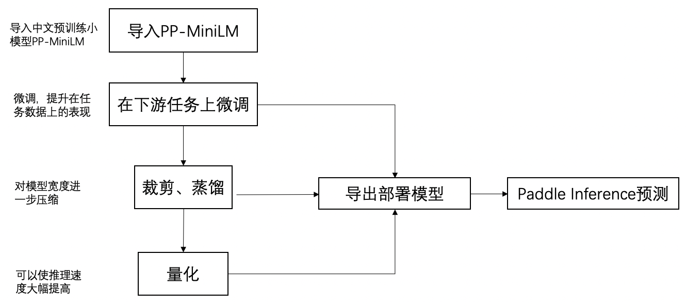

 **目录**

* [PP-MiniLM 中文小模型](#PP-MiniLM中文小模型)
    * [导入 PP-MiniLM](#导入PP-MiniLM)
    * [在下游任务上使用 PP-MiniLM](#在下游任务上使用PP-MiniLM)
        * [数据介绍](#数据介绍)
        * [环境依赖](#环境依赖)
        * [微调](#微调)
            * [运行方式](#运行方式)
            * [微调后模型精度](#微调后模型精度)
            * [导出微调后模型](#导出微调后模型)
        * [裁剪](#裁剪)
            * [原理简介](#原理简介)
            * [运行方式](#运行方式)
            * [裁剪后模型精度](#裁剪后模型精度)
            * [导出裁剪后的模型](#导出裁剪后的模型)
        * [量化](#量化)
            * [原理简介](#原理简介)
            * [运行方式](#运行方式)
            * [量化后模型精度](#量化后模型精度)
        * [使用 Paddle Inference 进行推理部署](#使用PaddleInference推理部署)
            * [环境要求](#环境要求)
            * [运行方式](#运行方式)
            * [性能测试](#性能测试)
        * [使用 Paddle Serving 进行服务化部署](#使用PaddleServing服务化部署)
    * [参考文献](#参考文献)

<a name="PP-MiniLM中文小模型"></a>

# PP-MiniLM 中文小模型
[PaddleNLP](https://github.com/PaddlePaddle/PaddleNLP) 联合 [PaddleSlim](https://github.com/PaddlePaddle/PaddleSlim) 通过模型蒸馏、剪裁、量化等级联模型压缩技术发布中文特色小模型 PP-MiniLM(6L768H) 及压缩方案，保证模型精度的同时模型推理速度达 BERT(12L768H) 的 8.88 倍，参数量相比减少 52%，模型精度在中文语言理解评测基准 CLUE 高 0.62。

PP-MiniLM 压缩方案以面向预训练模型的任务无关知识蒸馏(Task-agnostic Distillation)技术、裁剪(Pruning)技术、量化(Quantization)技术为核心，使得 PP-MiniLM **又快**、**又准**、**又小**。

1. **推理速度快**: 依托 PaddleSlim 的裁剪、量化技术对 PP-MiniLM 小模型进行压缩、加速, 使得 PP-MiniLM 量化后模型 GPU 推理速度相比 BERT base 加速比高达 8.88；

2. **精度高**: 我们以 [MiniLMv2](https://arxiv.org/abs/2012.15828) 提出的 Multi-Head Self-Attention Relation Distillation 技术为基础，通过引入样本间关系知识蒸馏做了进一步算法优化，6 层 PP-MiniLM 模型在 CLUE 数据集上比 12 层 `bert-base-chinese` 高 0.62%，比同等规模的 TinyBERT<sub>6,</sub>、UER-py RoBERTa 分别高 2.57%、2.24%；

3. **参数规模小**：依托 Task-agnostic Distillation 技术和 PaddleSlim 裁剪技术，模型参数量相比 BERT 减少 52%。

**整体效果**


| Model                         | #Params   | #FLOPs    | Speedup (w/o FasterTokenizer)   | AFQMC     | TNEWS     | IFLYTEK   | CMNLI     | OCNLI     | CLUEWSC2020 | CSL       | Avg       |
| ----------------------------- | --------- | --------- | ---------------- | --------- | --------- | --------- | --------- | --------- | ----------- | --------- | --------- |
| BERT-base, Chinese            | 102.3M    | 10.87B    | 1.00x            | 74.14     | 56.81     | 61.10     | 81.19     | 74.85     | 79.93       | 81.47     | 72.78     |
| TinyBERT<sub>6,</sub> Chinese | 59.7M     | 5.44B     | 1.90x            | 72.59     | 55.70     | 57.64     | 79.57     | 73.97     | 76.32       | 80.00     | 70.83     |
| UER-py RoBERTa L6-H768        | 59.7M     | 5.44B     | 1.90x            | 69.62     | **66.45** | 59.91     | 76.89     | 71.36     | 71.05       | **82.87** | 71.16     |
| RBT6, Chinese                 | 59.7M     | 5.44B     | 1.90x            | 73.93     | 56.63     | 59.79     | 79.28     | 73.12     | 77.30       | 80.80     | 71.55     |
| ERNIE-Tiny                    | 90.7M     | 4.83B     | 2.22x            | 71.55     | 58.34     | 61.41     | 76.81     | 71.46     | 72.04       | 79.13     | 70.11     |
| PP-MiniLM                     | 59.7M     | 5.44B     | 2.15x (1.90x)     | 74.14     | 57.43     | **61.75** | 81.01     | **76.17** | 86.18       | 79.17     | **73.69** |
| PP-MiniLM + 裁剪              | **49.1M** | **4.08B** | 2.74x (2.48x)     | 73.91     | 57.44     | 61.64     | 81.10     | 75.59     | **85.86**   | 78.53     | 73.44     |
| PP-MiniLM + 量化              | 59.8M     | -         | 7.34x (4.63x)     | **74.19** | 57.13     | 61.10     | **81.20** | 76.10     | 85.20       | 78.03     | 73.28     |
| PP-MiniLM + 裁剪 + 量化       | **49.2M** | -         | **8.88x** (5.36x) | 74.00     | 57.37     | 61.33     | 81.09     | 75.56     | 85.85       | 78.57     | 73.40     |


**NOTE：**

1.上表所有模型的精度测试均是基于下方超参数范围进行的 Grid Search 超参寻优。在每个配置下训练时，每隔 100 个 steps 在验证集上评估一次，取验证集上最佳准确率作为当前超参数配置下的准确率；
- batch sizes: 16, 32, 64;
- learning rates: 3e-5, 5e-5, 1e-4

2.量化后比量化前模型参数量多了 0.1M 是因为保存了 scale 值；

3.性能测试的环境：

- 硬件：NVIDIA Tesla T4 单卡；
- 软件：CUDA 11.1, cuDNN 8.1, TensorRT 7.2, PaddlePaddle 2.2.2；
- 实验配置：batch_size: 32, max_seq_len: 128；

其中，除上表最后两行的模型是对 INT8 模型进行预测，其余模型均基于 FP32 精度测试。

4.PP-MiniLM 的加速比（见表中 Speedup 列）均测试了接入与未接入 FasterTokenizer 的数据，其中括号内的加速比代表未接入 FasterTokenizer 的加速比数据。接入 FasterTokenizer 对模型的精度没有影响，裁剪、量化后的模型相对 BERT-base 的加速比从 5.36 倍增加到 8.88 倍。

**方案流程**

<p align="center">
<br />
方案流程图
</p>

如上流程图所示，完整的中文小模型方案分为：导入 PP-MiniLM 中文预训练小模型、下游任务微调、裁剪、离线量化、预测部署五大步。下面会对这里的每一个步骤进行介绍。除了下游任务微调步骤，其余步骤均可以省略，但我们建议保留下面的每一个步骤。

以下是本范例模型的简要目录结构及说明：

```shell
.
├── general_distill              # 任务无关知识蒸馏目录
│ └── general_distill.py         # 任务无关知识蒸馏脚本
│ └── run.sh                     # 任务无关知识蒸馏启动脚本
│ └── README.md                  # 任务无关知识蒸馏文档
├── finetuning                   # 下游任务训练目录
│ └── run_clue.py                # CLUE 上的微调脚本
│ └── run_clue.sh                # CLUE 上的微调启动脚本
│ └── run_one_search.sh          # 单数据集下精调脚本
│ └── run_all_search.sh          # CLUE数据集下精调脚本
│ └── export_model.py            # 导出 fine-tuned 部署模型脚本
├── pruning                      # 裁剪、蒸馏目录
│ └── prune.py                   # 裁剪、蒸馏脚本
│ └── prune.sh                   # 裁剪、蒸馏启动脚本
│ └── export_model.py            # 导出裁剪训练得到的子模型（动、静态图模型）
├── quantization                 # 离线量化目录
│ └── quant_post.py              # 离线量化脚本
│ └── quant.sh                   # 离线量化启动脚本
├── deploy                       # 部署目录
│ └── python                     # Paddle Inference 预测目录
│   └── infer.py                 # Paddle Inference 预测脚本
│   └── infer_all.sh             # 批量预测量化模型启动脚本
│   └── infer_perf.sh            # 量化模型性能测试启动脚本
│ └── serving                    # Paddle Serving 预测目录
│   └── export_to_serving.py     # 导出 Paddle Serving 预测模型脚本
│   └── web_service.py           # Paddle Serving 服务端启动脚本
│   └── rpc_client.py            # Paddle Serving 客户端启动脚本
│   └── config_nlp.yml           # Paddle Serving 预测配置文件
│   └── README.md                # Paddle Serving 预测文档
├── data.py                      # 数据处理脚本
├── pp-minilm.png                # PP-MiniLM 方案流程图
└── README.md                    # 文档，本文件

```

<a name="导入PP-MiniLM"></a>

## 导入 PP-MiniLM

PP-MiniLM 是使用任务无关蒸馏方法，以 `roberta-wwm-ext-large` 做教师模型蒸馏产出的含 6 层 Transformer Encoder Layer、Hidden Size 为 768 的预训练小模型，在 CLUE 上 7 个分类任务上的模型精度超过 BERT<sub>base</sub>、TinyBERT<sub>6</sub>、UER-py RoBERTa L6-H768、RBT6。

可以这样导入 PP-MiniLM：

```python

from paddlenlp.transformers import PPMiniLMModel, PPMiniLMForSequenceClassification

model = PPMiniLMModel.from_pretrained('ppminilm-6l-768h')
model = PPMiniLMForSequenceClassification.from_pretrained('ppminilm-6l-768h') # 用于分类任务
```

PP-MiniLM 是一个 6 层的预训练模型，使用 `from_pretrained`导入 PP-MiniLM 之后，就可以在自己的数据集上进行 fine-tuning。接下来会介绍如何用下游任务数据在导入的 PP-MiniLM 上进行微调、进一步压缩及推理部署。

**NOTE：** 如果对 PP-MiniLM 的训练过程感兴趣，可以查看[任务无关蒸馏文档](general_distill/README.md)了解相关细节。

<a name="在下游任务上使用PP-MiniLM"></a>

## 在下游任务上使用 PP-MiniLM

PP-MiniLM 预训练小模型在 CLUE 中的 7 个分类数据集的平均精度上比 12 层 `bert-base-chinese` 高 0.62%，比同等规模的 TinyBERT、UER-py RoBERTa 分别高 2.57%、2.24%，因此我们推荐将 PP-MiniLM 运用在中文下游任务上。当然，如果想对已有模型进一步压缩，也可以参考这里的压缩方案，因为压缩方案是通用的。

本案例中会以 CLUE 中 7 个分类数据集为例介绍如何在下游任务上使用 PP-MiniLM。首先用 CLUE 中的数据集对预训练小模型 PP-MiniLM 进行微调，然后提供了一套压缩方案，即借助 [PaddleSlim](https://github.com/PaddlePaddle/PaddleSlim) 进行裁剪和量化，进一步对模型规模进行压缩，最终使用基于 TensorRT 的 [Paddle Inference](https://www.paddlepaddle.org.cn/documentation/docs/zh/develop/guides/05_inference_deployment/inference/inference_cn.html) 预测库对量化后的模型进行预测部署。裁剪、量化前，6 层 PP-MiniLM 的推理速度达 `bert-base-chinese` 的 2.15 倍，在下游任务上压缩完成后，模型推理速度高达`bert-base-chinese`的 8.88 倍。

<a name="数据介绍"></a>

### 数据介绍

本案例中下游任务使用的数据是 CLUE 中 7 个分类数据集，包括 AFQMC、TNEWS、IFLYTEK、OCNLI、CMNLI、CSL、CLUEWSC2020。在 Linux 环境下，运行 `run_clue.py` 这个 fine-tuning 脚本会将该数据集自动下载到`~/.paddlenlp/datasets/Clue/`目录下。

<a name="环境依赖"></a>

### 环境依赖

压缩方案依赖 [PaddleSlim](https://github.com/PaddlePaddle/PaddleSlim) 提供的裁剪、量化功能，在本案例中需要安装 paddleslim 2.2.2 及之后的版本(使用命令 `pip install paddleslim>=2.2.2` 安装即可)。PaddleSlim 是个专注于深度学习模型压缩的工具库，提供剪裁、量化、蒸馏、和模型结构搜索等模型压缩策略，帮助用户快速实现模型的小型化。安装命令如下：

```shell
pip install paddleslim>=2.2.2
```

<a name="微调"></a>

### 微调

基于如下超参范围对 PP-MiniLM 在各个任务上进行 Grid Search 超参寻优：

- batch sizes: 16, 32, 64
- learning rates: 3e-5, 5e-5, 1e-4

<a name="运行方式"></a>

#### 运行方式

```shell
cd finetuning
mkdir ppminilm-6l-768h
sh run_all_search.sh ppminilm-6l-768h
```

如果只是在单个数据集上用特定 `batch_size`、`learning_rate` 微调，可以使用如下命令：

```
sh run_clue.sh CLUEWSC2020 1e-4 32 50 128 0 ppminilm-6l-768h
```

其中每个参数依次表示：CLUE 中的任务名称、学习率、batch size、epoch 数、最大序列长度、gpu id、模型名称（模型保存目录）。

<a name="微调后模型精度"></a>

#### 微调后模型精度

经过超参寻优后，我们可以得到在 CLUE 每个任务上验证集上有最高准确率的模型，CLUE 上各个任务上的最高准确率如下表：

| AFQMC | TNEWS | IFLYTEK | CMNLI | OCNLI | CLUEWSC2020 | CSL   | Avg   |
| ----- | ----- | ------- | ----- | ----- | ----------- | ----- | ----- |
| 74.14 | 57.43 | 61.75   | 81.01 | 76.17 | 86.18       | 79.17 | 73.69 |


超参寻优完成后，保存下每个数据集下有最高准确率的模型，以及其对应的超参数，因裁剪、量化等后续步骤需要用到最好的模型和超参数。

<a name="导出微调后模型"></a>

#### 导出微调后模型

模型在训练完成之后，可以选择每个数据集下效果最好的模型进行导出：

```shell
export TASK_NAME=CLUEWSC2020
export MODEL_PATH=ppminilm-6l-768h
export LR=1e-4
export BS=32

python export_model.py --task_name ${TASK_NAME} --model_path ${MODEL_PATH}/models/${TASK_NAME}/${LR}_${BS}/
```

静态图（部署）模型路径与动态图模型的路径相同，文件名为 `inference.pdmodel` , `inference.pdiparams` 和 `inference.pdiparams.info` 。

<a name="裁剪"></a>

### 裁剪

这一步主要使用 PaddleSlim 对下游任务上的模型宽度进行裁剪，进一步压缩模型的大小。

该过程会以上一步的模型（即 fine-tuning 后得到的最好模型）当作教师模型，蒸馏宽度为 3/4 的学生模型。经过我们的实验，在 6L768H 条件下，模型宽度压缩为原来的 3/4，平均精度下降 0.25。

<a name="原理简介"></a>

#### 原理简介

本方案采取的裁剪方法参考了 [DynaBERT-Dynamic BERT with Adaptive Width and Depth](https://arxiv.org/pdf/2004.04037) 中的策略。首先对预训练模型和 Head 进行重要性排序，保证更重要的 Head 不容易被裁掉，然后用原模型作为蒸馏过程中的教师模型，宽度更小的（本案例是 3/4 宽度）模型作为学生模型，蒸馏得到的学生模型就是我们裁剪得到的模型。

<a name="运行方式"></a>

#### 运行方式

假设需要对上一步 fine-tuned 模型 `../finetuning/ppminilm-6l-768h/models/CLUEWSC2020/1e-4_32` 进行裁剪，其中 `learning_rate`、`batch_size` 可以继续使用 fine-tuning 时的参数，这里执行的是宽度 `0.75` 的裁剪，可以使用如下命令运行：

```shell
cd pruning
export FT_MODELS=../finetuning/ppminilm-6l-768h/models/CLUEWSC2020/1e-4_32

sh prune.sh CLUEWSC2020 1e-4 32 50 128 0 ${FT_MODELS} 0.75
```
其中每个参数依次表示：CLUE 中的任务名称、学习率、batch size、epoch 数、最大序列长度、gpu id、学生模型的地址、裁剪后宽度比例列表。执行完成后，模型保存的路径位于 `pruned_models/CLUEWSC2020/0.75/best_model/`。

<a name="裁剪后模型精度"></a>

#### 裁剪后模型精度

经过裁剪后，CLUE 上各个任务上的精度如下表所示。相比起裁剪前，CLUE 数据集上平均值下降 0.25。模型的参数量由 59.7M 下降到 49.1M。

| Model            | AFQMC | TNEWS | IFLYTEK | CMNLI | OCNLI | CLUEWSC2020 | CSL   | Avg   |
| ---------------- | ----- | ----- | ------- | ----- | ----- | ----------- | ----- | ----- |
| PP-MiniLM 裁剪后 | 73.91 | 57.44 | 61.64   | 81.10 | 75.59 | 85.86       | 78.53 | 73.44 |


<a name="导出裁剪后的模型"></a>

#### 导出裁剪后的模型

这一步可以同时导出经过裁剪后特定宽度下模型的动、静态图的模型和参数等文件。

以 CLUEWSC2020 数据集为例，导出模型：

```shell

export MODEL_PATH=pruned_models
export TASK_NAME=CLUEWSC2020
sh export.sh ${MODEL_PATH} ${TASK_NAME}
```

或者可以批量导出 CLUE 各个任务上的模型：

```shell

sh export_all.sh
cd ..
```

导出的静态图模型、参数等文件位于 `${MODEL_PATH}/${TASK_NAME}/0.75/sub_static/` 目录下，有 `float.pdmodel`、`float.pdiparams`、`float.pdiparams.info` 三个文件。

导出的动态图参数等文件位于 `${MODEL_PATH}/${TASK_NAME}/0.75/sub/model_width_0.75000/` 目录下，有 `model_state.pdparams` 和 `model_config.json` 两个文件。需要注意的是，此动态图模型不能通过原始 Transformer API 将参数正确载入，因为裁剪后模型不再符合 Transformer 的组网，例如 q、k、v 的 weight 的 shape 是 `[hidden_size, hidden_size * width_mul]` ，不再是 `[hidden_size, hidden_size]`。

<a name="量化"></a>

### 量化

```shell
cd quantization
```

<a name="原理简介"></a>

#### 原理简介

这里的量化采用的是静态离线量化方法，即不需要训练，只使用少量校准数据计算量化因子，就可快速得到量化模型。这一步需要有训练好的预测（静态图）模型。因此，需要对前序步骤产出的模型进行导出（参考上方导出模型的运行方式）。

量化我们可以借助 PaddleSlim 提供的离线量化 API `paddleslim.quant.quant_post_static` 实现，我们这一步使用了 `mse`、`avg`、`abs_max`、`hist` 四种对于激活 Tensor 的量化方法，以及 `channel_wise_abs_max` 对权重 Tensor 的量化方法，并使用 4、8 两种校准集数量，对 `matmul`、`matmul_v2` 算子进行量化。

<a name="运行方式"></a>

#### 运行方式

运行如下脚本可以对导出的静态图模型进行量化：

```shell
export MODEL_DIR=../pruning/pruned_models/
python quant_post.py --task_name $TASK_NAME --input_dir ${MODEL_DIR}/${TASK_NAME}/0.75/sub_static
```

可以批量对所有数据集下的 FP32 模型进行量化：

```shell
sh quant_all.sh
cd ..
```

<a name="量化后模型精度"></a>

#### 量化后模型精度

经过量化后，CLUE 上各个任务上的精度如下表，对 PP-MiniLM 进行量化后，精度比原 FP32 模型下降 0.19；对裁剪后的模型进行量化，精度几乎无损（-0.04）：

| NO   | Model                   | AFQMC | TNEWS | IFLYTEK | CMNLI | OCNLI | CLUEWSC2020 | CSL   | Avg   |
| ---- | ----------------------- | ----- | ----- | ------- | ----- | ----- | ----------- | ----- | ----- |
| 1    | PP-MiniLM               | 74.24 | 57.21 | 61.1    | 81.16 | 76.17 | 85.53       | 78.90 | 73.47 |
| 1    | PP-MiniLM + 量化        | 74.19 | 57.13 | 61.10   | 81.20 | 76.10 | 85.20       | 78.03 | 73.28 |
| 2    | PP-MiniLM + 裁剪        | 73.91 | 57.44 | 61.64   | 81.10 | 75.59 | 85.86       | 78.53 | 73.44 |
| 2    | PP-MiniLM + 裁剪 + 量化 | 74.00 | 57.37 | 61.33   | 81.09 | 75.56 | 85.85       | 78.57 | 73.40 |


**NOTE：** 实验 1 是补充实验，PP-MiniLM 和 实验 2 中裁剪前的 PP-MiniLM 模型精度不同。

最后，值得注意的是，PP-MiniLM 是基于 `roberta-wwm-ext-large` 做教师模型蒸馏得到的学生模型，如果你有更好的 24 层中文预训练模型，可以基于[任务无关蒸馏文档](general_distill/README.md)中介绍的蒸馏过程，训练出一个比 PP-MiniLM 精度更高，在下游任务上表现更好的 6 层小模型。

<a name="使用PaddleInference进行推理部署"></a>

### 使用 Paddle Inference 进行推理部署

预测部署借助 PaddlePaddle 安装包中自带的 [Paddle Inference](https://www.paddlepaddle.org.cn/documentation/docs/zh/develop/guides/05_inference_deployment/inference/inference_cn.html) 进行预测。

<a name="环境要求"></a>

#### 环境要求

这一步依赖安装有预测库的 PaddlePaddle 2.2.2。可以在 [PaddlePaddle 官网](https://paddleinference.paddlepaddle.org.cn/user_guides/download_lib.html#python) 根据机器环境选择合适的 Python 预测库进行安装。

想要得到更明显的加速效果，推荐在 NVIDA Tensor Core GPU（如 T4、A10、A100)上进行测试，本案例基于 T4 测试。若在 V 系列 GPU 卡上测试，由于其不支持 Int8 Tensor Core，加速效果将达不到本文档表格中的效果。

本案例是在 NVIDIA Tesla T4 单卡上，使用 CUDA 11.1、cuDNN 8.1、TensorRT 7.2 进行预测。

<a name="运行方式"></a>

#### 运行方式

这里使用了动态 shape 功能，因此需要设置 TensorRT 子图输入shape 的范围。用户需要事先根据自己的模型结构和数据 shape 的范围，设置 TensorRT 子图输入的 shape 的最大、最小、以及最优的范围，其中最优范围可以按照数据分布选择最常见的来设置。动态 shape 的设置可以参考[官方文档](https://paddleinference.paddlepaddle.org.cn/optimize/paddle_trt.html#dynamic-shape)中的教程，以及本案例中 infer.py 脚本中的 160 行 - 206 行）。

INT8 预测运行脚本：

```shell

cd deploy/python

export task=tnews
export algo=mse
export bs=4
python infer.py --task_name ${task}  --model_path  ../../quantization/${task}_quant_models/${algo}${bs}/int8  --int8 --use_trt
```
如果想要批量对量化模型进行预测并输出不同量化策略产出模型的精度，可以使用如下的脚本批量预测：

```shell
sh infer_all.sh
```

FP32 预测运行脚本：

```shell
python infer.py --task_name ${task}  --model_path  $MODEL_PATH --use_trt
```

<a name="性能测试"></a>

#### 性能测试

测试性能环境同上。本案例测试采用的是 CLUE TNEWS 数据集下量化方法为 `mse`、校准集数量为 4 得到的量化模型，在 TNEWS 的验证集上统计 5 次端到端预测的总耗时（前 20 个 steps 作为 warmup steps）并求平均。其中 `batch_size` 为 32，`max_seq_len` 为 128。

启动性能测试需要对 `infer.py` 脚本传入参数 `--perf`，运行性能测试脚本可以得到 PP-MiniLM、PP-MiniLM 裁剪后、PP-MiniLM 量化后模型预测的耗时：

```shell

bash infer_perf.sh
cd ../../
```

下表后三行分别是微调后的模型、裁剪后的模型、量化后模型的总耗时情况。

取 5 个测试时长取平均，并计算出加速度比，可以发现裁剪、量化后的模型是原 BERT<sub>base</sub> 模型推理速度的 8.88 倍，其中只经过裁剪后的模型是 BERT<sub>base</sub> 推理速度的 2.74 倍，只经过量化后的模型是 BERT<sub>base</sub> 推理速度的 7.34 倍，接入 FasterTokenizer 前，裁剪、量化后的推理速度是原 BERT<sub>base</sub> 模型推理速度的 5.36 倍。

|                         | 加速比    | 加速比（w/o FasterTokenizer） |
| ----------------------- | --------- | ----------------------------- |
| BERT<sub>base</sub>     | 1.00x     | 1.00x                         |
| PP-MiniLM               | 2.15x     | 1.90x                         |
| PP-MiniLM + 裁剪        | 2.74x     | 2.48x                         |
| PP-MiniLM + 量化        | 7.34x     | 4.63x                         |
| PP-MiniLM + 裁剪 + 量化 | **8.88x** | **5.36x**                     |


<a name="使用PaddleServing进行服务化部署"></a>

### 使用 Paddle Serving 进行服务化部署

上面介绍的 Paddle Inference 为使用本地模型推理，Paddle Serving 可以实现在服务器端部署推理模型，客户端远程通过 RPC/HTTP 方式发送数据进行推理，实现模型推理的服务化。准备好静态图（推理模型）后，可参考 [Paddle Serving](deploy/serving/README.md) 部署步骤。

<a name="参考文献"></a>

## 参考文献

1.Wang W, Bao H, Huang S, Dong L, Wei F. MiniLMv2: Multi-Head Self-Attention Relation Distillation for Compressing Pretrained Transformers[J]. arXiv preprint arXiv:2012.15828v2, 2021.

2.Hou L, Huang Z, Shang L, Jiang X, Chen X and Liu Q. DynaBERT: Dynamic BERT with Adaptive Width and Depth[J]. arXiv preprint arXiv:2004.04037, 2020.

3.Cai H, Gan C, Wang T, Zhang Z, and Han S. Once for all: Train one network and specialize it for efficient deployment[J]. arXiv preprint arXiv:1908.09791, 2020.

4.Wu H, Judd P, Zhang X, Isaev M and Micikevicius P. Integer Quantization for Deep Learning Inference: Principles and Empirical Evaluation[J]. arXiv preprint arXiv:2004.09602v1, 2020.
