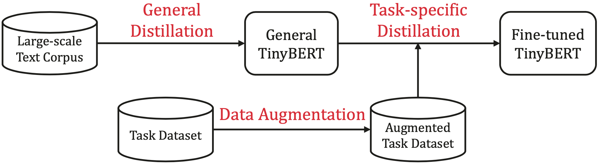

# TinyBERT: Distilling BERT for Natural Language Understanding
以下是本例的简要目录结构及说明：
```
.
├── task_distill.py       # 在特定任务上下的蒸馏脚本
└── README.md             # 文档，本文件
```
## 简介
本目录下的实验主要参考论文[《TinyBERT: Distilling BERT for Natural Language Understanding》](https://arxiv.org/abs/1909.10351)实现。
TinyBERT中蒸馏的整体过程：首先进行通用蒸馏，然后用数据增强后的数据，在特定任务上进行蒸馏，本文主要进行了第二阶段的蒸馏，模型是利用第一阶段得到的通用小模型进行初始化。

<p align="center">
<br />
TinyBERT蒸馏流程图
</p>


在模型蒸馏中，较大的模型（在本例中是BERT base）通常被称为教师模型，较小的模型（在本例中是层数为6的BERT，下文都称TinyBERT6）通常被称为学生模型。
知识的蒸馏通常是通过让学生模型学习相关的蒸馏相损失函数实现，在本实验中，蒸馏的学习目标由两个部分组成，分别是中间层的蒸馏损失和预测层的蒸馏损失。其中，中间层的蒸馏包括对Embedding层的蒸馏、对每个Transformer layer输出的蒸馏、以及对每个Transformer中attention矩阵（softmax之前的结果）的蒸馏，三者均采用的是均方误差损失函数。而预测层蒸馏的学习目标则是学生模型输出的logits和教师模型输出的logits的交叉熵损失。

由于教师模型是12层，学生模型的层数少于教师模型的层数，因此需要选择一种layer mapping的方式。参考论文实现，在这里采用了一种固定的映射方式，当学生模型的层数为教师模型的1/2时，学生第i层的attention矩阵，需要学习教师的第2i+1层的attention矩阵，Tnansformer layer输出同理。

本实验分为两个大的训练过程：先对BERT-base进行微调，得到教师模型，然后进行蒸馏的训练。其中，蒸馏过程也分为两个步骤：先对中间层进行蒸馏多个epochs（论文中是10、20或者30个），再对预测层蒸馏3个epochs。

## 数据、预训练模型介绍及获取

本实验使用GLUE中数据集中的训练集作为训练语料，用数据集中的验证集评估模型的效果。运行本目录下的实验，数据集会被自动下载到`paddlenlp.utils.env.DATA_HOME` 路径下，例如在linux系统下，对于GLUE中的QQP数据集，默认存储路径是`~/.paddlenlp/datasets/Glue/QQP`。

对于BERT的fine-tuning任务，本实验中使用了预训练模型`bert-bas-uncased`。同样，这几个模型在训练时会被自动下载到`paddlenlp.utils.env.DATA_HOME`路径下。例如，对于`bert-base-uncased`模型，在linux系统下，会被下载到`~/.paddlenlp/models/bert-base-uncased`下。

## 蒸馏实验过程

### 对BERT Fine-tuning得到教师模型
以GLUE的SST-2任务为例，调用BERT fine-tune的训练脚本，配置如下的参数，训练SST-2任务：

```shell
cd ../../benchmark/glue/
export CUDA_VISIBLE_DEVICES=0
export TASK_NAME=SST-2

python -u ./run_glue.py \
    --model_type bert \
    --model_name_or_path bert-base-uncased \
    --task_name $TASK_NAME \
    --max_seq_length 128 \
    --batch_size 32   \
    --learning_rate 2e-5 \
    --num_train_epochs 3 \
    --logging_steps 1 \
    --save_steps 500 \
    --output_dir ./tmp/$TASK_NAME/ \
    --n_gpu 1 \

```

训练完成之后，可将训练效果最好的模型保存在本项目下的`pretrained_models/$TASK_NAME/`下。模型目录下有`model_config.json`, `model_state.pdparams`, `tokenizer_config.json`及`vocab.txt`这几个文件。


### 数据增强扩充训练集

先下载glove embeddings

```
wget http://nlp.stanford.edu/data/glove.6B.zip
```

然后运行下面的命令对GLUE数据集进行扩展
```
export TASK_NAME=SST-2
export GLOVE_EMB="glove/glove.6B.300d.txt"
python data_augmentation.py --pretrained_bert_model bert-base-uncased \
                            --glove_embs $GLOVE_EMB \
                            --glue_dir /root/.paddlenlp/datasets/Glue/  \
                            --task_name $TASK_NAME

```

### 训练TinyBERT模型

```shell
export CUDA_VISIBLE_DEVICES=0
export TASK_NAME=SST-2

python task_distill.py \
    --model_type tinybert \
    --model_name_or_path tinybert-6l-768d-v2 \
    --task_name $TASK_NAME \
    --max_seq_length 64 \
    --batch_size 32   \
    --T 1 \
    --teacher_model_type bert \
    --teacher_path ../pretrained_models/SST-2/best_model_610 \
    --learning_rate 5e-5 \
    --num_train_epochs 10 \
    --logging_steps 10 \
    --save_steps 10 \
    --output_dir ./tmp/$TASK_NAME/ \
    --device gpu

```


### 实验中使用的超参数

|                                  | SST-2     | QQP       | MRPC      | CoLA      | STS-B     | RTE       | MNLI      | QNLI      |
| -------------------------------- | --------- | --------- | --------- | --------- | --------- | --------- | --------- | --------- |
| batch_size                       | 32        | 32        | 32        | 32        | 32        | 32        | 32        | 32        |
| max_seq_length                   | 64        | 128       | 128       | 64        | 128       | 128       | 128       | 128       |
| max_epochs_of_intermediate_layer | 20        | 10        | 20        | 50        | 20        | 20        | 10        | 10        |
| max_epochs_of_prediction_layer   | 3         | 3         | 3         | 3         | 3         | 3         | 3         | 3         |
| learning_rate(two stages)        | 5e-5/3e-5 | 5e-5/3e-5 | 5e-5/3e-5 | 5e-5/3e-5 | 5e-5/3e-5 | 5e-5/3e-5 | 5e-5/3e-5 | 5e-5/3e-5 |


## 蒸馏实验结果

TODO

## 参考文献

Jiao X, Yin Y, Shang L, et al. [TinyBERT: Distilling BERT for Natural Language Understanding](https://arxiv.org/abs/1909.10351)[J]. arXiv preprint arXiv:1909.10351v5, 2020.
