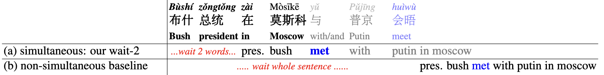
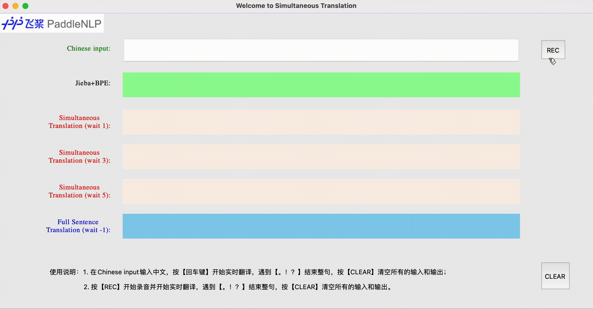

# Text Simultaneous Translation using Prefix-to-Prefix Framework: STACL

同声传译（Simultaneous Translation），即在句子完成之前进行翻译，同声传译的目标是实现同声传译的自动化，它可以与源语言同时翻译，延迟时间只有几秒钟。

同声传译的难点在于源语言和目标语言之间词序的差异带来的翻译延迟。 例如，考虑将SOV（主宾谓）语言（如日语或德语）翻译为SVO（主谓宾）语言（如英语或汉语），必须等到源语言动词出现才可以准确翻译。因此，翻译系统必须求助于传统的全句翻译，因此造成至少一句话的延迟。

本项目是基于机器翻译领域主流模型 Transformer[1]网络结构的同传模型STACL的PaddlePaddle 实现，包含模型训练，预测以及使用自定义数据等内容。用户可以基于发布的内容搭建自己的同传翻译模型。

## 模型介绍

### 模型特点

STACL 是论文 [STACL: Simultaneous Translation with Implicit Anticipation and Controllable Latency using Prefix-to-Prefix Framework](https://www.aclweb.org/anthology/P19-1289/) 中针对同传提出的适用于所有同传场景的翻译架构[2]，该架构基于Transformer实现，可参考PaddleNLP的[Transformer](https://github.com/PaddlePaddle/PaddleNLP/tree/develop/examples/machine_translation/transformer)。

STACL 主要具有以下优势：

- Prefix-to-Prefix架构拥有预测能力，即在未看到源词的情况下仍然可以翻译出对应的目标词，克服了SOV→SVO等词序差异；

- Wait-k策略可以不需要全句的源句，直接预测目标句，可以实现任意的字级延迟，同时保持较高的翻译质量。

#### Prefix-to-Prefix架构
<p align="center">
 <br />
图 1. Seq2Seq vs. STACL
</p>

和传统的机器翻译模型主要的区别在于翻译时是否需要利用全句的源句。上图中，Seq2Seq模型需要等到全句的源句（1-5）全部输入Encoder后，Decoder才开始解码进行翻译；而STACL架构采用了Wait-k（图中Wait-2）的策略，当源句只有两个词（1和2）输入到Encoder后，Decoder即可开始解码预测目标句的第一个词。

####  Wait-k 策略
Wait-k策略首先等待源句单词，然后与源句的其余部分同时翻译，即输出总是隐藏在输入后面。这是受到同声传译人员的启发，同声传译人员通常会在几秒钟内开始翻译演讲者的演讲，在演讲者结束几秒钟后完成。例如，如果k=2，第一个目标词使用前2个源词预测，第二个目标词使用前3个源词预测，以此类推。下图3中，(a)simultaneous: our wait-2 等到"布什"和"总统"输入后就开始解码预测"pres."，而(b) non-simultaneous baseline 为传统的翻译模型，需要等到整句"布什 总统 在 莫斯科 与 普京 会晤"才开始解码预测。
<p align="center">
 <br />
图 2. Wait-k 例子
</p>

## 环境依赖
 - attrdict==2.0.1
 - PyYAML==5.4.1
 - subword_nmt==0.3.7
 - jieba==0.42.1

安装命令：`pip install -r requirements.txt`

## 数据准备

### 数据分词
中文需要首先经过jieba分词，然后经过BPE分词(Byte Pair Encoding)；英文仅需要经过BPE分词。
BPE分词需要对应的BPE词典，这里提供下载链接：[中文BPE词典](https://bj.bcebos.com/paddlenlp/models/stacl/2M.zh2en.dict4bpe.zh) ，[英文BPE词典](https://bj.bcebos.com/paddlenlp/models/stacl/2M.zh2en.dict4bpe.en) 。

我们提供分词的接口，下面给出分词的具体操作：
```python
from utils.tokenizer import STACLTokenizer

tokenizer_zh = STACLTokenizer('2M.zh2en.dict4bpe.zh', is_chinese=True)
# 处理中文字符串
print(tokenizer_zh.tokenize('玻利维亚举行总统与国会选举'))
# 输出是: 玻@@ 利@@ 维亚 举行 总统 与 国会 选举

# 处理英文字符串
tokenizer_en = STACLTokenizer('2M.zh2en.dict4bpe.en', is_chinese=False)
print(tokenizer_en.tokenize('bolivia holds presidential and parliament elections'))
# 输出是：bol@@ i@@ via holds presidential and parliament elections
```

### 数据格式
每行数据为分词后的中英文，用制表符分割。
```
兵营 是 双@@ 枪 老@@ 大@@ 爷 的 前提 建筑 之一 。	it serves as a prerequisite for Re@@ apers to be built at the Bar@@ rac@@ ks .
```

## 单机训练

### 单机单卡/单机多卡
可以执行以下命令进行模型训练：
``` sh
unset CUDA_VISIBLE_DEVICES
python -m paddle.distributed.launch --gpus "0" train.py --config ./config/transformer.yaml
```

可以在`config/transformer.yaml` 文件中设置相应的参数。如果执行不提供 `--config` 选项，程序将默认使用`config/transformer.yaml` 的配置。

建议：如果为了更好的效果，可先在整句模型(即`waik=-1`)进行预训练，然后在此基础上根据不同的waitk进行微调来训练不同的waitk模型，训练的命令都同上，下面给出具体的流程以及主要的参数配置：
- Pretrain
  用来训练整句模型(即`waik=-1`)，可在`config/transformer.yaml`文件中配置参数：
  - `waik`表示waik策略，这里设置为-1
  - `training_file`表示训练集，数据格式同上文
  - `validation_file`表示验证集，数据格式同上文
  - `init_from_checkpoint`表示模型目录，从该checkpoint恢复训练，这里设置为空
  - `init_from_pretrain_model`表示模型目录，从该checkpoint开始finetune下游任务，这里设置为空
  - `device`选择训练用的设备，支持cpu/gpu/xpu，默认为gpu
  - `use_amp`表示混合精度训练，示例设置为False
- Finetune
  用来训练waik模型(即`waitk=1,2,3,4...`)，可在`config/transformer.yaml`文件中配置参数：
  - `waik`表示waik策略，这里设置为3（以wait-3模型为例）
  - `training_file`表示训练集，数据格式同上文
  - `validation_file`表示验证集，数据格式同上文
  - `init_from_checkpoint`表示模型目录，从该checkpoint恢复训练，这里设置`waik=-1`模型的ckeckpoint
  - `init_from_pretrain_model`表示模型目录，从该checkpoint开始finetune下游任务，这里设置为空
  - `device`选择训练用的设备，支持cpu/gpu/xpu，默认为gpu
  - `use_amp`表示混合精度训练，示例设置为False
## 模型推理

模型训练完成后可以执行以下命令对指定文件中的文本进行翻译：

``` sh
# setting visible devices for prediction
export CUDA_VISIBLE_DEVICES=0
python predict.py --config ./config/transformer.yaml
```
- Predict
 根据具体的waik策略来进行翻译，可在`config/transformer.yaml`文件中配置参数，预测的命令同上，下面给出主要的参数说明：
  - `waik`表示waik策略，这里设置为3（以wait-3模型为例）
  - `predict_file`表示测试集，数据格式是BPE分词后的源语言（中文为Jieba+BPE分词），按行区分
  - `output_file`表示输出文件，翻译结果会输出到该参数指定的文件
  - `init_from_params`表示模型的所在目录，根据具体的`waik`来设置，这里设置为`wait=3`模型目录
  - 更多参数的使用可以在 `config/transformer.yaml`文件中查阅注释说明并进行更改设置。如果执行不提供 `--config` 选项，程序将默认使用 `config/transformer.yaml` 的配置。

需要注意的是，目前预测仅实现了单卡的预测，原因在于，翻译后面需要的模型评估依赖于预测结果写入文件顺序，多卡情况下，目前暂未支持将结果按照指定顺序写入文件。


## 模型评估

预测结果中每行输出是对应行输入的得分最高的翻译，对于使用 BPE 的数据，预测出的翻译结果也将是 BPE 表示的数据，要还原成原始的数据（这里指 tokenize 后的数据）才能进行正确的评估。评估过程具体如下（BLEU 是翻译任务常用的自动评估方法指标）：

``` sh
# 还原 predict.txt 中的预测结果为 tokenize 后的数据
sed -r 's/(@@ )|(@@ ?$)//g' predict.txt > predict.tok.txt
# 若无 BLEU 评估工具，需先进行下载
git clone https://github.com/moses-smt/mosesdecoder.git
# 以中英翻译 newstest2017 测试数据为例
perl mosesdecoder/scripts/generic/multi-bleu.perl newstest2017.tok.en < predict.tok.txt
```

## 模型下载（更新中）
我们提供基于NIST（中->英，共2M中英句对）预训练模型，供大家下载，下载后需解压使用。
| Wait-k策略     | 模型连接     | 4-ref BLEU on NIST 2008|
| ------------ | --------------- |---------|
| Wait-1 | [下载](https://bj.bcebos.com/paddlenlp/models/stacl/nist_zhen_full_w1.tar.gz) |30.94|
| Wait-3   |[下载](https://bj.bcebos.com/paddlenlp/models/stacl/nist_zhen_full_w3.tar.gz) |34.24 |
| Wait-5   |[下载](https://bj.bcebos.com/paddlenlp/models/stacl/nist_zhen_full_w5.tar.gz) |36.30 |
| Wait-7   |[下载](https://bj.bcebos.com/paddlenlp/models/stacl/nist_zhen_full_w7.tar.gz) |37.84 |
| Wait_-1(整句模型)   |[下载](https://bj.bcebos.com/paddlenlp/models/stacl/nist_zhen_full_sent.tar.gz) |41.41 |
词表下载：[source vocab](https://bj.bcebos.com/paddlenlp/models/stacl/nist.20k.zh.vocab) ，[target vocab](https://bj.bcebos.com/paddlenlp/models/stacl/nist.10k.en.vocab)

## Demo展示
通过GUI界面的Demo来模拟STACL实时翻译的效果，下图为Demo示例，实现细节可查看[demo](./demo)
<p align="center">
 <br />
图 3. 文本同传
</p>
<p align="center">
 <br />
图 4. 语音同传
</p>

## 参考文献
1. Vaswani A, Shazeer N, Parmar N, et al. [Attention is all you need](http://papers.nips.cc/paper/7181-attention-is-all-you-need.pdf)[C]//Advances in Neural Information Processing Systems. 2017: 6000-6010.
2. Ma M ,  Huang L ,  Xiong H , et al. [STACL: Simultaneous Translation with Implicit Anticipation and Controllable Latency using Prefix-to-Prefix Framework](https://www.aclweb.org/anthology/P19-1289/)[J]//Proceedings of the 57th Annual Meeting of the Association for Computational Linguistics. 2018: 3025–3036.
3. He K, Zhang X, Ren S, et al. [Deep residual learning for image recognition](http://openaccess.thecvf.com/content_cvpr_2016/papers/He_Deep_Residual_Learning_CVPR_2016_paper.pdf)[C]//Proceedings of the IEEE conference on computer vision and pattern recognition. 2016: 770-778.
4. Ba J L, Kiros J R, Hinton G E. [Layer normalization](https://arxiv.org/pdf/1607.06450.pdf)[J]. arXiv preprint arXiv:1607.06450, 2016.
