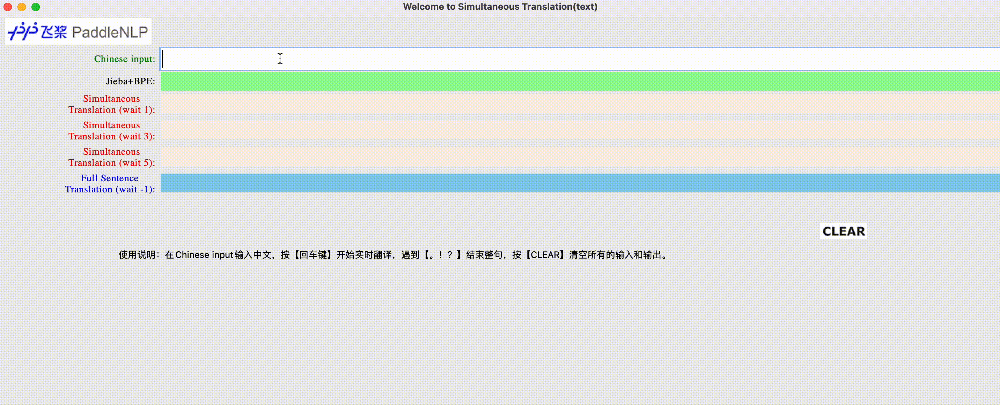

# Demo for STACL

该Demo模拟同传模型STACL实时翻译的效果。
<p align="center">
 <br />
图 1. 效果展示
</p>
用户通过Chinese input文本框进行输入，通过Jieba和BPE得到分词结果。Simultaneous Translation (wait 1)是读取1个token（分词后）后开始实时翻译，同理，Simultaneous Translation (wait 3)是读取3个token后开始实时翻译，Simultaneous Translation (wait 5)是读取5个token后开始实时翻译。最后，Full Sentence Translation(wait -1)是读取所有的token即整句后开始翻译。
由上图可见，waitk越大(waitk=-1可看作waitk=∞)，读入的信息越多，实时翻译效果越好。

### 目录结构

```text
.
├── README.md             # 文档，本文件
├── demo.py               # 启动demo的主程序文件
├── images  
│   ├── clear.png         # Demo界面元素
│   ├── demo_show.gif     # Demo效果展示图
│   └── paddlenlp.png     # Demo界面logo
├── model_for_demo.py     # STACL模型文件
├── models                # 预训练模型路径
│   ├── nist_wait_-1      # waitk=-1（整句模型）
│   ├── nist_wait_1       # waitk=1模型
│   ├── nist_wait_3       # waitk=3模型
│   └── nist_wait_5       # waitk=5模型
├── requirements.txt      # 环境依赖文件
└── transformer_demo.yaml # 参数配置文件
```

上述models下的模型可以在这里[下载](https://github.com/PaddlePaddle/PaddleNLP/blob/develop/examples/simultaneous_translation/stacl/README.md#%E6%A8%A1%E5%9E%8B%E4%B8%8B%E8%BD%BD%E6%9B%B4%E6%96%B0%E4%B8%AD)，下载完后将解压后的`transformer.pdparams`分别放在不同的waitk策略对应的子目录下面。

### 参数说明与配置

可以在`config/transformer_demo.yaml` 文件中设置相应的参数，下面给出主要的参数配置：

- `src_bpe_dict`配置源语言（这里是中文）的BPE词表，[中文BPE词表下载](https://paddlenlp.bj.bcebos.com/models/stacl/2M.zh2en.dict4bpe.zh)
- `src_vocab_fpath`配置源语言（这里是中文）词表，[source vocab](https://paddlenlp.bj.bcebos.com/models/stacl/nist.20k.zh.vocab)
- `trg_vocab_fpath`配置目标语言（这里是英文）词表，[target vocab](https://paddlenlp.bj.bcebos.com/models/stacl/nist.10k.en.vocab)
- `device`选择预测用的设备，支持cpu/gpu/xpu，默认为cpu

### 环境依赖

- attrdict==2.0.1
- PyYAML==5.4.1
- subword_nmt==0.3.7
- jieba==0.42.1

安装命令：`pip install -r requirements.txt`

### 使用说明

1. 下载好预训练模型，并放在对应的目录下；
2. 下载好词表（源语言词表，目标语言词表，BPE词表），并在配置文件`transformer_demo.yaml`中修改相应的参数；
3. 运行`demo.py`；
4. 出现界面，在Chinese input文本框中输入中文，按【回车键】开始实时翻译，遇到【。！？】结束整句，按【CLEAR】清空所有的输入和输出。
