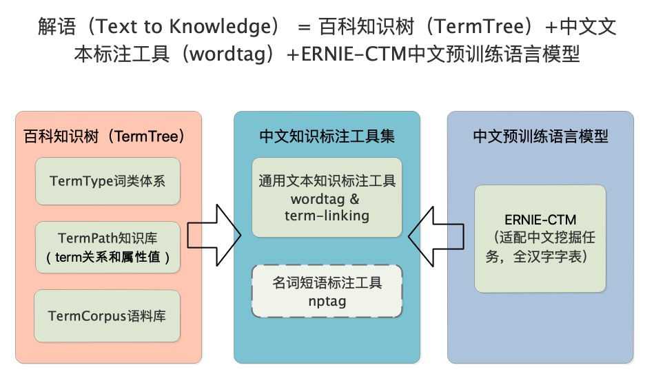

# 解语（Text to Knowledge）

解语（Text to Knowledge）是首个中文全词类描述的知识库及知识标注框架，拥有可覆盖所有中文词汇的概念体系、全词类文本知识标注工具，及更适用于中文挖掘任务的预训练语言模型。

全词类知识标注能够帮助你面对更加多元的应用场景，可以让你方便地将自有的知识体系应用于文本之中，预训练语言模型能够帮助你得到更加精准的挖掘结果。



[百科知识树：描述所有汉语词汇的树状知识库](./termtree)

[中文文本知识标注工具集：wordtag](./wordtag)

[ERNIE-CTM：适用于中文文本挖掘任务的全字表预训练语言模型](./ernie-ctm)

## 快速开始

### 快速加载标注工具

## 在论文中引用解语
如果您的工作成果中使用了TermTree，请增加下述引用。我们非常乐于看到TermTree对您的工作带来帮助。
```
@article{zhao2020TermTree,
	title={TermTree and Knowledge Annotation Framework for Chinese Language Understanding},
	author={Zhao, Min and Qin, Huapeng and Zhang, Guoxin and Lyu, Yajuan and Zhu, Yong},
    technical report={Baidu, Inc. TR:2020-KG-TermTree},
    year={2020}
}
```