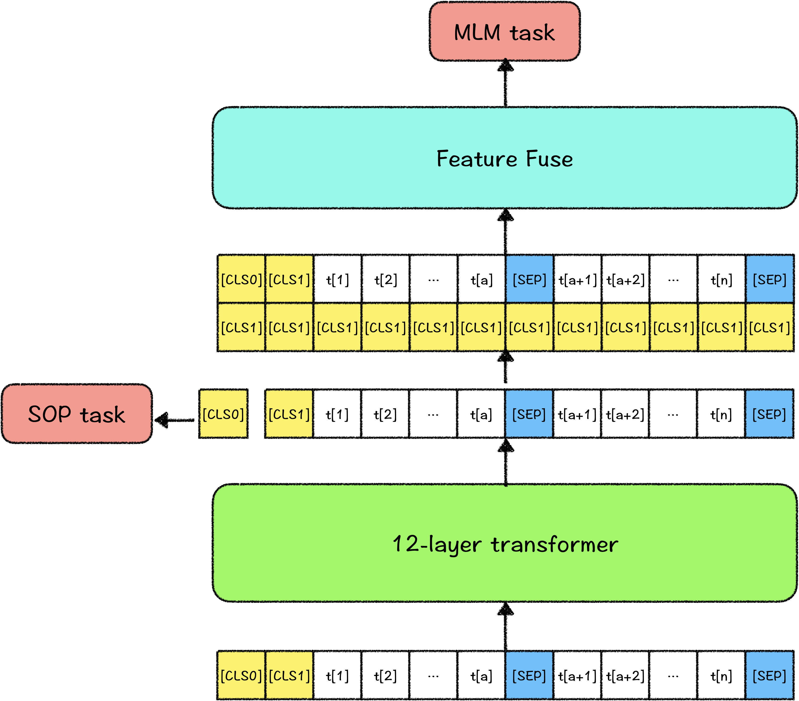

# 解语：ERNIE-CTM（ERNIE for **Chinese Text Mining**）

ERNIE-CTM是适用于中文文本挖掘任务的预训练语言模型，拥有更全面的汉字字表集合，更优的中文文本挖掘任务表现，与PaddleNLP深度结合，提供更加便捷的应用实践。

## ERNIE-CTM特点

- 全面的中文汉字字表扩充
  - ERNIE-CTM的字符集包含2万+汉字，以及中文常用符号（常用标点、汉语拼音、编号）、部分外语符号（假名、单位）等，大幅减少中文解析挖掘任务中UNK（未识别字符）引发的标注问题。同时，ERNIE-CTM使用了embedding分解，可以更加灵活地扩充应用字表。
- 更加适配中文文本挖掘任务
  - ERNIE-CTM中在每个表示后面添加了全局信息，在序列特征上叠加了全局的信息，使得在文本挖掘任务上有更加强力的表现。
- 支持多种特征训练的模型结构
  - ERNIE-CTM的模型结构中，支持多种特征训练，用户可按照自己的需求任意添加任务及对应特征训练模型，而无需考虑任务之间的冲突所造成的灾难性遗忘。


## ERNIE-CTM模型介绍

### 模型结构

ERNIE-CTM的模型结构大体与BERT相同，都是双向transformer结构。区别是，ERNIE-CTM为能灵活扩充字表，采用了ALBERT的embedding分解，将embedding层分解为128维，参数列表如下：

| 模型           | embedding size | hidden size | hidden layers | vocab size |
| -------------- | -------------- | ----------- | ------------- | ---------- |
| ERNIE-CTM-base | 128            | 768         | 12            | 23000      |

ERNIE-CTM以字粒度建模，英文区分大小写，其输入表示如下：


其中，`[CLS{n}]`是ERNIE-CTM预留出的全局观察位，其中`n`从0开始计数，该全局观察位用于不同的训练任务，建模不同的语义特征，在下游任务中，可以结合使用，如使用attention筛选/融合特征，以达到更好的效果。而在灵活使用`[CLS{n}]`的时候，为中途增减任务token时不影响文本输入，所有的`[CLS{n}]`的位置编码均为0，且可以使用可见性矩阵（visible matrix）控制`[CLS{n}]`位置的特征对序列中其他位置，以及其他的全局观察位的可见性，以获得更加灵活、独立的特征表示。

本次开源的ERNIE-CTM-base模型中，使用了两个全局观察位`[CLS0]`和`[CLS1]`，具体作用见下文预训练任务介绍。

### 预训练任务

ERNIE-CTM使用的预训练任务为掩码语言模型（Masked Language Model，MLM）及ALBERT所使用的句子顺序预测（Sentence Order Prediction，SOP）。

其中`[CLS0]`用于训练SOP任务，训练方式如ALBERT中描述，正例为同一篇文章中的两个连续的句子，负例为用一篇文章中两个连续的句子顺序翻转。

`[CLS1]`做为全局的监督信号，应用于MLM任务中。训练MLM任务前，将`[CLS1]`特征表示拼接在所有的序列表示之后，通过线性层融合，成为最终的序列表示，之后预测MLM任务。所以，ERNIE-CTM最终输出的文本序列表示中，都融合了`[CLS1]`的特征表示。最终的序列表示中，带有全句的特征，一定程度可避免序列中全局特征捕捉不足，同时，`[CLS1]`最终的表示中也充分融合了句子内容的信息，弥补了SOP任务对文本主题信息捕捉不足的缺陷。



### WordTag增量训练

在Ernie-Ctm微调任务中我们提供了一个基于[WordTag](../wordtag)的百科知识标注任务，该任务旨在解析中文词汇的知识标注，在该词性体系中覆盖了所有中文词汇的词类体系，包括各类实体词与非实体词（如概念、实体/专名、语法词等）。除了使用已有的WordTag工具对通用中文文本进行词类知识标注，WordTag同样支持用户使用自己的数据进行增量训练，下面是在WordTag模型上进行增量训练的具体示例流程。

#### 代码结构说明

```text
wordtag/
├── data.py # 训练数据处理脚本
├── metric.py # 模型效果验证指标脚本
├── predict.py # 预测脚本
├── README.md # 使用说明
├── train.py  # 训练脚本
└── utils.py  # 工具函数
```

#### 数据准备

我们提供了少数样本用以示例增量训练。执行以下命令，下载并解压示例数据集：

```bash
wget https://bj.bcebos.com/paddlenlp/paddlenlp/datasets/wordtag_dataset_v2.tar.gz && tar -zxvf wordtag_dataset_v2.tar.gz
```
解压之后

```text
data/
├── dev.txt # 验证集
├── tags.txt # WordTag标签集合
└── train.json  # 训练数据
```

训练样本示例如下，每个单词以"/type"的形式标记其词性或实体类别，单词之间使用空格作为切分标记

```text
砚台/物体类 与/连词 笔/物体类 、/w 墨/物体类 、/w 纸/物体类 是/肯定词 中国/世界地区类 传统/修饰词 的/助词 文房四宝/词汇用语 。/w
《/w 全球化与中国：理论与发展趋势/作品类_实体 》/w 是/肯定词 2010年/时间类 经济管理出版社/组织机构类 出版/场景事件 的/助词 图书/作品类_概念 ，/w 作者/人物类_概念 是/肯定词 余永定/人物类_实体 、/w 路爱国/人物类_实体 、/w 高海红/人物类_实体 。/w
```

#### 模型训练

```shell
python -m paddle.distributed.launch --gpus "0"  train.py \
    --max_seq_len 128 \
    --batch_size 32   \
    --learning_rate 5e-5 \
    --num_train_epochs 3 \
    --logging_steps 10 \
    --save_steps 100 \
    --output_dir ./output \
    --device "gpu"
```

其中参数释义如下：
- `max_seq_length` 表示最大句子长度，超过该长度将被截断。
- `batch_size` 表示每次迭代**每张卡**上的样本数目。
- `learning_rate` 表示基础学习率大小，将于learning rate scheduler产生的值相乘作为当前学习率。
- `num_train_epochs` 表示训练轮数。
- `logging_steps` 表示日志打印间隔。
- `save_steps` 表示模型保存及评估间隔。
- `output_dir` 表示模型保存路径。
- `device` 表示训练使用的设备, 'gpu'表示使用GPU, 'xpu'表示使用百度昆仑卡, 'cpu'表示使用CPU。


### 模型预测

```shell
export CUDA_VISIBLE_DEVICES=0
python -m paddle.distributed.launch --gpus "0" predict.py \
    --params_path ./output/model_300/model_state.pdparams \
    --batch_size 32 \
    --device "gpu"
```

## 自定义模型一键预测

Taskflow支持加载增量训练后的模型进行一键预测，通过`task_path`定义用户自定义路径即可。

文件组成：
```text
custom_task_path/
├── model_state.pdparams
├── model_config.json
└── tags.txt
```

```python
from paddlenlp import Taskflow

my_wordtag = Taskflow("knowledge_mining", task_path="./custom_task_path/")

my_wordtag("美人鱼是周星驰执导的一部电影")
# [{'text': '美人鱼是周星驰执导的一部电影', 'items': [{'item': '美人鱼', 'offset': 0, 'wordtag_label': '作品类_实体', 'length': 3, 'termid': '作品与出版物_eb_美人鱼'}, {'item': '是', 'offset': 3, 'wordtag_label': '肯定词', 'length': 1, 'termid': '肯定否定词_cb_是'}, {'item': '周星驰', 'offset': 4, 'wordtag_label': '人物类_实体', 'length': 3, 'termid': '人物_eb_周星驰'}, {'item': '执导', 'offset': 7, 'wordtag_label': '场景事件', 'length': 2, 'termid': '场景事件_cb_执导'}, {'item': '的', 'offset': 9, 'wordtag_label': '助词', 'length': 1, 'termid': '助词_cb_的'}, {'item': '一部', 'offset': 10, 'wordtag_label': '数量词', 'length': 2}, {'item': '电影', 'offset': 12, 'wordtag_label': '作品类_概念', 'length': 2, 'termid': '影视作品_cb_电影'}]}]
```


## ERNIE-CTM后续计划


1. 提升预训练语料的多样性（开源版主要使用了百度百科语料），持续优化预训练模型
2. 发布其他参数量的预训练模型（tiny、large等），便于不同场景应用
3. 维护开源社区，探索模型优化方向，整合优秀idea


## 在论文中引用ERNIE-CTM

如果您的工作成果中使用了ERNIE-CTM，请增加下述引用。我们非常乐于看到ERNIE-CTM对您的工作带来帮助。
```
@article{zhao2020TermTree,
    title={TermTree and Knowledge Annotation Framework for Chinese Language Understanding},
    author={Zhao, Min and Qin, Huapeng and Zhang, Guoxin and Lyu, Yajuan and Zhu, Yong},
    technical report={Baidu, Inc. TR:2020-KG-TermTree},
    year={2020}
}
```


## 问题与反馈

ERNIE-CTM在持续优化中，如果您有任何建议或问题，欢迎提交issue到Github。
