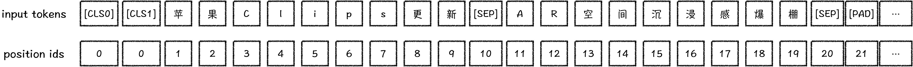
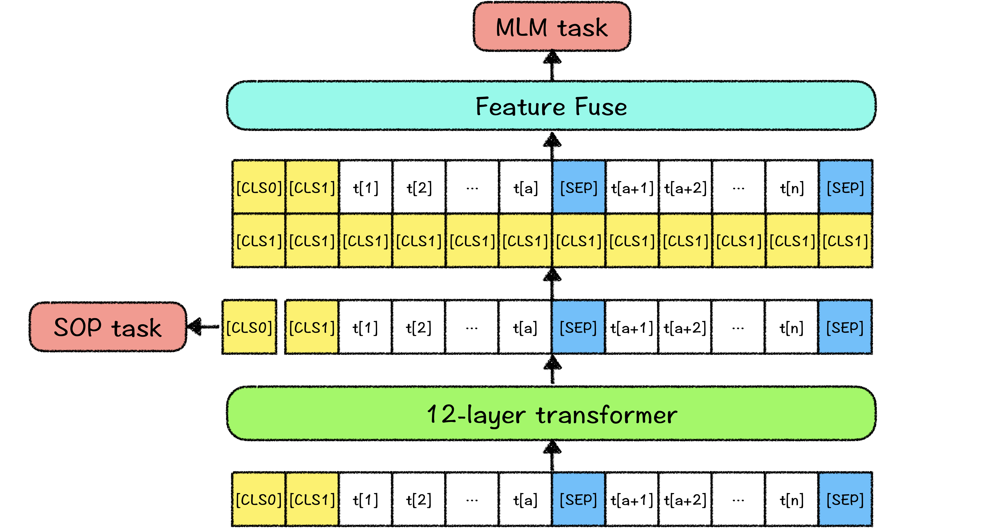

# 解语：ERNIE-CTM（ERNIE for **Chinese Text Mining**）

ERNIE-CTM是适用于中文文本挖掘任务的预训练语言模型，拥有更全面的汉字字表集合，更优的中文文本挖掘任务表现，与PaddleNLP深度结合，提供更加便捷的应用实践。

## Ernie-CTM特点

- 全面的中文汉字字表扩充
  - ERNIE-CTM的字符集包含2万+汉字，以及中文常用符号（常用标点、汉语拼音、编号）、部分外语符号（假名、单位）等，大幅减少中文解析挖掘任务中UNK（未识别字符）引发的标注问题。同时，ERNIE-CTM使用了embedding分解，可以更加灵活地扩充应用字表。
- 更加适配中文文本挖掘任务
  - ERNIE-CTM中在每个表示后面添加了全局信息，在序列特征上叠加了全局的信息，使得在文本挖掘任务上有更加强力的表现。
- 支持多种特征训练的模型结构
  - ERNIE-CTM的模型结构中，支持多种特征训练，用户可按照自己的需求任意添加任务及对应特征训练模型，而无需考虑任务之间的冲突所造成的灾难性遗忘。


## Ernie-CTM模型介绍

### 模型结构

ERNIE-CTM的模型结构大体与BERT相同，都是双向transformer结构。区别是，ERNIE-CTM为能灵活扩充字表，采用了ALBERT的embedding分解，将embedding层分解为128维，参数列表如下：

| 模型           | embedding size | hidden size | hidden layers | vocab size |
| -------------- | -------------- | ----------- | ------------- | ---------- |
| ERNIE-CTM-base | 128            | 768         | 12            | 23000      |

ERNIE-CTM以字粒度建模，英文区分大小写，其输入表示如下：



其中，`[CLS{n}]`是ERNIE-CTM预留出的全局观察位，其中`n`从0开始计数，该全局观察位用于不同的训练任务，建模不同的语义特征，在下游任务中，可以结合使用，如使用attention筛选/融合特征，以达到更好的效果。而在灵活使用`[CLS{n}]`的时候，为中途增减任务token时不影响文本输入，所有的`[CLS{n}]`的位置编码均为0，且可以使用可见性矩阵（visible matrix）控制`[CLS{n}]`位置的特征对序列中其他位置，以及其他的全局观察位的可见性，以获得更加灵活、独立的特征表示。

本次开源的ERNIE-CTM-base模型中，使用了两个全局观察位`[CLS0]`和`[CLS1]`，具体作用见下文预训练任务介绍。

### 预训练任务

ERNIE-CTM使用的预训练任务为掩码语言模型（Masked Language Model，MLM）及ALBERT所使用的句子顺序预测（Sentence Order Prediction，SOP）。

其中`[CLS0]`用于训练SOP任务，训练方式如ALBERT中描述，正例为同一篇文章中的两个连续的句子，负例为用一篇文章中两个连续的句子顺序翻转。

`[CLS1]`做为全局的监督信号，应用于MLM任务中。训练MLM任务前，将`[CLS1]`特征表示拼接在所有的序列表示之后，通过线性层融合，成为最终的序列表示，之后预测MLM任务。所以，ERNIE-CTM最终输出的文本序列表示中，都融合了`[CLS1]`的特征表示。最终的序列表示中，带有全句的特征，一定程度可避免序列中全局特征捕捉不足，同时，`[CLS1]`最终的表示中也充分融合了句子内容的信息，弥补了SOP任务对文本主题信息捕捉不足的缺陷。




## Ernie-CTM后续计划

1. 提升预训练语料的多样性（开源版主要使用了百度百科语料），持续优化预训练模型
2. 发布其他参数量的预训练模型（tiny、large等），便于不同场景应用
3. 维护开源社区，探索模型优化方向，整合优秀idea


## 在论文中引用ERNIE-CTM

如果您的工作成果中使用了ERNIE-CTM，请增加下述引用。我们非常乐于看到ERNIE-CTM对您的工作带来帮助。
```
@article{zhao2020TermTree,
    title={TermTree and Knowledge Annotation Framework for Chinese Language Understanding},
    author={Zhao, Min and Qin, Huapeng and Zhang, Guoxin and Lyu, Yajuan and Zhu, Yong},
    technical report={Baidu, Inc. TR:2020-KG-TermTree},
    year={2020}
}
```


## 问题与反馈

ERNIE-CTM在持续优化中，如果您有任何建议或问题，欢迎提交issue到Github。