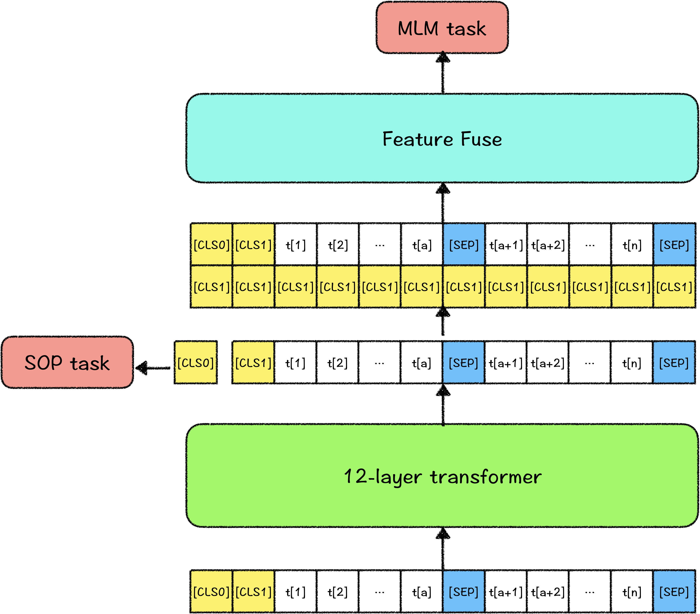

# 解语 - ERNIR-CTM

ERNIE-CTM（**C**hinese **T**ext **M**ining）是适用于中文文本挖掘任务的全汉字字表预训练语言模型，拥有更全的中文字表集合，更优的挖掘任务表现，与PaddleNLP深度结合，提供更加便捷的应用实践。

## 特性

- 中文全汉字字表扩充
  - ERNIE-CTM添加了2万+的常用汉字，以及中文常用符号（常用标点、汉语拼音、编号）、部分外语符号（假名、单位）等符号，大幅减少UNK所引发的标注问题；且ERNIE-CTM区别英文字母大小写，更好地区分文本挖掘中部分英文特征。同时，ERNIE-CTM使用了embedding分解，可以更加灵活地扩充字表
- 更加适配中文文本挖掘任务
  - ERNIE-CTM中在每个表示后面添加了新的特征，使得在文本挖掘任务上有更加强力的表现
- 支持多种特征训练的模型结构
  - ERNIE-CTM的模型结构中，支持多种特征训练，用户可按照自己的需求任意添加任务及对应特征训练模型，而无需考虑任务之间的冲突所造成的灾难性遗忘

## 模型表现

| 模型               | 参数量 | XNLI     | LCQMC    | MSRA-NER  |
| ------------------ | ------ | -------- | -------- | --------- |
| BERT-chinese       | 108M   | 77.8     | 86.9     | 95.38     |
| ALBERT-xlarge      | 59M    | 74.0     | 86.76    | 89.51     |
| RoBERTa-large      | 334M   | **79.9** | 87.2     | 96.07     |
| RoBERTa-wwm-ext    | 108M   | 79.28    | 86.33    | 95.06     |
| **ERNIE-CTM-base** | 88M    | 76.31    | **87.3** | **97.42** |

且ERNIE-CTM在wordtag及其他文本挖掘任务上相较于其他同等参数量模型均有较好的表现。

## 模型介绍

### 模型结构

ERNIE-CTM的模型结构大体与BERT相同，都是双向transformer结构。区别是，ERNIE-CTM为能灵活扩充字表，采用了ALBERT的embedding分解，将embedding层分解为128维，参数列表如下：

| 模型           | embedding size | hidden size | hidden layers | vocab size |
| -------------- | -------------- | ----------- | ------------- | ---------- |
| ERNIE-CTM-base | 128            | 768         | 12            | 23000      |

ERNIE-CTM以字粒度建模，英文区分大小写，其输入表示如下：


其中，`[CLS{n}]`是ERNIE-CTM预留出的全局观察位，其中`n`从0开始计数，该全局观察位用于不同的训练任务，建模不同的语义特征，在下游任务中，可以结合使用，如使用attention筛选/融合特征，以达到更好的效果。而在灵活使用`[CLS{n}]`的时候，为中途增减任务token时不影响文本输入，所有的`[CLS{n}]`的位置编码均为0，且可以使用可见性矩阵（visible matrix）控制`[CLS{n}]`位置的特征对序列中其他位置，以及其他的全局观察位的可见性，以获得更加灵活、独立的特征表示。

本次开源的ERNIE-CTM-base模型中，使用了两个全局观察位`[CLS0]`和`[CLS1]`，具体作用见下文预训练任务介绍。

### 预训练任务

ERNIE-CTM使用的预训练任务为掩码语言模型（Masked Language Model，MLM）及ALBERT所使用的句子顺序预测（Sentence Order Prediction，SOP）。

其中`[CLS0]`用于训练SOP任务，训练方式如ALBERT中描述，正例为同一篇文章中的两个连续的句子，负例为用一篇文章中两个连续的句子顺序翻转。

`[CLS1]`做为全局的监督信号，应用于MLM任务中。训练MLM任务前，将`[CLS1]`特征表示拼接在所有的序列表示之后，通过线性层融合，成为最终的序列表示，之后预测MLM任务。所以，ERNIE-CTM最终输出的文本序列表示中，都融合了`[CLS1]`的特征表示。最终的序列表示中，带有全句的特征，一定程度可避免序列中全局特征捕捉不足，同时，`[CLS1]`最终的表示中也充分融合了句子内容的信息，弥补了SOP任务对文本主题信息捕捉不足的缺陷。



## 快速开始

### 数据准备

我们提供了少数样本用以示例输入数据格式。执行以下命令，下载并解压示例数据集：

```bash
python download.py --data_dir ./  
```

训练使用的数据可以由用户根据实际的应用场景，自己组织数据。每行数据都由tokens、tags、cls_label组成，tags采用 BIOES 标注体系，cls_label是整个句子的分类，包含"编码/引用/列表","外语句子","古文/古诗句","其他文本"四种，由于目前发布的预训练模型针对的是现代文，因此前三种文本只用于训练文本分类，不用于训练序列标注。

示例如下：

```text
{"tokens": ["1", ".", "1", ".", "8", "车", "辆", "自", "动", "驾", "驶", "及", "控", "制", " ", "8"], "tags": ["B-数量词", "I-数量词", "I-数量词", "I-数量词", "E-数量词", "B-物体类", "E-物体类", "B-场景事件", "I-场景事件", "I-场景事件", "E-场景事件", "S-连词", "B-场景事件", "E-场景事件", "S-w", "S-数量词"], "cls_label": "编码/引用/列表"}
{"tokens": ["亦", "在", "空", "中", "捕", "食", "，", "边", "飞", "翔", "边", "捕", "食", "。"], "tags": ["S-词汇用语", "S-介词", "B-位置方位", "E-位置方位", "B-场景事件", "E-场景事件", "S-w", "S-词汇用语", "B-场景事件", "E-场景事件", "S-词汇用语", "B-场景事件", "E-场景事件", "S-w"], "cls_label": "其他文本"}
```


### 模型训练

#### 单卡训练

```bash
python -u train.py \
    --max_seq_len 128 \
    --batch_size 32   \
    --learning_rate 1e-4 \
    --num_train_epochs 3 \
    --logging_steps 10 \
    --save_steps 100 \
    --output_dir ./tmp/ \
    --device "gpu"
```

#### 多卡训练
```bash
python -m paddle.distributed.launch --gpus "0,1"  train.py \
    --max_seq_len 128 \
    --batch_size 32   \
    --learning_rate 1e-4 \
    --num_train_epochs 3 \
    --logging_steps 10 \
    --save_steps 100 \
    --output_dir ./tmp/ \
    --device "gpu"
```

其中参数释义如下：
- `max_seq_length` 表示最大句子长度，超过该长度将被截断。
- `batch_size` 表示每次迭代**每张卡**上的样本数目。
- `learning_rate` 表示基础学习率大小，将于learning rate scheduler产生的值相乘作为当前学习率。
- `num_train_epochs` 表示训练轮数。
- `logging_steps` 表示日志打印间隔。
- `save_steps` 表示模型保存及评估间隔。
- `output_dir` 表示模型保存路径。
- `device` 表示训练使用的设备, 'gpu'表示使用GPU, 'xpu'表示使用百度昆仑卡, 'cpu'表示使用CPU。


### 模型评估

通过加载训练过程中保存的模型，可以对验证集数据进行验证，启动方式如下：

```bash
python -u eval.py \
    --max_seq_len 128 \
    --batch_size 32   \
    --init_ckpt_dir ./tmp/ernie_ctm_ft_model_1.pdparams \
    --device "gpu"
```

其中 init_ckpt_dir 是模型加载路径，请根据具体的模型路径填写该项。

### 模型预测

对无标签数据可以启动模型预测：

```bash
python -u predict.py \
    --max_seq_len 128 \
    --batch_size 32   \
    --init_ckpt_dir ./tmp/ernie_ctm_ft_model_1.pdparams \
    --device "gpu"
```

## 后续计划

1. 持续优化预训练模型
2. 发布其他参数量的预训练模型（tiny、large等）
3. 维护开源社区，探索模型优化方向，整合优秀idea
