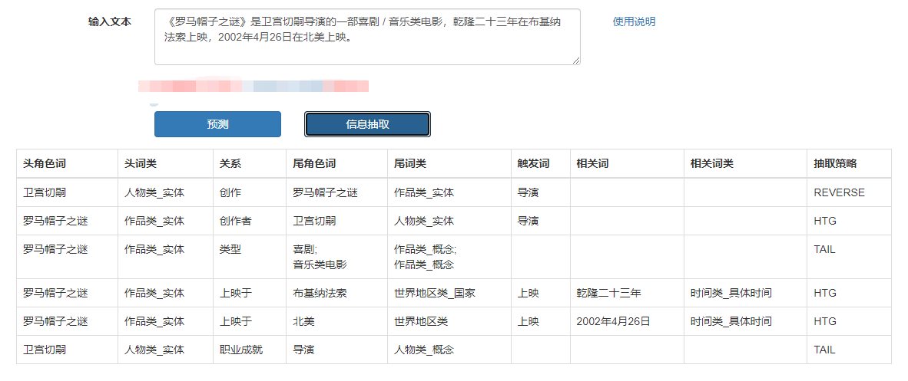

# 解语：WordTag-IE（基于中文词类知识的信息抽取工具）

WordTag-IE（基于中文词类知识的信息抽取工具）是在WordTag标注结果之上实现的信息抽取工具，旨在提供一个灵活、可配置，能够精准、全面覆盖简单句式的**规则信息抽取工具**。我们已提供了通用配置，可覆盖大部分通用文本。用户也可以根据我们提供的配置方法，完成自己的配置，应用于自己的领域、专业文本。其产出数据，可作为模型的训练样本，也可以直接当作挖掘结果使用。



## WordTag-IE特点

- **灵活、方便的配置，即时生效**
  - WordTag-IE是在WordTag标注结果的基础上，完全使用规则实现的关系抽取工具。其配置完全基于WordTag的词类知识以及TermTree中的词表实现，实现了灵活、简单配置，且保证了产出数据的一致性

## 使用示例

（待上线后补充）

## 配置示例

我们提供了配置示例文件[demo_config.json](./demo_config.json)了，用户可以直接基于这个文件实现自己想要的配置。

我们以“出版方”这个关系为例：

```json
{
    "head_role": "作品类_实体", //头实体词类
    "group": "出版方", //关系名
    "tail_role": [
        {
            "main": [
                "组织机构类"
            ], //尾实体词类
            "support": [
                "时间类_具体时间"
            ] //相关词类，可作为该关系的补充，不可作为尾实体独立存在
        }
    ], //尾实体配置
    "trig_word": [
        "出版"
    ], //触发词，对于没有触发词，而是由头尾实体直接触发的关系，可为null
    "trig_type": "trigger", //trigger表明由触发词触发，tail表明为尾实体触发
    "reverse": false, //是否为反向配置，即尾实体实际是头，头实体实际是尾
    "rel_group": "出版" //对应的反关系，即头尾实体对调后，对应的关系，用于逻辑推断
}
```

## 实现方法

使用WordTag的标注结果，相当于已实现将**无限的词收拢到了有限的词类体系中**，而待抽取的关系，则变成了仅发生在词类与词类之间，便可以枚举出来。例如，`人物类_实体`与`作品类_实体`之间的关系可以是“创作”，而“创作”的触发词（如作词、作曲、演唱、执导、出演等）或触发pattern，则可以通过知识库枚举得到，如此，则实现了灵活配置。

那么，接下来一个问题则是，我们如何从现在的序列解析结果中，得到关系三元组数据呢？

要解决这个问题，我们依旧要从中文语言学的成果中寻找答案：==中文更偏孤立语，注重**意合**，依靠词序和词之间的意义联系成句，词性、句法特征弱。== 也就是说，我们在解析的时候，可以尝试摒弃所谓句法特征，只是从次序上下手。于是，我们发现，只需要覆盖好 SPO 的几种常用表达顺序，单向搜索，即可覆盖大部分简单句。

例如，对于`<张艺谋，创作，十面埋伏>`这一 SPO 三元组，常用表达顺序有如下几种：

- S-P-O：张艺谋执导了《十面埋伏》。
- S-O-P：张艺谋是《十面埋伏》的导演。
- O-S-P：《十面埋伏》是张艺谋执导的电影。
- O-P-S：《十面埋伏》的导演是张艺谋。

然而，这种模式仍然过于复杂，如遇到多组 SPO 关系并存的文本，如果要完全照顾到这四种表达顺序，则很容易发生混乱，难以得到严格对应的三元组。所以，我们设计了**互反关系**的概念，即头实体和尾实体对调后，对应的反向关系。例如三元组`<张艺谋，创作，十面埋伏>`，则存在一个反向三元组`<十面埋伏，创作者，三元组>`。那么，当我们找到一个头实体之后，只需要考虑它之后的部分（即 `S-P-O` 和 `S-O-P` 两种表达顺序）就行了。

另外，我们认为，规范表达中，关系触发和尾实体一定实在同一个短语中出现，所以，触发关系之后，寻找尾实体的过程中，我们仅搜索与触发在同一个短语中的实体及相关元素。

## 后续计划

- 实现基于语义结构的抽取，覆盖复杂句式

## 在论文中引用WordTag-IE

如果您的工作成果中使用了WordTag-IE，请增加下述引用。我们非常乐于看到WordTag-IE对您的工作带来帮助。

```
@article{qin2022WordTag-IE,
    title={WordTag-IE: a Rule-based Tool for Chinese Information Extraction},
    author={Qin, Huapeng and Zhao, Min and Tang, Wei},
    technical report={Baidu, Inc. TR:2022-KG-WordTag-IE},
    year={2022}
}
```

## 问题与反馈

WordTag-IE在持续优化中，如果您有任何建议或问题，欢迎提交issue到Github。