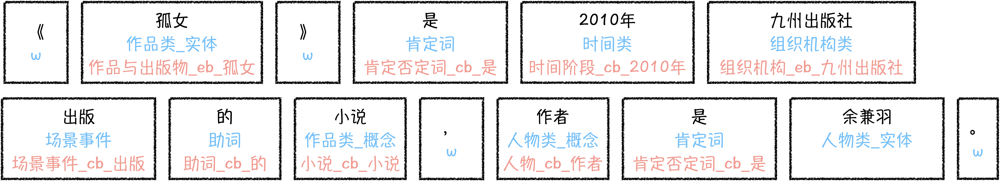
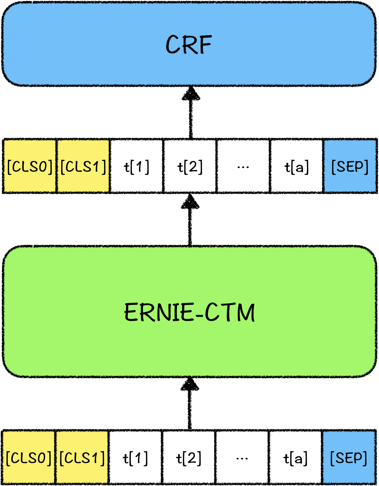

# 解语|中文文本知识标注工具（wordtag）

中文文本知识标注工具是首个覆盖中文所有词类的知识标注工具，旨在提供全面、丰富的知识标注结果，可以应用于挖掘模板生成，数据挖掘、词类细化、新词发现、关系挖掘等应用中。



## 特性

- **覆盖中文全词类，更丰富的知识标注结果**
  - 中文文本知识标注工具使用的词类体系为覆盖中文全部词汇的词类体系，包括各类实体词与非实体词（如概念、专名、语法词等），考虑到一些类单使用文本无法细分（如人物类、作品类、品牌名等），词类体系中不做区分，一些可细分类别（如医院、学校等），划分了较细类别。
- **整合TermTree linking结果，获得更丰富的标注知识**
  - 如上图示例所示，各个切分标注结果中，除词类标注外，还整合了TermTree的linking结果，用户可以结合[TermTree](../termtree)数据共同使用，如利用TermTree中的subtype获得更细的上位粒度；利用TermTree中term的关系获得更加丰富的知识等；同时，TermTree数据是可插拔的，用户可将自定义的词表按照TermTree字段定义好，挂接到TermTree体系中，即可使用自己的Term数据展开下游任务。

## 应用场景

### 挖掘模板生成与匹配

在实际文本处理应用中，往往不仅仅要使用深度学习模型学到的统计特征，还需要使用规则去更精准地匹配或生成文本，去支持相关的应用，如语义一致判定、文本相关性扩召、模型的样本增强等。

wordtag包含了覆盖中文所有词汇的词类标注体系，在生成挖掘模板以及模板匹配上有着天然的优势，用户可以根据wordtag标注到的词类，配置更加丰富、精准的匹配模板，同时对于目标文本，只需使用wordtag标注之后，即可利用模板进行匹配。

例如，输入文本：*美人鱼是周星驰执导的电影*，得到预测结果：

```json
{
    "text": "美人鱼是周星驰执导的电影",
    "items": [
        {
            "item": "美人鱼",
            "offset": 0,
            "wordtag_label": "作品类_实体",
            "length": 3,
            "termid": "作品与出版物_eb_美人鱼"
        },
        {
            "item": "是",
            "offset": 3,
            "wordtag_label": "肯定词",
            "length": 1,
            "termid": "肯定否定词_cb_是"
        },
        {
            "item": "周星驰",
            "offset": 4,
            "wordtag_label": "人物类_实体",
            "length": 3,
            "termid": "人物_eb_周星驰"
        },
        {
            "item": "执导",
            "offset": 7,
            "wordtag_label": "场景事件",
            "length": 2,
            "termid": "场景事件_cb_执导"
        },
        {
            "item": "的",
            "offset": 9,
            "wordtag_label": "助词",
            "length": 1,
            "termid": "助词_cb_的"
        },
        {
            "item": "电影",
            "offset": 10,
            "wordtag_label": "作品类_概念",
            "length": 2,
            "termid": "影视作品_cb_电影"
        }
    ]
}
```

如将上述标注结果中的词类取出，去除虚词、标点等与语义无关的词，将抽取出的词类构造成为匹配模板：

```
[作品类_实体][肯定词][人物类_实体][场景事件][作品类_概念]
```

利用该匹配模板，可以匹配所有该句式的文本，例如：

> 《狂人日记》是鲁迅创作的第一个短篇白话日记体小说
>
> 《澳门风云》是王晶创作执导的合家欢贺岁喜剧赌片
>
> 《千王之王2000》是一部王晶于1999年导演的喜剧电影
>
> 《射雕英雄传》是金庸创作的长篇武侠小说

同时结合term linking结果及百科知识树，可以得到更加细粒度的词类（如subtype），配制出更加精细的模板。

### 词类增强的深度学习模型

词类特征同时也可以是深度学习模型可以使用的一种重要特征，词类特征可以对原始文本token提供有效的边界信息、归组信息，减少样本中的噪音，防止模型过拟合。

在实际应用中，可以将词类作为embedding特征，直接叠加到文本token上，输入到模型中；在BERT等模型中，也可以使用K-BERT等方式，将词类作为序列中的一部分，利用position id和可见性矩阵控制token和词类特征之间的可见性，作为模型的输入。

## 快速开始

### 数据准备

我们提供了少数样本用以示例输入数据格式。执行以下命令，下载并解压示例数据集：

```bash
python download.py --data_dir ./  
```

训练使用的数据可以由用户根据实际的应用场景，自己组织数据。每行数据都由tokens、tags、cls_label组成，tags采用 BIOES 标注体系，cls_label是整个句子的分类，包含"编码/引用/列表","外语句子","古文/古诗句","其他文本"四种，由于目前发布的预训练模型针对的是现代文，因此前三种文本只用于训练文本分类，不用于训练序列标注。

示例如下：

```text
{"tokens": ["1", ".", "1", ".", "8", "车", "辆", "自", "动", "驾", "驶", "及", "控", "制", " ", "8"], "tags": ["B-数量词", "I-数量词", "I-数量词", "I-数量词", "E-数量词", "B-物体类", "E-物体类", "B-场景事件", "I-场景事件", "I-场景事件", "E-场景事件", "S-连词", "B-场景事件", "E-场景事件", "S-w", "S-数量词"], "cls_label": "编码/引用/列表"}
{"tokens": ["亦", "在", "空", "中", "捕", "食", "，", "边", "飞", "翔", "边", "捕", "食", "。"], "tags": ["S-词汇用语", "S-介词", "B-位置方位", "E-位置方位", "B-场景事件", "E-场景事件", "S-w", "S-词汇用语", "B-场景事件", "E-场景事件", "S-词汇用语", "B-场景事件", "E-场景事件", "S-w"], "cls_label": "其他文本"}
```


### 模型训练

#### 单卡训练

```bash
python -u train.py \
    --max_seq_len 128 \
    --batch_size 32   \
    --learning_rate 1e-4 \
    --num_train_epochs 3 \
    --logging_steps 10 \
    --save_steps 100 \
    --output_dir ./tmp/ \
    --device "gpu"
```

#### 多卡训练
```bash
python -m paddle.distributed.launch --gpus "0,1"  train.py \
    --max_seq_len 128 \
    --batch_size 32   \
    --learning_rate 1e-4 \
    --num_train_epochs 3 \
    --logging_steps 10 \
    --save_steps 100 \
    --output_dir ./tmp/ \
    --device "gpu"
```

其中参数释义如下：
- `max_seq_length` 表示最大句子长度，超过该长度将被截断。
- `batch_size` 表示每次迭代**每张卡**上的样本数目。
- `learning_rate` 表示基础学习率大小，将于learning rate scheduler产生的值相乘作为当前学习率。
- `num_train_epochs` 表示训练轮数。
- `logging_steps` 表示日志打印间隔。
- `save_steps` 表示模型保存及评估间隔。
- `output_dir` 表示模型保存路径。
- `device` 表示训练使用的设备, 'gpu'表示使用GPU, 'xpu'表示使用百度昆仑卡, 'cpu'表示使用CPU。


### 模型评估

通过加载训练过程中保存的模型，可以对验证集数据进行验证，启动方式如下：

```bash
python -u eval.py \
    --max_seq_len 128 \
    --batch_size 32   \
    --init_ckpt_dir ./tmp/ernie_ctm_ft_model_1.pdparams \
    --device "gpu"
```

其中 init_ckpt_dir 是模型加载路径，请根据具体的模型路径填写该项。

### 模型预测

对无标签数据可以启动模型预测：

```bash
python -u predict.py \
    --max_seq_len 128 \
    --batch_size 32   \
    --init_ckpt_dir ./tmp/ernie_ctm_ft_model_1.pdparams \
    --device "gpu"
```

## 模型结构

模型使用ERNIE-CTM+CRF训练而成，预测时使用viterbi解码，模型结构如下：



## Term Linking

wordtag提供从文本到知识的解析与链接方法，即Term-Liking，只需将term词类体系与TermTree数据加载到工具中，即可在解析结果中得到linking

wordtag模型对所有的词预测到上位词类之后，会直接根据预测到的词类，映射到term体系（映射表参见代码配置），查找相应的term，查找到相应的term后，会直接link到term上，如用户需要自己定制TermTree，只需将term挂接好之后更换数据即可。

## 后期计划

1. 持续优化知识标注模型，获得更加精准的标注结果
2. 发布多粒度、多种参数规模的知识标注模型
3. 根据TermPath及TermCorpus完成细粒度term及subterm消歧

## 在论文中引用wordtag

如果您的工作成果中使用了wordtag，请增加下述引用。我们非常乐于看到wordtag对您的工作带来帮助。
```
@article{zhao2020TermTree,
	title={TermTree and Knowledge Annotation Framework for Chinese Language Understanding},
	author={Zhao, Min and Qin, Huapeng and Zhang, Guoxin and Lyu, Yajuan and Zhu, Yong},
    technical report={Baidu, Inc. TR:2020-KG-TermTree},
    year={2020}
}
```