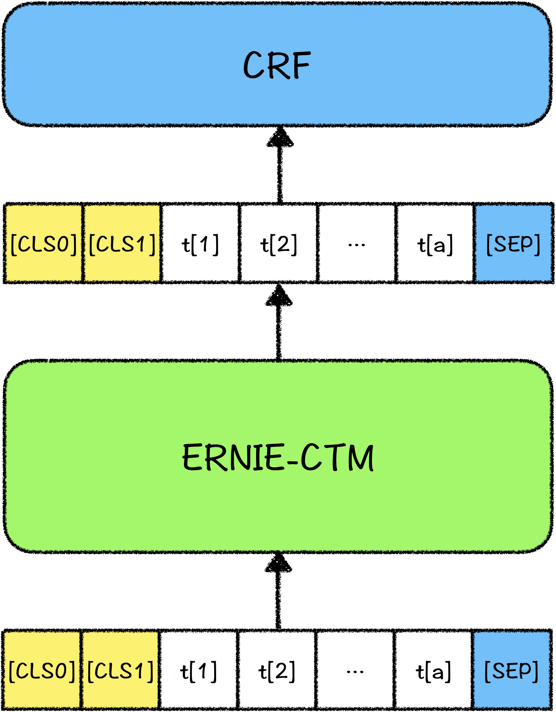

# 解语：WordTag（中文词类知识标注工具）

WordTag（中文词类知识标注工具）是首个能够覆盖所有中文词汇的词类知识标注工具，旨在为中文文本解析提供全面、丰富的知识标注结果，可以应用于模板（挖掘模板、解析模板）生成与匹配、知识挖掘(新词发现、关系挖掘)等自然语言处理任务中，提升文本解析与挖掘精度；也可以作为中文文本特征生成器，为各类机器学习模型提供文本特征。


## WordTag特点

- **覆盖所有中文词汇的词类体系，更丰富的知识标注结果**
  - WordTag使用的词类体系为覆盖所有中文词汇的词类体系，包括各类实体词与非实体词（如概念、实体/专名、语法词等）。WordTag开源版对部分类目（如组织机构等），做了更细类目的划分识别（如，医疗卫生机构、体育组织机构），对仅使用文本信息难以细分的类目（如人物类、作品类、品牌名等），不做更细粒度的词类识别。用户需要细粒度的词类识别时，可利用百科知识树的类别体系自行定制。
- **整合百科知识树链接结果，获得更丰富的标注知识**
  - 如上图示例所示，各个切分标注结果中，除词类标注外，还整合了百科知识树的链接结果，用户可以结合百科知识树数据共同使用：如，利用百科知识树中的subtype获得更细的上位粒度，利用term的百科信息获得更加丰富的知识等。
- **可定制的词类序列标注框架**
  - WordTag开源版标注使用的词类体系是我们在实践中对**百科文本**解析应用较好的一个版本，不同类型文本（如，搜索query、新闻资讯）的词类分布不同，用户可以利用百科知识树定制自己的词类体系和训练样本，构建自己的WordTag应用版，以获得更好的适配效果。例如，可将自定义的词表按照百科知识树的字段定义好，挂接/整合到百科知识树上，即可使用自己的Term数据定制标注样本和标注任务。

## WordTag应用场景

参见"[解语的应用场景](../)"


## 快速开始

### 数据准备

我们提供了少数样本用以示例输入数据格式。执行以下命令，下载并解压示例数据集：

```bash
python download.py --data_dir ./  
```

训练使用的数据可以由用户根据实际的应用场景，自己组织数据。每行数据都由tokens、tags、cls_label组成，tags采用 BIOES 标注体系，cls_label是整个句子的分类，包含"编码/引用/列表","外语句子","古文/古诗句","其他文本"四种，由于目前发布的预训练模型针对的是现代文，因此前三种文本只用于训练文本分类，不用于训练序列标注。

示例如下：

```text
{"tokens": ["1", ".", "1", ".", "8", "车", "辆", "自", "动", "驾", "驶", "及", "控", "制", " ", "8"], "tags": ["B-数量词", "I-数量词", "I-数量词", "I-数量词", "E-数量词", "B-物体类", "E-物体类", "B-场景事件", "I-场景事件", "I-场景事件", "E-场景事件", "S-连词", "B-场景事件", "E-场景事件", "S-w", "S-数量词"], "cls_label": "编码/引用/列表"}
{"tokens": ["亦", "在", "空", "中", "捕", "食", "，", "边", "飞", "翔", "边", "捕", "食", "。"], "tags": ["S-词汇用语", "S-介词", "B-位置方位", "E-位置方位", "B-场景事件", "E-场景事件", "S-w", "S-词汇用语", "B-场景事件", "E-场景事件", "S-词汇用语", "B-场景事件", "E-场景事件", "S-w"], "cls_label": "其他文本"}
```


### 模型训练

#### 单卡训练

```bash
python -u train.py \
    --max_seq_len 128 \
    --batch_size 32   \
    --learning_rate 1e-4 \
    --num_train_epochs 3 \
    --logging_steps 10 \
    --save_steps 100 \
    --output_dir ./tmp/ \
    --device "gpu"
```

#### 多卡训练
```bash
python -m paddle.distributed.launch --gpus "0,1"  train.py \
    --max_seq_len 128 \
    --batch_size 32   \
    --learning_rate 1e-4 \
    --num_train_epochs 3 \
    --logging_steps 10 \
    --save_steps 100 \
    --output_dir ./tmp/ \
    --device "gpu"
```

其中参数释义如下：
- `max_seq_length` 表示最大句子长度，超过该长度将被截断。
- `batch_size` 表示每次迭代**每张卡**上的样本数目。
- `learning_rate` 表示基础学习率大小，将于learning rate scheduler产生的值相乘作为当前学习率。
- `num_train_epochs` 表示训练轮数。
- `logging_steps` 表示日志打印间隔。
- `save_steps` 表示模型保存及评估间隔。
- `output_dir` 表示模型保存路径。
- `device` 表示训练使用的设备, 'gpu'表示使用GPU, 'xpu'表示使用百度昆仑卡, 'cpu'表示使用CPU。


### 模型评估

通过加载训练过程中保存的模型，可以对验证集数据进行验证，启动方式如下：

```bash
python -u eval.py \
    --max_seq_len 128 \
    --batch_size 32   \
    --init_ckpt_dir ./tmp/ernie_ctm_ft_model_1.pdparams \
    --device "gpu"
```

其中 init_ckpt_dir 是模型加载路径，请根据具体的模型路径填写该项。


### 模型预测

对无标签数据可以启动模型预测：

```bash
python -u predict.py \
    --max_seq_len 128 \
    --batch_size 32   \
    --init_ckpt_dir ./tmp/ernie_ctm_ft_model_1.pdparams \
    --device "gpu"
```


## 模型结构

模型使用[ERNIE-CTM](../ernie-ctm)+CRF训练而成，预测时使用viterbi解码，模型结构如下：




## Term-Linking实现

WordTag提供从文本到百科知识树的链接方法，即Term-Linking，只需将term词类体系与百科知识树数据加载到工具中，即可在解析结果中得到term-linking结果。

为了能够适配应用中的不同实体集（例如，不同的企业有不同的人物实体集合，不同的小说站有不同的小说实体集合），我们将term-linking拆分为两个步骤：

- 第一步是基于词类的linking，主要解决“同名概念词/实体词”、“不同类的同名词”消歧问题，这一步只使用文本本身特征和词类特征，不使用图谱中的实体属性值（SPO）知识，从而支持切换不同应用知识图谱；
- 第二步是同类同名实体词的linking，主要解决同类下不同属性值的实体消歧问题，这一步需要使用实体词的SPO知识（一般用于实体特征表示计算，以及文本-实体相似度计算）。

“WordTag+百科知识树”的开源版提供了第一步的解决示例，第二步由于依赖于特定图谱的SPO知识，无法提供通用工具，未来可能提供通用解决方案。

WordTag模型对所有的词预测到上位词类之后，会直接根据预测到的词类，映射到term体系（映射表参见代码配置），查找相应的term，进行link。用户也可根据自己的数据分布，定制term-linking策略：

- link到自己定制的term词表：只需将term词表按照TermTree挂接好之后更换数据即可；
- 调整WordTag预测词类与term词表的映射关系（如，增加自定义类别）：在代码配置中直接调整映射表即可。


## WordTag后续计划

1. 持续优化知识标注模型，获得更加精准的标注结果；
2. 发布多粒度、多种参数规模的知识标注模型；
3. 提供细粒度term及subterm消歧的解决方案。


## 在论文中引用WordTag

如果您的工作成果中使用了WordTag，请增加下述引用。我们非常乐于看到WordTag对您的工作带来帮助。
```
@article{zhao2020TermTree,
	title={TermTree and Knowledge Annotation Framework for Chinese Language Understanding},
	author={Zhao, Min and Qin, Huapeng and Zhang, Guoxin and Lyu, Yajuan and Zhu, Yong},
    technical report={Baidu, Inc. TR:2020-KG-TermTree},
    year={2020}
}
```


## 问题与反馈

WordTag在持续优化中，如果您有任何建议或问题，欢迎提交issue到Github。