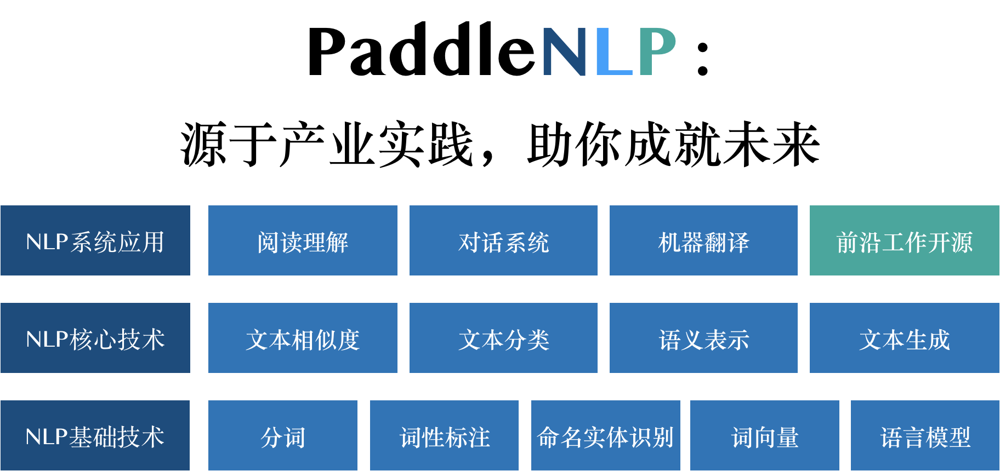

**NOTE** 本目录是PaddlePaddle 1.8版本的PaddleNLP模型库，目前已全面升级至PaddlePaddle 2.0版本。欢迎体验[PaddleNLP 2.0](https://github.com/PaddlePaddle/PaddleNLP)




**PaddleNLP**是基于[飞桨 PaddlePaddle](http://www.paddlepaddle.org/)深度学习框架开发的自然语言处理（NLP）工具，算法，模型和数据的开源项目。百度在NLP领域十几年的深厚积淀为PaddleNLP提供了强大的核心动力，使用PaddleNLP，您可以得到：

- **丰富而全面的NLP任务支持：**

  - PaddleNLP为您提供了多粒度，多场景的应用支持。涵盖了从[分词](https://github.com/PaddlePaddle/models/tree/release/1.7/PaddleNLP/lexical_analysis)，[词性标注](https://github.com/PaddlePaddle/models/tree/release/1.7/PaddleNLP/lexical_analysis)，[命名实体识别](https://github.com/PaddlePaddle/models/tree/release/1.7/PaddleNLP/lexical_analysis)等NLP基础技术，到[文本分类](https://github.com/PaddlePaddle/models/tree/release/1.7/PaddleNLP/sentiment_classification)，[文本相似度计算](https://github.com/PaddlePaddle/models/tree/release/1.7/PaddleNLP/similarity_net)，[语义表示](https://github.com/PaddlePaddle/models/tree/release/1.7/PaddleNLP/pretrain_langauge_models)，[文本生成](https://github.com/PaddlePaddle/models/tree/release/1.7/PaddleNLP/seq2seq)等NLP核心技术。同时，PaddleNLP还提供了针对常见NLP大型应用系统（如[阅读理解](https://github.com/PaddlePaddle/models/tree/release/1.7/PaddleNLP/machine_reading_comprehension)，[对话系统](https://github.com/PaddlePaddle/models/tree/release/1.7/PaddleNLP/dialogue_system)，[机器翻译系统](https://github.com/PaddlePaddle/models/tree/release/1.7/PaddleNLP/machine_translation)等）的特定核心技术和工具组件，模型和预训练参数等，让您在NLP领域畅通无阻。

- **稳定可靠的NLP模型和强大的预训练参数：**

  - PaddleNLP集成了百度内部广泛使用的NLP工具模型，为您提供了稳定可靠的NLP算法解决方案。基于百亿级数据的预训练参数和丰富的预训练模型，助您轻松提高模型效果，为您的NLP业务注入强大动力。

- **持续改进和技术支持，零基础搭建NLP应用：**

  - PaddleNLP为您提供持续的技术支持和模型算法更新，为您的NLP业务保驾护航。


快速安装
-------

### 流程

- 克隆代码库到本地

```shell
git clone https://github.com/PaddlePaddle/PaddleNLP.git
```

- 进入到特定的子目录中查看代码和运行任务（如情感分析）

```shell
cd legacy/sentiment_classification
```


找到您的NLP解决方案
-------

|                      任务场景                      |                        对应项目/目录                         |                             简介                             |
| :------------------------------------------------: | :----------------------------------------------------------: | :----------------------------------------------------------: |
| **中文分词**，**词性标注**，**命名实体识别**:fire: | [LAC](https://github.com/PaddlePaddle/models/tree/release/1.7/PaddleNLP/lexical_analysis) | LAC，全称为Lexical Analysis of Chinese，是百度内部广泛使用的中文处理工具，功能涵盖从中文分词，词性标注，命名实体识别等常见中文处理任务。 |
|               **词向量（word2vec）**               |                         [word2vec](https://github.com/PaddlePaddle/models/tree/release/1.7/PaddleRec/word2vec)                         | 提供单机多卡，多机等分布式训练中文词向量能力，支持主流词向量模型（skip-gram，cbow等），可以快速使用自定义数据训练词向量模型。 |
|                    **语言模型**                    | [Language_model](https://github.com/PaddlePaddle/models/tree/release/1.7/PaddleNLP/language_model) | 基于循环神经网络（RNN）的经典神经语言模型（neural language model）。 |
|                 **情感分类**:fire:                 | [Senta](https://github.com/PaddlePaddle/models/tree/release/1.7/PaddleNLP/sentiment_classification)，[EmotionDetection](https://github.com/PaddlePaddle/models/tree/release/1.7/PaddleNLP/emotion_detection) | Senta（Sentiment Classification，简称Senta）和EmotionDetection两个项目分别提供了面向*通用场景*和*人机对话场景专用*的情感倾向性分析模型。 |
|              **文本相似度计算**:fire:              | [SimNet](https://github.com/PaddlePaddle/models/tree/release/1.7/PaddleNLP/similarity_net) | SimNet，又称为Similarity Net，为您提供高效可靠的文本相似度计算工具和预训练模型。 |
|                 **语义表示**:fire:                 | [pretrain_language_models](https://github.com/PaddlePaddle/models/tree/release/1.7/PaddleNLP/pretrain_langauge_models) | 集成了ELMO，BERT，ERNIE 1.0，ERNIE 2.0，XLNet等热门中英文预训练模型。 |
|                    **文本生成**                    | [seq2seq](../examples/text_generation/) | seq2seq为您提供了一些列经典文本生成模型案例，如vanilla seq2seq，seq2seq with attention，variational seq2seq模型等。 |
|                    **阅读理解**                    | [machine_reading_comprehension](https://github.com/PaddlePaddle/models/tree/release/1.7/PaddleNLP/machine_reading_comprehension) | Paddle Machine Reading Comprehension，集合了百度在阅读理解领域相关的模型，工具，开源数据等一系列工作。包括DuReader (百度开源的基于真实搜索用户行为的中文大规模阅读理解数据集)，KT-Net (结合知识的阅读理解模型，SQuAD以及ReCoRD曾排名第一), D-Net (预训练-微调框架，在EMNLP2019 MRQA国际阅读理解评测获得第一)，等。 |
|                    **对话系统**                    | [dialogue_system](https://github.com/PaddlePaddle/models/tree/release/1.7/PaddleNLP/dialogue_system) | 包括：1）DGU（Dialogue General Understanding，通用对话理解模型）覆盖了包括**检索式聊天系统**中context-response matching任务和**任务完成型对话系统**中**意图识别**，**槽位解析**，**状态追踪**等常见对话系统任务，在6项国际公开数据集中都获得了最佳效果。<br/> 2) knowledge-driven dialogue：百度开源的知识驱动的开放领域对话数据集，发表于ACL2019。<br/>3）ADEM（Auto Dialogue Evaluation Model）：对话自动评估模型，可用于自动评估不同对话生成模型的回复质量。 |
|                    **机器翻译**                    | [machine_translation](https://github.com/PaddlePaddle/models/tree/release/1.7/PaddleNLP/machine_translation) | 全称为Paddle Machine Translation，基于Transformer的经典机器翻译模型。 |


目录结构
------

```text
.
├── machine_translation               # 机器翻译相关代码，数据，预训练模型
├── dialogue_system                   # 对话系统相关代码，数据，预训练模型
├── machcine_reading_comprehension    # 阅读理解相关代码，数据，预训练模型
├── pretrain_language_models          # 语言表示工具箱
├── language_model                    # 语言模型
├── lexical_analysis                  # LAC词法分析
├── shared_modules/models             # 共享网络
│   ├── __init__.py
│   ├── classification
│   ├── dialogue_model_toolkit
│   ├── language_model
│   ├── matching
│   ├── neural_machine_translation
│   ├── reading_comprehension
│   ├── representation
│   ├── sequence_labeling
│   └── transformer_encoder.py
├── shared_modules/preprocess        # 共享文本预处理工具
│   ├── __init__.py
│   ├── ernie
│   ├── padding.py
│   └── tokenizer
├── sentiment_classification          # Senta文本情感分析
├── similarity_net                    # SimNet短文本语义匹配
```

其中，除了 `models` 和 `preprocess` 分别是共享的模型集合与共享的数据预处理流程之外，其它目录包含的都是相互独立的任务，可以直接进入这些目录运行任务。
