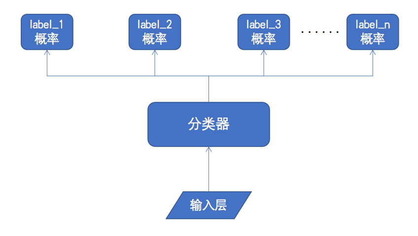
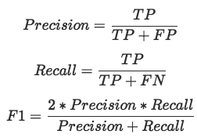

# Paddle NLP（对话领域分类器）


## 模型简介

​   在对话业务场景中，完整的对话能力往往由多个领域的语义解析bot组成并提供，对话领域分类器能够根据业务场景需求，将流量分发到对应领域的语义解析bot。对话领域分类器不但能够节省机器资源，流量只分发到所属领域的bot，避免了无效流量调用bot； 同时，对话领域分类器的精准分发，过滤了无效的解析结果，也使得最终的解析结果更加精确。


## 快速开始
**目前模型要求使用PaddlePaddle 1.8及以上版本或适当的develop版本运行。**

### 1. Paddle版本安装

本项目训练模块兼容Python2.7.x以及Python3.7.x， 依赖PaddlePaddle 1.8版本以及CentOS系统环境， 安装请参考官网 [快速安装](https://www.paddlepaddle.org.cn/documentation/docs/zh/beginners_guide/install/index_cn.html)。

注意：该模型同时支持cpu和gpu训练和预测，用户可以根据自身需求，选择安装对应的paddlepaddle-gpu或paddlepaddle版本。

> Warning: GPU 和 CPU 版本的 PaddlePaddle 分别是 paddlepaddle-gpu 和 paddlepaddle，请安装时注意区别。


### 2. 代码安装

克隆工具集代码库到本地

```shell
git clone https://github.com/PaddlePaddle/models.git
cd models/PaddleNLP/dialogue_domain_classification
```


### 3. 数据准备

本项目提供了部分涉及的数据集，通过运行以下指令可以快速下载。运行指令后会生成`data/input`目录，`data/input`目录下有训练集数据（train.txt）、开发集数据（eval.txt）、测试集数据（test.txt），对应词典（char.dict），领域词表(domain.dict) 以及模型配置文件(model.conf)

```shell
mkdir -p data/input
wget --no-check-certificate https://baidu-nlp.bj.bcebos.com/dialogue_domain_classification-dataset-1.0.0.tar.gz
tar -zxvf dialogue_domain_classification-dataset-1.0.0.tar.gz -C ./data/input
```

**数据格式说明**


1. 数据格式

输入和输出的数据格式相同。

数据格式为:  query \t  domain_1 \002 domain_2  （多个标签， 使用\002分隔开）

指定输入数据的文件夹： 参数`data_dir`

训练文件: train.txt
验证集: eval.txt
测试集: test.txt

指定输出结果的文件夹： 参数`save_dir`

测试集预测结果为: test.rst

2. 模型配置
  
参数`config_path` 指定模型配置文件地址， 格式如下：
```shell
[model]
emb_dim = 128
win_sizes = [5, 5, 5]
hid_dim = 160
hid_dim2 = 160
```


### 4. 模型下载

针对于"打电话， 天气， 火车票预订， 机票预订， 音乐"这5个领域数据，我们开源了一个使用CharCNN训练好的对话领域分类模型，使用以下指令可以对模型进行下载。

```model
mkdir -p model
wget --no-check-certificate https://baidu-nlp.bj.bcebos.com/dialogue_domain_classification-model-1.0.0.tar.gz
tar -zxvf dialogue_domain_classification-model-1.0.0.tar.gz -C ./model
```

### 5. 脚本参数说明

通过执行如下指令，可以查看入口脚本文件所需要的参数以及说明，指令如下：
 `export PATH="/path/to/your/python:$PATH"; python run_classifier.py --help `

```shell
1. 模型参数
--init_checkpoint   # 指定热启动加载的checkpoint模型， Default: None.
--checkpoints   # 指定保存checkpoints的地址，Default: ./checkpoints.
--config_path   # 指定模型配置文件，Default: ./data/input/model.conf.
--build_dict    # 是否根据训练数据建立char字典和domain字典，Default: False

2. 训练参数
--epoch    # 训练的轮次，Default: 100.
--learning_rate # 学习率， Default: 0.1.
--save_steps    # 保存模型的频率，每x个steps保存一次模型，Default: 1000.
--validation_steps  # 模型评估的频率，每x个steps在验证集上验证模型的效果，Default: 100.
--random_seed   # 随机数种子，Default: 7
--threshold # 领域置信度阈值，当置信度超过阈值，预测结果出对应的领域标签。 Default: 0.1.
--cpu_num   # 当使用cpu训练时的线程数(当use_cuda=False才起作用)。 Default: 3.

3. logging
--skip_steps    # 训练时打印loss的频率，每x个steps打印一次loss，Default: 10.

4. 数据
--data_dir  # 数据集的目录，其中train.txt为训练集，eval.txt为验证集，test.txt为测试集。Default: ./data/input/
--save_dir  # 模型产出的目录， Default: ./data/output/
--max_seq_len   # 最大句子长度，超过会进行截断，Default: 50.
--batch_size    # 批大小， Default: 64.

5. 脚本运行配置
--use_cuda  # 是否使用GPU，Default: False
--do_train  # 是否进行训练，Default: True
--do_eval   # 是否进行验证，Default: True
--do_test   # 是否进行测试，Default: True
```


### 6. 模型训练

用户可以基于示例数据构建训练集和开发集，可以运行下面的命令，进行模型训练和开发集验证。

```
sh run.sh train 
```

> Warning1:  可以参考`run.sh`脚本以及第5节的**脚本参数说明**， 对默认参数进行修改。

> Warning2:  CPU多线程以及GPU多卡训练时，每个step训练分别给每一个CPU核或者GPU卡提供一个batch数据，实际上的batch_size为单核的线程数倍或者单卡的多卡数倍。


### 7. 模型评估

基于已有的预训练模型和数据，可以运行下面的命令进行测试，查看训练的模型在验证集（test.tsv）上的评测结果

```
sh run.sh eval
```

> Warning:  可以参考`run.sh`脚本以及第5节的**脚本参数说明**， 对默认参数进行修改。

### 8. 模型推断

```
sh run.sh test
```
> Warning:  可以参考`run.sh`脚本以及第5节的**脚本参数说明**， 对默认参数进行修改。


## 进阶使用


### 1. 任务定义与建模

在真实复杂业务场景中，语义解析服务往往由多个不同领域的语义解析bot组成，从而同时满足多个场景下的语义解析需求。例如：同时能查天气、播放音乐、查询股票等多种功能的对话bot。

与此同时用户输入的query句子形式各样，而且存在很多歧义。比如用户输入的query为`“下雨了”`， 这条query的语义解析既属于`天气`领域， 又属于`音乐`领域(薛之谦的歌曲)。针对这种多歧义的情况，业务上常见的方法是将query进行"广播"，即同时请求每一个语义解析bot，再对返回的解析结果进行粗排，得到最终的语义解析结果。

对话领域分类器能够处理同一query同时命中多个领域的情况，根据对话领域分类器的解析结果，可以对query进行有效的分发到各个领域的bot。对话领域分类器对query进行有效的分发，可以避免"广播"式调用带来的资源浪费，大量的节省了机器资源；同时也提高了最终粗排后的语义解析结果的准确率。


对话领域分类模型解决了一个多标签分类(Multilabel Classification)的问题， 将用户输入的文本作为模型的输入，分类器会预测出输入文本对应的每一个标签的置信度，从而得到多标签结果，并依次对query分发。


### 2. 模型原理介绍

对话领域分类器的大体结构如下图所示，用户输入通过`输入层`进行向量化后，作为`分类器模型`的输入，`分类器`最终的输出是一个多标签结果为`[label_1, label_2, ..., label_n]`，它的维度为`n`.(训练数据定义的训练领域总共有`n-1`个，每一个领域对应一个标签，还有额外一个标签表示背景，即不属于任何一个训练领域)

其中每个`label_i`的概率为0到1之间，且所有label的概率之和不恒为1，它表示当前输入属于第`i`个领域的概率。最后可以人为对每一个label的概率设置阈值，从而可以得到多标签分类的结果。



**评估指标说明**

传统的二分类任务中，通常使用准确率、召回率和F1值对模型效果进行评估。

<p align="center">
    
</p>


**该项目中对于正负样本的定义** 

在多标签分类任务中，我们将样本分为正样本(Pos)与负样本(Neg)两种。如果样本包含了领域标签，表示需要分发到至少1个bot进行解析，则为正样本；反之，样本不包含任何领域标签流量，表示不需要分发，则为负样本。

我们的对话领域分类器在保证了原有解析效果的基础之上，有效的降低机器资源的消耗。即在保证正样本召回率的情况下，尽可能提高准确率。


**该项目中样本预测正确的定义**
1. 如果`正确结果`不包含领域标签， 则`预测结果`也不包含领域标签时，预测正确。
2. 如果`正确结果`包含领域标签， 则`预测结果`包含`正确结果`的所有领域标签时(即`预测结果`的标签是`正确结果`的超集，预测正确。 


### 3. 代码结构说明

```
├── run_classifier.py：该项目的主函数，封装包括训练、预测、评估的部分
├── nets.py : 定义了模型所使用的网络结构
├── utils.py：定义了其他常用的功能函数
├── run.sh: 启动主函数的demo脚本
```


### 4. 如何组建自己的模型
可以根据自己的需求，组建自定义的模型，具体方法如下所示：

1. 定义自己的对话领域模型，可以在 ./nets.py 中添加自己的网络结构。

2. 定义自己的领域对话数据，可以参考**第3节数据准备**的数据格式，准备自己的训练数据。

3. 模型训练、评估、预测的逻辑，需要在[run.sh](./run.sh)中修改对应的模型路径、数据路径和词典路径等参数，具体说明请参照**第5节的脚本参数说明**.
