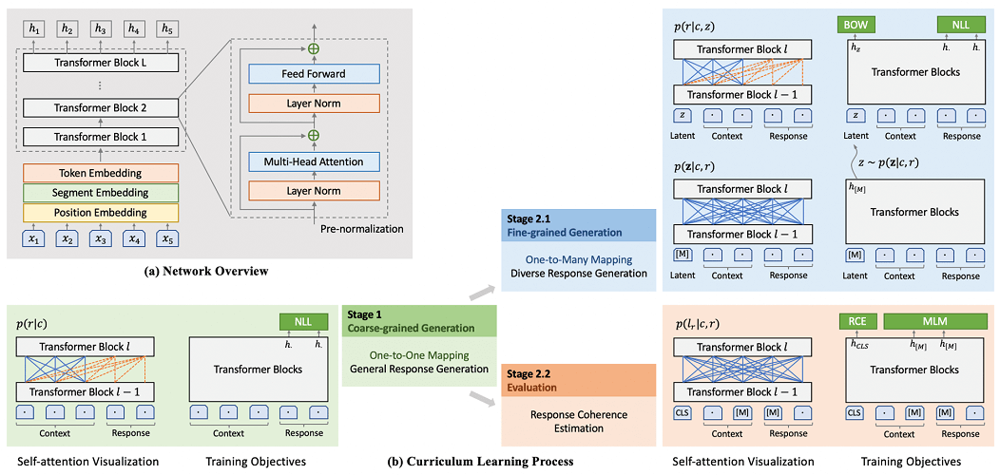

# PLATO-2

## 模型简介

构建高质量的开放领域（Open-Domain）的对话机器人，使得它能用自然语言与人自由地交流，这一直是自然语言处理领域终极目标之一。

为了能够简易地构建一个高质量的开放域聊天机器人，本项目在Paddle2.0上实现了PLATO-2的预测模型，并基于终端实现了简单的人机交互。用户可以通过下载预训练模型快速构建一个开放域聊天机器人。

PLATO-2的网络结构见下图：

<p align="center"></p>

PLATO-2的训练过程及其他细节详见 [Knover](https://github.com/PaddlePaddle/Knover)

## 快速开始

### 环境依赖

- python 3.7+
- sentencepiece
- termcolor

安装方式：`pip install sentencepiece termcolor`

### 数据准备

您可以从以下位置下载预训练模型文件：

* PLATO-2, 24-layers, 16-heads, 1024-hidden, EN: [预训练模型](https://bj.bcebos.com/paddlenlp/models/transformers/plato2/24L.pdparams)
* PLATO-2, 32-layers, 32-heads, 2048-hidden, EN: [预训练模型](https://bj.bcebos.com/paddlenlp/models/transformers/plato2/32L.pdparams)

以24层预训练模型为例：

```shell
wget https://bj.bcebos.com/paddlenlp/models/transformers/plato2/24L.pdparams
```

**NOTE:** PLATO-2网络参数量较大，24层网络至少需要显存16G，32层网络至少需要显存22G，用户可选择合适的网络层数及预训练模型。

sentencepiece分词预训练模型和词表文件下载：

```shell
wget https://bj.bcebos.com/paddlenlp/models/transformers/plato2/data.tar.gz
tar -zxf data.tar.gz
```

### 人机交互

运行如下命令即可开始与聊天机器人用英语进行简单的对话

```shell
export CUDA_VISIBLE_DEVICES=0
python interaction.py --vocab_path ./data/vocab.txt --spm_model_file ./data/spm.model --num_layers 24 --init_from_ckpt ./24L.pdparams
```

以上参数表示：

* vocab_path：词表文件路径。
* spm_model_file：sentencepiece分词预训练模型路径。
* num_layers：PLATO-2组网层数。
* init_from_ckpt：PLATO-2预训练模型路径。

32层PLATO-2网络交互示例：

<p></p>

**NOTE:** 输入"[EXIT]"退出交互程序，输入"[NEXT]"开启下一轮新的对话。
