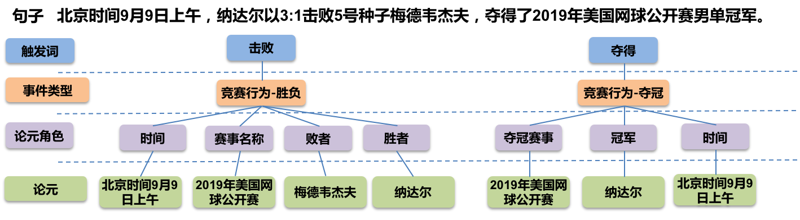
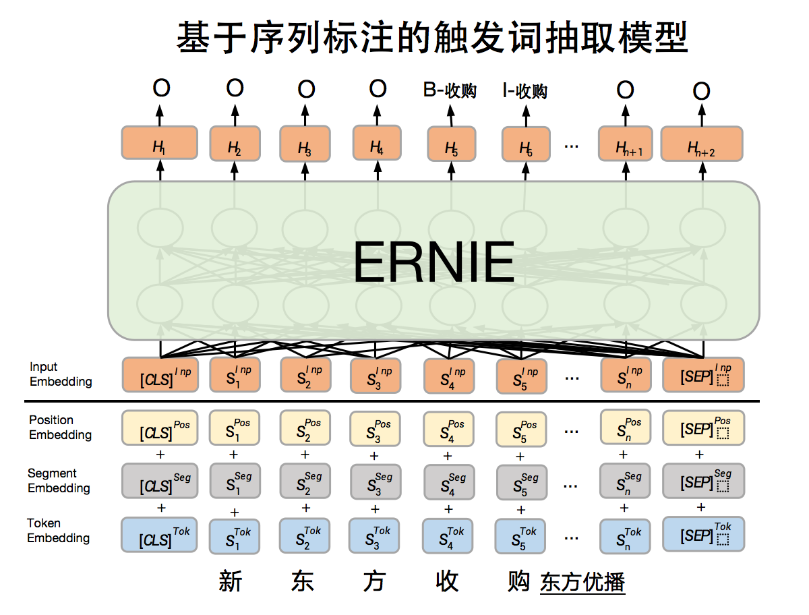
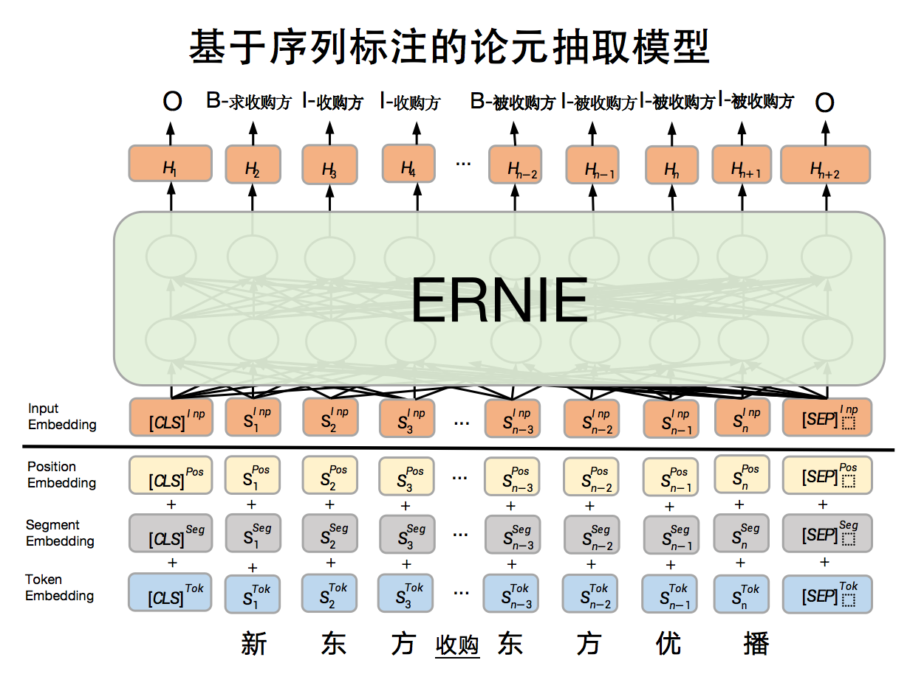
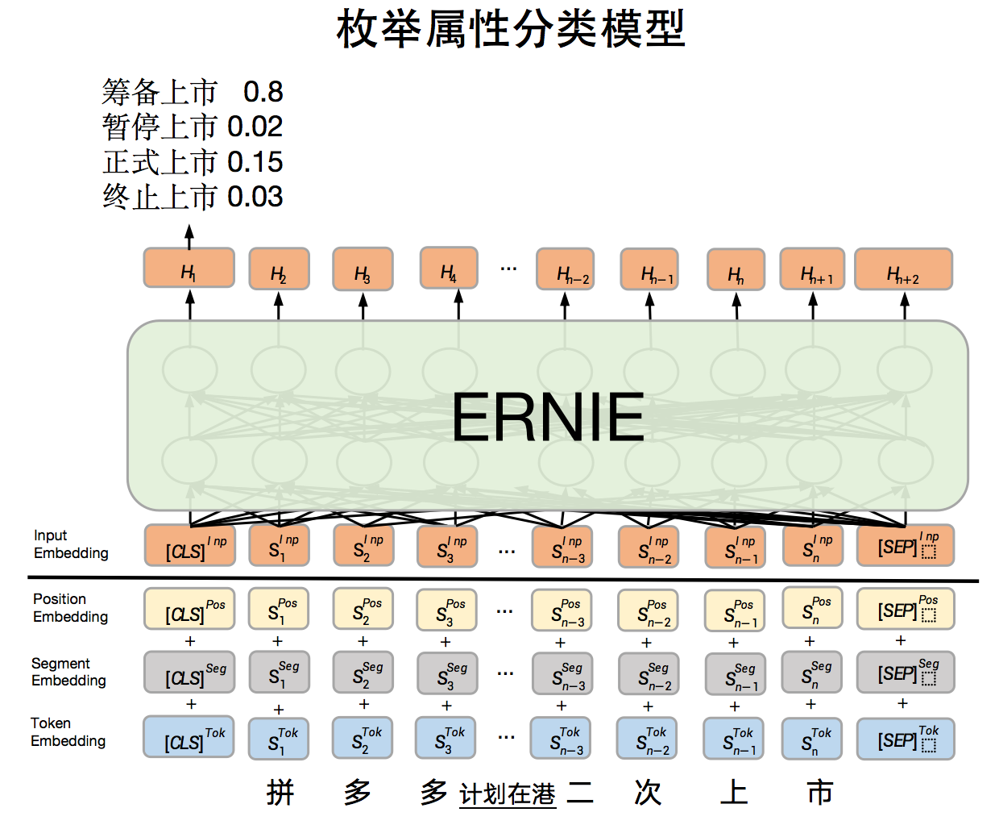

# LIC2021 DuEE 事件抽取基线


信息抽取旨在从非结构化自然语言文本中提取结构化知识，如实体、关系、事件等。事件抽取的目标是对于给定的自然语言句子，根据预先指定的事件类型和论元角色，识别句子中所有目标事件类型的事件，并根据相应的论元角色集合抽取事件所对应的论元。其中目标事件类型 (event_type) 和论元角色 (role) 限定了抽取的范围，例如 (event_type：胜负，role：时间，胜者，败者，赛事名称)、(event_type：夺冠，role：夺冠事件，夺冠赛事，冠军)。

<div align="center">

</div>

该示例展示了如何使用PaddleNLP快速复现[LIC2021事件抽取比赛](http://lic2021.ccf.org.cn/)基线并进阶优化基线。

同时，我们提供了该示例在线运行展示教程：
[PaddleNLP实战——LIC2021事件抽取任务基线](https://aistudio.baidu.com/aistudio/projectdetail/1639964)

## 目录结构

以下是本项目主要目录结构及说明：

```text
DuEE/
├── classifier.py # 文本分类训练脚本
├── duee_1_data_prepare.py # 句子级事件抽取数据预处理
├── duee_1_postprocess.py # 句子级事件抽取数据后处理
├── duee_fin_data_prepare.py  # 篇章级事件抽取数据预处理
├── duee_fin_postprocess.py  # 篇章级事件抽取数据后处理
├── README.md # 文档说明
├── run_classifier.sh # 文本分类训练启动脚本
├── run_duee_1.sh # 句子级事件抽取启动脚本
├── run_duee_fin.sh # 篇章级事件抽取启动脚本
├── run_sequence_labeling.sh # 序列标注训练启动脚本
├── sequence_labeling.py # 序列标注训练脚本
└── utils.py # 效能函数
```


## 篇章级事件抽取基线

篇章级事件抽取数据集（DuEE-Fin）是金融领域篇章级别事件抽取数据集，
共包含13个已定义好的事件类型约束和1.15万中文篇章（存在部分非目标篇章作为负样例），其中6900训练集，1150验证集和3450测试集，数据集下载[地址](https://aistudio.baidu.com/aistudio/competition/detail/65) 。
在该数据集上基线采用基于[ERNIE](https://github.com/PaddlePaddle/ERNIE)的序列标注（sequence labeling）方案，分为基于序列标注的触发词抽取模型、基于序列标注的论元抽取模型和枚举属性分类模型，属于PipeLine模型；基于序列标注的触发词抽取模型采用BIO方式，识别触发词的位置以及对应的事件类型，基于序列标注的论元抽取模型采用BIO方式识别出事件中的论元以及对应的论元角色；枚举属性分类模型采用ernie进行分类。

### 评测方法

本任务采用预测论元F1值作为评价指标，对于每个篇章，采用不放回的方式给每个目标事件寻找最相似的预测事件（事件级别匹配），搜寻方式是优先寻找与目标事件的事件类型相同且角色和论元正确数量最多的预测事件

f1_score = (2 * P * R) / (P + R)，其中

- 预测论元正确=事件类型和角色相同且论元正确
- P=预测论元正确数量 / 所有预测论元的数量
- R=预测论元正确数量 / 所有人工标注论元的数量

### 快速复现基线Step1：数据预处理并加载

从比赛官网下载数据集，逐层解压存放于data/DuEE-fin目录下，运行以下脚本将原始数据预处理成序列标注格式数据。
处理之后的数据放在data/DuEE-Fin下，触发词识别数据文件存放在data/DuEE-Fin/role下，论元角色识别数据文件存放在data/DuEE-Fin/trigger下。
枚举分类数据存放在data/DuEE-Fin/enum下。

```
sh run_duee_fin.sh data_prepare
```

我们可以加载自定义数据集。通过继承[`paddle.io.Dataset`](https://www.paddlepaddle.org.cn/documentation/docs/zh/api/paddle/io/Dataset_cn.html#dataset)，自定义实现`__getitem__` 和 `__len__`两个方法。

如下代码已完成加载数据集操作：
```
train_ds = DuEventExtraction(args.train_data, args.vocab_path, args.tag_path)
dev_ds = DuEventExtraction(args.dev_data, args.vocab_path, args.tag_path)
test_ds = DuEventExtraction(args.test_data, args.vocab_path, args.tag_path)
```

### 快速复现基线Step2：构建模型


基于序列标注的触发词抽取模型是整体模型的一部分，该部分主要是给定事件类型，识别句子中出现的事件触发词对应的位置以及对应的事件类别，该模型是基于ERNIE开发序列标注模型，模型原理图如下：

<div align="center">

</div>


同样地，基于序列标注的论元抽取模型也是基于ERNIE开发序列标注模型，该部分主要是识别出事件中的论元以及对应论元角色，模型原理图如下：

<div align="center">

</div>

上述样例中通过模型识别出：1）论元"新东方"，并分配标签"B-收购方"、"I-收购方"、"I-收购方"；2）论元"东方优播", 并分配标签"B-被收购方"、"I-被收购方"、"I-被收购方"、"I-被收购方"。最终识别出文本中包含的论元角色和论元对是<收购方，新东方>、<被收购方，东方优播>

**PaddleNLP提供了ERNIE预训练模型常用序列标注模型，可以通过指定模型名字完成一键加载**：

```python
from paddlenlp.transformers import AutoModelForTokenClassification

model = AutoModelForTokenClassification.from_pretrained("ernie-3.0-medium-zh", num_classes=len(label_map))
```

同时，对于枚举分类数据采用的是基于ERNIE的文本分类模型，枚举角色类型为环节。模型原理图如下：

<div align="center">

</div>

> 给定文本，对文本进行分类，得到不同类别上的概率 筹备上市（0.8）、暂停上市（0.02）、正式上市（0.15）、终止上市（0.03）


**同样地，PaddleNLP提供了ERNIE预训练模型常用文本分类模型，可以通过指定模型名字完成一键加载**：

```python
from paddlenlp.transformers import AutoModelForSequenceClassification

model = AutoModelForSequenceClassification.from_pretrained("ernie-3.0-medium-zh", num_classes=len(label_map))
```

### 快速复现基线Step3：数据处理

我们需要将原始数据处理成模型可读入的数据。PaddleNLP为了方便用户处理数据，内置了对于各个预训练模型对应的Tokenizer，可以完成
文本token化，转token ID，文本长度截断等操作。与加载模型类似地，也可以一键加载。

```python
from paddlenlp.transformers import AutoTokenizer

tokenizer = AutoTokenizer.from_pretrained("ernie-3.0-medium-zh")
```

文本数据处理直接调用tokenizer即可输出模型所需输入数据。

```python
inputs = tokenizer(text="请输入测试样例", max_seq_len=20)
# {'input_ids': [1, 647, 789, 109, 558, 525, 314, 656, 2, 0, 0, 0, 0, 0, 0, 0, 0, 0, 0, 0],
# 'token_type_ids': [0, 0, 0, 0, 0, 0, 0, 0, 0, 0, 0, 0, 0, 0, 0, 0, 0, 0, 0, 0],
# 'seq_len': 9}
```


### 快速复现基线Step4：定义损失函数和优化器，开始训练

在该基线上，我们选择交叉墒作为损失函数，使用[`paddle.optimizer.AdamW`](https://www.paddlepaddle.org.cn/documentation/docs/zh/api/paddle/optimizer/adamw/AdamW_cn.html#adamw)作为优化器。

启动训练：
```shell
# 触发词识别模型训练
sh run_duee_fin.sh trigger_train

# 触发词识别预测
sh run_duee_fin.sh trigger_predict

# 论元识别模型训练
sh run_duee_fin.sh role_train

# 论元识别预测
sh run_duee_fin.sh role_predict

# 枚举分类模型训练
sh run_duee_fin.sh enum_train

# 枚举分类预测
sh run_duee_fin.sh enum_predict
```


### 快速复现基线Step5：数据后处理，提交结果

按照比赛预测指定格式提交结果至[评测网站](http://aistudio-bce.bcc-bdbl.baidu.com/aistudio/competition/detail/141)。


``` shell
sh run_duee_fin.sh pred_2_submit
```

结果存放于`submit/test_duee_fin.json`


#### to-do 增加基线效果


## 句子级事件抽取基线


句子级别通用领域的事件抽取数据集（[DuEE 1.0](https://aistudio.baidu.com/aistudio/competition/detail/32?isFromCcf=true)）上进行事件抽取的基线模型，该模型采用基于[ERNIE](https://github.com/PaddlePaddle/ERNIE)的序列标注（sequence labeling）方案，分为基于序列标注的触发词抽取模型和基于序列标注的论元抽取模型，属于PipeLine模型；基于序列标注的触发词抽取模型采用BIO方式，识别触发词的位置以及对应的事件类型，基于序列标注的论元抽取模型采用BIO方式识别出事件中的论元以及对应的论元角色。模型和数据处理方式与篇章级事件抽取相同，此处不再赘述。句子级别通用领域的事件抽取无枚举角色分类。

启动训练：
```shell
# 训练触发词识别模型
sh run_duee_1.sh trigger_train

# 触发词识别预测
sh run_duee_1.sh trigger_predict

# 论元识别模型训练
sh run_duee_1.sh role_train

# 论元识别预测
sh run_duee_1.sh role_predict

# 数据后处理，提交预测结果
# 结果存放于submit/test_duee_1.json`
sh run_duee_1.sh pred_2_submit
```

### 评测方法

事件论元结果与人工标注的事件论元结果进行匹配，并按字级别匹配F1进行打分，不区分大小写，如论元有多个表述，则取多个匹配F1中的最高值

f1_score = (2 * P * R) / (P + R)，其中

- P=预测论元得分总和 / 所有预测论元的数量
- R=预测论元得分总和 / 所有人工标注论元的数量
- 预测论元得分=事件类型是否准确 * 论元角色是否准确 * 字级别匹配F1值 （*是相乘）
- 字级别匹配F1值 = 2 * 字级别匹配P值 * 字级别匹配R值 / (字级别匹配P值 + 字级别匹配R值)
- 字级别匹配P值 = 预测论元和人工标注论元共有字的数量/ 预测论元字数
- 字级别匹配R值 = 预测论元和人工标注论元共有字的数量/ 人工标注论元字数

#### to-do 增加基线效果

## 进阶优化基线效果

基线采用的预训练模型为ERNIE，PaddleNLP提供了丰富的预训练模型，如BERT，RoBERTa，Electra，XLNet等
参考[PaddleNLP预训练模型介绍](https://paddlenlp.readthedocs.io/zh/latest/model_zoo/index.html#transformer)

如可以选择RoBERTa large中文模型优化模型效果，只需更换模型和tokenizer即可无缝衔接。

```python
from paddlenlp.transformers import RobertaForTokenClassification, RobertaTokenizer

model = RobertaForTokenClassification.from_pretrained("roberta-wwm-ext-large", num_classes=len(label_map))
tokenizer = RobertaTokenizer.from_pretrained("roberta-wwm-ext-large")
```

## Reference

- [DuEE: A Large-Scale Dataset for Chinese Event Extraction in Real-World Scenarios](https://link.springer.com/chapter/10.1007/978-3-030-60457-8_44)
