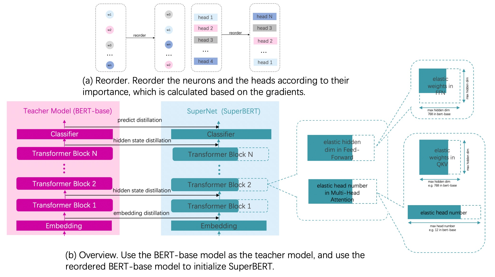

# BERT Compression Based on PaddleSlim

BERT-base模型是一个迁移能力很强的通用语义表示模型，但是模型中也有一些参数冗余。本教程将介绍如何使用PaddleSlim对BERT-base模型进行压缩。

## 压缩原理

1. 对Fine-tuning得到模型通过计算参数及其梯度的乘积得到参数的重要性，把模型参数根据重要性进行重排序。
2. 超网络中最大的子网络选择和Bert-base模型网络结构一致的网络结构，其他小的子网络是对最大网络的进行不同的宽度选择来得到的，宽度选择具体指的是网络中的参数进行裁剪，所有子网络在整个训练过程中都是参数共享的。
2. 用重排序之后的模型参数作为超网络模型的初始化参数。
3. Fine-tuning之后的模型作为教师网络，超网络作为学生网络，进行知识蒸馏。

<p align="center">
<br />
整体流程图
</p>


## 压缩结果

利用`bert-base-uncased`模型首先在GLUE数据集上进行finetune，得到需要压缩的模型，之后基于此模型进行压缩。压缩后模型参数大小减小26%（从110M减少到81M），压缩后模型在GLUE dev数据集上的精度和压缩前模型在GLUE dev数据集上的精度对比如下表所示：

| Task  | Metric                       | Result            | Result with PaddleSlim |
|:-----:|:----------------------------:|:-----------------:|:----------------------:|
| SST-2 | Accuracy                     |      0.93005      |       0.931193         |
| QNLI  | Accuracy                     |      0.91781      |       0.920740         |
| CoLA  | Mattehew's corr              |      0.59557      |       0.601244         |
| MRPC  | F1/Accuracy                  |  0.91667/0.88235  |   0.91740/0.88480      |
| STS-B | Person/Spearman corr         |  0.88847/0.88350  |   0.89271/0.88958      |
| QQP   | Accuracy/F1                  |  0.90581/0.87347  |   0.90994/0.87947      |
| MNLI  | Matched acc/MisMatched acc   |  0.84422/0.84825  |   0.84687/0.85242      |
| RTE   | Accuracy                     |      0.711191     |       0.718412         |

<p align="center">
<strong>表1-1: GLUE数据集精度对比</strong>
</p>

压缩前后模型的耗时如下表所示：

<table style="width:100%;" cellpadding="2" cellspacing="0" border="1" bordercolor="#000000">
        <tbody>
                <tr>
                        <td style="text-align:center">
                                <span style="font-size:18px;">Device</span>
                        </td>
                        <td style="text-align:center">
                                <span style="font-size:18px;">Batch Size</span>
                        </td>
                        <td style="text-align:center">
                                <span style="font-size:18px;">Model</span>
                        </td>
                        <td style="text-align:center">
                                <span style="font-size:18px;">TRT(FP16)</span>
                        </td>
                        <td style="text-align:center;">
                                <span style="font-size:18px;">Latency(ms)</span>
                        </td>
                </tr>
                <tr>
                        <td rowspan=8 align=center> T4 </td>
                        <td rowspan=4 align=center> 16 </td>
                        <td rowspan=2 align=center> BERT </td>
                        <td style="text-align:center">
                                <span style="font-size:18px">N</span>
                        </td>
                        <td style="text-align:center">
                                <span style="font-size:18px">110.71</span>
                        </td>
                </tr>
                <tr>
                        <td style="text-align:center">
                                <span style="font-size:18px">Y</span>
                        </td>
                        <td style="text-align:center">
                                <span style="font-size:18px">22.0</span>
                        </td>
                </tr>
                <tr>
                        <td rowspan=2 align=center>Compressed BERT </td>
                        <td style="text-align:center">
                                <span style="font-size:18px">N</span>
                        </td>
                        <td style="text-align:center">
                                <span style="font-size:18px">69.62</span>
                        </td>
                </tr>
                <tr>
                        <td style="text-align:center">
                                <span style="font-size:18px">Y</span>
                        </td>
                        <td style="text-align:center">
                                <span style="font-size:18px">14.93</span>
                        </td>
                </tr>
        <tr>
            <td rowspan=4 align=center> 40 </td>
                        <td rowspan=2 align=center> BERT </td>
                        <td style="text-align:center">
                                <span style="font-size:18px">N</span>
                        </td>
                        <td style="text-align:center">
                                <span style="font-size:18px">252.78</span>
                        </td>
                </tr>
                <tr>
                        <td style="text-align:center">
                                <span style="font-size:18px">Y</span>
                        </td>
                        <td style="text-align:center">
                                <span style="font-size:18px">53.67</span>
                        </td>
                </tr>
                <tr>
                        <td rowspan=2 align=center>Compressed BERT </td>
                        <td style="text-align:center">
                                <span style="font-size:18px">N</span>
                        </td>
                        <td style="text-align:center">
                                <span style="font-size:18px">168.71</span>
                        </td>
                </tr>
                <tr>
                        <td style="text-align:center">
                                <span style="font-size:18px">Y</span>
                        </td>
                        <td style="text-align:center">
                                <span style="font-size:18px">37.22</span>
                        </td>
                </tr>
                <tr>
                        <td rowspan=2 align=center> V100 </td>
                        <td rowspan=2 align=center> 16 </td>
                        <td style="text-align:center">
                                <span style="font-size:18px;" align=center>BERT</span>
                        </td>
                        <td style="text-align:center">
                                <span style="font-size:18px">N</span>
                        </td>
                        <td style="text-align:center">
                                <span style="font-size:18px">33.28</span>
                        </td>
                </tr>
                <tr>
                        <td style="text-align:center">
                                <span style="font-size:18px;">Compressed BERT</span>
                        </td>
                        <td style="text-align:center">
                                <span style="font-size:18px">N</span>
                        </td>
                        <td style="text-align:center">
                                <span style="font-size:18px">21.83</span>
                        </td>
                </tr>
                <tr>
                        <td rowspan=2 align=center> Intel(R) Xeon(R) Gold 5117 CPU @ 2.00GHz </td>
                        <td rowspan=2 align=center> 16 </td>
                        <td style="text-align:center">
                                <span style="font-size:18px;" align=center>BERT</span>
                        </td>
                        <td style="text-align:center">
                                <span style="font-size:18px">N</span>
                        </td>
                        <td style="text-align:center">
                                <span style="font-size:18px">10831.73</span>
                        </td>
                </tr>
                <tr>
                        <td style="text-align:center">
                                <span style="font-size:18px;">Compressed BERT</span>
                        </td>
                        <td style="text-align:center">
                                <span style="font-size:18px">N</span>
                        </td>
                        <td style="text-align:center">
                                <span style="font-size:18px">7682.93</span>
                        </td>
                </tr>
        </tbody>
</table>
<br />
<p align="center">
<strong>表1-2: 模型速度对比</strong>
</p>

压缩后模型在T4机器上相比原始模型在FP32的情况下加速59%，在TensorRT FP16的情况下加速47.3%。
压缩后模型在V100机器上相比原始模型在FP32的情况下加速52.5%。
压缩后模型在Intel(R) Xeon(R) Gold 5117 CPU上相比原始模型在FP32的情况下加速41%。

## 快速开始
本教程示例以GLUE/SST-2 数据集为例。

### 环境依赖

模型压缩功能依赖最新版本的PaddleSlim
```shell
git clone https://github.com/PaddlePaddle/PaddleSlim
python setup.py build && python setup.py install
```

### Fine-tuing
首先需要对Pretrain-Model在实际的下游任务上进行Finetuning，得到需要压缩的模型。Fine-tuning流程参考[Fine-tuning教程](../../benchmark/glue)

```shell
cd ../../benchmark/glue/
```

```python
export CUDA_VISIBLE_DEVICES=0
export TASK_NAME=SST-2

python -u ./run_glue.py \
    --model_type bert \
    --model_name_or_path bert-base-uncased \
    --task_name $TASK_NAME \
    --max_seq_length 128 \
    --batch_size 32   \
    --learning_rate 2e-5 \
    --num_train_epochs 3 \
    --logging_steps 1 \
    --save_steps 500 \
    --output_dir ./tmp/$TASK_NAME/ \
    --device gpu \
```
参数详细含义参考[README.md](../../benchmark/glue/README.md)
Fine-tuning 在dev上的结果如压缩结果表1-1中Result那一列所示。


### 压缩训练

单卡训练
```shell
python -u ./run_glue_ofa.py --model_type bert \
          --model_name_or_path ${task_pretrained_model_dir} \
          --task_name $TASK_NAME --max_seq_length 128     \
          --batch_size 32       \
          --learning_rate 2e-5     \
          --num_train_epochs 6     \
          --logging_steps 10     \
          --save_steps 100     \
          --output_dir ./tmp/$TASK_NAME \
          --device gpu  \
          --width_mult_list 1.0 0.8333333333333334 0.6666666666666666 0.5
```

多卡训练

```shell
unset CUDA_VISIBLE_DEVICES
python -m paddle.distributed.launch --gpus "0,1" run_glue_ofa.py  \
          --model_type bert \
          --model_name_or_path ${task_pretrained_model_dir} \
          --task_name $TASK_NAME --max_seq_length 128     \
          --batch_size 32       \
          --learning_rate 2e-5     \
          --num_train_epochs 6     \
          --logging_steps 10     \
          --save_steps 100     \
          --output_dir ./tmp/$TASK_NAME \
          --device gpu  \
          --width_mult_list 1.0 0.8333333333333334 0.6666666666666666 0.5
```


其中参数释义如下：
- `model_type` 指示了模型类型，当前仅支持BERT模型。
- `model_name_or_path` 指示了某种特定配置的模型，对应有其预训练模型和预训练时使用的 tokenizer。若模型相关内容保存在本地，这里也可以提供相应目录地址。
- `task_name` 表示 Fine-tuning 的任务。
- `max_seq_length` 表示最大句子长度，超过该长度将被截断。
- `batch_size` 表示每次迭代**每张卡**上的样本数目。
- `learning_rate` 表示基础学习率大小，将于learning rate scheduler产生的值相乘作为当前学习率。
- `num_train_epochs` 表示训练轮数。
- `logging_steps` 表示日志打印间隔。
- `save_steps` 表示模型保存及评估间隔。
- `output_dir` 表示模型保存路径。
- `device` 表示训练使用的设备, 'gpu'表示使用GPU, 'xpu'表示使用百度昆仑卡, 'cpu'表示使用CPU。
- `width_mult_list` 表示压缩训练过程中，对每层Transformer Block的宽度选择的范围。

压缩训练之后在dev上的结果如压缩结果表格中Result with PaddleSlim那一列所示，延时情况如表1-2所示。


### 导出子模型
根据传入的config导出相应的子模型并转为静态图模型。

启动命令：

```shell
python -u ./export_model.py --model_type bert \
                             --model_name_or_path ${PATH_OF_MODEL_AFTER_OFA} \
                             --max_seq_length 128     \
                 --sub_model_output_dir ./tmp/$TASK_NAME/dynamic_model \
                             --static_sub_model ./tmp/$TASK_NAME/static_model \
                 --device gpu \
                 --width_mult  0.6666666666666666
```

其中参数释义如下：
- `model_type` 指示了模型类型，当前仅支持BERT模型。
- `model_name_or_path` 指示了某种特定配置的经过OFA训练后保存的模型，对应有其预训练模型和预训练时使用的tokenizer。若模型相关内容保存在本地，这里也可以提供相应目录地址。
- `max_seq_length` 表示最大句子长度，超过该长度将被截断。默认：128.
- `sub_model_output_dir` 指示了导出子模型动态图参数的目录。
- `static_sub_model` 指示了导出子模型静态图模型及参数的目录，设置为None，则表示不导出静态图模型。默认：None。
- `device` 表示训练使用的设备, 'gpu'表示使用GPU, 'xpu'表示使用百度昆仑卡, 'cpu'表示使用CPU。
- `width_mult` 表示导出子模型的宽度。默认：1.0.


### OFA接口介绍

OFA API介绍参考[API](https://github.com/PaddlePaddle/PaddleSlim/blob/release/2.0.0/docs/zh_cn/api_cn/dygraph/ofa/ofa_api.rst)

## 另附：基于本代码对TinyBERT(L=4, D=312)进行压缩
下游任务模型是从TinyBERT官方repo转换得到。

### 压缩结果

| Task  | Metric                       | TinyBERT(L=4, D=312) |     Result with OFA    |
|:-----:|:----------------------------:|:--------------------:|:----------------------:|
| SST-2 | Accuracy                     |     [0.9234]()       |      [0.9220]()        |
| QNLI  | Accuracy                     |     [0.8746]()       |      [0.8720]()        |
| CoLA  | Mattehew's corr              |     [0.4961]()       |      [0.5048]()        |
| MRPC  | F1/Accuracy                  |  [0.8998/0.8554]()   |   [0.9003/0.8578]()    |
| STS-B | Person/Spearman corr         |  [0.8635/0.8631]()   |   [0.8717/0.8706]()    |
| QQP   | Accuracy/F1                  |  [0.9047/0.8751]()   |   [0.9034/0.8733]()    |
| MNLI  | Matched acc/MisMatched acc   |  [0.8256/0.8294]()   |   [0.8211/0.8261]()    |
| RTE   | Accuracy                     |     [0.6534]()       |      [0.6787]()        |


## 参考论文

1. Lu Hou, Zhiqi Huang, Lifeng Shang, Xin Jiang, Xiao Chen, Qun Liu. DynaBERT: Dynamic BERT with Adaptive Width and Depth.
2. H. Cai, C. Gan, T. Wang, Z. Zhang, and S. Han. Once for all: Train one network and specialize it for efficient deployment.
