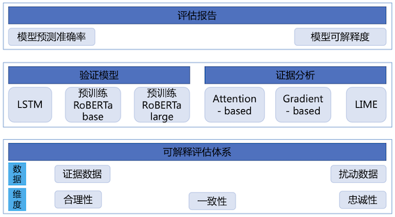
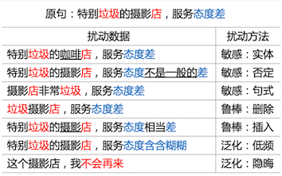
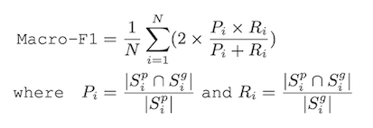
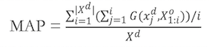
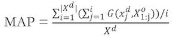
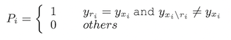
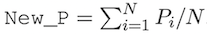

NLP可解释评估
===
深度学习模型在很多NLP任务上已经取得巨大成功，但其常被当作一个黑盒使用，内部预测机制对使用者是不透明的。这使得深度学习模型结果不被人信任，增加落地难度，尤其是在医疗、法律等特殊领域。同时，当模型出现效果不好或鲁棒性差等问题时，由于不了解其内部机制，导致很难对模型进行优化。近期，深度学习模型的可解释性被越来越多的人关注。但模型的可解释性评估还不够完善，本模块提供了3个NLP任务的评测数据和相关评测指标，旨在评估模型的可解释性。模块包含以下功能：

    1. 完善可解释性评估体系，提供了评测数据和对应的评测指标
    2. 提供了3种典型的证据抽取方法，分别是基于注意力（attention-based）、梯度（gradient-based）和线性模型（LIME）的证据抽取方法，并在LSTM、Transformer（RoBERTa-base和RoBERTa-large）等常用模型网络结构上完成实验验证，分别验证模型结构复杂度、模型参数规模对模型可解释的影响
    3. 提供模型较全面的评估报告，含模型本身准确率等效果、以及在3个可解释评测指标上的结果

<p align="center">
 <br>
</p>

可解释评估体系
---
### 评测数据
我们提供了情感分析、相似度计算、阅读理解等三个NLP任务上的中英文数据集。对于每一个数据集，人工标注了证据数据和扰动数据。

    证据数据：给出模型预测依赖的证据（从人类认知角度），其由输入中的若干词构成。我们的标注标准包含3个维度：充分性（sufficiency）、简洁性（concision）、可理解性（understandability）。
    扰动数据：旨在评估模型在扰动下的证据一致性。我们从抗干扰性、敏感性和泛化性等角度构建了扰动数据，其中，“敏感性”和“泛化性”维度下构建的数据可能会改变证据。

#### 样例数据（来自中文情感分析任务）：

<p align="center">
 <br>
</p>

#### 数据规模
<table>
   <tr>
      <td rowspan="2">任务</td>
      <td colspan="3">英文模型</td>
      <td colspan="3">中文模型</td>
   </tr>
   <tr>
      <td>规模</td>
      <td>证据平均长度比例</td>
      <td>证据平均数量</td>
      <td>规模</td>
      <td>证据平均长度比例</td>
      <td>证据平均数量</td>
   </tr>
   <tr>
      <td>情感分析</td>
      <td>1,499</td>
      <td>19.20%</td>
      <td>2.1</td>
      <td>1,646</td>
      <td>30.10%</td>
      <td>1.4</td>
   </tr>
   <tr>
      <td>相似度任务</td>
      <td>1,659</td>
      <td>52.20%</td>
      <td>1.0</td>
      <td>1,629</td>
      <td>70.50%</td>
      <td>1.0</td>
   </tr>
   <tr>
      <td>阅读理解</td>
      <td>1,507</td>
      <td>10.20%</td>
      <td>1.0</td>
      <td>1,762</td>
      <td>9.60%</td>
      <td>1.0</td>
   </tr>
</table>

### 评估指标
__合理性__：评估模型预测依赖的证据与人工标注证据的拟合度，我们这里使用macro-F1作为评估指标，其中模型预测依赖证据可以由本模块提供的证据分析方法（位于/model_interpretation/task/目录下）给出。<br>

<p align="center">
 <br>
</p>
其中S<sub>i</sub><sup>p</sup>和S<sub>i</sub><sup>g</sup>分别代表针对第i条输入模型预测证据和人工标注证据，N代表数据集中数据的数量<br>

__一致性__：评估(原始输入，对应扰动输入)对中词重要度排序的一致性。证据分析方法对输入中每个词赋予一个重要度，基于该重要度对输入中所有词进行排序。我们使用搜索排序中的MAP（mean average precision）指标来计算两个排序的一致性。这里给出了MAP的两种计算方式，分别见以下两个公式：<br>
公式一（正在使用）：<br>
<p align="center">
 <br>
</p>
公式二：<br>
<p align="center">
 <br>
</p>
其中X<sup>o</sup>和X<sup>d</sup>分别代表原始输入和扰动输入的词重要度排序序列。|X<sup>d</sup>|代表X<sup>d</sup>中词的个数，X<sup>o</sup><sub>1:j</sub>表示X<sup>o</sup>中前j最重要的词。函数G(x, Y)检查词x是否存在于列表Y中，如果存在则G(x, Y)=1。MAP越高表示两个序列排序一致性越高<br>

__忠诚性__：评估模型给出的证据的忠诚性，即模型是否真的基于给出的证据进行预测的。这里从充分性和完备性两个角度进行评估。充分性，即模型给出的证据是否包含了预测需要的全部信息（即y<sub>r<sub>i</sub></sub> = y<sub>x<sub>i</sub></sub>，其中r<sub>i</sub>表示输入x<sub>i</sub>的证据，y<sub>x</sub>表示模型对输入x的预测结果）；完备性，即模型对输入x的预测结果（即y<sub>x<sub>i</sub>\r<sub>i</sub></sub> ≠ y<sub>x<sub>i</sub></sub>，其中x<sub>i</sub>\r<sub>i</sub>表示从输入x<sub>i</sub>中去除证据r<sub>i</sub>）。基于这两个维度，我们提出了一个新的指标New-P，计算方式如下：<br>

<p align="center">
 <br>
</p>
<p align="center">
 <br>
</p>

### 证据抽取方法
证据抽取方法（rationale-extraction），顾名思义，就是从输入中抽取对模型预测至关重要的词，又被称为后验解释方法（post-hoc explanation methods）。
该平台提供了3种典型的证据抽取方法，分别是：基于注意力机制（attention-based）的解释方法、基于梯度（gradient-based）的解释方法，和基于线性模型（linear-based）的解释方法：<br>

Attention-based（[Jain and Wallace, 2019](https://arxiv.org/pdf/1902.10186.pdf)）：

   将注意力分数作为词重要度。注意力分数的获取取决于具体模型架构，我们提供了基于LSTM和transformer框架的提取方法，见每个具体任务下的saliency_map目录。

Gradient-based（[Sundararajan et al., 2017](https://arxiv.org/pdf/1703.01365.pdf)）：

   基于梯度给出每个词重要度。我们这里给出了integrated gradient计算方式，具体见saliency_map目录或论文[Axiomatic attribution for deep networks](https://arxiv.org/pdf/1703.01365.pdf)。

Linear-based（[Ribeiro et al.. 2016](https://arxiv.org/pdf/1602.04938.pdf)）：

   使用线性模型局部模拟待验证模型，线性模型学习到的词的权重作为该词对预测结果的重要度，详细见论文[" why should i trust you?" explaining the predictions of any classifier](https://arxiv.org/pdf/1602.04938.pdf)。

### 三个任务的被评估模型
为验证模型复杂度、参数规模对可解释的影响，针对每个任务，我们分别提供了基于LSTM（简单结构）的模型、及Transformer-based预训练模型（复杂结构），其中，对于预训练模型，提供了base版本和large版本。<br>
模型代码位置：/model_interpretation/task/{task}/，({task}可取值为["senti","similarity","mrc"]，其中senti代表情感分析，similarity代表相似度计算，mrc代表阅读理解)<br>
模型运行及依赖环境请参考下方的“平台使用”。


## 平台使用
### 环境准备
代码运行需要 Linux 主机，Python 3.8（推荐，其他低版本未测试过） 和 PaddlePaddle 2.1 以上版本。

### 推荐的环境

* 操作系统 CentOS 7.5
* Python 3.8.12
* PaddlePaddle 2.1.0
* PaddleNLP 2.2.4

除此之外，需要使用支持 GPU 的硬件环境。

### PaddlePaddle

需要安装GPU版的PaddlePaddle。

```
# GPU 版本
pip3 install paddlepaddle-gpu
```

更多关于 PaddlePaddle 的安装教程、使用方法等请参考[官方文档](https://www.paddlepaddle.org.cn/#quick-start).

### 第三方 Python 库
除 PaddlePaddle 及其依赖之外，还依赖其它第三方 Python 库，位于代码根目录的 requirements.txt 文件中。

可使用 pip 一键安装

```pip3 install -r requirements.txt```

## 数据准备
### 模型训练数据
#### 情感分析任务：

中文推荐使用ChnSentiCorp，英文推荐使用SST-2。本模块提供的中英文情感分析模型就是基于这两个数据集的。若修改训练数据集，请修改/model_interpretation/task/senti/pretrained_models/train.py (RoBERTa) 以及 /model_interpretation/task/senti/rnn/train.py (LSTM)。

[//]:数据集会被缓存到/home/work/.paddlenlp/datasets/目录下

#### 相似度计算：

中文推荐使用LCQMC，英文推荐使用QQP。本模块提供的中英文相似度计算模型就是基于这两个数据集的，若修改训练数据集，请修改/model_interpretation/task/similarity/pretrained_models/train_pointwise.py(RoBERTa)以及/model_interpretation/task/similarity/simnet/train.py(LSTM)。

#### 阅读理解中英文：

中文推荐使用[DuReader_Checklist](https://dataset-bj.cdn.bcebos.com/lic2021/dureader_checklist.dataset.tar.gz)，英文推荐使用[SQUDA2](https://rajpurkar.github.io/SQuAD-explorer/dataset/train-v2.0.json)。请将阅读理解训练数据放置在/model_interpretation/task/mrc/data目录下。

### 下载预训练模型

使用paddlenlp框架自动缓存模型文件。

### 其他数据下载
请运行download.sh自动下载

### 评测数据
评测数据样例位于/model_interpretation/data/目录下，每一行为一条JSON格式的数据。
#### 情感分析数据格式：
    id: 数据的编号，作为该条数据识别key；
    context：原文本数据；
    sent_token：原文本数据的标准分词，注意：golden证据是基于该分词的，预测证据也需要与该分词对应；
    sample_type： 数据的类性，分为原始数据（ori）和扰动数据（disturb）；
    rel_ids：与原始数据关联的扰动数据的id列表（只有原始数据有）；

#### 相似度数据格式：
    id：数据的编号，作为该条数据识别key；
    query（英文中为sentence1）：句子1的原文本数据；
    title（英文中为sentence2）：句子2的原文本数据；
    text_q_seg：句子1的标准分词，注意：golden证据是基于该分词的，预测证据也需要与该分词对应；
    text_t_seg：句子2的标准分词，注意：golden证据是基于该分词的，预测证据也需要与该分词对应；
    sample_type： 数据的类性，分为原始数据（ori）和扰动数据（disturb）；
    rel_ids：与原始数据关联的扰动数据的id列表（只有原始数据有）；

#### 阅读理解数据格式：
    id：数据的编号，作为该条数据识别key；
    title：文章标题；
    context：文章主体；
    question：文章的问题；
    sent_token：原文本数据的标准分词，注意：golden证据是基于该分词的，预测证据也需要与该分词对应；
    sample_type： 数据的类性，分为原始数据（ori）和扰动数据（disturb）；
    rel_ids：与原始数据关联的扰动数据的id列表（只有原始数据有）；
## 模型运行
### 模型预测：

      model_interpretation/task/{task}/run_inter_all.sh (生成所有结果)
      model_interpretation/task/{task}/run_inter.sh (生成单个配置的结果，配置可以选择不同的评估模型，以及不同的证据抽取方法、语言)

(注：{task}可取值为["senti","similarity","mrc"]，其中senti代表情感分析，similarity代表相似度计算，mrc代表阅读理解)

### 证据抽取:
      cd model_interpretation/rationale_extraction
      ./generate.sh

### 可解释评估：
#### 合理性（plausibility）：
    model_interpretation/evaluation/plausibility/run_f1.sh
#### 一致性（consistency）：
    model_interpretation/evaluation/consistency/run_map.sh
#### 忠诚性（faithfulness）：
    model_interpretation/evaluation/faithfulness/run_newp.sh

### 评估报告
中文情感分析评估报告样例：
<table>
   <tr>
      <td rowspan="2">模型 + 证据抽取方法</td>
      <td colspan="4">情感分析</td>
   </tr>
   <tr>
      <td>Acc</td>
      <td>Macro-F1</td>
      <td>MAP</td>
      <td>New_P</td>
   </tr>
   <tr>
      <td>LSTM + IG</td>
      <td>56.8</td>
      <td>36.8</td>
      <td>59.8</td>
      <td>91.4</td>
   </tr>
   <tr>
      <td>RoBERTa-base + IG</td>
      <td>62.4</td>
      <td>36.4</td>
      <td>48.7</td>
      <td>48.9</td>
   </tr>
   <tr>
      <td>RoBERTa-large + IG</td>
      <td>65.3</td>
      <td>38.3</td>
      <td>41.9</td>
      <td>37.8</td>
   </tr>
</table>
