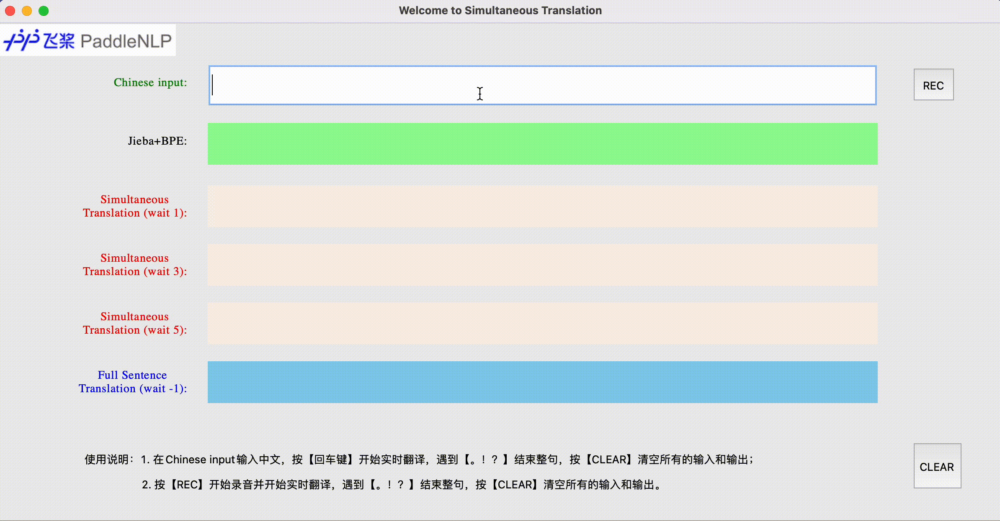
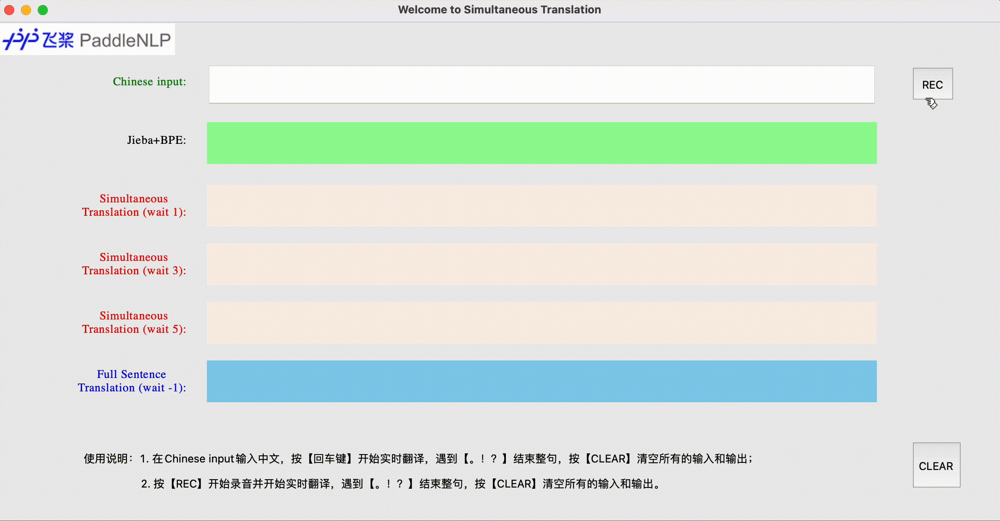

# Demo for STACL

该Demo模拟同传模型STACL实时翻译的效果。
<p align="center">
 <br />
图 1. 文本同传
</p>
<p align="center">
 <br />
图 2. 语音同传
</p>

用户通过Chinese input文本框**打字输入**或者**语音输入即本地麦克风收音**，然后通过Jieba和BPE得到分词结果。

- Simultaneous Translation (wait 1)是读取1个token（分词后）后开始实时翻译；
- Simultaneous Translation (wait 3)是读取3个token（分词后）后开始实时翻译；
- Simultaneous Translation (wait 5)是读取5个token（分词后）后开始实时翻译；
- Full Sentence Translation(wait -1)是读取所有的token（分词后）即整句后开始翻译。

一般来说，waitk越大(waitk=-1可看作waitk=∞)，读入的信息越多，实时翻译效果越好。由上图可见，STACL具有较好的预测性，较小的waitk也能得到较好的翻译结果。

### 目录结构
```text
.
├── README.md                       # 说明文档，本文件
├── const.py                        # 语音识别应用鉴权信息
├── demo.py                         # 启动demo的主程序文件
├── images
│   ├── speech_demo_show.gif        # 语音同传Demo效果图
│   ├── paddlenlp.png               # Demo界面logo
│   └── text_demo_show.gif          # 文本同传Demo效果图
├── model_demo.py                   # STACL模型文件
├── models                          # 预训练模型路径
│   ├── nist_wait_1                 # waitk=1模型
│   ├── nist_wait_3                 # waitk=3模型
│   ├── nist_wait_5                 # waitk=5模型
│   └── nist_wait_-1                # waitk=-1（整句模型）
├── requirements.txt                # 环境依赖文件
└── transformer_demo.yaml           # 参数配置文件

```

上述models目录下的模型可以在这里[下载](https://github.com/PaddlePaddle/PaddleNLP/blob/develop/examples/simultaneous_translation/stacl/README.md#%E6%A8%A1%E5%9E%8B%E4%B8%8B%E8%BD%BD%E6%9B%B4%E6%96%B0%E4%B8%AD) ，下载完后将解压后的`transformer.pdparams`分别放在不同的waitk策略对应的子目录下面。

### 参数说明与配置

##### 1. 模型参数配置
可以在`transformer_demo.yaml` 文件中设置相应的参数，下面给出主要的参数配置：

- `src_bpe_dict`配置源语言（这里是中文）的BPE词表，[中文BPE词表下载](https://bj.bcebos.com/paddlenlp/models/stacl/2M.zh2en.dict4bpe.zh)
- `src_vocab_fpath`配置源语言（这里是中文）词表，[source vocab](https://bj.bcebos.com/paddlenlp/models/stacl/nist.20k.zh.vocab)
- `trg_vocab_fpath`配置目标语言（这里是英文）词表，[target vocab](https://bj.bcebos.com/paddlenlp/models/stacl/nist.10k.en.vocab)
- `device`选择预测用的设备，支持cpu/gpu/xpu，默认为cpu

##### 2. 语音同传参数配置
需要配置`const.py`里面语音识别的应用鉴权信息，只需要将`APPID`和`APPKEY`设置为自己所申请的。
申请教程：[教程](./README_ai.md)

### 环境依赖
##### 1. 基本环境
- attrdict==2.0.1
- PyYAML==5.4.1
- subword_nmt==0.3.7
- jieba==0.42.1
- websocket-client==1.0.1

可通过安装命令：`pip install -r requirements.txt`来进行安装。

注意：本项目依赖于Python内置包`tkinter >= 8.6`
- 查看`tkinter`的版本：
    ```python
    python -c "import tkinter; print(tkinter.TkVersion)"
- [`tkinter`官方文档](https://tkdocs.com/tutorial/index.html)

##### 2. 语音同传环境
需要安装`pyaudio==0.2.11`来调用本地麦克风，安装教程参考[官网](http://people.csail.mit.edu/hubert/pyaudio/)
安装失败，则只会启动文本同传。


### 使用说明

1. 下载[预训练模型](https://github.com/PaddlePaddle/PaddleNLP/blob/develop/examples/simultaneous_translation/stacl/README.md#%E6%A8%A1%E5%9E%8B%E4%B8%8B%E8%BD%BD%E6%9B%B4%E6%96%B0%E4%B8%AD) ，并放在models目录下对应的子目录里；
2. 下载词表（源语言词表，目标语言词表，BPE词表），并在配置文件`transformer_demo.yaml`中修改相应的参数；
3. 运行`demo.py`；
4. 出现界面，在Chinese input文本框中输入中文，按【回车键】开始实时翻译，或者按【REC】开始录音并开始实时翻译，遇到【。！？】结束整句，按【CLEAR】清空所有的输入和输出。

### 常见问题
**Q:** 出现`_tkinter.TclError: couldn't recognize data in image file`错误
**A:** 升级`tkinter`，确保`tkinter >= 8.6`

**Q:** 出现Chinese input文本框无法输入中文
**A:** 升级`tkinter`，确保`tkinter >= 8.6`
