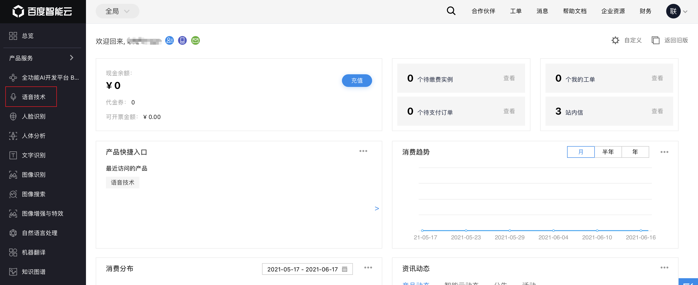
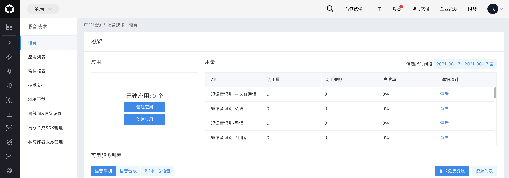
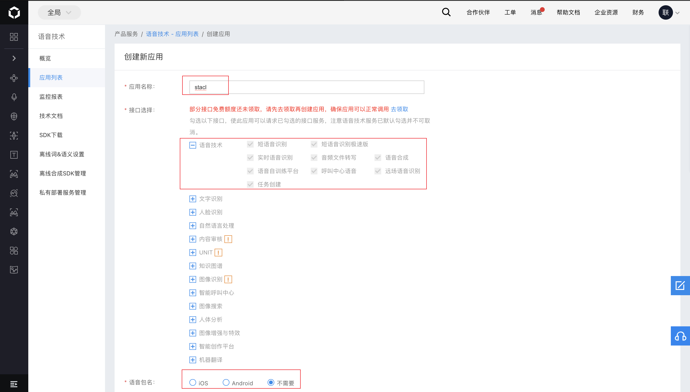
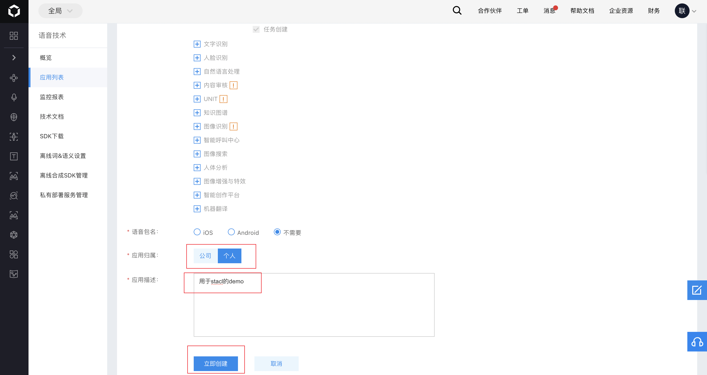
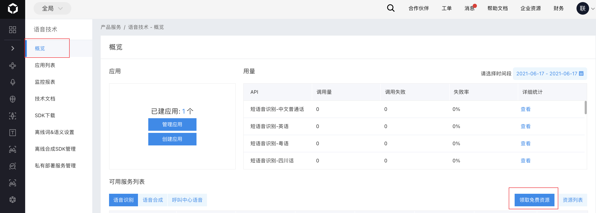
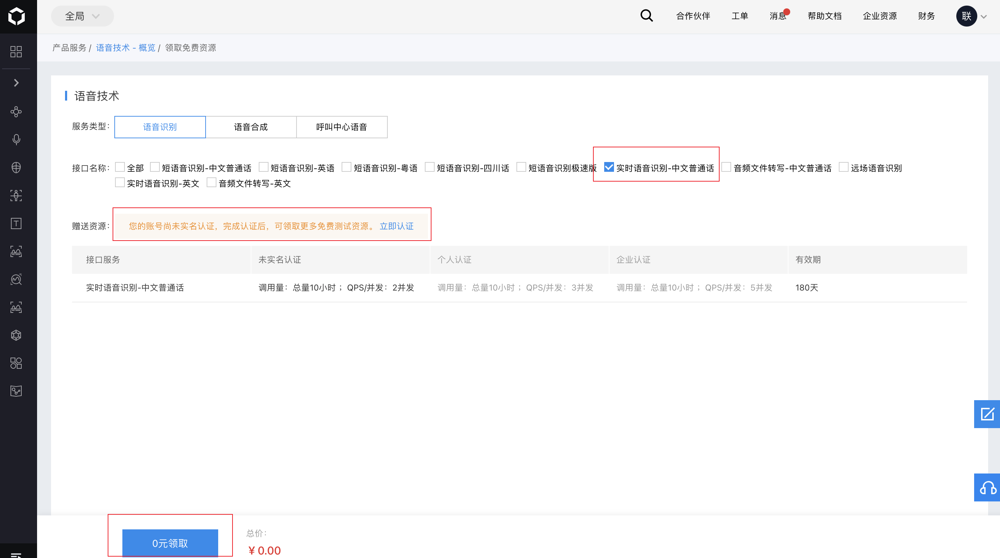
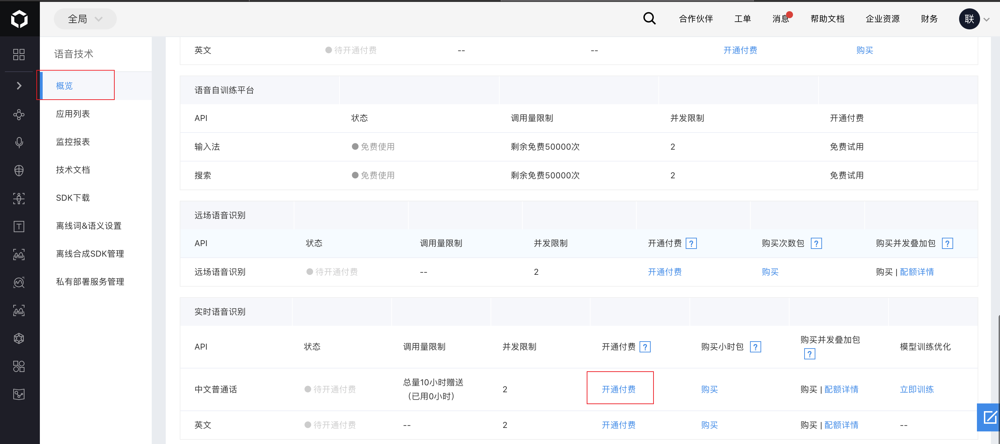
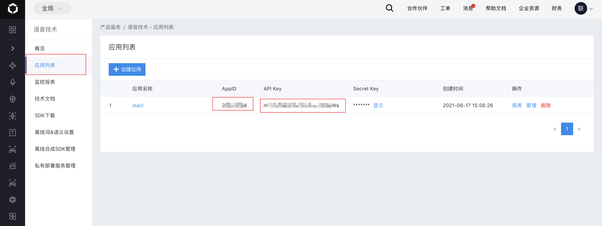

# AI接入指南
### 1. 成为开发者
- 1.1 参考[AI接入指南](https://ai.baidu.com/ai-doc/REFERENCE/Ck3dwjgn3) 完成第一步

### 2.创建应用
- 2.1 进入[控制台](https://console.bce.baidu.com/?fromai=1#/index/overview_v3) ，选择【语音技术】

  

- 2.2 [创建应用](https://console.bce.baidu.com/ai/?fromai=1#/ai/speech/app/create) ，参数配置

  

  

  

### 3.领取免费资源
- 3.1 [领取免费资源](https://console.bce.baidu.com/ai/?fromai=1#/ai/speech/overview/resource/getFree) ，需要实名认证

  

  

- 3.2 开通付费，这里因为有10个小时的免费资源，所以不收费

  

### 4.获取密钥
- 4.1 本项目主要用到AppID和API Key

  

