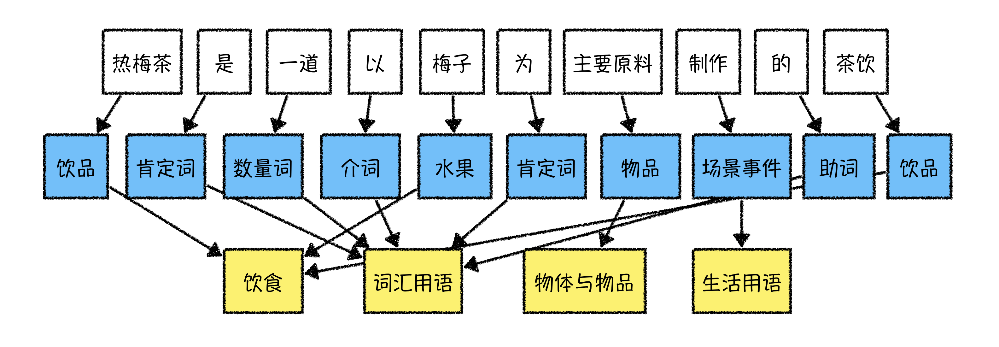

# 解语（Text to Knowledge）

[解语官网](https://www.paddlepaddle.org.cn/textToKnowledge)

解语（Text to Knowledge）是首个覆盖中文全词类的知识库（百科知识树）及知识标注与挖掘框架，拥有可描述所有中文词汇的词类体系、中文知识标注工具集，以及更适用于中文挖掘任务的预训练语言模型。


覆盖中文全词类的知识库和知识标注工具能够帮助你面对更加多元的应用场景，方便地融合自有知识体系，显著提升中文文本解析和挖掘效果，并能够更容易地利用知识增强机器学习模型效果。解语经过大规模工业应用验证，在实际业务中取得了良好的应用效果，适合通用领域中文文本理解任务。


**解语由以下三部分构成：**

- [百科知识树（TermTree）](./termtree) ：包括能够描述所有中文词汇的TermType词类体系，以及Term关系和属性值。
- 中文知识标注工具集：包括[词类知识标注工具（WordTag）](./wordtag) 和[名词短语标注工具（NPTag）](./nptag)，[适用于中文文本挖掘的预训练语言模型（ERNIE-CTM）](./ernie-ctm)，为中文文本解析提供词类序列标注框架，结合百科知识树可实现定制化词类序列标注。
- 中文知识挖掘方案：包括[知识模板挖掘工具](./wordtag-ie)，旨在提供灵活可配置，可快速定制的中文知识挖掘方案。

**本次发布的解语开源试用版包括：**

- 百科知识树（TermTree）V1.0试用版：包括简化版的TermType词类体系，和约100w的term集。
- 中文词类知识标注工具（WordTag）V1.0版。
- 名词短语标注工具（NPTag）V1.0版。
- 中文预训练语言模型（ERNIE-CTM）V1.0版。


----

## 解语的应用场景

解语可直接用于各类中文文本解析与挖掘任务，提升文本解析与挖掘精度；也可以作为中文文本特征生成器，为各类机器学习模型提供文本特征。

中文词类知识标注工具（WordTag）整合了传统中文解析的**分词**、**词性标注**、**命名实体识别**的能力，能够将任意中文句子解析为**完整的词类序列**。结合百科知识树（TermTree），可为应用提供一套通用的知识关联（term-linking）框架，方便应用适配关联自己的应用知识图谱，更好地将知识用于中文自然语言处理（NLP）任务。




### 应用场景A：文本挖掘/解析模板生成与匹配

虽然近年来，深度学习模型尤其是预训练语言模型的广泛使用大幅提升了各项中文NLP任务效果，但在实际的工业应用中，单独使用深度学习模型往往达不到应用需求，还需要结合规则模型以提升精度以及解决恶劣case，如，知识图谱构建、query解析、语义一致性判定等应用。

在这些应用中，文本挖掘/解析模板是最常用的规则模型。WordTag包含了覆盖中文所有词汇的词类标注体系，在生成模板以及模板匹配上有着天然的优势。用户可以根据WordTag标注的样本词类序列，自动生成或配置更加丰富、精准的挖掘/解析模板，然后对目标文本使用WordTag标注，即可利用模板进行匹配，从而大大降低人工配置模板的代价，显著提升生产效率。

例如，输入文本：*美人鱼是周星驰执导的电影*，得到预测结果：

```json
{
    "text": "美人鱼是周星驰执导的电影",
    "items": [
        {
            "item": "美人鱼",
            "offset": 0,
            "wordtag_label": "作品类_实体",
            "length": 3,
            "termid": "作品与出版物_eb_美人鱼"
        },
        {
            "item": "是",
            "offset": 3,
            "wordtag_label": "肯定词",
            "length": 1,
            "termid": "肯定否定词_cb_是"
        },
        {
            "item": "周星驰",
            "offset": 4,
            "wordtag_label": "人物类_实体",
            "length": 3,
            "termid": "人物_eb_周星驰"
        },
        {
            "item": "执导",
            "offset": 7,
            "wordtag_label": "场景事件",
            "length": 2,
            "termid": "场景事件_cb_执导"
        },
        {
            "item": "的",
            "offset": 9,
            "wordtag_label": "助词",
            "length": 1,
            "termid": "助词_cb_的"
        },
        {
            "item": "电影",
            "offset": 10,
            "wordtag_label": "作品类_概念",
            "length": 2,
            "termid": "影视作品_cb_电影"
        }
    ]
}
```

将上述标注结果中的词类序列取出，去除虚词、标点等与语义无关的词，可将抽取出的词类直接构造成为挖掘匹配模板：

```
[作品类_实体][肯定词|是][人物类_实体][场景事件|执导][作品类_概念|电影]
```

利用该模板，以及结合TermTree进行概念扩展，可以匹配出所有该句式的文本，例如：

> 《狂人日记》是鲁迅创作的第一个短篇白话日记体小说
>
> 《澳门风云》是王晶创作执导的合家欢贺岁喜剧赌片
>
> 《千王之王2000》是一部王晶于1999年执导的喜剧电影
>
> 《射雕英雄传》是金庸创作的长篇武侠小说

WordTag的标注结果中，区分了“人物类\_实体”和“人物类\_概念”，以及“作品类\_实体”和“作品类\_概念”，使得模板生成更为精准。同时，TermTree中也区分了命名实体词(eb: entity base)与非实体词(cb: concept base)，这样，可以利用TermTree分别进行实体扩展（e.g., 周星驰->王晶）和概念扩展(e.g., 电影->小说)，生成更加丰富多样的模板，支持更细化的应用场景。

### 应用场景B：词类知识增强的深度学习模型

词类特征同时也是一类重要的文本特征，可为原始文本token提供有效的边界信息、归组信息，减少样本中的噪音，防止模型过拟合；还可作为层次泛化特征，弥补统计共现特征的不足。

在深度学习模型应用中，可将WordTag产出的词类作为embedding特征，直接叠加到文本token上，作为深度学习模型的输入；在BERT等模型中，也可以将词类作为文本序列中的一部分，利用position id和可见性矩阵控制token和词类特征之间的可见性，作为深度学习模型的输入。

### 应用场景C：知识图谱关联（term-linking）

随着知识图谱技术的普及和越来越多应用知识图谱数据的发布，如何利用知识提升NLP任务效果，成为近年来NLP研究的热点方向。文本与图谱知识结合的前提是将图谱中的实体准确link到文本上，这是知识图谱应用的一大难点。现有的方案多是基于某个特定图谱实现的，缺乏通用的图谱关联解决方案。我们尝试使用“**WordTag+TermTree**”提供一套通用的图谱关联（term-linking）技术框架。

**NOTE：** 为了避免歧义，我们 **用term统一指代图谱收录的各类实体、概念、术语**。

为了能够适配应用中的不同实体集（例如，不同的企业有不同的人物实体集合，不同的小说站有不同的小说实体集合），我们将term-linking拆分为两个步骤：

- 第一步是基于词类的linking，主要解决“同名概念词/实体词”、“不同类的同名词”消歧问题，这一步只使用文本本身特征和词类特征，不使用图谱中的实体属性值（SPO）知识，从而支持切换不同应用图谱；
- 第二步是同类同名实体词的linking，主要解决同类下不同属性值的实体消歧问题，这一步需要使用实体词的SPO知识（一般用于实体特征表示计算，以及文本-实体相似度计算）。

“WordTag+TermTree”的开源版提供了第一步的解决示例，第二步由于依赖于特定图谱的SPO知识，暂时无法提供通用工具，未来可能提供通用解决方案。

### 应用场景D：文本分类和文本挖掘样本优化

工业NLP应用场景中，文本分类、文本挖掘是最常见的任务。虽然，预训练语言模型的技术进步大幅提升了小样本学习的效果，但要达到理想的工业应用效果，还是需要大规模高精度监督训练样本。

人工标注可以产出高精度小规模训练样本。半监督学习等技术可以帮助用户基于人工标准样本快速扩充样本规模，但无法保证样本精度。这种情况下，可以使用“WordTag+TermTree”辅助筛选和修正样本，提升样本精度，例如：

- 使用WordTag产出样本模板，再利用TermTree进行泛化约束，筛选出高置信度的样本，或者过滤不合格的样本；

- 利用词类关系检测类别与样本的一致性，比如，医疗类文本与“疾病损伤、药物、医疗卫生机构”等词类相关，可以利用TermTree知识筛选出该类别高置信度的样本。

此外，统计模型容易拟合高频term，导致在低频term上泛化效果不好，这时可以利用TermTree筛选样本，提升样本平衡性，从而提升模型泛化能力。

## 后续计划

1. 发布百科知识树（TermTree）正式版数据，建立知识共建社区，支持用户提交应用词表/应用图谱 & 定制化TermTree, [TermTree下载链接](https://kg-concept.bj.bcebos.com/TermTree/TermTree.V1.0.tar.gz)；
2. 持续优化ERNIE-CTM预训练模型，支持多种参数规模模型发布，探索更好的适配中文解析挖掘任务的预训练模型；
3. 持续优化中文文本知识标注工具集，提供更加精准的知识标注服务；发布多粒度标注工具，支持更加丰富的应用场景。

## 在论文中引用解语

如果您的工作成果中使用了解语，请增加下述引用。我们非常乐于看到解语对您的工作带来帮助。

```
@article{zhao2020TermTree,
    title={TermTree and Knowledge Annotation Framework for Chinese Language Understanding},
    author={Zhao, Min and Qin, Huapeng and Zhang, Guoxin and Lyu, Yajuan and Zhu, Yong},
    technical report={Baidu, Inc. TR:2020-KG-TermTree},
    year={2020}
}
```


## 问题与反馈

解语在持续优化中，如果您有任何建议或问题，欢迎提交issue到Github。
