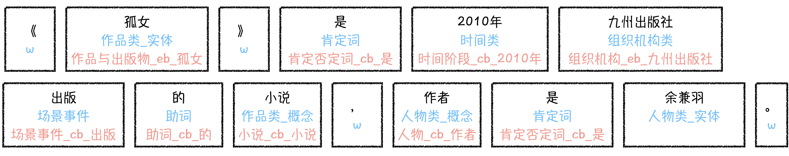
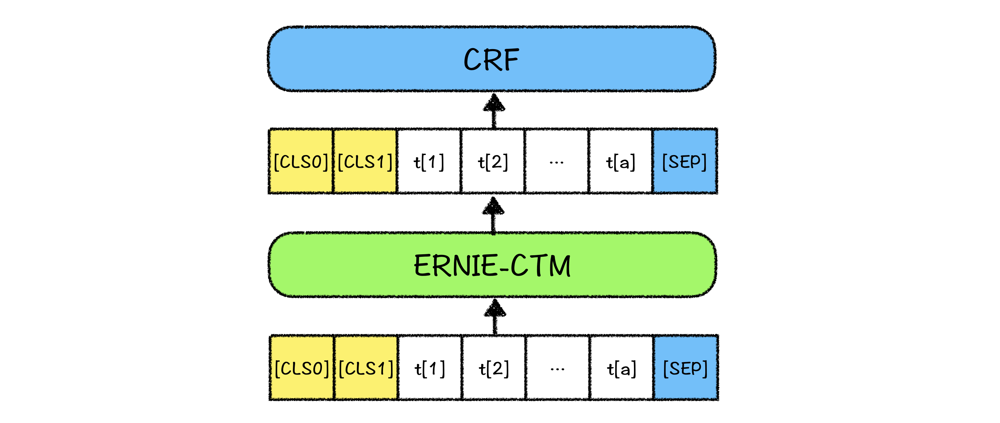

# 解语：WordTag（中文词类知识标注工具）

WordTag（中文词类知识标注工具）是首个能够覆盖所有中文词汇的词类知识标注工具，旨在为中文文本解析提供全面、丰富的知识标注结果，可以应用于模板（挖掘模板、解析模板）生成与匹配、知识挖掘(新词发现、关系挖掘)等自然语言处理任务中，提升文本解析与挖掘精度；也可以作为中文文本特征生成器，为各类机器学习模型提供文本特征。



## WordTag特点

- **覆盖所有中文词汇的词类体系，更丰富的知识标注结果**
  - WordTag使用的词类体系为覆盖所有中文词汇的词类体系，包括各类实体词与非实体词（如概念、实体/专名、语法词等）。WordTag开源版对部分类目（如组织机构等），做了更细类目的划分识别（如，医疗卫生机构、体育组织机构），对仅使用文本信息难以细分的类目（如人物类、作品类、品牌名等），不做更细粒度的词类识别。用户需要细粒度的词类识别时，可利用百科知识树的类别体系自行定制。
- **整合百科知识树链接结果，获得更丰富的标注知识**
  - 如上图示例所示，各个切分标注结果中，除词类标注外，还整合了百科知识树的链接结果，用户可以结合百科知识树数据共同使用：如，利用百科知识树中的subtype获得更细的上位粒度，利用term的百科信息获得更加丰富的知识等。
- **可定制的词类序列标注框架**
  - WordTag开源版标注使用的词类体系是我们在实践中对**百科文本**解析应用较好的一个版本，不同类型文本（如，搜索query、新闻资讯）的词类分布不同，用户可以利用百科知识树定制自己的词类体系和训练样本，构建自己的WordTag应用版，以获得更好的适配效果。例如，可将自定义的词表按照百科知识树的字段定义好，挂接/整合到百科知识树上，即可使用自己的Term数据定制标注样本和标注任务。

## 模型结构

模型使用[ERNIE-CTM](../ernie-ctm)+CRF训练而成，预测时使用viterbi解码，模型结构如下：




## Term-Linking实现

WordTag提供从文本到百科知识树的链接方法，即Term-Linking，只需将term词类体系与百科知识树数据加载到工具中，即可在解析结果中得到term-linking结果。

为了能够适配应用中的不同实体集（例如，不同的企业有不同的人物实体集合，不同的小说站有不同的小说实体集合），我们将term-linking拆分为两个步骤：

- 第一步是基于词类的linking，主要解决“同名概念词/实体词”、“不同类的同名词”消歧问题，这一步只使用文本本身特征和词类特征，不使用图谱中的实体属性值（SPO）知识，从而支持切换不同应用知识图谱；
- 第二步是同类同名实体词的linking，主要解决同类下不同属性值的实体消歧问题，这一步需要使用实体词的SPO知识（一般用于实体特征表示计算，以及文本-实体相似度计算）。

“WordTag+百科知识树”的开源版提供了第一步的解决示例，第二步由于依赖于特定图谱的SPO知识，无法提供通用工具，未来可能提供通用解决方案。

WordTag模型对所有的词预测到上位词类之后，会直接根据预测到的词类，映射到term体系（映射表参见代码配置），查找相应的term，进行link。用户也可根据自己的数据分布，定制term-linking策略：

- link到自己定制的term词表：只需将term词表按照TermTree挂接好之后更换数据即可；
- 调整WordTag预测词类与term词表的映射关系（如，增加自定义类别）：在代码配置中直接调整映射表即可。

## WordTag类别标签集合

WordTag共包含91种词性及专名类别标签，标签集合如下表

<table>
    <thead>
        <th colspan='7'>WordTag标签集合</th>
    </thead>
    <tbody>
        <tr>
            <td>人物类_实体</td>
            <td>组织机构类_军事组织机构_概念</td>
            <td>文化类_制度政策协议</td>
            <td>位置方位</td>
            <td>术语类_医药学术语</td>
            <td>信息资料_性别</td>
            <td>否定词</td>
        </tr>
        <tr>
            <td>人物类_概念</td>
            <td>组织机构类_医疗卫生机构</td>
            <td>文化类_姓氏与人名</td>
            <td>世界地区类</td>
            <td>术语类_生物体</td>
            <td>链接地址</td>
            <td>数量词</td>
        </tr>
        <tr>
            <td>作品类_实体</td>
            <td>组织机构类_医疗卫生机构_概念</td>
            <td>生物类</td>
            <td>世界地区类_国家</td>
            <td>疾病损伤类</td>
            <td>个性特征</td>
            <td>数量词_序数词</td>
        </tr>
        <tr>
            <td>作品类_概念</td>
            <td>组织机构类_教育组织机构</td>
            <td>生物类_植物</td>
            <td>世界地区类_区划概念</td>
            <td>疾病损伤类_植物病虫害</td>
            <td>感官特征</td>
            <td>数量词_单位数量词</td>
        </tr>
        <tr>
            <td>组织机构类</td>
            <td>组织机构类_教育组织机构_概念</td>
            <td>生物类_动物</td>
            <td>世界地区类_地理概念</td>
            <td>宇宙类</td>
            <td>场景事件</td>
            <td>叹词</td>
        </tr>
        <tr>
            <td>组织机构类_概念</td>
            <td>物体类</td>
            <td>品牌名</td>
            <td>饮食类</td>
            <td>事件类</td>
            <td>介词</td>
            <td>拟声词</td>
        </tr>
        <tr>
            <td>组织机构类_企事业单位</td>
            <td>物体类_概念</td>
            <td>品牌名_品牌类型</td>
            <td>饮食类_菜品</td>
            <td>时间类</td>
            <td>介词_方位介词</td>
            <td>修饰词</td>
        </tr>
        <tr>
            <td>组织机构类_企事业单位_概念</td>
            <td>物体类_兵器</td>
            <td>场所类</td>
            <td>饮食类_饮品</td>
            <td>时间类_特殊日</td>
            <td>助词</td>
            <td>修饰词_性质</td>
        </tr>
        <tr>
            <td>组织机构类_国家机关</td>
            <td>物体类_化学物质</td>
            <td>场所类_概念</td>
            <td>药物类</td>
            <td>时间类_朝代</td>
            <td>代词</td>
            <td>修饰词_类型</td>
        </tr>
        <tr>
            <td>组织机构类_国家机关_概念</td>
            <td>其他角色类</td>
            <td>场所类_交通场所</td>
            <td>药物类_中药</td>
            <td>时间类_具体时间</td>
            <td>连词</td>
            <td>修饰词_化</td>
        </tr>
        <tr>
            <td>组织机构类_体育组织机构</td>
            <td>文化类</td>
            <td>场所类_交通场所_概念</td>
            <td>术语类</td>
            <td>时间类_时长</td>
            <td>副词</td>
            <td>外语单词</td>
        </tr>
        <tr>
            <td>组织机构类_体育组织机构_概念</td>
            <td>文化类_语言文字</td>
            <td>场所类_网上场所</td>
            <td>术语类_术语类型</td>
            <td>词汇用语</td>
            <td>疑问词</td>
            <td>汉语拼音</td>
        </tr>
        <tr>
            <td>组织机构类_军事组织机构</td>
            <td>文化类_奖项赛事活动</td>
            <td>场所类_网上场所_概念</td>
            <td>术语类_符号指标类</td>
            <td>信息资料</td>
            <td>肯定词</td>
            <td>w（标点）</td>
        </tr>
    </tbody>
</table>


## WordTag应用场景

参见"[解语的应用场景](../)"


## WordTag示例代码
下面提供了WordTag模型进行文本到百科知识树链接的示例程序。

### Term-Linking示例程序

Term-Linking示例程序可以对无标签数据启动模型预测, 例如想对下面几段文本进行百科知识树的链接解析
```
"《孤女》是2010年九州出版社出版的小说，作者是余兼羽。",
"热梅茶是一道以梅子为主要原料制作的茶饮"
```

执行下面的脚本即可快速获取上面两段文本的百科知识树链接的结果

```python
from paddlenlp import Taskflow
wordtag = Taskflow("knowledge_mining", model="wordtag", linking=True)
wordtag(["热梅茶是一道以梅子为主要原料制作的茶饮",
      "《孤女》是2010年九州出版社出版的小说，作者是余兼羽"])
# Support the input text directly
wordtag("热梅茶是一道以梅子为主要原料制作的茶饮")

```
下面是运行WordTag工具后的知识链接的预测结果

```json
[{'text': '《孤女》是2010年九州出版社出版的小说，作者是余兼羽。', 'items': [{'item': '《', 'offset': 0, 'wordtag_label': 'w', 'length': 1}, {'item': '孤女', 'offset': 1, 'wordtag_label': '作品类_实体', 'length': 2, 'termid': '小说_eb_孤女'}, {'item': '》', 'offset': 3, 'wordtag_label': 'w', 'length': 1}, {'item': '是', 'offset': 4, 'wordtag_label': '肯定词', 'length': 1, 'termid': '肯定否定词_cb_是'}, {'item': '2010年', 'offset': 5, 'wordtag_label': '时间类', 'length': 5, 'termid': '时间阶段_cb_2010年'}, {'item': '九州出版社', 'offset': 10, 'wordtag_label': '组织机构类', 'length': 5, 'termid': '组织机构_eb_九州出版社'}, {'item': '出版', 'offset': 15, 'wordtag_label': '场景事件', 'length': 2, 'termid': '场景事件_cb_出版'}, {'item': '的', 'offset': 17, 'wordtag_label': '助词', 'length': 1, 'termid': '助词_cb_的'}, {'item': '小说', 'offset': 18, 'wordtag_label': '作品类_概念', 'length': 2, 'termid': '小说_cb_小说'}, {'item': '，', 'offset': 20, 'wordtag_label': 'w', 'length': 1}, {'item': '作者', 'offset': 21, 'wordtag_label': '人物类_概念', 'length': 2, 'termid': '人物_cb_作者'}, {'item': '是', 'offset': 23, 'wordtag_label': '肯定词', 'length': 1, 'termid': '肯定否定词_cb_是'}, {'item': '余兼羽', 'offset': 24, 'wordtag_label': '人物类_实体', 'length': 3}, {'item': '。', 'offset': 27, 'wordtag_label': 'w', 'length': 1}]}, {'text': '热梅茶是一道以梅子为主要原料制作的茶饮', 'items': [{'item': '热梅茶', 'offset': 0, 'wordtag_label': '饮食类_饮品', 'length': 3}, {'item': '是', 'offset': 3, 'wordtag_label': '肯定词', 'length': 1, 'termid': '肯定否定词_cb_是'}, {'item': '一道', 'offset': 4, 'wordtag_label': '数量词', 'length': 2}, {'item': '以', 'offset': 6, 'wordtag_label': '介词', 'length': 1, 'termid': '介词_cb_以'}, {'item': '梅子', 'offset': 7, 'wordtag_label': '饮食类', 'length': 2, 'termid': '饮食_cb_梅'}, {'item': '为', 'offset': 9, 'wordtag_label': '肯定词', 'length': 1, 'termid': '肯定否定词_cb_为'}, {'item': '主要原料', 'offset': 10, 'wordtag_label': '物体类', 'length': 4, 'termid': '物品_cb_主要原料'}, {'item': '制作', 'offset': 14, 'wordtag_label': '场景事件', 'length': 2, 'termid': '场景事件_cb_制作'}, {'item': '的', 'offset': 16, 'wordtag_label': '助词', 'length': 1, 'termid': '助词_cb_的'}, {'item': '茶饮', 'offset': 17, 'wordtag_label': '饮食类_饮品', 'length': 2, 'termid': '饮品_cb_茶饮'}]}]
{'text': '热梅茶是一道以梅子为主要原料制作的茶饮', 'items': [{'item': '热梅茶', 'offset': 0, 'wordtag_label': '饮食类_饮品', 'length': 3}, {'item': '是', 'offset': 3, 'wordtag_label': '肯定词', 'length': 1, 'termid': '肯定否定词_cb_是'}, {'item': '一道', 'offset': 4, 'wordtag_label': '数量词', 'length': 2}, {'item': '以', 'offset': 6, 'wordtag_label': '介词', 'length': 1, 'termid': '介词_cb_以'}, {'item': '梅子', 'offset': 7, 'wordtag_label': '饮食类', 'length': 2, 'termid': '饮食_cb_梅'}, {'item': '为', 'offset': 9, 'wordtag_label': '肯定词', 'length': 1, 'termid': '肯定否定词_cb_为'}, {'item': '主要原料', 'offset': 10, 'wordtag_label': '物体类', 'length': 4, 'termid': '物品_cb_主要原料'}, {'item': '制作', 'offset': 14, 'wordtag_label': '场景事件', 'length': 2, 'termid': '场景事件_cb_制作'}, {'item': '的', 'offset': 16, 'wordtag_label': '助词', 'length': 1, 'termid': '助词_cb_的'}, {'item': '茶饮', 'offset': 17, 'wordtag_label': '饮食类_饮品', 'length': 2, 'termid': '饮品_cb_茶饮'}]}
```

同时我们也提供了基于上述taskflow的python执行脚本，具体的执行方式如下：
```shell
python predict.py --max_seq_len 128 --batch_size 2
```
其中参数释义如下：
- `max_seq_len` 表示最大句子长度，超过该长度将被截断。
- `batch_size` 表示每个预测批次的样本数目。

## WordTag进阶使用

### 自定义模型一键预测

用户可以使用自有数据对WordTag模型进行增量训练，然后使用Taskflow进行一键预测，参见[WordTag增量训练示例](../ernie-ctm)。

### 自定义Term-Linking

Taskflow默认使用TermTreeV1.0实现Term-Linking, 用户也可以基于自己的TermTree实现Term-Linking，参见[自定义TermTree](../termtree)。

## Release Note

- 2022.06：新增25个细化词类，用于下游挖掘任务

## WordTag后续计划

1. 持续优化知识标注模型，获得更加精准的标注结果；
2. 发布多粒度、多种参数规模的知识标注模型；
3. 提供细粒度term及subterm消歧的解决方案。


## 在论文中引用WordTag

如果您的工作成果中使用了WordTag，请增加下述引用。我们非常乐于看到WordTag对您的工作带来帮助。
```
@article{zhao2020TermTree,
    title={TermTree and Knowledge Annotation Framework for Chinese Language Understanding},
    author={Zhao, Min and Qin, Huapeng and Zhang, Guoxin and Lyu, Yajuan and Zhu, Yong},
    technical report={Baidu, Inc. TR:2020-KG-TermTree},
    year={2020}
}
```


## 问题与反馈

WordTag在持续优化中，如果您有任何建议或问题，欢迎提交issue到Github。
