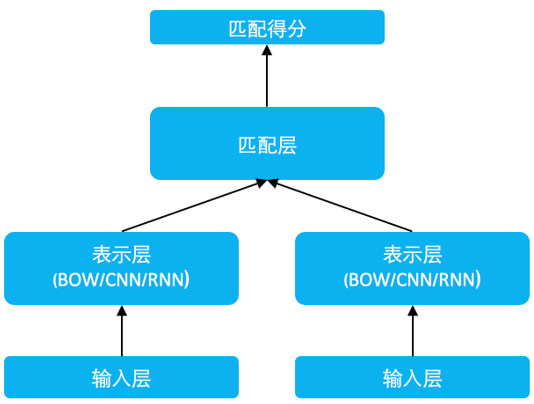

# 短文本语义匹配
## 简介
### 任务说明
短文本语义匹配(SimilarityNet, SimNet)是一个计算短文本相似度的框架，可以根据用户输入的两个文本，计算出相似度得分。SimNet框架在百度各产品上广泛应用，主要包括BOW、CNN、RNN、MMDNN等核心网络结构形式，提供语义相似度计算训练和预测框架，适用于信息检索、新闻推荐、智能客服等多个应用场景，帮助企业解决语义匹配问题。可通过[AI开放平台-短文本相似度](https://ai.baidu.com/tech/nlp_basic/simnet)线上体验。

同时推荐用户参考[ IPython Notebook demo](https://aistudio.baidu.com/aistudio/projectDetail/124373)

### 效果说明
基于百度海量搜索数据，我们训练了一个SimNet-BOW-Pairwise语义匹配模型，在一些真实的FAQ问答场景中，该模型效果比基于字面的相似度方法AUC提升5%以上，我们基于百度自建测试集（包含聊天、客服等数据集）和语义匹配数据集(LCQMC)进行评测，效果如下表所示。LCQMC数据集以Accuracy为评测指标，而pairwise模型的输出为相似度，因此我们采用0.958作为分类阈值，相比于基线模型中网络结构同等复杂的CBOW模型（准确率为0.737），我们模型的准确率为0.7532。


| 模型       | 百度知道         | ECOM        |QQSIM | UNICOM |
|:-----------:|:-------------:|:-------------:|:-------------:|:-------------:|
|   | AUC  | AUC | AUC|正逆序比|
|BOW_Pairwise(WordSeg)|0.6767|0.7329|0.7650|1.5630|
|BOW_Pairwise(Jieba)|0.6658|0.7351|0.8431|1.5331|
#### 测试集说明
| 数据集       | 来源         | 垂类        |
|:-----------:|:-------------:|:-------------:|
|百度知道   | 百度知道问题  | 日常 |
|ECOM|商业问句|金融|
|QQSIM|闲聊对话|日常|
|UNICOM|联通客服|客服|
## 快速开始
#### 版本依赖
本项目依赖于 Paddlepaddle Fluid 1.8，请参考[安装指南](https://www.paddlepaddle.org.cn/install/quick)进行安装。

python版本依赖python 2.7
#### 安装代码
克隆工具集代码库到本地
```shell
git clone https://github.com/PaddlePaddle/models.git
cd models/PaddleNLP/similarity_net
```
#### 数据准备
下载经过预处理的数据，运行命令后，data目录下会存在训练集数据示例、集数据示例、测试集数据示例，以及对应词索引字典（term2id.dict）。
```shell
sh download_data.sh
```
或者
```
python download.py dataset
```
#### 模型准备
我们开源了基于大规模数据训练好的```pairwise```模型（基于bow模型训练），用户可以通过运行命令下载预训练好的模型，该模型将保存在```./model_files/simnet_bow_pairwise_pretrained_model/```下。
```shell
sh download_pretrained_model.sh
```
或者
```
python download.py model
```

#### 评估
我们公开了自建的测试集，包括百度知道、ECOM、QQSIM、UNICOM 四个数据集，基于上面的预训练模型，用户可以进入 evaluate 目录下依次执行下列命令获取测试集评估结果。

我们在以下评估脚本中以 Jieba 切词作为示例，如果您需要自定义切词模块，只需要在 [`tokenization.py`](tokenization.py) 中参考 `JiebaTokenizer` 实现自定义的切词类, 并且在 `evaluate_*.sh` 评估脚本中配置环境变量 `TOKENIZER=${YOUR_TOKENIZER_NAME}` 即可, 如果 `TOKENIZER` 环境变量为空, 则默认输入数据是切词后的数据(示例给出的数据是百度切词工具 WordSeg 切词后的数据)

```shell
sh evaluate_ecom.sh  
sh evaluate_qqsim.sh  
sh evaluate_zhidao.sh  
sh evaluate_unicom.sh  
```
用户也可以指定./run.sh中的TEST_DATA_PATH的值，通过下列命令评估自己指定的测试集。
```shell
sh run.sh eval
```

#### 推测
基于上面的预训练模型，可以运行下面的命令进行推测，并保存推测结果到本地。
```shell
sh run.sh infer  
```
#### 训练与验证
用户可以基于示例数据构建训练集和开发集，可以运行下面的命令，进行模型训练和开发集验证。
```shell
sh run.sh train
```
用户也可以指定./run.sh中train()函数里的INIT_CHECKPOINT的值，载入训练好的模型进行热启动训练。
## 进阶使用

### 任务定义与建模

传统的文本匹配技术如信息检索中的向量空间模型 VSM、BM25 等算法，主要解决词汇层面的相似度问题，这种方法的效果在实际应用中受到语言的多义词和语言结构等问题影响。SimNet 在语义表示上沿袭了隐式连续向量表示的方式，但对语义匹配问题在深度学习框架下进行了 End-to-End 的建模，将```point-wise```与 ```pair-wise```两种有监督学习方式全部统一在一个整体框架内。在实际应用场景下，将海量的用户点击行为数据转化为大规模的弱标记数据，在网页搜索任务上的初次使用即展现出极大威力，带来了相关性的明显提升。

### 模型原理介绍

SimNet如下图所示：

<p align="center">
 <br />
</p>

### 数据格式说明

训练模式一共分为```pairwise```和```pointwise```两种模式。

#### pairwise模式：
训练集格式如下： query \t pos_query \t neg_query。
query、pos_query和neg_query是以空格分词的中文文本，中间使用制表符'\t'隔开，pos_query表示与query相似的正例，neg_query表示与query不相似的随机负例，文本编码为utf-8。</br>
```
现在 安卓模拟器 哪个 好 用     电脑 安卓模拟器 哪个 更好      电信 手机 可以 用 腾讯 大王 卡 吗 ?
土豆 一亩地 能 收 多少 斤      一亩 地土豆 产 多少 斤        一亩 地 用 多少 斤 土豆 种子
```

开发集和测试集格式：query1 \t query2 \t label。</br>

query1和query2表示以空格分词的中文文本，label为0或1，1表示query1与query2相似，0表示query1与query2不相似，query1、query2和label中间以制表符'\t'隔开，文本编码为utf-8。</br>
```
现在 安卓模拟器 哪个 好 用    电脑 安卓模拟器 哪个 更好      1
为什么 头发 掉 得 很厉害      我 头发 为什么 掉 得 厉害    1
常喝 薏米 水 有 副 作用 吗    女生 可以 长期 喝 薏米 水养生 么    0
长 的 清新 是 什么 意思      小 清新 的 意思 是 什么 0
```

#### pointwise模式：

训练集、开发集和测试集数据格式相同：query1和query2表示以空格分词的中文文本，label为0或1，1表示query1与query2相似，0表示query1与query2不相似，query1、query2和label中间以制表符'\t'隔开，文本编码为utf-8。
```
现在 安卓模拟器 哪个 好 用    电脑 安卓模拟器 哪个 更好      1
为什么 头发 掉 得 很厉害      我 头发 为什么 掉 得 厉害    1
常喝 薏米 水 有 副 作用 吗    女生 可以 长期 喝 薏米 水养生 么    0
长 的 清新 是 什么 意思     小 清新 的 意思 是 什么 0
```

#### infer数据集：

```pairwise```和```pointwise```的infer数据集格式相同：query1 \t query2。</br>

query1和query2为以空格分词的中文文本。
```
怎么 调理 湿热 体质 ？   湿热 体质 怎样 调理 啊
搞笑 电影 美国   搞笑 的 美国 电影
```

__注__：本项目额外提供了分词预处理脚本（在preprocess目录下），可供用户使用，具体使用方法如下：

```shell
python tokenizer.py --test_data_dir ./test.txt.utf8 --batch_size 1 > test.txt.utf8.seg
```
其中test.txt.utf8为待分词的文件，一条文本数据一行，utf8编码，分词结果存放在test.txt.utf8.seg文件中

### 代码结构说明
```text
.
├── run_classifier.py：该项目的主函数，封装包括训练、预测、评估的部分
├── config.py：定义该项目模型的配置类，读取具体模型类别、以及模型的超参数等
├── reader.py：定义了读入数据的相关函数
├── utils.py：定义了其他常用的功能函数
├── Config: 定义多种模型的配置文件
├── download.py: 下载数据及预训练模型脚本
```

### 如何训练
```shell
python run_classifier.py \
   --task_name ${TASK_NAME} \
   --use_cuda false \ #是否使用GPU
   --do_train True \  #是否训练
   --do_valid True \  #是否在训练中测试开发集
   --do_test True \   #是否验证测试集
   --do_infer False \ #是否预测
   --batch_size 128 \ #batch_size的值
   --train_data_dir ${TRAIN_DATA_kPATH} \ #训练集的路径
   --valid_data_dir ${VALID_DATA_PATH} \ #开发集的路径
   --test_data_dir ${TEST_DATA_PATH} \   #测试集的路径
   --infer_data_dir ${INFER_DATA_PATH} \ #待推测数据的路径
   --output_dir ${CKPT_PATH} \           #模型存放的路径
   --config_path ${CONFIG_PATH} \        #配置文件路径
   --vocab_path ${VOCAB_PATH} \          #字典路径
   --epoch 10 \    #epoch值
   --save_steps 1000 \  #每save_steps保存一次模型
   --validation_steps 100 \ #每validation_steps验证一次开发集结果
   --task_mode ${TASK_MODE} #训练模式，pairwise或pointwise，与相应的配置文件匹配。
   --compute_accuracy False \   #是否计算accuracy
   --lamda 0.91 \    #pairwise模式计算accuracy时的阈值
   --init_checkpoint "" #预加载模型路径
```
### 如何组建自己的模型
用户可以根据自己的需求，组建自定义的模型，具体方法如下所示：

i. 定义自己的网络结构

用户可以在```../models/matching```下定义自己的模型；

ii. 更改模型配置

用户仿照```config```中的文件生成自定义模型的配置文件。

用户需要保留配置文件中的```net```、```loss```、```optimizer```、```task_mode```和```model_path```字段。```net```为用户自定义的模型参数，```task_mode```表示训练模式，为```pairwise```或```pointwise```，要与训练命令中的```--task_mode```命令保持一致，```model_path```为模型保存路径，```loss```和```optimizer```依据自定义模型的需要仿照```config```下的其他文件填写。


iii.模型训练，运行训练、评估、预测脚本即可（具体方法同上）。

## 其他
### 如何贡献代码
如果你可以修复某个issue或者增加一个新功能，欢迎给我们提交PR。如果对应的PR被接受了，我们将根据贡献的质量和难度进行打分（0-5分，越高越好）。如果你累计获得了10分，可以联系我们获得面试机会或者为你写推荐信。
