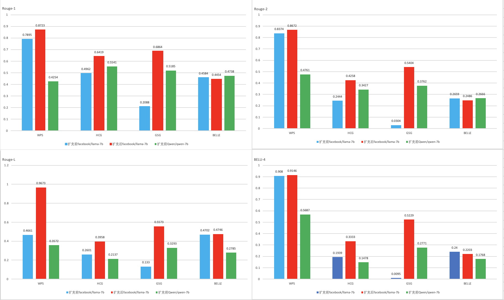

## 🚣‍♂️ 飞桨大模型套件介绍 🚣
飞桨大模型套件秉承了一站式体验、性能极致、生态兼容的设计理念，旨在提供业界主流大模型预训练、精调（含SFT、PEFT）、量化、推理等统一流程， 帮助开发者低成本、低门槛、快速实现大语言模型定制化。

<div align="center">
    
</div>


##  💪🏼 大模型套件特色 💪🏼

-  **飞桨4D并行分布式策略**。 PaddleNLP Trainer 封装支持飞桨4D并行配置（数据并行、张量并行、流水线并行、 分组参数切分并行），屏蔽多硬件编程复杂性，用户可以修改Trainer配置组合多种预训练或精调过程的分布式策略，充分组合大模型4D并行训练能力，能有效提升在多模型、多硬件下的训练性能。

-  **高效精调策略**。飞桨大模型套件提供SFT、PEFT等多种精调策略，搭载自研Zero Padding零填充优化策略有效减少训练数据中pad token的占比，提高模型训练效率。独创PEFT结合低比特和分布式并行策略，大幅降低大模型精调硬件门槛。

- **大模型无损量化**。大模型套件内置了PaddleSlim团队自研的自适应Shift-SmoothQuant的A8W8量化算法和业界主流GPTQ的W4量化算法，实现了主流大模型的无损量化，有效加速模型推理。

- **高性能推理**。大模型套件高性能推理模块内置动态插入和全环节算子融合策略，极大加快并行推理的速度。同时隐藏了底层实现的细节，实现了开箱即用高性能并行推理能力。


##  🛠️ 支持模型列表 🛠️

| Model | Pretrain | SFT | LoRA | Prefix Tuning |  Quantization | Weight convert |
| --- | --- | --- | --- | --- | --- |  --- |
| [LLaMA/LLaMA2](./llama) | ✅  | ✅ | ✅ | ✅ | ✅  | ✅  |
| [Baichuan/Baichuan2](./llama) | ✅  | ✅ | ✅ | ✅ | ✅  | ✅  |
| [ChatGLM-6B](./chatglm) |  ❌  |  ✅  |    ✅  |  ✅  |  ✅  | ❌  |
| [ChatGLM2/ChatGLM3](./chatglm2) |  ❌  |    ✅  |  ✅  |  ✅  |  ✅  | ✅  |
| [Qwen](./qwen) | ✅ | ✅ | ✅ | ✅ |  🚧 | ✅  |j
| [Bloom](./bloom) | ❌  | ✅ | ✅ |  ✅ | ✅ | ✅  |
| [GPT-3](./gpt-3) |   ✅  |  ✅  |    🚧  | 🚧  | 🚧 | ✅  |
| [OPT](./opt) | 🚧 | ✅ | ✅ | 🚧 |  🚧 | ✅  |
| [GLM](./glm) | ❌  | ✅ | ✅ | 🚧 |   🚧 | ✅  |

* ✅: Supported
* 🚧: In Progress
* ❌: Not Supported


##  🚀 快速开始 🚀

### 1. 预训练
PaddleNLP将飞桨4D并行策略加入到Trainer API中， 用户只需修改Trainer配置即可使用不同的分布式策略。目前工具链提供[LLaMA/LLaMA2](./llama)、[GPT-3](./gpt-3)、[Qwen](./qwen)、[Baichuan/Baichuan2](./llama) 等模型预训练功能，更多模型支持持续更新中。

<div align="center">
    
</div>
<div align="center">
    <font size ="1">
    飞桨与 Megatron 预训练性能比对
     </font>
</div>


我们在此处提供了更详细的[预训练数据制作]()，[分布式策略支持情况]( https://paddlenlp.readthedocs.io/zh/latest/llm/pretraining/index.html#model-capability)，[性能测试报告文档](https://paddlenlp.readthedocs.io/zh/latest/llm/pretraining/index.html#model-performance)，参见: https://paddlenlp.readthedocs.io/zh/latest/llm/pretraining/index.html. 大模型权重列表参见[此处](https://paddlenlp.readthedocs.io/zh/latest/llm/pretraining/index.html#model-weight)


此项目支持了LLaMA、GPT-3、BaiChuan、Qwen 等大模型的预训练。用户切换配置config文件，即可一键运行。

数据详细制作流程可参考[此处](https://paddlenlp.readthedocs.io/zh/latest/pretraining/dataset.html) : https://paddlenlp.readthedocs.io/zh/latest/pretraining/dataset.html

为了方便用户运行测试本模型，本项目提供了处理好的100k条doc的训练样本：
```shell
# llama 模型数据下载
wget https://bj.bcebos.com/paddlenlp/models/transformers/llama/data/llama_openwebtext_100k_ids.npy
wget https://bj.bcebos.com/paddlenlp/models/transformers/llama/data/llama_openwebtext_100k_idx.npz

# gpt 模型数据下载
# wget https://bj.bcebos.com/paddlenlp/models/transformers/gpt/data/gpt_en_dataset_300m_ids.npy
# wget https://bj.bcebos.com/paddlenlp/models/transformers/gpt/data/gpt_en_dataset_300m_idx.npz
```

将所有预处理得到的文件统一放入一个文件夹中，以备训练使用：

```
mkdir data
mv llama_openwebtext_100k_ids.npy ./data
mv llama_openwebtext_100k_idx.npz ./data
```

```shell
# 编译自定义算子，可选
cd ../model_zoo/gpt-3/external_ops/ && python3 setup.py install && cd -

# llama 模型预训练
python -u  -m paddle.distributed.launch --gpus "0,1,2,3,4,5,6,7" run_pretrain.py ./llama/pretrain-llama2_7b-tp2sd4_stage2.json

# Qwen 模型预训练
python -u  -m paddle.distributed.launch --gpus "0,1,2,3,4,5,6,7" run_pretrain.py ./qwen/pretrain_argument_stage2.json
```

##### 1.1词表扩充预训练
词表扩充预训练是自然语言处理（NLP）中的一个重要概念，旨在通过增加模型词汇库的大小和多样性来提高语言模型的理解和生成能力。这个过程通常涉及到识别和添加新的词汇到模型的词表中，使其能够处理更广泛的文本数据。预训练阶段是在模型处理特定任务之前进行的，有助于模型更好地适应不同的语言特征和术语。
下图为词表扩充预训练后，经过SFT效果展示：

更多技术细节和词表扩充预训练使用详见[词表扩充预训练](./vocab_extend_scripts/VOCAB_EXTEND.md)

注意：
1. 建议使用paddle develop版本训练，需要安装`pip install tool_helpers visualdl==2.5.3`等相关缺失whl包
2. `use_flash_attention` 需要在A100机器开启，建议使用cuda11.8环境。
3. `use_fused_rms_norm` 需要安装[此目录](https://github.com/PaddlePaddle/PaddleNLP/tree/develop/model_zoo/gpt-3/external_ops)下的自定义OP, `python setup.py install`。如果安装后仍然找不到算子，需要额外设置PYTHONPATH
4. `continue_training` 表示从现有的预训练模型加载训练。7b模型初始loss大概为2.xx, 随机初始化模型loss从11.x左右下降。
5. 当前脚本为sharding版本，需要4D并行训练（数据、sharding、张量、流水线并行）的用户，请参考 `run_trainer_tp4pp2.sh`脚本。
6. 多机训练时，若各机器使用的训练数据文件位置相同（例如挂载共享硬盘情况），请指定`--share_folder true`使全局0号卡制作缓存数据。否则默认各台机器的0号卡独立制作缓存数据，
7. 若数据集文件夹中存在默认缓存文件夹`index-cache/`，则额外指定的`--data_cache`不生效，训练时优先加载默认缓存文件夹中的内容。


### 2. 精调
PaddleNLP支持多个主流大模型的SFT、LoRA、Prefix Tuning等精调策略，提供统一、高效精调方案：
- **统一训练入口**。飞桨大模型套件精调方案可适配业界主流大模型，用户只需修改配置文件，即能在单卡或多卡（支持4D并行分布式策略）进行多种大模型精调。
- **高效数据和分布式策略**。Zero Padding零填充优化策略有效减少了pad token的占比，提高模型训练效率高达100%。独创PEFT结合低比特和分布式并行策略，大幅降低大模型精调硬件门槛，支持单卡（A100 80G）百亿模型微调、单机（A100 80G * 8）千亿模型微调。
- **支持多轮对话**。支持统一对话模板，支持多轮对话高效训练，详参[多轮对话文档](./docs/chat_template.md)。


<div align="center">
    
</div>
<div align="center">
    <font size ="1">
    飞桨与 Huggingface Transformers 微调性能比对
     </font>
</div>

**数据准备**：

我们支持的精调数据格式是每行包含一个字典的json文件，每个字典包含以下字段：

- `src` : `str, List(str)`, 模型的输入指令（instruction）、提示（prompt），模型应该执行的任务。
- `tgt` : `str, List(str)`, 模型的输出。

样例数据：
```
{"src": "类型#裙*颜色#蓝色*风格#清新*图案#蝴蝶结", "tgt": "裙身处采用立体蝴蝶结装饰辅以蓝色条带点缀，令衣身造型饱满富有层次的同时为其注入一丝甜美气息。将女孩清新娇俏的一面衬托而出。"}
...
```

为了方便测试，我们也提供了广告生成数据集可以直接使用：
```bash
wget https://bj.bcebos.com/paddlenlp/datasets/examples/AdvertiseGen.tar.gz
tar -zxvf AdvertiseGen.tar.gz
```

**全参精调：SFT**
```bash
# 四卡llama SFT启动命令参考
python -u  -m paddle.distributed.launch --gpus "0,1,2,3" finetune_generation.py ./llama/sft_argument.json
```

**LoRA**
```bash
# 单卡llama LoRA启动命令参考
python  finetune_generation.py ./llama/lora_argument.json
```

**Prefix Tuning**
```bash
# 单卡llama Prefix Tuning启动命令参考
python  finetune_generation.py ./llama/pt_argument.json
```

更多大模型精调分布式使用文档、训练细节和效果请参见[大模型精调教程](./docs/finetune.md)。

### 3. 量化
大模型量化将16位、32位浮点数的模型参数或激活量化为4位或8位整数能够有效降低模型存储空间和计算资源需求，同时加速推理速度。工具链量化算法包含：
- **PTQ**。PaddleSlim 团队自研的自适应Shift-SmoothQuant量化算法，在[SmoothQuant](https://arxiv.org/abs/2211.10438)和[Outlier Suppression+](https://arxiv.org/abs/2304.09145)基础上
新增PieceWiseSearch参数搜索算法，对模型权重和激活分布进行调整，减少后续A8W8 PTQ量化损失。


- **GPTQ**。[GPTQ](https://arxiv.org/abs/2210.17323)是业界主流的权重量化算法，可以将大模型权重进行4位整数无损量化，提高模型推理速度。

<div align="center">
    
</div>
<div align="center">
    <font size ="1">
    飞桨量化算法效果展示
     </font>
</div>


```
# PTQ 量化启动命令参考
python  finetune_generation.py ./llama/ptq_argument.json

# GPTQ 量化启动命令参考
python  finetune_generation.py ./llama/ptq_argument.json
```

更多技术细节和模型量化使用详见[量化文档](./docs/quantization.md)。


### 4. 推理
PaddleNLP除了提供常用模型推理外，还提供了高性能推理，内置动态插入和全环节算子融合策略，极大加快并行推理的速度。

- **常用模型推理**：PaddleNLP 提供了动态图推理和静态图推理两种方式，方便用户快速验证模型推理效果（包含LoRA、PrefixTuning）。

```shell
# 动态图模型推理命令参考
python predictor.py --model_name_or_path meta-llama/Llama-2-7b-chat --data_file ./data/dev.json --dtype float16

# 静态图模型推理命令参考
# step1 : 静态图导出
python export_model.py --model_name_or_path meta-llama/Llama-2-7b-chat --output_path ./inference --dtype float16
# step2: 静态图推理
python predictor.py --model_name_or_path ./inference --data_file ./data/dev.json --dtype float16 --mode static
```

- **InferenceModel 高性能推理**：PaddleNLP 还提供了高性能推理模型加快并行推理的速度，同时支持FP16、Prefix Tuning、WINT8、A8W8多种推理方式。
<div align="center">
    
</div>
<div align="center">
    <font size ="1">
    推理部署性能业界领先
     </font>
</div>


```shell
# 高性能动态图模型推理命令参考
python predictor.py --model_name_or_path meta-llama/Llama-2-7b-chat --inference_model --dtype float16

# 高性能静态图模型推理命令参考
# step1 : 静态图导出
python export_model.py --model_name_or_path meta-llama/Llama-2-7b-chat --inference_model --output_path ./inference --dtype float16
# step2: 静态图推理
python predictor.py --model_name_or_path ./inference --inference_model --dtype "float16" --mode "static"
```

更多常用模型推理和高性能模型使用方法详见[大模型推理文档](./docs/inference.md)。

### 5. 服务化部署

#### 5.1 环境准备

- python >= 3.8
- gradio
- flask

#### 5.2 Flask & Gradio UI服务化部署

我们提供了一套基于动态图推理的简单易用UI服务化部署脚本，用户可以快速部署服务化推理。

```
python -m paddle.distributed.launch --gpus "0,1,2,3,4,5,6,7" flask_server.py \
    --model_name_or_path meta-llama/Llama-2-7b-chat \
    --port 8010 \
    --flask_port 8011 \
    --dtype "float16"
```
- `port`: Gradio UI 服务端口号，默认8011。
- `flask_port`: Flask服务端口号，默认8010。
- 其他参数请参见[推理文档](./docs/inference.md)中推理参数配置。

此外，如果想通过API脚本的方式跑推理，可参考：`./request_flask_server.py` 文件。

</div></details>


### 6. PyTorch模型权重转换
PaddleNLP 提供了可自动将 PyTorch 相关的权重转化为 Paddle 权重的接口，代码如下：

```python
from paddlenlp.transformers import AutoModelForCausalLM
AutoModelForCausalLM.from_pretrained("/path/to/pytorch/model", convert_from_torch=True,dtype="float16")
```
更多细节请参考[torch2paddle文档](./docs/torch2paddle.md)
