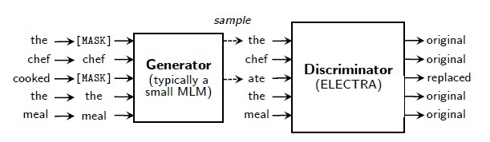

# ELECTRA with PaddleNLP

[ELECTRA](https://openreview.net/pdf?id=r1xMH1BtvB) 在[BERT](https://arxiv.org/abs/1810.04805)的基础上对其预训练过程进行了改进：预训练由两部分模型网络组成，称为Generator和Discriminator，各自包含1个BERT模型。Generator的预训练使用和BERT一样的Masked Language Model(MLM)任务，但Discriminator的预训练使用Replaced Token Detection(RTD)任务（主要改进点）。预训练完成后，使用Discriminator作为精调模型，后续的Fine-tuning不再使用Generator。


图片来源：来自[electra论文](https://openreview.net/pdf?id=r1xMH1BtvB)

根据论文中给出的实验结果，在和BERT具有相同的模型参数、预训练计算量一样的情况下，GLUE得分比BERT明显好，small模型为79.9：75.1，Base模型为85.1：82.2，Large模型为89.0：87.2。

本项目是 ELECTRA 在 Paddle 2.0上的开源实现。

## **环境依赖**

- jieba, 安装方式：`pip install jieba`
- colorlog, 安装方式：`pip install colorlog`
- colorama, 安装方式：`pip install colorama`
- seqeval, 安装方式：`pip install seqeval`

## **数据准备**
### 建议的预训练数据
论文中提到预训练需要两部分数据：Book Corpus数据 和 Wikipedia Corpus数据，均为英文文本，utf-8编码。但是当前BookCorpus数据已不再开源，可以使用其它数据替代，只要是纯英文文本数据，utf-8编码即可（例如 Gutenberg Dataset）。
。另外，Wikipedia Corpus数据建议从[官方获取](https://www.english-corpora.org/wiki/)，下面例子假设这些数据都已获取并都放在./BookCorpus/train.data 文件中，每行一句英文文本

### 自定义预训练数据
支持用户自定义数据进行训练，自定义数据为文本形式，每行一句英文文本，utf-8编码，下面例子假设数据在./BookCorpus/train.data

### Fine-tuning数据
Fine-tuning 使用GLUE数据，这部分Paddle已提供，在执行第4章 Fine-tuning 命令时会自动下载并加载

### 推理数据
可以使用GLUE test数据集（Paddle已提供，在Fine-tuning时会自动下载），或者也可以自定义，格式要求和2.2 自定义预训练数据一样，每行一句英文文本，utf-8编码

## **模型预训练**

**特别注意**：预训练模型如果想要达到较好的效果，需要训练几乎全量的Book Corpus数据 和 Wikipedia Corpus数据，原始文本接近20G，建议用GPU进行预训练，最好4片GPU以上。如果资源较少，Paddle提供已经预训练好的模型进行Fine-tuning，可以直接跳转到下面：运行Fine-tuning-使用Paddle提供的预训练模型运行 Fine-tuning

### 单机单卡
```shell
export CUDA_VISIBLE_DEVICES="0"
export DATA_DIR=./BookCorpus/

python -u ./run_pretrain.py \
    --model_type electra \
    --model_name_or_path electra-small \
    --input_dir $DATA_DIR \
    --output_dir ./pretrain_model/ \
    --train_batch_size 64 \
    --learning_rate 5e-4 \
    --max_seq_length 128 \
    --weight_decay 1e-2 \
    --adam_epsilon 1e-6 \
    --warmup_steps 10000 \
    --num_train_epochs 4 \
    --logging_steps 100 \
    --save_steps 10000 \
    --max_steps -1 \
    --device gpu
```
其中参数释义如下：
- `model_type` 表示模型类型，默认为ELECTRA模型。
- `model_name_or_path` 如果配置1个名字，则表示预训练模型的规模，当前支持的名字为：electra-small（约1400万参数）、electra-base（约1.1亿参数）、electra-large（约3.35亿参数）。如果配置1个路径，则表示按照路径中的模型规模进行训练，这时需配置 --init_from_ckpt 参数一起使用，一般用于断点恢复训练场景。
- `input_dir` 表示输入数据的目录，该目录下需要有1个train.data纯英文文本文件，utf-8编码。
- `output_dir` 表示将要保存预训练模型的目录。
- `train_batch_size` 表示 每次迭代**每张卡**上的样本数目。此例子train_batch_size=64 运行时大致需要单卡12G显存，如果实际GPU显存小于12G或大大多于12G，可适当调小/调大此配置。
- `learning_rate` 表示基础学习率大小，将于learning rate scheduler产生的值相乘作为当前学习率。
- `max_seq_length` 表示最大句子长度，超过该长度将被截断。
- `weight_decay` 表示每次迭代中参数缩小的比例，该值乘以学习率为真正缩小的比例。
- `adam_epsilon` 表示adam优化器中的epsilon值。
- `warmup_steps` 表示学习率逐渐升高到基础学习率（即上面配置的learning_rate）所需要的迭代数，最早的使用可以参考[这篇论文](https://arxiv.org/pdf/1706.02677.pdf)。
- `num_train_epochs` 表示训练轮数。
- `logging_steps` 表示日志打印间隔。
- `save_steps` 表示模型保存间隔。
- `max_steps` 如果配置且大于0，表示预训练最多执行的迭代数量；如果不配置或配置小于0，则根据输入数据量、train_batch_size和num_train_epochs来确定预训练迭代数量
- `device` 表示使用的设备类型。默认为GPU，可以配置为CPU、GPU、XPU。若希望使用GPU训练，将其设置为GPU，同时环境变量CUDA_VISIBLE_DEVICES配置要使用的GPU id。

另外还有一些额外参数不在如上命令中：
- `use_amp` 表示是否开启混合精度(float16)进行训练，默认不开启。如果在命令中加上了--use_amp，则会开启。
- `init_from_ckpt` 表示是否从某个checkpoint继续训练（断点恢复训练），默认不开启。如果在命令中加上了--init_from_ckpt，且 --model_name_or_path 配置的是路径，则会开启从某个checkpoint继续训练。例如下面的命令从第40000步的checkpoint继续训练：
```shell
export CUDA_VISIBLE_DEVICES="0"
export DATA_DIR=./BookCorpus/

python -u ./run_pretrain.py \
    --model_type electra \
    --model_name_or_path ./pretrain_model/model_40000.pdparams/ \
    --input_dir $DATA_DIR \
    --output_dir ./pretrain_model/ \
    --train_batch_size 64 \
    --learning_rate 5e-4 \
    --max_seq_length 128 \
    --weight_decay 1e-2 \
    --adam_epsilon 1e-6 \
    --warmup_steps 10000 \
    --num_train_epochs 4 \
    --logging_steps 100 \
    --save_steps 10000 \
    --max_steps -1 \
    --device gpu \
    --init_from_ckpt
```

训练过程将按照 `logging_steps`的设置打印如下日志：

```
global step 100/322448, epoch: 0, loss: 46.2487393681735099, lr: 0.000100000000, speed: 0.6439 step/s
global step 200/322448, epoch: 0, loss: 45.2436411214760099, lr: 0.000200000000, speed: 0.6041 step/s
global step 300/322448, epoch: 0, loss: 43.2906827821215998, lr: 0.000300000000, speed: 0.5991 step/s
```

### 单机多卡
```shell
export CUDA_VISIBLE_DEVICES="0,1,2,3"
export DATA_DIR=./BookCorpus/

python -u ./run_pretrain.py \
    --model_type electra \
    --model_name_or_path electra-small \
    --input_dir $DATA_DIR \
    --output_dir ./pretrain_model/ \
    --train_batch_size 64 \
    --learning_rate 5e-4 \
    --max_seq_length 128 \
    --weight_decay 1e-2 \
    --adam_epsilon 1e-6 \
    --warmup_steps 10000 \
    --num_train_epochs 4 \
    --logging_steps 100 \
    --save_steps 10000 \
    --max_steps -1 \
    --device gpu
```
执行命令和单机单卡一样，只有环境变量CUDA_VISIBLE_DEVICES配置多个GPU-id，配置后预训练程序使用配置中的GPU-id，不会使用未配置的GPU-id

## **Fine-tuning**
### 从预训练模型得到Fine-tuning所需模型
由第一段简介得知，Electra Fine-tuning时只需要Discriminator部分，所以通过如下命令从预训练模型中提取出Discriminator，得到Fine-tuning所需模型
```shell
python -u ./get_ft_model.py \
    --model_dir ./pretrain_model/model_40000.pdparams/
```
其中参数释义如下：
- `model_dir` 表示预训练模型所在目录，这里例子取预训练40000步的checkpoint来生成Fine-tuning所需模型，生成的用于Fine-tuning的模型也会在这个目录下。

此命令可多次执行，但只有第1次会生成Fine-tuning所需模型

**特别注意**：如果使用windows系统执行此命令，需使用**管理员**权限运行，否则会出错。Linux无此限制

### 运行Fine-tuning
使用./run_glue.py运行，有两种方式：
#### **使用Paddle提供的预训练模型运行 Fine-tuning**
此方式无需在本地进行预训练，即可以跳过上面 模型预训练 和 从预训练模型得到Fine-tuning所需模型 的介绍，直接运行Fine-tuning。

以 GLUE/SST-2 任务为例，启动 Fine-tuning 的方式如下：
```shell
export CUDA_VISIBLE_DEVICES=0,1
export TASK_NAME=SST-2

python -u ./run_glue.py \
    --model_type electra \
    --model_name_or_path electra-small \
    --task_name $TASK_NAME \
    --max_seq_length 128 \
    --batch_size 32   \
    --learning_rate 1e-4 \
    --num_train_epochs 3 \
    --logging_steps 100 \
    --save_steps 100 \
    --output_dir ./$TASK_NAME/ \
    --device gpu
```
其中参数释义如下：
- `model_type` 指示了模型类型，当前支持BERT、ELECTRA、ERNIE模型。
- `model_name_or_path` 如果配置模型名（electra模型当前支持electra-small、electra-base、electra-large几种规格）则为本节介绍的方式。如果配置本地目录（例如执行get_ft_model.py 命令得到Fine-tuning所需模型，配置其所在的目录 pretrain_model/model_40000.pdparams/）则为下一节中介绍的方式。
- `task_name` 表示 Fine-tuning 的任务，当前支持CoLA、SST-2、MRPC、STS-B、QQP、MNLI、QNLI、RTE。
- `max_seq_length` 表示最大句子长度，超过该长度将被截断。
- `batch_size` 表示每次迭代**每张卡**上的样本数目。
- `learning_rate` 表示基础学习率大小，将于learning rate scheduler产生的值相乘作为当前学习率。
- `num_train_epochs` 表示训练轮数。
- `logging_steps` 表示日志打印间隔。
- `save_steps` 表示模型保存及评估间隔。
- `output_dir` 表示模型保存路径。
- `device` 表示使用的设备类型。默认为GPU，可以配置为CPU、GPU、XPU。若希望使用多GPU训练，将其设置为GPU，同时环境变量CUDA_VISIBLE_DEVICES配置要使用的GPU id。

#### **使用本地预训练模型运行 Fine-tuning**
按照上面模型预训练的介绍，在本地运行 ELECTRA 模型的预训练后，执行get_ft_model.py命令得到Fine-tuning所需模型，然后运行 Fine-tuning。

以 GLUE/SST-2 任务为例，启动 Fine-tuning 的方式如下：
```shell
export CUDA_VISIBLE_DEVICES=0,1
export TASK_NAME=SST-2

python -u ./run_glue.py \
    --model_type electra \
    --model_name_or_path ./pretrain_model/model_40000.pdparams/ \
    --task_name $TASK_NAME \
    --max_seq_length 128 \
    --batch_size 32   \
    --learning_rate 1e-4 \
    --num_train_epochs 3 \
    --logging_steps 100 \
    --save_steps 100 \
    --output_dir ./$TASK_NAME/ \
    --device gpu
```
其中绝大部分参数和上节中一样，只有参数model_name_or_path配置了本地预训练模型的路径

无论使用哪种方式进行 Fine-tuning，过程将按照 `logging_steps` 和 `save_steps` 的设置打印如下格式的日志：

```
global step 100/6315, epoch: 0, batch: 99, rank_id: 0, loss: 0.687738, lr: 0.0000158479, speed: 3.3566 step/s
eval loss: 0.693736, acc: 0.5137614678899083, eval done total : 2.0170159339904785 s
global step 200/6315, epoch: 0, batch: 199, rank_id: 0, loss: 0.342201, lr: 0.0000316957, speed: 3.1531 step/s
eval loss: 0.715023, acc: 0.8256880733944955, eval done total : 1.9682419300079346 s
global step 300/6315, epoch: 0, batch: 299, rank_id: 0, loss: 0.516034, lr: 0.0000475436, speed: 3.1663 step/s
eval loss: 0.653879, acc: 0.8658256880733946, eval done total : 1.9738705158233643 s
global step 400/6315, epoch: 0, batch: 399, rank_id: 0, loss: 0.228789, lr: 0.0000633914, speed: 3.1512 step/s
eval loss: 0.863306, acc: 0.8600917431192661, eval done total : 1.960683822631836 s
global step 500/6315, epoch: 0, batch: 499, rank_id: 0, loss: 0.320570, lr: 0.0000792393, speed: 3.1495 step/s
eval loss: 0.732358, acc: 0.8704128440366973, eval done total : 1.9749321937561035 s
```

使用electra-small预训练模型进行单卡 Fine-tuning ，在验证集上有如下结果（这里各类任务的结果是运行3次取最好得到）：

| Task  | Metric                       | Result      |
|-------|------------------------------|-------------|
| CoLA  | Matthews corr                | 58.22       |
| SST-2 | acc.                         | 91.85       |
| MRPC  | acc./F1                      | 88.24       |
| STS-B | Pearson/Spearman corr        | 87.24       |
| QQP   | acc./F1                      | 88.83       |
| MNLI  | matched acc./mismatched acc. | 82.45       |
| QNLI  | acc.                         | 88.61       |
| RTE   | acc.                         | 66.78       |

注：acc.是Accuracy的简称，表中Metric字段名词取自[GLUE论文](https://openreview.net/pdf?id=rJ4km2R5t7)

## **推理部署**
运行某个GLUE任务后（还是继续以GLUE/SST-2 情感分类任务为例），想要将Fine-tuning模型导出以加速类似场景更多数据的推理，可以按照如下步骤完成推理部署

### 导出推理模型
```shell
python -u ./export_model.py \
    --input_model_dir ./SST-2/sst-2_ft_model_6000.pdparams/ \
    --output_model_dir ./ \
    --model_name electra-deploy
```
其中参数释义如下：
- `input_model_dir` 表示输入的预训练模型所在目录，这里例子取SST-2 Fine-tuning 6000步的checkpoint来导出推理模型。
- `output_model_dir` 表示将要保存推理模型的目录，这里例子取当前路径。
- `model_name` 表示输出推理模型的名字前缀，任意字符串均可，默认为electra-deploy。

例如，执行如上命令后，可以看到在output_model_dir配置的目录下，导出的推理模型包括3个文件：
| 文件                          | 说明                                   |
|-------------------------------|----------------------------------------|
| electra-deploy.pdiparams      | 模型权重文件，供推理时加载使用            |
| electra-deploy.pdiparams.info | 模型权重信息文件                         |
| electra-deploy.pdmodel        | 模型结构文件，供推理时加载使用            |

### **使用Paddle Inference API进行推理**
准备好如上推理模型后，可参考[Paddle Inference API推理步骤](./deploy/python/README.md)。

### **使用Paddle Serving API进行推理**
上面介绍的Paddle Inference为使用本地模型推理，Paddle Serving 可以实现在服务器端部署推理模型，客户端远程通过RPC/HTTP方式发送数据进行推理，实现模型推理的服务化。准备好如上推理模型后，可参考[Paddle Serving API推理步骤](./deploy/serving/README.md)。

### **使用Paddle Lite API进行推理**
上面介绍的Paddle Inference和Serving主要在服务器上进行推理，而在移动设备（手机、平板等）上需要使用Paddle Lite进行推理。准备好如上推理模型后，可参考[Paddle Lite API推理步骤](./deploy/lite/README.md)。


## Reference
[Kevin Clark, Minh-Thang Luong, Quoc V. Le, Christopher D. Manning. ELECTRA: Pre-training text encoders as discriminators rather than generators. In ICLR 2020](https://openreview.net/pdf?id=r1xMH1BtvB)
