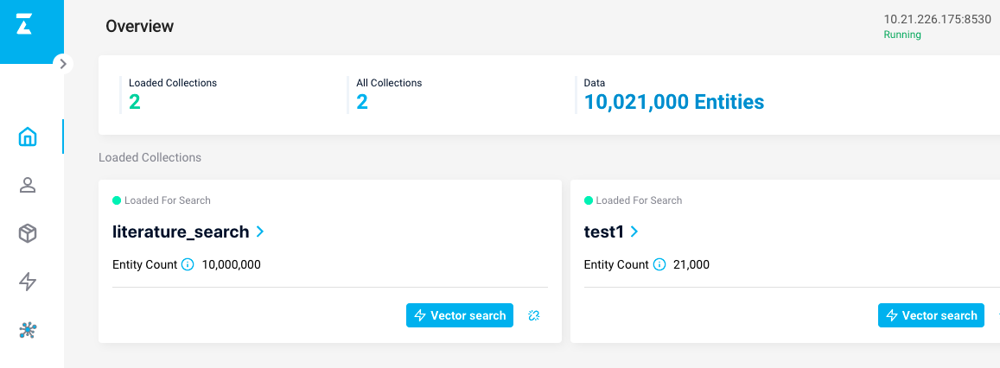

 **目录**

* [背景介绍](#背景介绍)
* [Milvus 召回](#Milvus 召回)
    * [1. 技术方案和评估指标](#技术方案)
    * [2. 环境依赖](#环境依赖)
    * [3. 代码结构](#代码结构)
    * [4. 数据准备](#数据准备)
    * [5. 向量检索](#向量检索)


<a name="背景介绍"></a>

# 背景介绍

基于某检索平台开源的数据集构造生成了面向语义索引的召回库。

<a name="Milvus 召回"></a>

# Milvus 召回

<a name="技术方案"></a>

## 1. 技术方案和评估指标

### 技术方案

使用 Milvus 搭建召回系统，然后使用训练好的语义索引模型，抽取向量，插入到 Milvus 中，然后进行检索。

<a name="环境依赖"></a>

## 2. 环境依赖和安装说明

**环境依赖**
* python >= 3.6.2
* paddlepaddle >= 2.2
* paddlenlp >= 2.2
* milvus >= 2.1.0
* pymilvus >= 2.1.0

<a name="代码结构"></a>

## 3. 代码结构

## 代码结构：

```
|—— scripts
    |—— feature_extract.sh  提取特征向量的bash脚本
    |—— search.sh  插入向量和向量检索bash脚本
├── base_model.py # 语义索引模型基类
├── config.py  # milvus配置文件
├── data.py # 数据处理函数
├── milvus_ann_search.py # 向量插入和检索的脚本
├── inference.py # 动态图模型向量抽取脚本
├── feature_extract.py # 批量抽取向量脚本
├── milvus_util.py # milvus的工具类
└── README.md
```
<a name="数据准备"></a>

## 4. 数据准备

数据集的样例如下，有两种，第一种是 title+keywords 进行拼接；第二种是一句话。

```
煤矸石-污泥基活性炭介导强化污水厌氧消化煤矸石,污泥,复合基活性炭,厌氧消化,直接种间电子传递
睡眠障碍与常见神经系统疾病的关系睡眠觉醒障碍,神经系统疾病,睡眠,快速眼运动,细胞增殖,阿尔茨海默病
城市道路交通流中观仿真研究智能运输系统;城市交通管理;计算机仿真;城市道路;交通流;路径选择
....
```

### 数据集下载


- [literature_search_data](https://bj.bcebos.com/v1/paddlenlp/data/literature_search_data.zip)

```
├── milvus # milvus建库数据集
    ├── milvus_data.csv.  # 构建召回库的数据
├── recall  # 召回（语义索引）数据集
    ├── corpus.csv # 用于测试的召回库
    ├── dev.csv  # 召回验证集
    ├── test.csv # 召回测试集
    ├── train.csv  # 召回训练集
    ├── train_unsupervised.csv # 无监督训练集
├── sort # 排序数据集
    ├── test_pairwise.csv   # 排序测试集
    ├── dev_pairwise.csv    # 排序验证集
    └── train_pairwise.csv  # 排序训练集

```

<a name="向量检索"></a>

## 5. 向量检索

### 5.1 基于 Milvus 的向量检索系统搭建

数据准备结束以后，我们开始搭建 Milvus 的语义检索引擎，用于语义向量的快速检索，我们使用[Milvus](https://milvus.io/)开源工具进行召回，Milvus 的搭建教程请参考官方教程  [Milvus 官方安装教程](https://milvus.io/docs/v2.1.x/install_standalone-docker.md)本案例使用的是 Milvus 的2.1版本，建议使用官方的 Docker 安装方式，简单快捷。

Milvus 搭建完系统以后就可以插入和检索向量了，首先生成 embedding 向量，每个样本生成256维度的向量，使用的是32GB 的 V100的卡进行的提取：

```
CUDA_VISIBLE_DEVICES=0 python feature_extract.py \
        --model_dir=./output \
        --model_name_or_path rocketqa-zh-base-query-encoder \
        --corpus_file "data/milvus_data.csv"
```
其中 output 目录下存放的是召回的 Paddle Inference 静态图模型。

|  数据量 |  时间 |
| ------------ | ------------ |
|1000万条|3hour40min39s|

运行结束后会生成 corpus_embedding.npy

生成了向量后，需要把数据插入到 Milvus 库中，首先修改配置：

修改 config.py 的配置 ip 和端口，本项目使用的是8530端口，而 Milvus 默认的是19530，需要根据情况进行修改：

```
MILVUS_HOST='your milvus ip'
MILVUS_PORT = 8530
```

然后运行下面的命令把向量插入到 Milvus 库中：

```
python milvus_ann_search.py --data_path milvus/milvus_data.csv \
                            --embedding_path corpus_embedding.npy \
                            --batch_size 100000 \
                            --insert
```
参数含义说明

* `data_path`: 数据的路径
* `embedding_path`: 数据对应向量的路径
* `index`: 选择检索向量的索引，用于向量检索
* `insert`: 是否插入向量
* `search`: 是否检索向量
* `batch_size`: 表示的是一次性插入的向量的数量


|  数据量 |  时间 |
| ------------ | ------------ |
|1000万条|21min12s|

另外，Milvus 提供了可视化的管理界面，可以很方便的查看数据，安装地址为[Attu](https://github.com/zilliztech/attu).




运行召回脚本：

```
python milvus_ann_search.py --data_path milvus/milvus_data.csv \
                            --embedding_path corpus_embedding.npy \
                            --batch_size 100000 \
                            --index 18 \
                            --search
```

运行以后的结果的输出为：

```
hit: (distance: 0.0, id: 18), text field: 吉林铁合金集团资产管理现状分析及对策资产管理;资金控制;应收帐款风险;造价控制;集中化财务控制
hit: (distance: 0.45325806736946106, id: 7611689), text field: 哈药集团应收账款分析应收账款,流动资产,财务报告
hit: (distance: 0.5440893769264221, id: 4297885), text field: 宝钢集团负债经营风险控制策略研究钢铁行业;负债经营;风险控制
hit: (distance: 0.5455711483955383, id: 5661135), text field: 浅谈电网企业固定资产风险管理大数据,固定资产,风险管理
...
```
返回的是向量的距离，向量的 id，以及对应的文本。

也可以一键执行上述的过程：

```
sh scripts/search.sh
```

### 5.2 文本检索

首先修改代码的模型路径和样本：

```
params_path='checkpoints/model_40/model_state.pdparams'
id2corpus={0:'国有企业引入非国有资本对创新绩效的影响——基于制造业国有上市公司的经验证据'}
```

运行命令

```
python3 inference.py

```
运行的输出为，分别是抽取的向量和召回的结果：

```
[1, 256]
Tensor(shape=[1, 256], dtype=float32, place=Place(gpu:0), stop_gradient=True,
       [[ 0.07830613, -0.14036864,  0.03433795, -0.14967985, -0.03386058,
          0.06630671,  0.01357946,  0.03531205,  0.02411086,  0.02000865,
          0.05724005, -0.08119474,  0.06286906,  0.06509133,  0.07193415,
   ....
hit: (distance: 0.40141725540161133, id: 2742485), text field: 完善国有企业技术创新投入机制的探讨--基于经济责任审计实践国有企业,技术创新,投
入机制
hit: (distance: 0.40258315205574036, id: 1472893), text field: 企业技术创新与组织冗余--基于国有企业与非国有企业的情境研究
hit: (distance: 0.4121206998825073, id: 51831), text field: 企业创新影响对外直接投资决策—基于中国制造业上市公司的研究企业创新;对外直接投资;
制造业;上市公司
hit: (distance: 0.42234909534454346, id: 8682312), text field: 政治关联对企业创新绩效的影响——国有企业与民营企业的对比政治关联,创新绩效,国有
企业,民营企业,双重差分
hit: (distance: 0.46187296509742737, id: 9324797), text field: 财务杠杆、股权激励与企业创新——基于中国A股制造业经验数据制造业;上市公司;股权激
励;财务杠杆;企业创新
....
```
## FAQ

#### 抽取文本语义向量后，利用 Milvus 进行 ANN 检索查询到了完全相同的文本，但是计算出的距离为什么不是 0？

使用的是近似索引，详情请参考 Milvus 官方文档，[索引创建机制](https://milvus.io/cn/docs/v2.0.x/index.md)
